# print-bench

Co-designed, review-hardened, printable: parametric 3D-printing designs
written in [OpenSCAD](https://openscad.org/), iterated with an AI
co-designer, and gated by automated printability checks before they ship.

**Live site → [printbench.xyz](https://printbench.xyz)** — browse every design, style and product page.

## The designs

<!-- gallery:begin (generated by scripts/gallery.sh — edit prose outside the markers) -->

### NUGGS ecosystem

| Design | |
|---|---|
| <a href="designs/nuggs/"></a> | **[nuggs](designs/nuggs/)** — An 80 mm-bore tunnel **system** for an adult Syrian hamster, built around one genderless quarter-turn port that every module carries at every end. The kit that exists today is the Bin Bridge: two bulkheads and one straight joining two enclosures through their walls, with nothing inside the cage. |
| <a href="designs/nuggs-den/">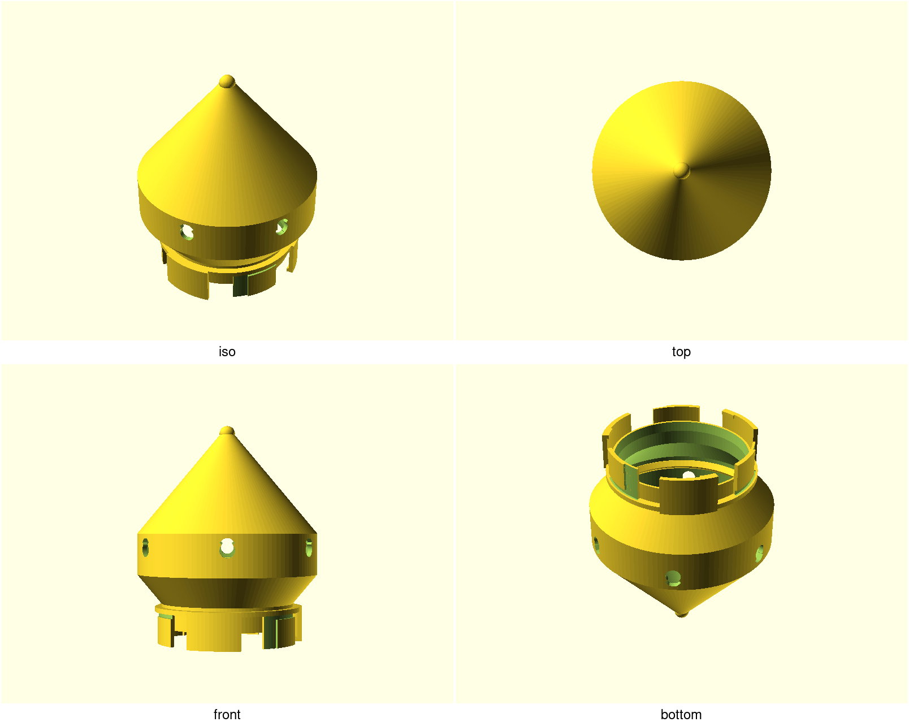</a> | **[nuggs-den](designs/nuggs-den/)** — A **terminal** NUGGS module — the first one in the system that is not a run of bore. `nuggs` is the straight (the Bin Bridge), and the `nuggs` backlog lists elbow / node / open module / wye, all of them still tube; `nuggs-yard` shares the `nuggs-` name but not the port, so it is a sibling, not a system module. This is the end-cap: a single-port rounded **refuge bulb** that turns the dead flat wall at the end of a run into a place to sit, hoard and hide. |
| <a href="designs/nuggs-elbow/">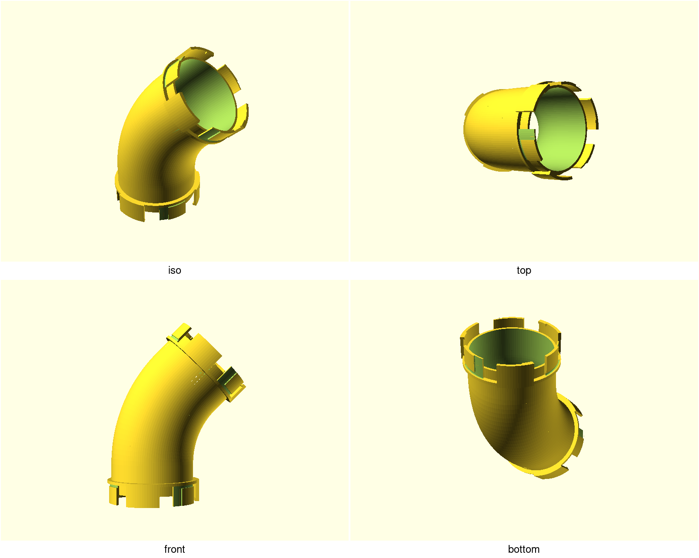</a> | **[nuggs-elbow](designs/nuggs-elbow/)** — A first-party NUGGS module: a curved (elbow) tube that routes an 80 mm-bore run around a corner, carrying the genderless quarter-turn NUGGS port (`nuggs_neck()`/`nuggs_port()` from `lib/nuggs-coupling.scad`) on each end, joined by a bent tube shell with a **continuous, smooth bore through the bend** (welfare non-negotiable). It is a consumer of the port standard, exactly like `designs/nuggs`: it builds one `cfg` with `nuggs_cfg()` defaults and never redefines a coupling number. |
| <a href="designs/nuggs-frieda/">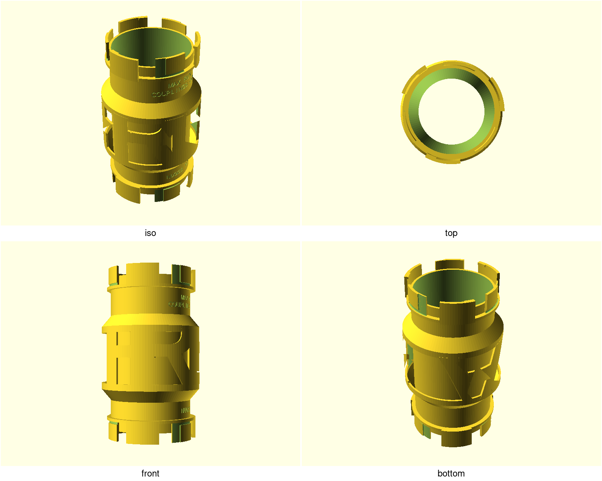</a> | **[nuggs-frieda](designs/nuggs-frieda/)** — A Word-World module: a NUGGS straight whose midspan is *made of* the resident's name — **FRIEDA** wrapped around the tube as a structural letter cage. Functionally it is a drop-in replacement for the nuggs straight (same 160 mm face-to-face length, same port standard at the same defaults); the letters are what it is *for*. The brief: "like Word World the object is made of letters … the word is Frieda. you can mix case … as needed." |
| <a href="designs/nuggs-hopper/">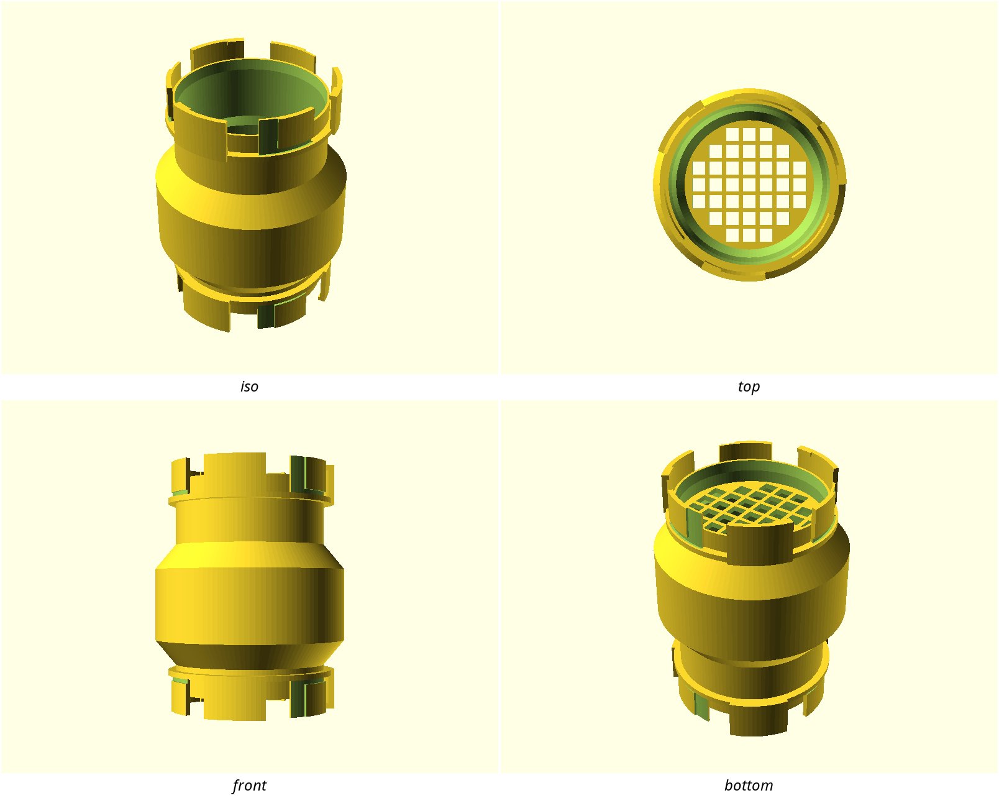</a> | **[nuggs-hopper](designs/nuggs-hopper/)** — The NUGGS ecosystem's feeding module: a shallow gravity hopper that mates the standard quarter-turn port and holds a few days of food, dropping it into the enclosure as it is eaten. Owner refills from outside the cage through the open top port. The catalog had den, elbow, bridge, orrery and shutter-valve — all tube or refuge; feeding was the gap (scout mandate: deepen the NUGGS ecosystem). |
| <a href="designs/nuggs-open/">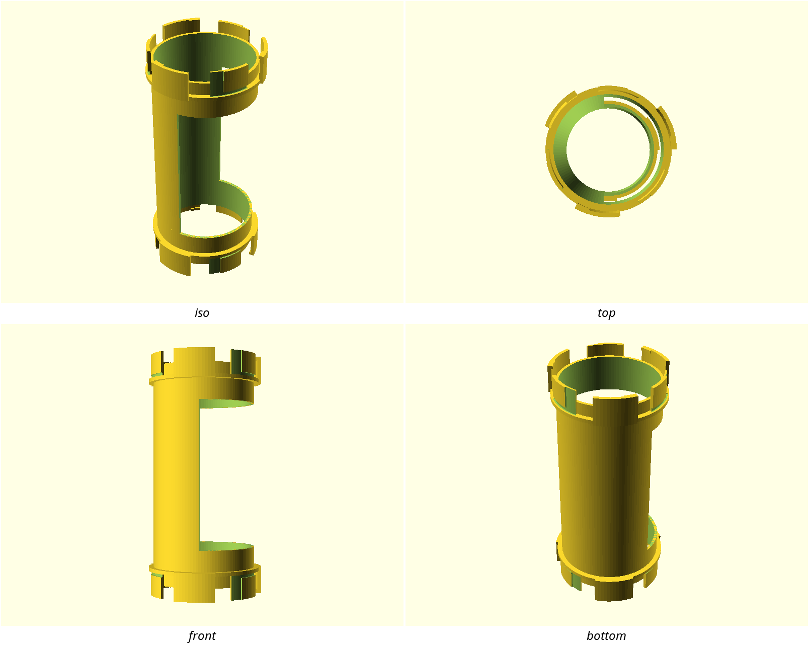</a> | **[nuggs-open](designs/nuggs-open/)** — The first member of the NUGGS **open-module family**: a straight 80 mm-bore module whose midspan opens into a longitudinal window ≥ 180° with the bore's own arc as its floor. Under charter N2 an open module is one of only three things that **reset a run** (an open end, an open module, a turnaround node), so any layout longer than one straight *requires* a part like this to stay legal. Who it's for: a NUGGS owner extending a run past the 360 mm limit, or wanting a mid-run check/hand-access point without disconnecting anything. |
| <a href="designs/nuggs-orrery/">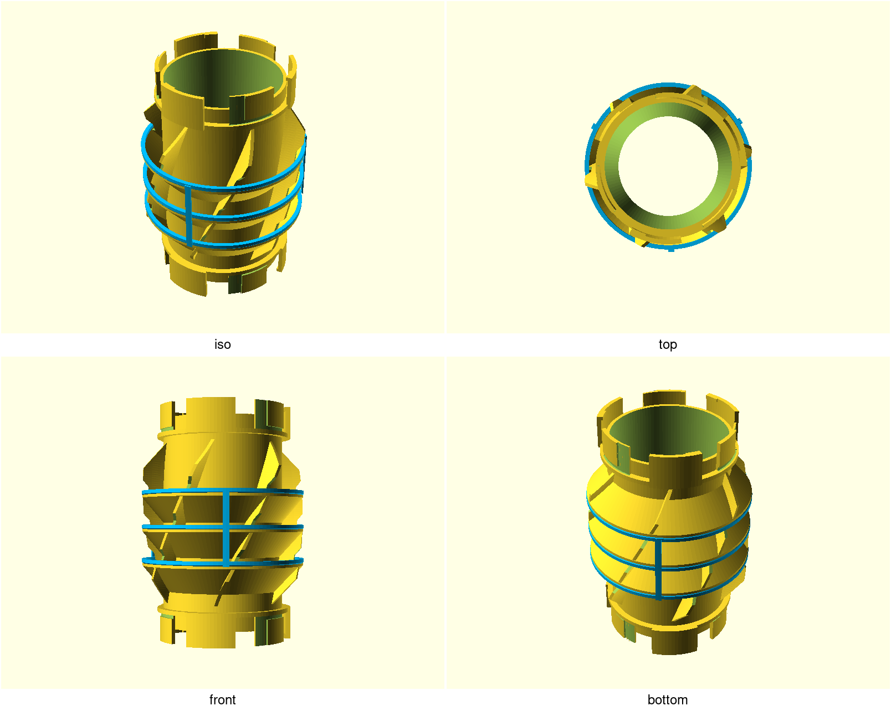</a> | **[nuggs-orrery](designs/nuggs-orrery/)** — An abstract, boundary-pushing NUGGS module that is *only manufacturable on a dual-nozzle 3D printer* (Bambu H2-series class; AMS available for color): the standard port at both ends, and outside the hamster-contact envelope a kinetic sculpture — six twisted fins carrying three captive, free-spinning orbit rings in a second material. Request: unique/abstract, dual materials using both nozzles, bonus for built-in break-away supports and other advanced techniques. NUGGS rules constrain the animal-contact surfaces; the exterior is fair game (owner's brief, this session). |
| <a href="designs/nuggs-rim-saddle/"></a> | **[nuggs-rim-saddle](designs/nuggs-rim-saddle/)** — A saddle that clamps over the top rim of a glass-tank enclosure — no drilling (N9: tempered glass shatters), no adhesive — and carries one standard NUGGS genderless quarter-turn port (`lib/nuggs-coupling.scad`, N10: the one interlock), so a run starts from a glass cabinet the same way it starts from a plywood bulkhead. Target enclosure: IKEA Detolf (the cabinet charter N9 itself names), parametrically — every rim dimension is a parameter with the Detolf value as the default, so another cabinet is a `-D` override. |
| <a href="designs/nuggs-shutter-valve/">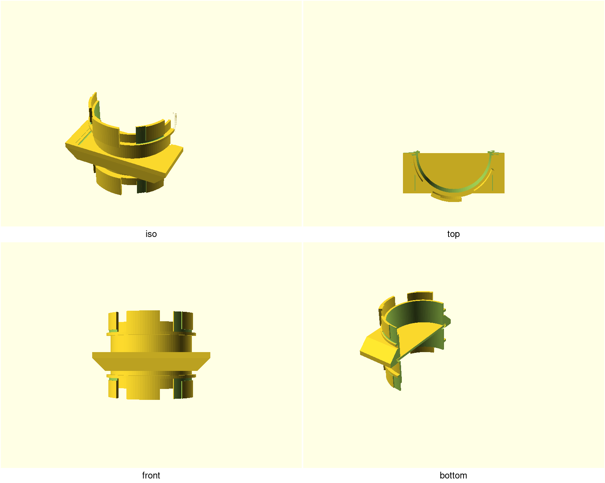</a> | **[nuggs-shutter-valve](designs/nuggs-shutter-valve/)** — - **Bore 80 mm, wall 2.4 mm, tube OD 84.8 mm** — inherited from `nuggs_cfg()`   defaults so the valve mates with every existing NUGGS module. Every coupling   number is the standard's; the coupling guards fire inside `nuggs_cfg()`. - **Slide clearances** — the battleship-tuned values `lib/print-in-place.scad`   carries (rail 0.4 vertical / 0.5 horizontal tabs, lip engagement). Do **not**   loosen the rail clearances (the acoustic property); tune only the door-side   `door_fit` on the coupon. - **Target printers** — Bambu P2S (256 mm bed) / H2C (bigger). Gated against the   smaller P2S bed. Jane runs the same hardware. - **Welfare non-negotiable** — when open, the shutter retracts entirely out of   the 80 mm bore; the bore is continuous and smooth with no interior ledge. |
| <a href="designs/nuggs-turnaround/">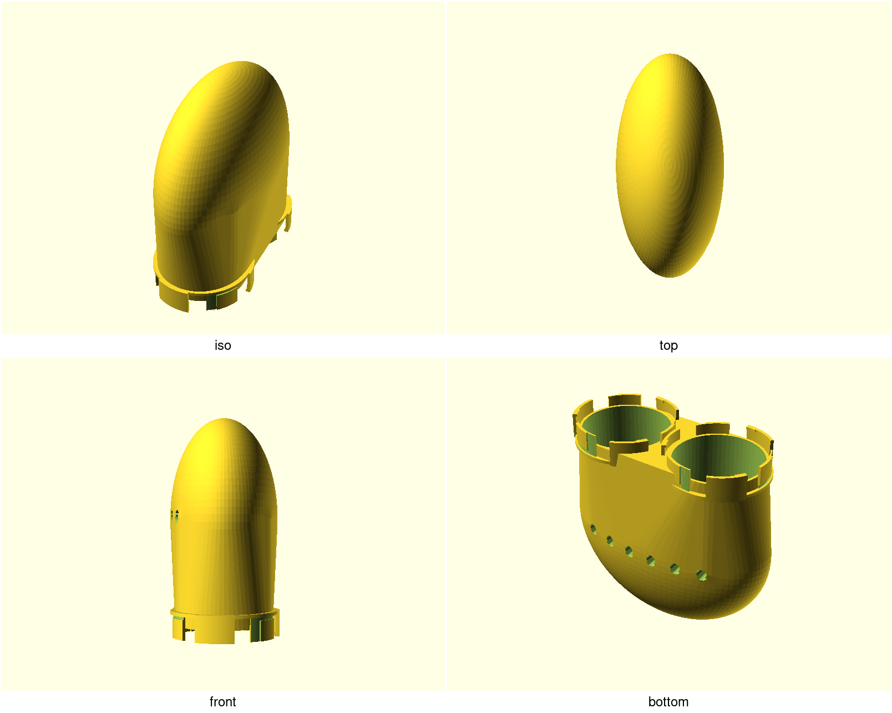</a> | **[nuggs-turnaround](designs/nuggs-turnaround/)** — The NUGGS **turnaround node** (issue #394, charter backlog B4): the run-resetter. A module carrying the standard genderless quarter-turn port on **two faces of one widened chamber**, so an adult Syrian hamster can enter port A, pivot 180°, and leave port B — doubling a run back on itself. This is the module that makes layouts larger than one straight legal: charter **N2** caps any continuously enclosed run at 2 × body length between *breaks*, and a turnaround node of **clear internal width ≥ body_len_mm that is itself open to ventilated space** is one of only three breaks. Without this part, no layout bigger than one straight tube is legal. |
| <a href="designs/nuggs-turnaround-tee/">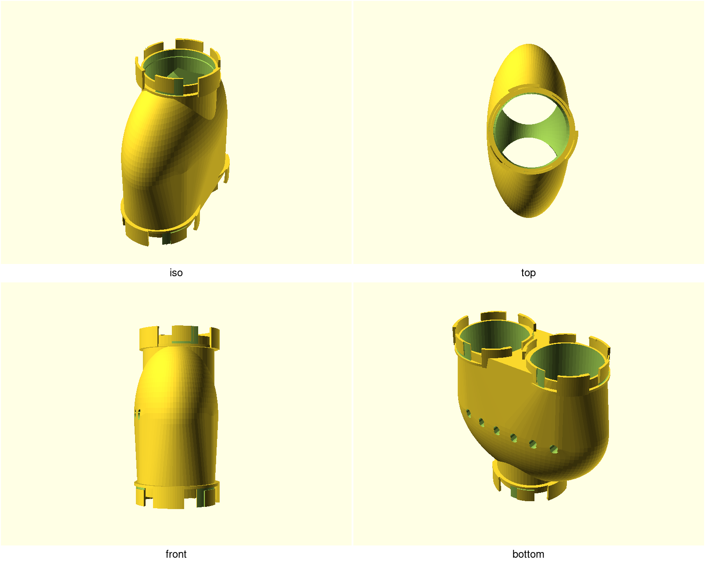</a> | ↳ **[nuggs-turnaround-tee](designs/nuggs-turnaround-tee/)** — The **three-port turnaround** for the N.U.G.G.S. run system: everything the two-port `nuggs-turnaround` node is, plus a **third port on the chamber crown**, anti-parallel to the two bed ports, so a run can pass **straight through** the turnaround instead of only switching back. Issue #435 — the 2-vs-3-ports decision deferred from #394; the owner settled it on-thread: build it **as a derivative** of `nuggs-turnaround`, same rule set, same port revision, deliverable `designs/nuggs-turnaround-tee/`.<br>_derived from [nuggs-turnaround](designs/nuggs-turnaround/)_ |
| <a href="designs/nuggs-y-splitter/">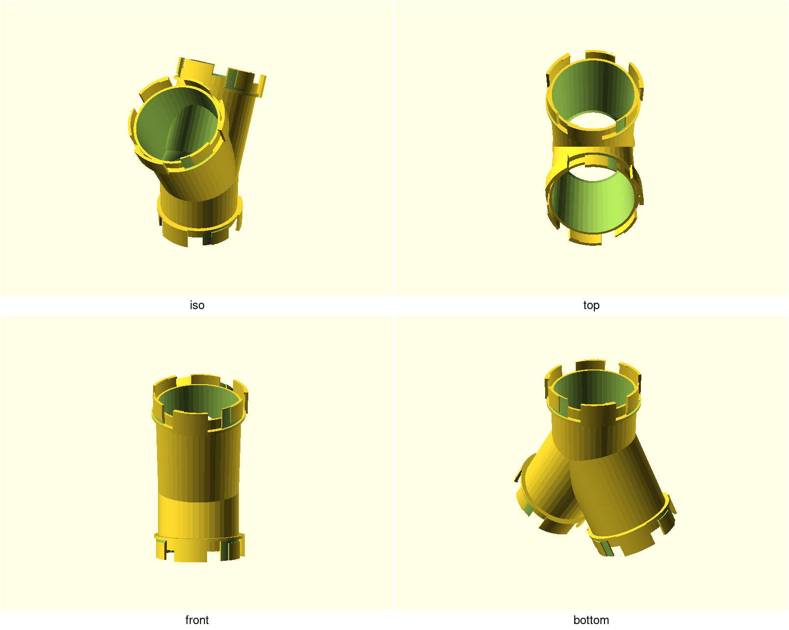</a> | **[nuggs-y-splitter](designs/nuggs-y-splitter/)** — A first-party NUGGS junction module: branch an 80 mm-bore NUGGS run into two paths — one inlet port, two symmetric outlets at a 60° included angle — with all three faces carrying the standard genderless quarter-turn bayonet port (`nuggs_port()` from `lib/nuggs-coupling.scad`). Branching was the one topology the ecosystem could not do; every other module is two-port single-path. A consumer of the port standard, exactly like `designs/nuggs` and `designs/nuggs-elbow`: one `cfg` built from `nuggs_cfg()` defaults, handed to every port call, never a redefined coupling number. |

### Compliant mechanisms

| Design | |
|---|---|
| <a href="designs/bistable-toggle/">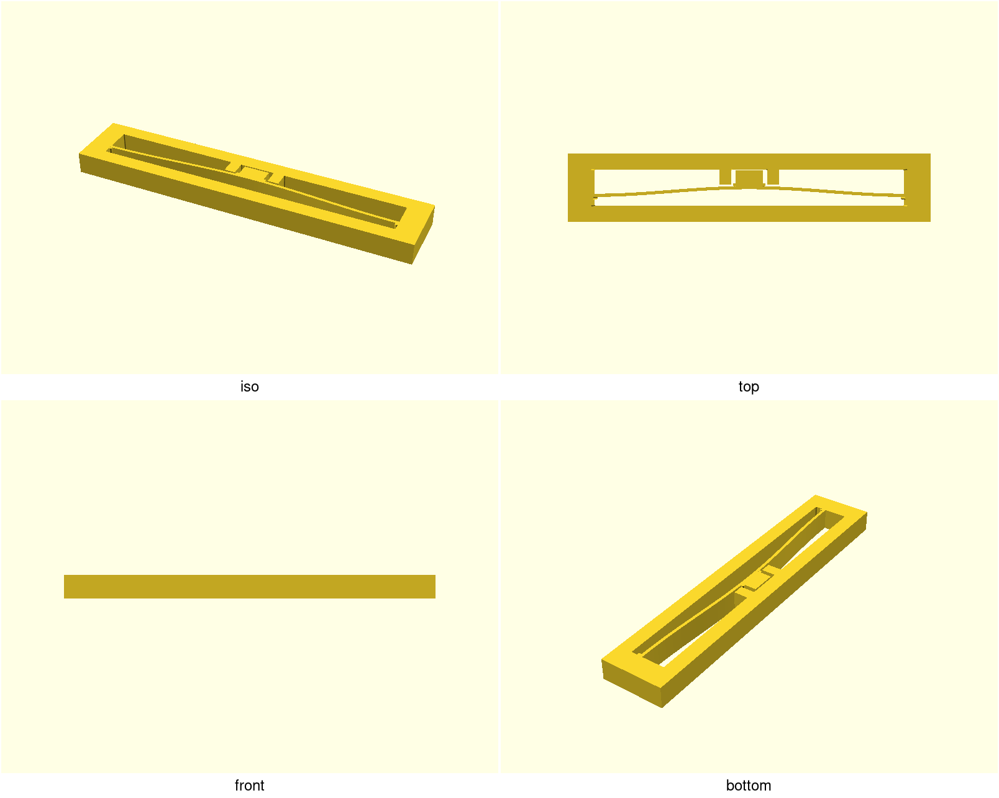</a> | **[bistable-toggle](designs/bistable-toggle/)** — A fixed–fixed pre-buckled arch with two stable states (bowed up / bowed down) separated by a negative-stiffness region: power only to switch, not to hold. The monostable snap of `snap-cantilever-clip` taken to genuine bistability. |
| <a href="designs/compliant-gripper/">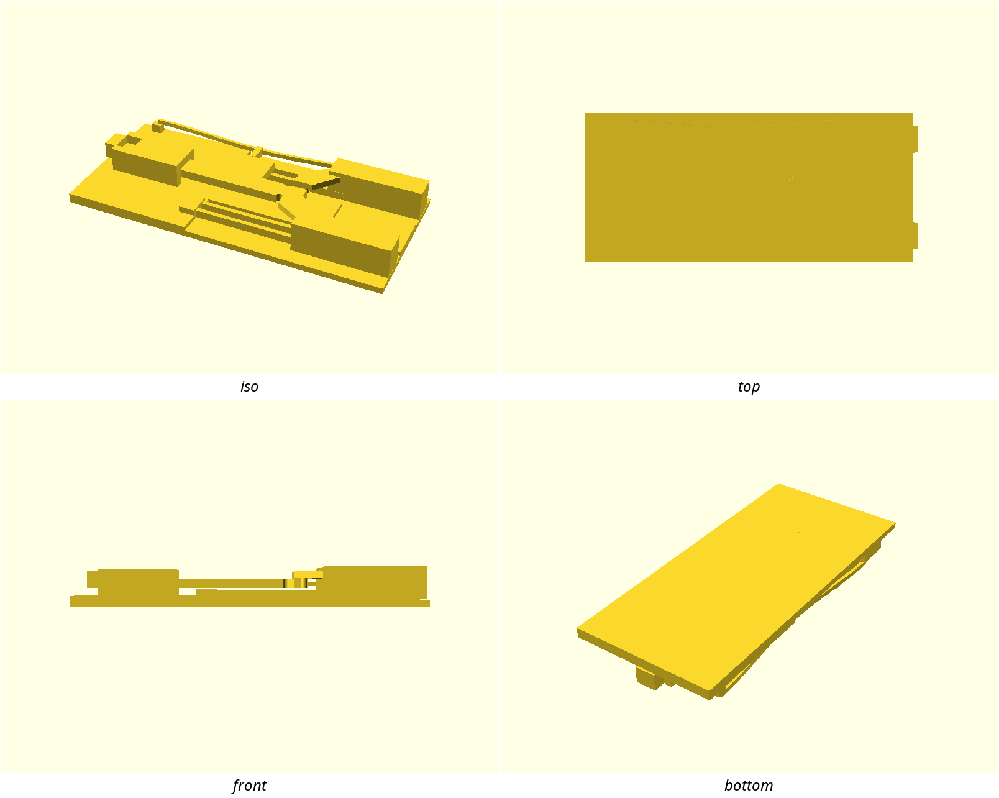</a> | **[compliant-gripper](designs/compliant-gripper/)** — A monolithic print-in-place **parallel-jaw** gripper. Each jaw rides a parallelogram of two leaf flexures, so the grip faces stay mutually parallel while they translate in Y. A captive push-plunger drives both jaws through diagonal edge-notches; a pre-buckled arch (the #389 solve) drops its apex tip into a valley detent on the plunger wing and holds the clamped state with zero applied force. Push the tab → jaws close in parallel → tip passes the crest and seats in the valley → held. Pull the tab → tip climbs back over the crest → flexures spring the jaws open. One piece, no supports, no assembly. |
| <a href="designs/constant-force-slider/">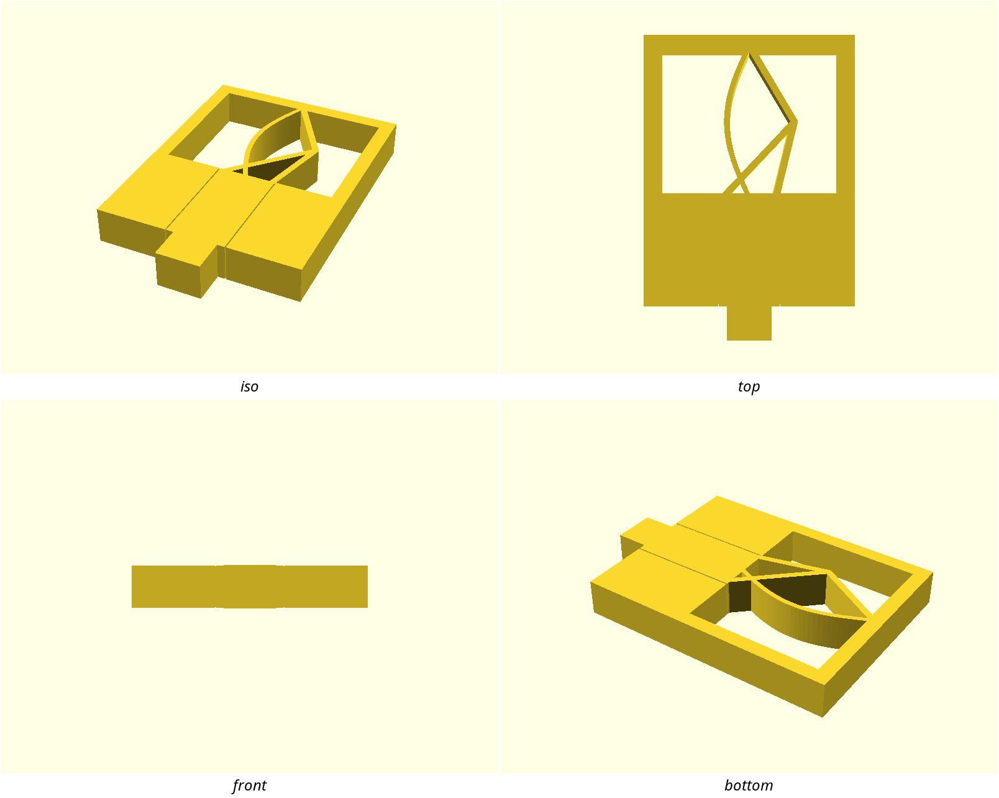</a> | **[constant-force-slider](designs/constant-force-slider/)** — A linear shuttle that moves under ~constant force over its stroke. It rides a guide slot (print-in-place sliding fit) and is returned by a QZS spring built from two flexure families in parallel. |
| <a href="designs/czs-slider/">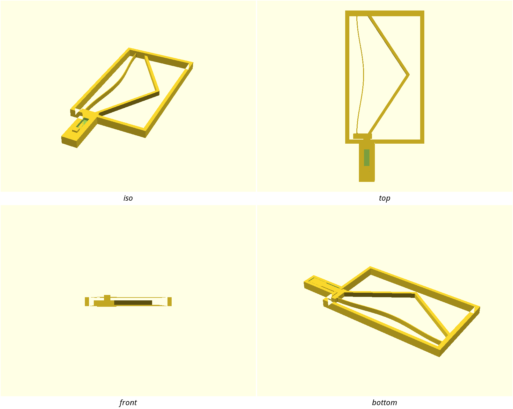</a> | **[czs-slider](designs/czs-slider/)** — A one-piece captive slider whose resistive force is **near-constant across its stroke** — push the knob and it glides at ~2 N instead of fighting a rising spring — printed in place, support-free, in PETG. |
| <a href="designs/let-folding-panel/">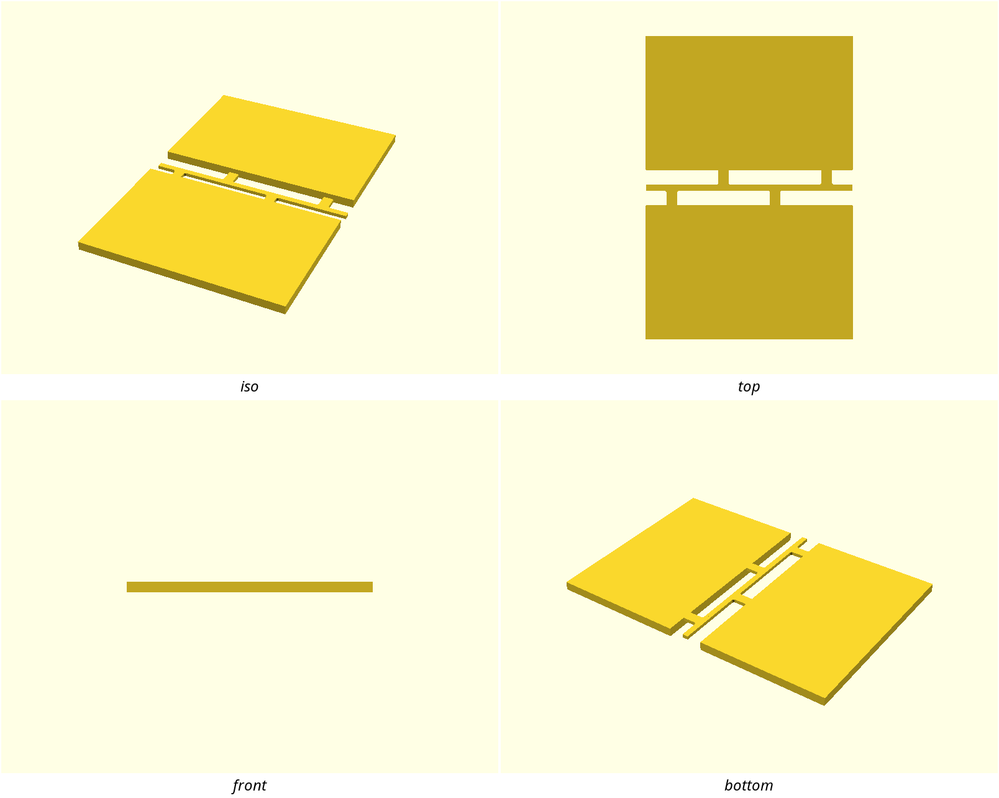</a> | **[let-folding-panel](designs/let-folding-panel/)** — Two rigid panels joined by a Lamina-Emergent Torsional (LET) joint: fabricated flat from one sheet, folds to 90°, zero clearance / zero assembly / no rattle. The alternative to a pin hinge when you want a fold, not a full revolution. |
| <a href="designs/snap-cantilever-clip/">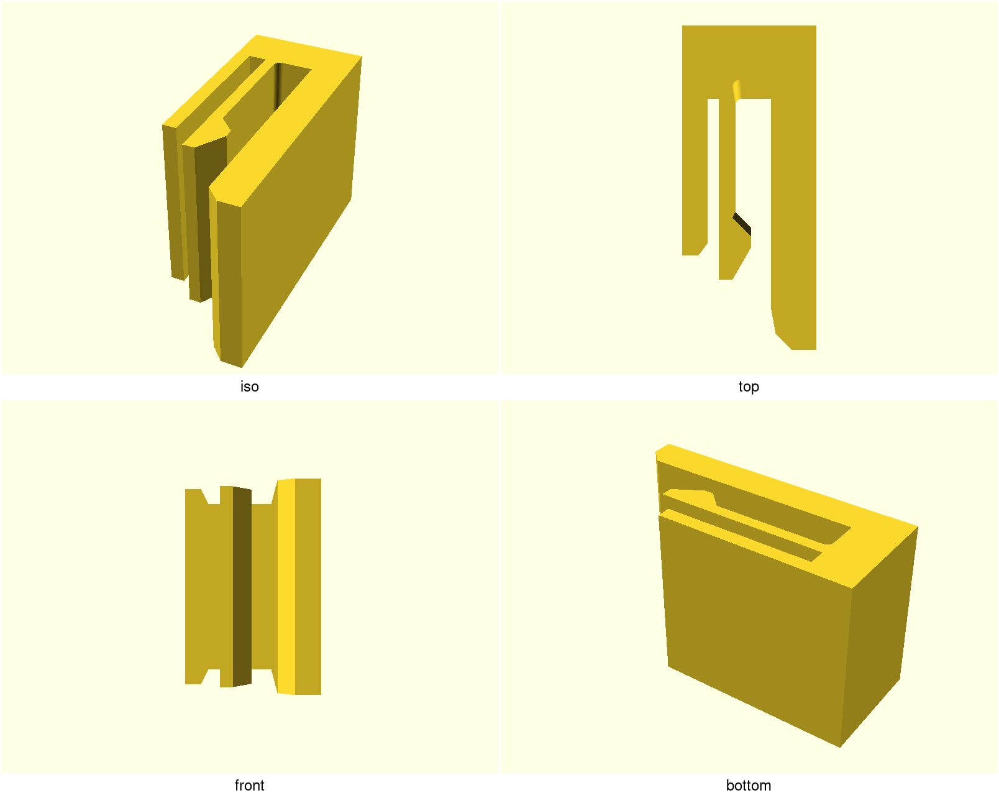</a> | **[snap-cantilever-clip](designs/snap-cantilever-clip/)** — A one-piece clip that snaps onto a plate edge and holds by cantilever deflection. Push it onto 3 mm card / shelf stock, the finger cams open over the plate, springs back, and the clip grips by spring preload — removal takes ~2× the insertion force via the steep retention shoulder. |
| <a href="designs/snap-clamshell-box/">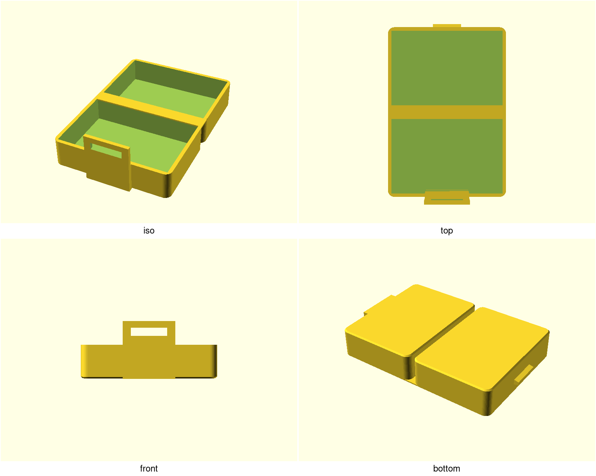</a> | **[snap-clamshell-box](designs/snap-clamshell-box/)** — A clamshell box: two trays joined at a spine by a **living hinge**, closed by a **compliant snap latch** (tab-in-window). Prints flat and open, folds 180° so the openings meet, and the front latch clicks shut. One piece, no supports, no assembly. |

### Designing around supports

_Every design here prints without slicer supports — leave them off._

| Design | |
|---|---|
| <a href="designs/aerochord/"></a> | **[aerochord](designs/aerochord/)** — A musical wind instrument that (a) prints in place as **one piece** with no supports, (b) does not correspond to any instrument in the historical record, and (c) is only really designable/printable with an FDM machine and a computed internal geometry. The brief was an explicit stress test of the whole co-design pipeline. |
| <a href="designs/support-free-bracket/">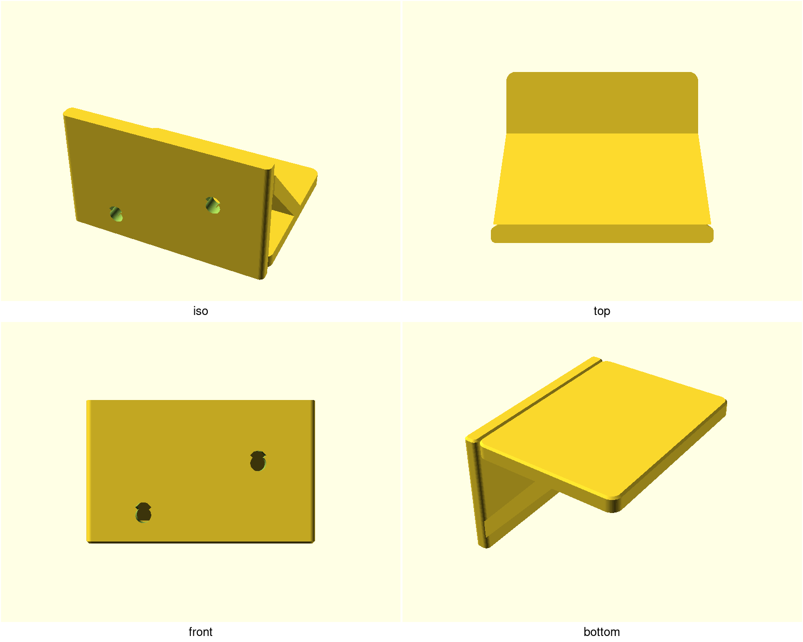</a> | **[support-free-bracket](designs/support-free-bracket/)** — A wall shelf bracket: an 80 × 50 wall plate fastened by 2 × M5 screws, with a 60 mm deep × 6 mm thick shelf arm, closing the cavity under the arm with a **vaulted ceiling ≤ 45°** so it never prints as a bridge roof. The point of the design is not the bracket; it is the demonstration that every support-needing feature can be designed out. |

### Print-in-place kinematics

_These parts come off the bed ready to move — free each one as its card says, and keep auto-supports off._

| Design | |
|---|---|
| <a href="designs/captive-spinner/">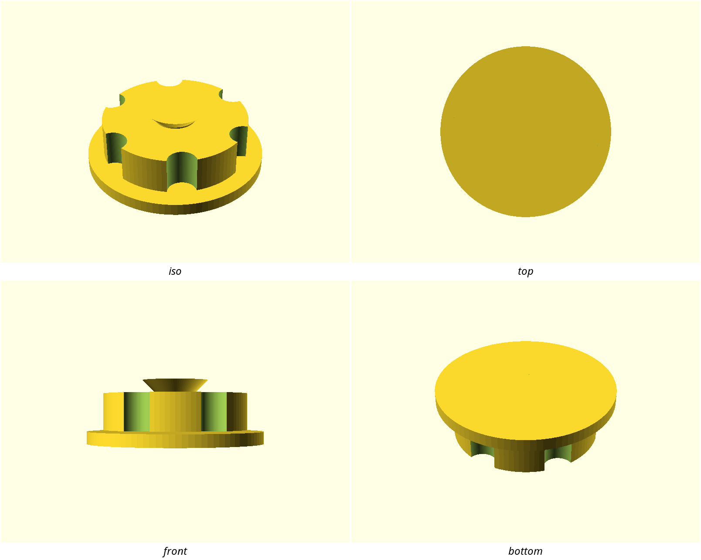</a> | **[captive-spinner](designs/captive-spinner/)** — A one-piece, support-free, no-assembly fidget: a rotor ring captured on a fixed post + cap, spinning about the vertical axis after you shear the break-in fusion. |
| <a href="designs/over-center-toggle-clamp/">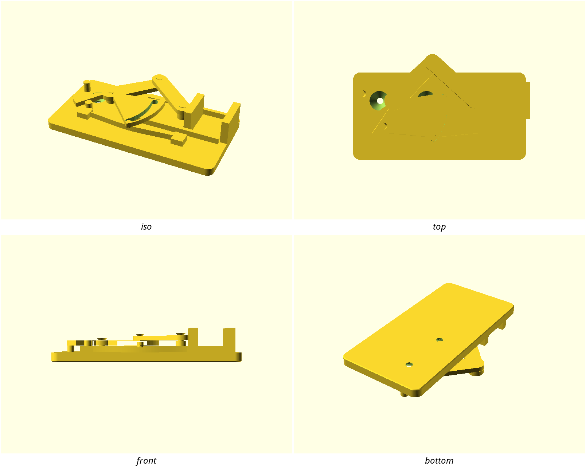</a> | **[over-center-toggle-clamp](designs/over-center-toggle-clamp/)** — Brief #285: promote bistable-toggle's buckled-beam physics to a load-carrying **print-in-place over-center toggle clamp** for bench-top workholding. One PETG print, no hardware: squeeze a lever, the moving jaw closes on the workpiece, the linkage passes dead center and self-locks, and a buckled-beam arch makes the toggle bistable so it stays both closed and open with a positive snap. |
| <a href="designs/perspective-coin/">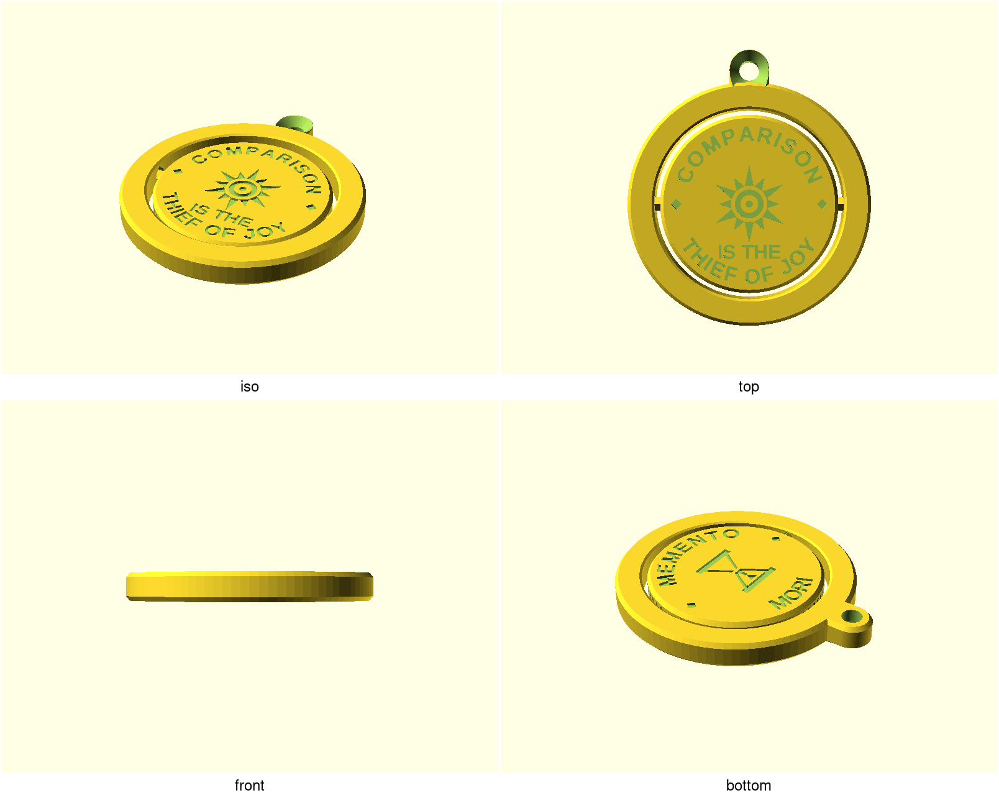</a> | **[perspective-coin](designs/perspective-coin/)** — John Cena carries a watch engraved on two sides: *"comparison is the thief of joy"* on the back (for when he doesn't feel enough) and *"memento mori"* on the other (for when his head gets too big) — "a keeper of perspective, not time" (as he tells it in an [interview clip shared on Reddit](https://www.reddit.com/r/MotivationalThoughts/s/q9BbhOayrd)). This design turns those two engravings into a two-sided pocket coin, plus a print-in-place **flipper charm**: the coin captured in a keyring gimbal so you physically flip it to the reminder you need. Tier reference: `docs/advanced-techniques.md` Domain 3 (print-in-place kinematics). |
| <a href="designs/pip-piano-hinge/">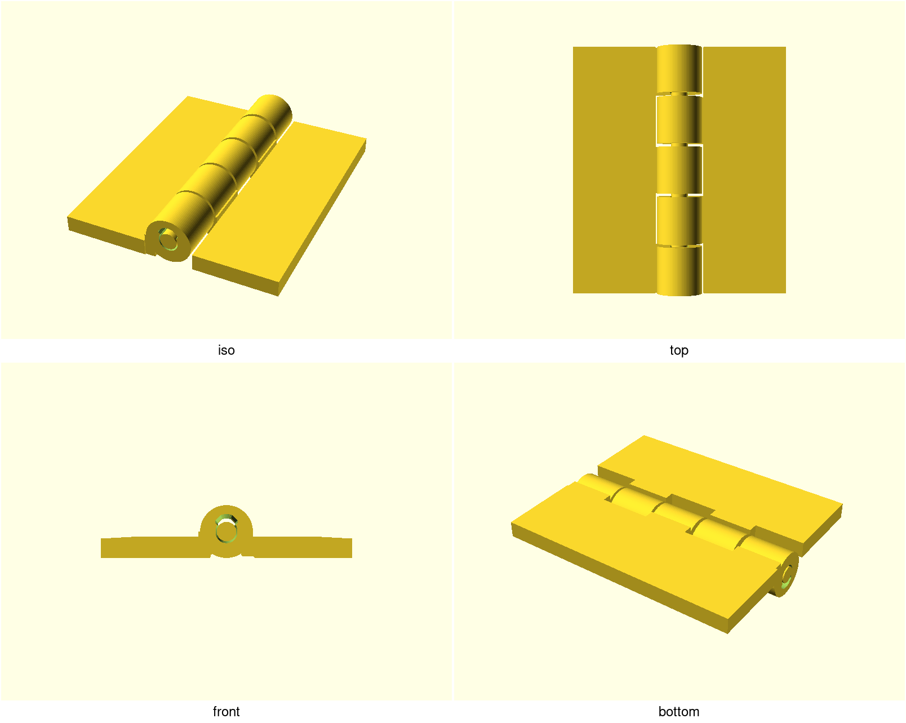</a> | **[pip-piano-hinge](designs/pip-piano-hinge/)** — A multi-knuckle hinge that comes off the plate assembled and swinging — the Domain-3 pin-in-bore joint tiled into a real piano hinge, plus the two piano-hinge-specific defenses (xy≠z clearance, per-knuckle axial play). |
| <a href="designs/pip-planetary/">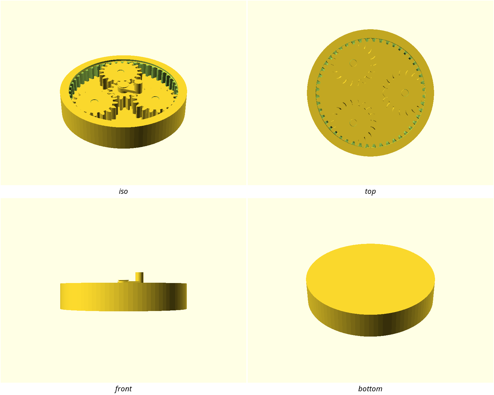</a> | **[pip-planetary](designs/pip-planetary/)** — A print-in-place planetary (epicyclic) gear set — sun, three planets, internal ring — printed as ONE assembled part, per brief #307: the catalog's first toothed-gear design (Domain 3 "Gears & rotary" in `docs/advanced-techniques.md`). Turn the sun's crank; the carrier walks round at **5:1**. |
| <a href="designs/pop-fidget-card/">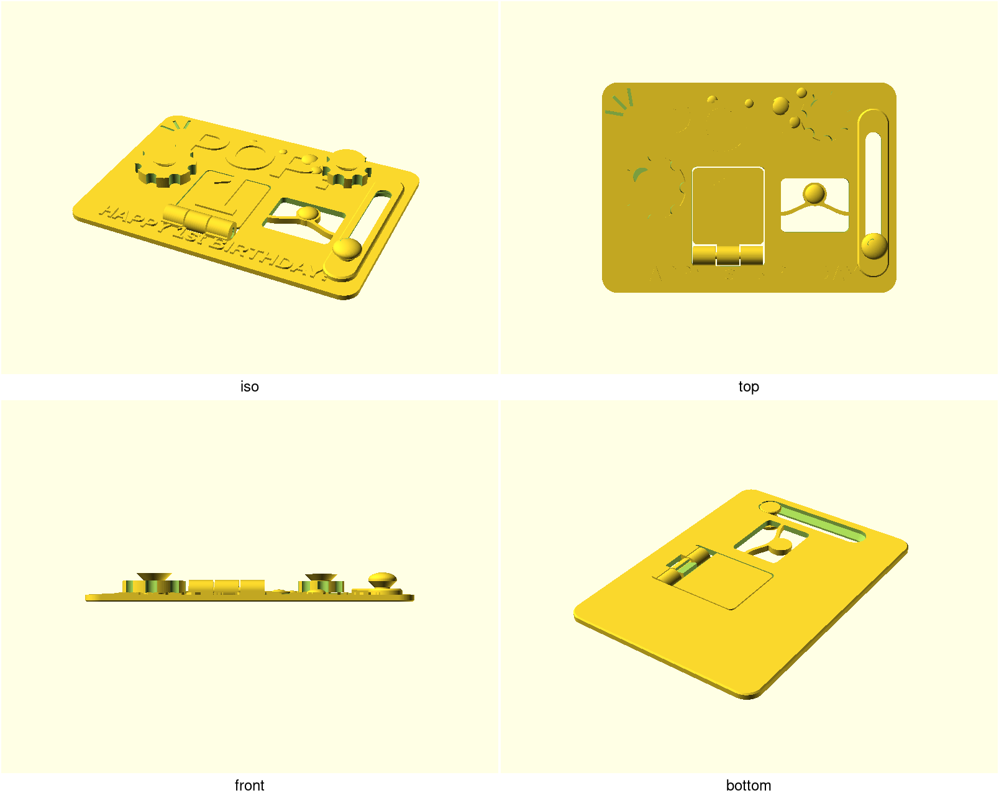</a> | **[pop-fidget-card](designs/pop-fidget-card/)** — A print-in-place 1st-birthday keepsake card (brief: issue #342) themed on a bubble/"POP" party motif — built for the **parents**, who keep fidgeting with it after the party. Flat landscape card, displays on a shelf via a punched easel flap, with four working fidgets printed in place on its face. Hard constraint: test-slice under 2 h; target 60 min on a fast modern printer. |
| <a href="designs/sushi-battleship/"></a> | **[sushi-battleship](designs/sushi-battleship/)** — Battleship played with real sushi. |
| <a href="designs/sushi-battleship-tracker/"></a> | ↳ **[sushi-battleship-tracker](designs/sushi-battleship-tracker/)** — The parent tracks hits structurally (an opened door is an eaten cell) but leaves **misses** to memory, and "did we already call B3?" is the real failure mode of a leisurely dinner game. The refit adds a shallow spherical **miss-marker seat** to the top face of every print-in-place shutter door: park any small round marker (dried soybean, 6 mm airsoft BB, peppercorn) on a called cell and nobody re-calls it. The product charter lives in PM.md beside this file.<br>_derived from [sushi-battleship](designs/sushi-battleship/)_ |
| <a href="designs/sweetheart-hamster/">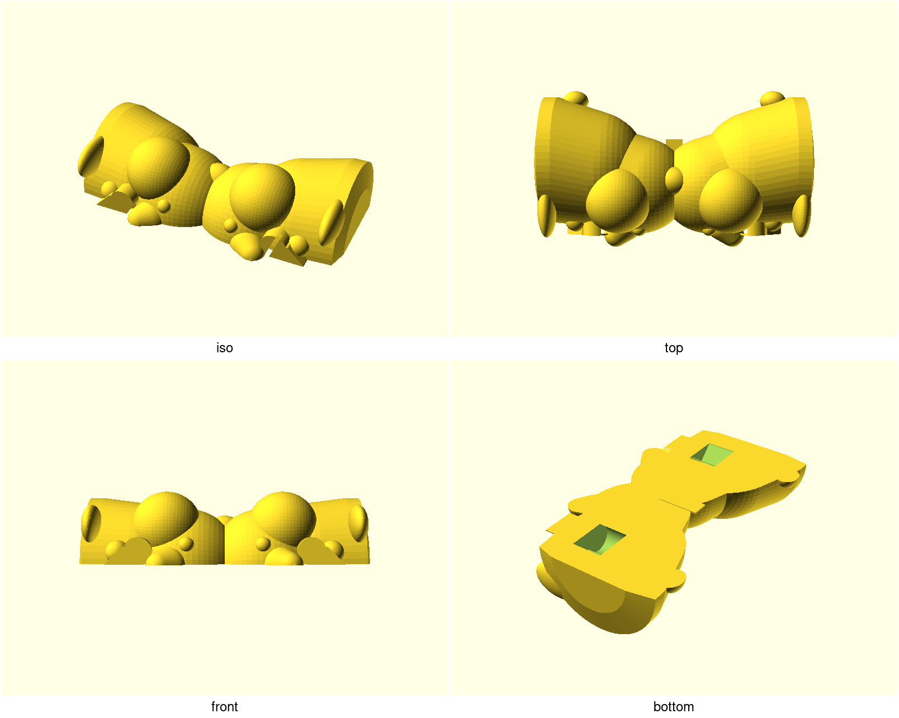</a> | **[sweetheart-hamster](designs/sweetheart-hamster/)** — A palm-sized (~60 mm) jewelry box shaped like a chibi hamster **cradling a heart**. It splits down the sagittal midline so the heart parts between the two halves — "hamster together, heart when the pieces are apart." It is a print-in-place clamshell: the two halves come off the bed as one piece, joined along the dorsal seam by a living-hinge web, and fold shut into the hamster. A heart-shaped pocket straddling the seam is the ring nest. |

### Everyday functional prints

| Design | |
|---|---|
| <a href="designs/alcove-rod-socket/">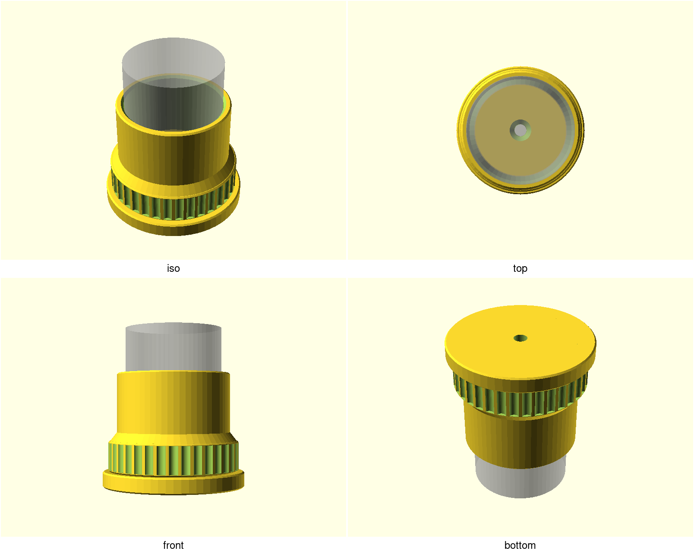</a> | **[alcove-rod-socket](designs/alcove-rod-socket/)** — A parametric, two-part **screw-together end socket** for a 40 mm round curtain/closet rod spanning a recess or alcove, used in pairs: a wall boss screwed flat to each facing wall, the rod's ends plugging into knurled collars that hand-thread onto the bosses. Removing the rod for washing = unthread the collar, no tools. Brief: issue #355 (reworked from MakerWorld #1200171, a 2-part fixed-STL 25 mm holder, scaled intent not mesh). |
| <a href="designs/calibration-cube/"></a> | **[calibration-cube](designs/calibration-cube/)** — Simple dimensional-accuracy test print; also serves as the repo's starter design demonstrating the parameter conventions. |
| <a href="designs/desiccant-capsule/"></a> | **[desiccant-capsule](designs/desiccant-capsule/)** — Refillable two-part capsule for loose silica gel beads, lived-in filament dry-boxes. Perforated body lets air/moisture reach the beads; screw-on lid with real threads (not press-fit) and a ribbed grip edge so it can be opened with dry-box gloves on. Must print on FDM with no supports on either part. |
| <a href="designs/extrusion-shelf-bracket/">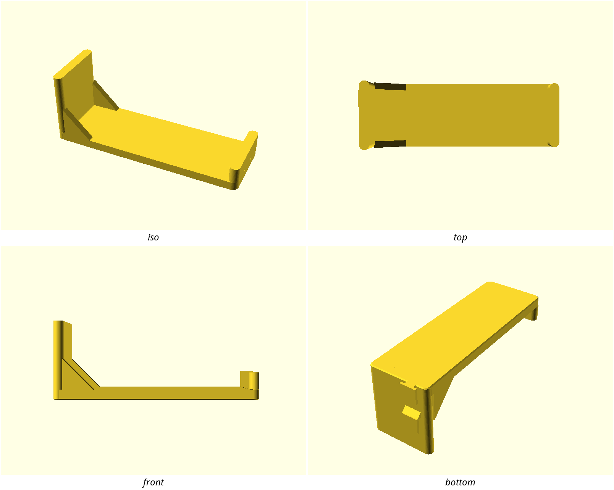</a> | **[extrusion-shelf-bracket](designs/extrusion-shelf-bracket/)** — A shelf corner bracket that locks into the **side slot of standard 2020 T-slot aluminum extrusion**: hammer-head lugs on the back of the plate slide along the slot, so a shelf board attaches anywhere along a rail with no T-nuts and no frame teardown. Horizontal arm carries the board between 45° gussets and a front stop lip. One printable part + a fit coupon. Brief: issue #283 (design-brief, `workshop-utility` style). |
| <a href="designs/nuggs-yard/"></a> | **[nuggs-yard](designs/nuggs-yard/)** — An open-top run for an adult Syrian hamster's **playpen** — free-roam time outside the cage. The ask was "loops and twists, turns, branches, all the stuff to keep him busy". It is a floor-standing kit of modules the owner lays out themselves, not a fixed object. Despite the `nuggs-` name, it is a sibling of the NUGGS tunnel system, not a module in it — its lap-skirt joint does not mate with the NUGGS port. |
| <a href="designs/preroll-elevator/">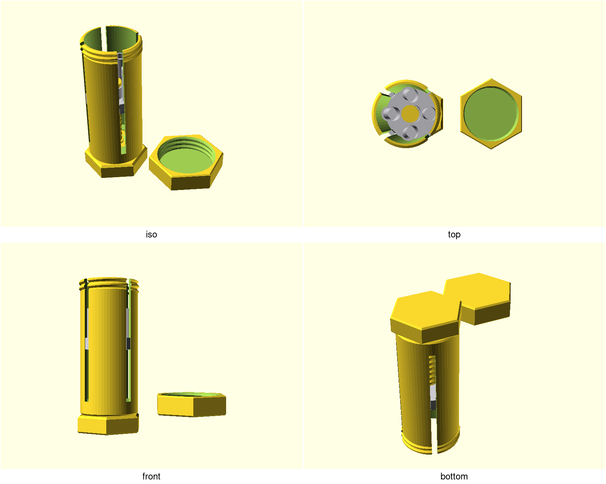</a> | **[preroll-elevator](designs/preroll-elevator/)** — A chapstick / glue-stick–style twist tube that stores and *presents* pre-rolls. Unscrew the hex cap-nut lid, twist the hex knob at the base → a central screw raises an internal elevator carrying 4 pre-rolls in a ring so their tops rise out the top to grab; twist back to retract, cap the lid to close and protect. Styled deliberately as an **industrial hex bolt with a nut on top** — the mechanical look is the point, and the interior echoes it (the elevator is literally a nut climbing a bolt). |
| <a href="designs/sbc-case/">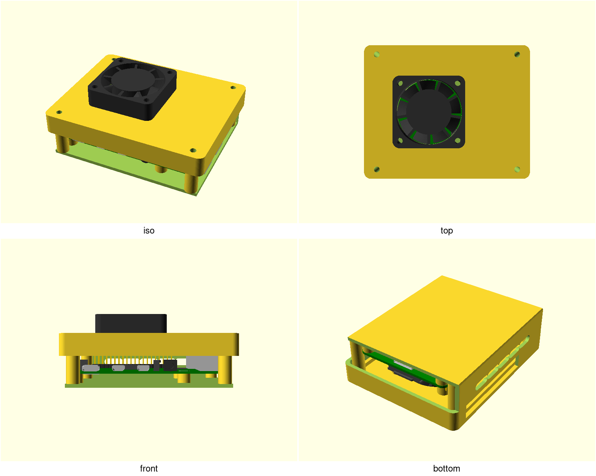</a> | **[sbc-case](designs/sbc-case/)** — A hardware-rich single-board-computer case (Raspberry Pi 4 primary target) that is deliberately the **reference / stress-test design for the assembly-instructions feature** (issue #158): it ships an `assembly.conf` declaring real `vitamin:` entries — board, inserts, three screw types, washers, fan — so it exercises the NopSCADlib vitamin path, the BOM collection pass, and the GPL-3.0 product-page disclosure no existing design carries. |
<!-- gallery:end -->

## Want to print one?

1. Open the design's folder above — its `README.md` is the product page:
   what it is, print settings, and the parameters worth tuning for your
   printer. `NOTES.md` holds the engineering log and measurements.
2. Render the STL:

   ```bash
   ./scripts/render.sh <name>   # produces build/<name>.stl and build/<name>.png
   ```

3. Slice `build/<name>.stl` with the settings from the product page. If the
   design ships a `<name>-coupon.scad`, print that first — it's a short
   test print for dialing in the fit parameters before you commit to the
   full part.

All dimensions are in millimeters. Designs target FDM printing by default
and expose printer-tuning parameters (wall thickness, fit tolerances) at
the top of each file. To tune a fit without editing files:

```bash
./scripts/render.sh <name> --sweep thread_tol=0.15:0.35:0.05
```

renders one labeled strip of test coupons across the range instead of five
sequential guess-prints.

## Want it to look a certain way?

Point the toolchain at a model whose look you like and it writes down *why*
it looks that way — the radius reused on its edges, chamfer or fillet, how
smooth its curves are, what size holes it drills — as a style you can build
new designs to and check them against:

```bash
./scripts/style-lift.sh <name> <reference.stl> --source <url> --license <terms>
./scripts/style-check.sh <name>        # does a part actually belong to the family?
```

Styles live in [`styles/`](styles/); pick one from the catalog there and a
design can `include <styles/<name>/style.scad>` to build from its numbers
directly. See [stylelift](tools/stylelift/README.md) for how the measuring
works, and the `/style-spec` skill for lifting a new one.

## Want to remix one?

Keep a design's tray and put your own lid on it. In OpenSCAD that is one
`include` of the original plus a redefinition of the parts you want
different — the original's own code then calls *your* version — so a remix
here is a design directory of its own that stays tied to what it was built
from, not a copy that quietly stops tracking it.

Two things the repo adds to that. Each remix records its parents in a
`derives.conf`, so changing an original automatically re-checks everything
built on it. And every replacement it claims to make is proved against the
original's own export before it can ship: OpenSCAD says nothing at all when
a redefinition misses — misspell the part name and you get a flawless,
watertight print of the part you were trying to replace — so the
replacements are checked rather than trusted.

Start with [docs/derivative-designs.md](docs/derivative-designs.md).

## Dependencies

The scripts expect: `openscad`, `xvfb-run` (headless rendering — the
scripts wrap every OpenSCAD call in `xvfb-run -a` themselves; you only need
the prefix for raw `openscad` commands you run by hand), ImageMagick
(`montage`, for preview sheets), `prusa-slicer` (for `gate.sh --slice`),
Python `bpy` — Blender as an importable module, `pip install 'bpy~=4.5.0'`
(for `product-shot.sh`; its wheels are built per Python minor version, so
this needs Python 3.11) — [printcheck](tools/printcheck/)
(`pip install -e tools/printcheck`), and [stylelift](tools/stylelift/)
(`pip install -e tools/stylelift`, for the style scripts).

A bare `python3` (3.10 or newer) is also required now, not only for those
pip-installed tools: `check.sh` and `gallery.sh` both call `scripts/lineage.sh`,
which runs [lineage](tools/lineage/) straight out of `tools/lineage/src` with no
install step — deliberately, so CI can resolve the lineage graph before it has
installed anything. The consequence for a local checkout is that both scripts
need `python3` on PATH and that directory present; `gallery.sh` fails loudly
rather than quietly dropping the lineage from the page.

## How designs get made

This repo runs a session-per-design co-design loop: a human brings the idea
and the measurements, an AI session models it parametrically, previews are
reviewed after every change, and reviewer personas (printability, and
fitness-for-purpose) challenge the design over pull requests until it
merges. The full workflow and conventions live in [CLAUDE.md](CLAUDE.md).

For how the system is put together — the generic CI/automation platform
separated from the 3D-print design layer, written as the basis for a reusable
template — see [docs/architecture/](docs/architecture/README.md).

## Want to work on the platform?

The contributor guide lives in [docs/contributing/](docs/contributing/README.md)
(entry point: [CONTRIBUTING.md](CONTRIBUTING.md)) — environment setup, the gate
system, the house conventions, recipes for each kind of change, and how a PR
lands here. The guide is AI-native by design: plain markdown in the repo,
served machine-readably by the product site with an
[llms.txt](https://llmstxt.org/) index at the site root — the routes table in
[site/README.md](site/README.md) is the authoritative list of what is served
where.

## Operating the automation

Most of this repo's CI drives itself, but a few controls are exposed to
maintainers directly — no code change required. Every comment-command below is
authorised by your real repository permission (write access needed).

- **Smart CI gates** — when a PR touches something no gate covers yet, the
  `smart-ci` job proposes one in a sticky PR comment. Cross it by commenting on
  the PR:
  - `/ci-gate approve <id>` — wire the gate in for this and every future run
  - `/ci-gate decline <id>` — turn it off so it stops being proposed
  - `/ci-gate list` — show the current selection
- **Backlog-burn policy** — change the scheduled `/ship-issue` routine's policy
  without opening a PR by commenting on any issue or PR:
  - `/backlog-burn set enabled true|false`
  - `/backlog-burn set label <label-name>`
  - `/backlog-burn set provider anthropic|zai`
  - `/backlog-burn set cadence 4x|2x|daily|weekly|<cron>`
- **Arming the unattended routines** — each scheduled agent is armed by a repo
  variable (Settings → Secrets and variables → Actions → Variables) kept
  deliberately *out* of git, so a clone or fork can't inherit it and flipping it
  off halts the routine in seconds:
  - `BACKLOG_BURN_ENABLED`, `DESIGN_RUN_ENABLED`, `CHUNKER_ENABLED` — the three
    scheduled agents (backlog burn, idea→PR design run, issue chunker). Each
    also needs its committed `enabled: true` in the matching `.github/*.conf`;
    both keys must agree before it runs.
  - `WRIGHT_ENABLED` — the agent forge (Wright's proposals + Reeve's sign-off,
    [docs/agent-forge.md](docs/agent-forge.md)); same two-key rule, and its
    `WRIGHT_AUTO_ARM` env in `wright.yml` demotes approves to advisory.
  - `PRINT_FEEDBACK_ENABLED` — the *Log a print result* form (single switch).
- **Manual workflows** — several workflows are `workflow_dispatch` forms in the
  repository's **Actions** tab: *Log a print result*, *Regenerate avatar*,
  *Lifestyle shot (tier-2, AI)*, *Lifestyle clip (tier-2, AI motion)*, *Release
  bundles* and *Backlog-burn config update*. The three scheduled agents can also
  be dispatched there, each with a `dry_run` option that selects an issue but
  takes no action.

The design of these controls (the two-key arming, the committed-vs-live config
split, the comment-command authorisation) is documented in full in
[CLAUDE.md](CLAUDE.md); the accepted security posture toward manually dispatched,
write-scoped workflows is in [docs/actions-security.md](docs/actions-security.md).

### Evaluating a tool for adoption

Wondering whether an outside library, slicer, or service belongs in the bench?
File an **Adoption study** issue: a neutral, repeatable evaluation that measures
the tool against print-bench's own gates and reports where it is redundant,
where it is additive, and where integration would make sense — no adoption
decision implied by asking. The process, the disposition labels, and how Reeve
surfaces studies awaiting a read live in
[docs/adoption-studies.md](docs/adoption-studies.md).

## Layout

- `designs/<name>/` — one directory per design: the parametric `.scad`
  source (entry point matches the directory name), the `README.md` product
  page, the `NOTES.md` engineering log, and committed `previews/`
- `lib/` — shared modules: `printability.scad` (FDM fastener/chamfer
  helpers), `threads-fdm.scad` (printable trapezoidal threads),
  `nuggs-coupling.scad` (the NUGGS genderless quarter-turn bayonet port),
  `print-in-place.scad` (print-in-place slide rails, tabs, end-stops,
  sacrificial membranes and a teardrop-bore hinge, extracted from the
  archived sushi-battleship),
  `printer-conf.scad` (the print-feedback profile a design reads to pre-fill
  its tuned-fit tolerances),
  each with a `*-demo.scad` regression render, plus vendored
  [BOSL2](https://github.com/BelfrySCAD/BOSL2)
- `build/` — generated STL/PNG outputs (gitignored)
- `people/` — the team registry: who builds here, humans and agents alike,
  one profile per handle, with per-design core rosters in
  `designs/<name>/team.conf` and the interim recent-work manifest in
  `people/work.conf`; read by the product-site build, which fails on any
  unresolvable handle, mandate, or work reference
- `printer.conf` — your printer's measured profile (inert by default);
  designs opt in to pre-fill tuned-fit tolerances. Part of the print-feedback
  loop — see [docs/print-feedback.md](docs/print-feedback.md)
- `scripts/` — the toolchain:
  - `render.sh` — STL + 4-view preview sheet; `--previews` re-renders a
    design's frozen review shots, `--sweep` renders tolerance-test strips
  - `check.sh` — fast syntax/geometry validation of every `.scad` file,
    plus the `guard-check.sh`, `mate-check.sh`, `lineage.sh` and
    `docs-check.sh` checks below
  - `guard-check.sh` — negative tests for library guards: every case in a
    `lib/*-guards.conf` must still be refused, which a demo cannot test
    because a firing assert would abort the demo's own render
  - `mate-check.sh` — positive tests for library fits: every case in a
    `lib/*-mates.conf` must still assemble, measured as zero facets of
    interference on the exported mesh. A demo cannot test this either — a
    render cannot measure itself, and echoing the clearance formula only
    proves it equals itself
  - `printer-conf-check.sh` — proves the `printer.conf` mechanism reads the
    generic default when nothing is measured and the profile's value when one
    is, reaching the exported geometry (issue #101)
  - `nopscadlib-check.sh` — proves the vendored `lib/NopSCADlib/` tree resolves
    through `OPENSCADPATH` and builds a real vitamin; no committed file includes
    NopSCADlib yet, so nothing else would notice if it went missing (issue #155)
  - `license-boundary-check.sh` — enforces the copyleft/GPL core stance
    (issue #160): no shared `lib/*.scad` may `include` a copyleft-vendored
    library and no `scripts/`/`site/` code may bundle its vendored source;
    design-layer opt-ins and invoking unshipped GPL tools stay allowed (see
    [docs/licensing.md](docs/licensing.md))
  - `assembly.sh` — generates assembly instructions (exploded view + BOM) from a
    per-design `assembly.conf` manifest, using NopSCADlib's BOM/assembly tooling;
    no design ships a manifest yet (issue #156, stage 2 of #98)
  - `chunker-perms-check.sh` — proves the chunker's deny backstop
    (`.claude/chunker-settings.json`) still neutralizes every dangerous tool
    allow it would otherwise inherit from `.claude/settings.json`, which
    claude-code-action loads additively via `settingSources=project`
  - `labeler-perms-check.sh` — the same drift check for the labeler's own deny
    backstop (`.claude/labeler-settings.json`), which additionally denies the
    chunker's `chunk-helper.sh` wrapper and must never deny `label-helper.sh`
  - `scout-perms-check.sh` — the same drift check for the product scout's own
    deny backstop (`.claude/scout-settings.json`), which additionally denies
    BOTH `chunk-helper.sh` and `label-helper.sh` and must never deny
    `scout-helper.sh`
  - `oracle-perms-check.sh` — the same drift check for the Oracle reviewer's
    own deny backstop (`.claude/oracle-settings.json`, issue #333): the Oracle
    has no shell wrapper, so EVERY Bash allow must be denied plus all three
    sibling write surfaces (the chunker's, labeler's and scout's), and its one
    MCP posting tool must never be denied
  - `adoption-assessor-perms-check.sh` — the same drift check for the
    adoption-study assessor's own deny backstop
    (`.claude/adoption-assessor-settings.json`), which additionally denies
    `chunk-helper.sh`, `label-helper.sh` AND `scout-helper.sh` and must never
    deny its own `assessor-helper.sh`
  - `wright-perms-check.sh` — the same drift check for BOTH halves of the
    agent forge ([docs/agent-forge.md](docs/agent-forge.md)) in one script:
    the propose half's backstop (`.claude/wright-settings.json`) must deny
    the sign-off MCP server and the sign-off half's
    (`.claude/reeve-signoff-settings.json`) must deny the filing server —
    the proposer can never judge, the judge can never file — while neither
    denies the shared read wrapper `wright-helper.sh` or its own write tool
  - `growth-perms-check.sh` — the same drift check for the Twitter/X growth
    agent's own deny backstop (`.claude/growth-twitter-settings.json`, see
    [docs/growth.md](docs/growth.md)): Lark has no shell wrapper, so EVERY
    Bash allow must be denied plus every sibling write surface AND the growth
    desk's own queue-filing server (the poster can never refill the queue it
    drains), while its one posting tool must never be denied
  - `reeve-growth-perms-check.sh` — the MIRROR of `growth-perms-check.sh` for
    the growth desk's generative PM-queueing routine (Reeve, `/reeve-growth`,
    see [docs/growth.md](docs/growth.md)): it OWNS the queue-filing tool
    (`mcp__growth_queue`, never denied) and DENIES the channel poster
    (`mcp__growth_twitter`), the inverse of Lark's backstop and the one
    exception to "every sibling denies both growth servers"; oracle-shaped,
    so EVERY Bash allow must be denied plus every sibling write surface and
    the poster
  - `reeve-perms-check.sh` — the same drift check for the Reeve greenlight
    loop's own deny backstop (`.claude/reeve-settings.json`, issue #442): the
    greenlight drafter is an LLM reading untrusted parked-decision text, so it
    carries the labeler containment pattern, not the v1 reporter exemption —
    every non-wrapper Bash allow must be denied plus every sibling write
    surface, while its own
    `.claude/skills/reeve-greenlight/greenlight-helper.sh` (the loop's only
    shell surface, whose `--selftest` pins every post-greenlight refusal and
    the assembled comment shape — marker, `GREENLIGHT: YES|NO|ROUTE` verdict
    line, reasoning, wrapper-appended approval footer) must never be denied
  - `assessor-context.sh` — the trusted vendor-fetch step behind the
    adoption-study assessor: extracts the study's named GitHub repository and
    shallow-clones it into `.assessor-context/<n>/` (GitHub-only, hooks
    disabled, size-capped, package never run) so the assessor compares the tool
    at a feature and code/functional level against the vendor's real source,
    the way `oracle.yml` assembles `.oracle-context/`. The agent only reads the
    fetched tree — it gains no network/`git`/`gh`. Its `--selftest` pins the
    security-critical URL parser (only `https://github.com/<owner>/<repo>` is a
    clone target) with negative controls
  - `cadence-sync-check.sh` — cadence-parity check for the scheduled autonomy
    routines (issue #276): the `cadence:` key in `.github/<routine>.conf` must
    resolve to the same schedule as the `cron:` literal in the matching
    workflow (Actions can't read a file for `on.schedule`, so each cadence
    lives in both places). Presets are resolved through backlog-burn's own
    parser, and the guarantee is parity, not correctness — it does not check a
    cron against the schedule the prose comments describe
  - `ci-ok-guard.sh` — proves every job in `ci.yml` is wired into the `ci-ok`
    aggregation job's hand-maintained `needs:` list, or is legitimately exempt
    as a job-level advisory (`continue-on-error`) job. Closes the hole `ci.yml`
    documents in its own comment: a new gating job left out of `needs` can fail
    RED while `ci-ok` stays green and the PR merges anyway. The exemption is
    read from each job's own flag, so a new advisory job is exempt
    automatically and a new blocking one is not; with a `--selftest`
  - `reviewer-signoff.sh` — the pass/block decision behind the
    `reviewer-signoff` required commit status (posted by `auto-review.yml`), the
    second required context that makes Jane and Drik actually run and sign off
    before a design PR merges. Fail-closed: a design PR without two clean,
    current sign-offs blocks (a sign-off survives a non-design push via
    design-tree currency, and must acknowledge a live `fusecheck` STRONG WARN);
    a non-design PR and the `no-auto-review`/`signoff-override` labels pass so a
    required check never strands a PR it wasn't meant to gate. All the policy
    lives here behind a `--selftest` with a negative control per row
  - `routine-lock-cleanup.sh` — withdraws a dead scheduled run's SHIP-LOCK (a
    run killed by its timeout cannot run the skill's own release step) and
    escalates to `needs-decision` after 3 run-deaths on one issue; invoked by
    `design-run.yml` and `backlog-burn.yml` (issues #312/#313)
  - `gate.sh` — render printable parts and gate the STLs with printcheck;
    `--slice` adds a PrusaSlicer test-slice (this is what CI enforces)
  - `plate.sh` — the multi-part deliverable: merges a design's per-part STLs
    into a multi-object 3MF (`build/<name>-plate.3mf`, N separate objects a
    slicer imports as N parts) from a `ci.plate` manifest, so a two-part
    design isn't handed over as one fused STL; `--check` gates the object
    count, `--selftest` proves it discriminates a fused body
  - `gate-summary.py` — turns a gate log into the CI results table
  - `ci-classify.sh` — the single source of truth for which gates CI runs and
    over which designs; `ci.yml`'s `changes` job pipes its diff to it and
    `/preflight` runs it `--local`, so the local mirror can't drift
  - `docs-standards-check.sh` — the standards gate for the architecture docs
    (`docs/architecture/`) and the How-it-works site page and its diagrams:
    presence/wiring only, no OpenSCAD, selected by `ci-classify.sh` when a
    change touches `docs/`, the page's source, this gate script, or the CI
    workflow (its own light `docs-standards` CI job, with a `--selftest`)
  - `lineage.sh` — who derives from whom: validates the `derives.conf`
    records, answers what a change has to re-gate, and re-proves the
    derivative gate can still fire (`selftest`)
  - `readme-gate.sh` — every design must ship a product-page README
  - `animate.sh` — animated GIF previews from `animations.conf`
  - `product-shot.sh` — real-world-looking studio product shots from
    `shots.conf`, path-traced from the design's own STL export
  - `lifestyle-shot.sh` — tier-2 AI lifestyle shots from `lifestyle.conf`,
    and tier-1.5 AI product stills (the bare part) from `product-still.conf`
    via `--kind product-still` — each image-to-image seeded from a committed
    render through the Z.AI GLM-Image API (though on this provider the seed
    does not constrain the geometry to the real mesh — issue #302): a product
    still seeds only from a tier-1 render, a lifestyle scene from a tier-1
    render or a product still (cosmetic, geometry-approximate, disclosed)
  - `shot-spec.sh` — authors `shots.conf`/`lifestyle.conf` from a PM's
    art-direction brief (named views/colors, freeze and disclosure enforced);
    the mechanics behind the `/art-direction` skill
  - `lifestyle-clip.sh` — tier-2 AI motion clips from `motion.conf` via the
    Z.AI Vidu 2 image-to-video API, transcoded to a budgeted GIF (cosmetic,
    geometry-approximate, motion illustrative, disclosed)
  - `product-page.sh` — drafts a design's product-page README with the
    Claude API when `readme-gate.sh` rejects the one in the tree, and
    reverts its own draft if the gate rejects that too
  - `gallery.sh` — regenerates the design gallery above
  - `catalog.sh` — the design-category signal behind the grouped gallery and
    site index: `check` validates every design's `category:` against the closed
    vocabulary in `designs/categories.conf`; `order` emits the grouped order
  - `site.sh` — builds the static product site into `build/site`
  - `style-lift.sh` — lift a design style out of a reference mesh into
    `styles/<name>/`
  - `style-check.sh` — gate the style packs and any design that declares one
  - `lint-scad.sh` — report-only [sca2d](https://gitlab.com/bath_open_instrumentation_group/sca2d) static analysis
  - `preview-budget.sh` — sourced helper defining the GIF and product-shot
    size budgets
  - `regen-stamp.sh` — a design's regeneration input fingerprint; CI skips
    re-rendering previews/GIFs/product shots when it matches the committed
    stamp
  - `field-test.sh` — appends a FIELD-TEST entry (one real print's result) to
    a design's NOTES.md; the tested core of the "Log a print result" Action
    (issue #101)
  - `telemetry.sh` — the repo measures itself (issue #93): `capture` turns
    one gate run into one JSON record (scores, per-design gate wall time,
    preview budget headroom, what was skipped); `report` renders the
    committed log into `telemetry/REPORT.md`
  - `release-bundle.sh` — builds a versioned, self-describing release bundle
    per design (the gated STLs + a `manifest.json` of per-part SHA-256
    checksums and the README's machine-readable print settings + a zip); the
    build half of the versioned-download UX (issue #102), driven by the
    "Release bundles" workflow
  - `gh-project.sh` — emits the repeatable `gh` recipes that provision this
    repo's GitHub Projects (v2) boards; each board's schema is a spec at the top
    of the script and the board is created by running the recipe, since the
    automation can't create a board here. Two boards via `--board <name>`:
    `autonomy` (default, the roadmap board, issue #148, see
    [docs/roadmap-board.md](docs/roadmap-board.md)) and `growth` (the Lark
    approval board, see [docs/growth.md](docs/growth.md))
  - `vercel-ignore-build.sh` — the Vercel *Ignored Build Step* gate: from a
    PR's changed-file list it skips a preview deployment when every changed
    path is one the served site never reads (CI, tooling, scripts, most docs),
    so a tooling-only PR doesn't rebuild a byte-identical site; conservative —
    any design, any `lib/` file a design includes, an architecture doc, or an
    unknown path still builds, and `main` always builds
- `site/` — the static product site built from the designs, styles and
  previews already committed here, and deployed on Vercel — see its
  [README](site/README.md)
- `styles/` — design languages lifted from reference models: the spec, the
  tokens a design builds from, and the rules CI checks parts against
- `templates/` — starting points for a new design and its product page
- `telemetry/` — the committed self-measurement log (`log.ndjson`, one JSON
  record per default-branch gate run, appended by CI) and the report
  generated from it (`REPORT.md`) — never hand-edited
- `growth/` — the growth desk's committed artifacts: accelerated dry-run
  timelines of what the channel agents *would have posted* (reviewed before
  anything is armed live) — see [docs/growth.md](docs/growth.md)
- `docs/` — repo-level research and reference notes
- `tools/printcheck/` — STL printability analyzer; scores rendered models
  for watertightness, overhangs, thin walls, and bed adhesion before
  slicing — see its [README](tools/printcheck/README.md)
- `tools/photoshot/` — STL → Blender/Cycles studio renderer behind
  `product-shot.sh`, which turns a design's own STL export into the
  photographed-looking hero image on its product page — see its
  [README](tools/photoshot/README.md)
- `tools/lineage/` — the lineage resolver: reads each design's
  `derives.conf` and its include lines, and answers who derives from whom —
  see its [README](tools/lineage/README.md)
- `tools/backlog-burn/` — the selection engine behind the scheduled backlog
  burn (`.github/workflows/backlog-burn.yml`): picks one unclaimed,
  `autonomy-ok`-labelled issue for a nightly unattended `/ship-issue` run —
  see its [README](tools/backlog-burn/README.md)
- `tools/model-registry/` — the provider/model registry + chain resolver behind
  the agentic workflows (`.github/models/registry.conf`, issue #206): the single
  source of truth for which models run, in what order, and why. A stdlib-only
  parser + selector resolves a named fallback chain into the ordered links a
  workflow consumes; `auto-review.yml` is the first consumer (its reviewer chain
  is now a registry edit, not per-job YAML), pinned by a drift-guard test — see
  its [README](tools/model-registry/README.md)
- `tools/backlog-groomer/` — the deterministic backlog-health reporter behind
  the scheduled groomer (`.github/workflows/backlog-groomer.yml`): seven
  detectors over the open-issue queue (stale, armed-but-stuck, unsized,
  resolved-but-parked decisions, unchunked oversized issues, duplicate
  candidates, completed epics), advisory-only into one sticky report issue,
  plus an optional fast-model narrative layer that only phrases the
  deterministic findings (default off) — see its
  [README](tools/backlog-groomer/README.md)
- `tools/reeve/` — the deterministic **bench-health** reporter behind Reeve,
  the platform PM (`.github/workflows/reeve.yml`, issue #272): six detectors
  over the committed telemetry log and live preview sizes (budget tightening,
  gate failures, score/wall-time regressions, archived creep, report drift),
  advisory-only into one sticky report issue — the platform-ops sibling of the
  backlog groomer — plus the **greenlight loop** (#296 stage 2, issue #443):
  a separate keyed-and-skippable job after the keyless report whose LLM
  drafter posts ONE advisory greenlight per parked `needs-decision` issue (a
  YES/NO verdict on system-level calls, or a ROUTE note handing design taste
  to its design PM) through the #442 wrapper — never a label, never a
  resolved gate — see its [README](tools/reeve/README.md) and the platform
  charter [PM.md](PM.md)
- `tools/growth/` — the deterministic engine behind the growth desk
  (`docs/growth.md`): the growth-twitter policy parser, the weighted
  tweet-length rule (URLs = 23), the queue drain-order policy, the
  accelerated dry-run simulator, the stdlib-only OAuth 1.0a X poster
  seam, and the approval-board Stage policy (`growth.board`, the lens
  `growth-board-sync.yml` reflects onto the Projects board) — see its
  [README](tools/growth/README.md)
- `tools/telemetry/` — the capture/report engine behind `telemetry.sh`:
  parses a gate log into a telemetry record and renders the committed log
  into the report — see its [README](tools/telemetry/README.md)
- `tools/stylelift/` — measures how a model is *shaped* (edge treatment,
  rounding vocabulary, proportion) and turns it into a checkable style
  spec — see its [README](tools/stylelift/README.md)
- `tools/ci-gates/` — Smart CI gate selector: proposes CI gates a PR's
  changes call for but that don't exist yet, runs the approved ones, and
  comments the command to cross the rest (registry:
  `.github/ci-gates/registry.conf`) — see its [README](tools/ci-gates/README.md)
- `tools/brief-sources/` — the deterministic half of the spike-to-brief
  converter (#245): extracts `brief-candidate` markers from committed
  research docs and applies the guard rails (never re-file a briefed
  candidate, dedup against open briefs and existing designs, one candidate
  or NONE) as tested, zero-network code — see its
  [README](tools/brief-sources/README.md)
- `audits/` — preserved before/after render comparisons from design
  reviews (review history — don't delete)
