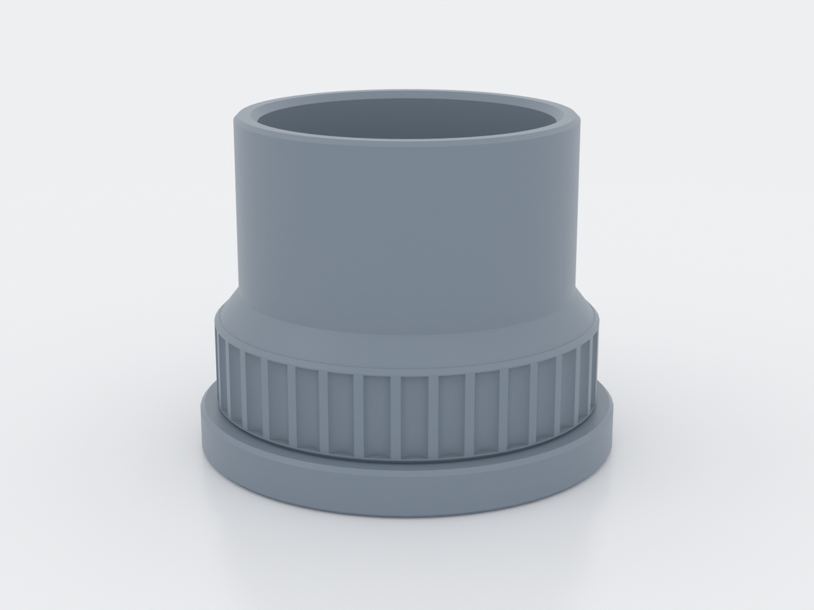
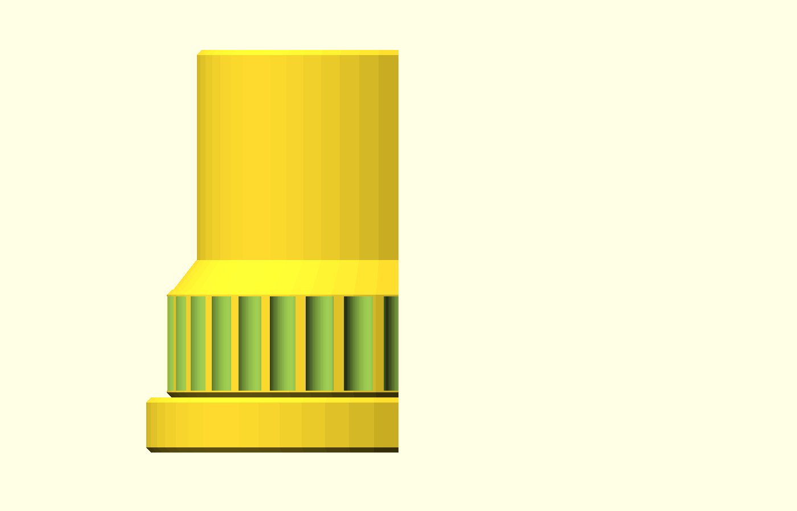
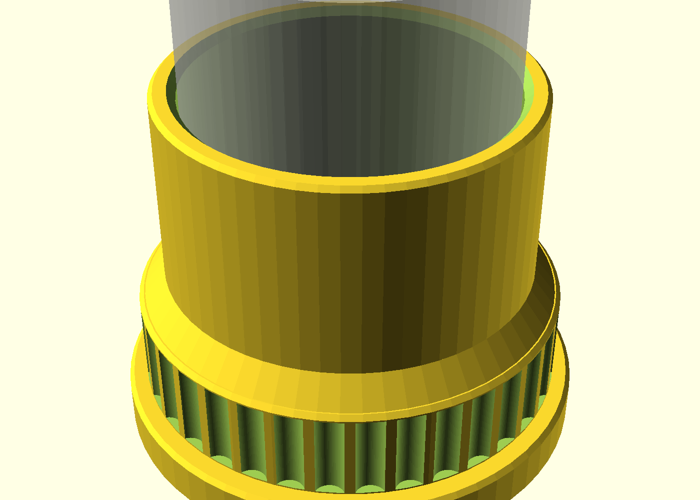
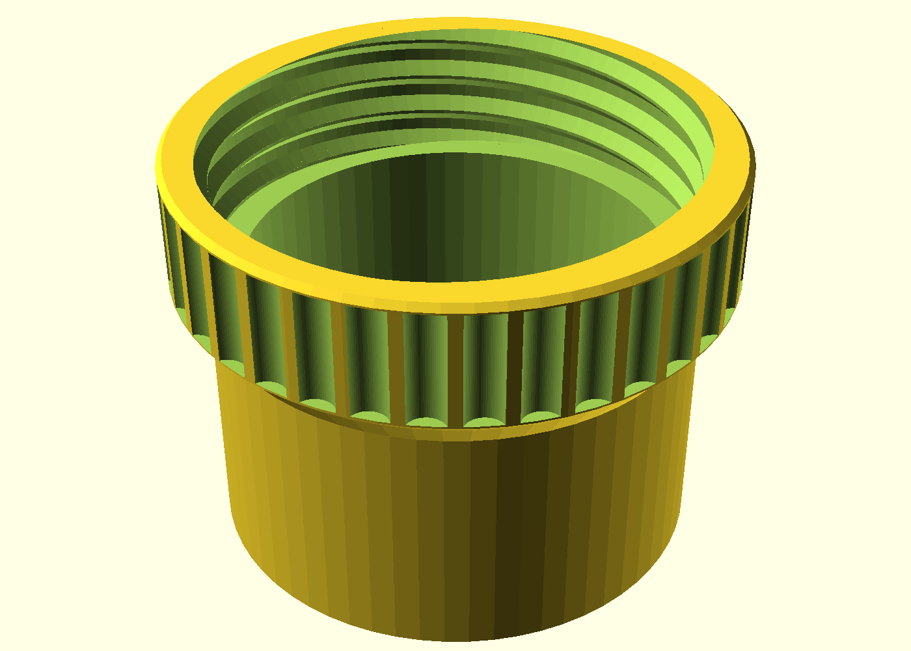
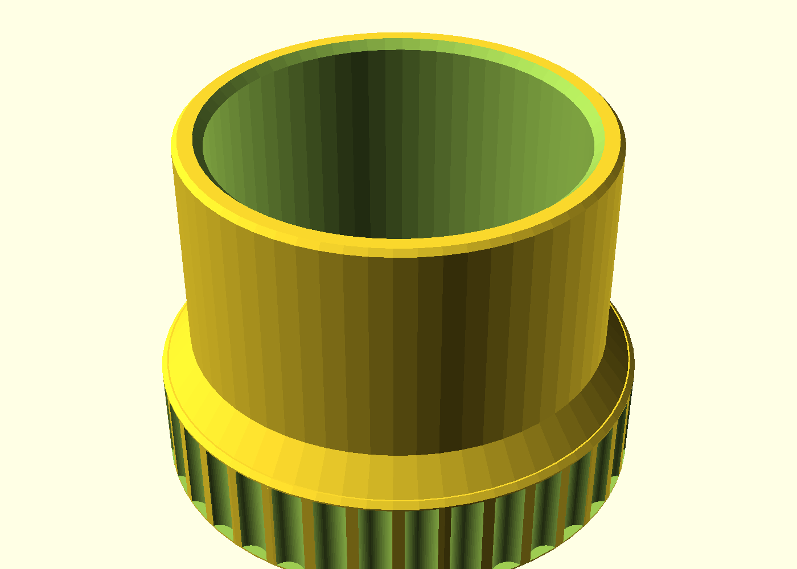
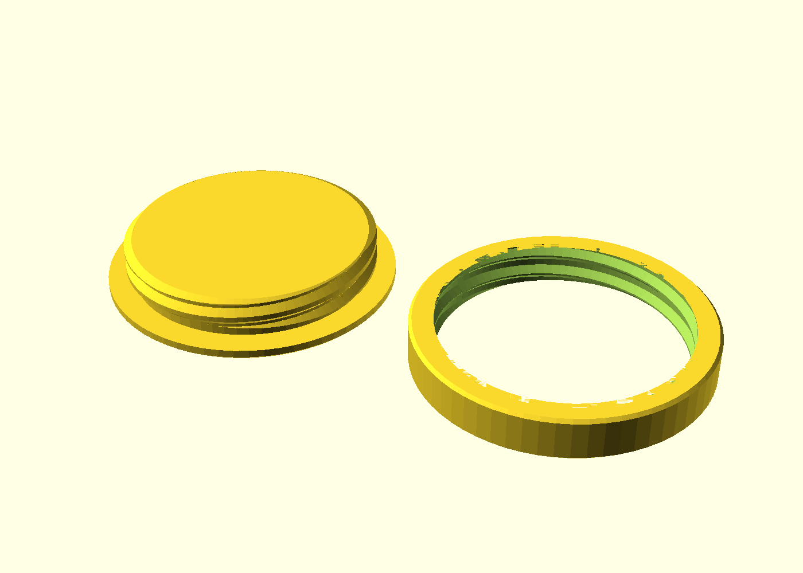

# Alcove rod socket

A parametric, two-part screw-together end socket for a 40 mm curtain or
closet rod that spans a recess or alcove. A wall boss screws flat to each
facing wall; the rod's ends plug into knurled collars that hand-thread onto
the bosses. Curtains down for washing = unthread two collars, no tools.

> **v2** — ships the separable multi-object plate deliverable. v1 (#361)
> printed **fused** in the field (a single STL of the two parts slices as one
> welded body); v2 fixes the packaging, geometry unchanged. See *Deliverable*
> below and the field test log in NOTES.md.

## What you get

Printed **in pairs** (one holder per wall, one pair per rod):

- `boss` — the wall plate: Ø58.8 × 18 mm disc with a countersunk M5 screw
  hole and an external printed thread (an optional second off-axis screw
  setting, `screw_count=2`, grows the flange for heavier installs — a hung
  pair over ~10 kg; see Assembly).
- `collar` — the rod socket: Ø54 × 40.6 mm knurled tube, internal printed
  thread below, Ø40.6 rod bore above.
- `thread-coupon` / `bore-coupon` — the "print this first" fit checks (see
  Print settings).

**Deliverable — two objects, never one fused STL.** `boss` and `collar` print as
**separate parts**, and the one rule is: keep them as two distinct objects in the
slicer. STL carries no object separation, so exporting the two into a *single*
STL imports as one fused body and welds them together — v1's field-test failure
(NOTES.md). Two ways to get the parts, both give the separation:

- **Downloaded a Release:** you get two files, `boss` and `collar` — import
  **both** and keep them as separate objects. (No v2 Release is tagged yet —
  releases are cut on a tag, not on merge — so until one exists, use the clone
  path below.) The Release carries the **default-depth** parts: for the
  push-in-deep / drop-in-shallow install, render the far-side collar shallow
  (`engagement_depth=12`) before install day.
- **Cloned the repo:** `./scripts/plate.sh alcove-rod-socket` bundles the two
  into one multi-object 3MF (`build/alcove-rod-socket-plate.3mf`) — the same two
  objects in one file. (The 3MF is a local build artifact; it isn't attached to
  the GitHub Release yet — that's a tracked follow-up.)

Either way, saving bed space is fine — lay the two parts **side by side and
flat** (the plate's `--merge` does exactly that). Don't stack them **one on top
of the other**: two separate objects stacked vertically still print the upper one
over open air — the ~10-layers-in spaghetti from v1.

**A rod takes a pair — two holders**, so print (or import) the set **twice**. For
the push-in-deep / drop-in-shallow install (Assembly step 3, Parameters table)
the two holders share the **same boss**; only the far holder's collar differs —
render it shallow with `engagement_depth=12`. So a deep+shallow pair is two
bosses + one default collar + one shallow collar. **Neither shipped set — the
Release nor the plate — carries that shallow collar yet**; render it before
install day with **`-D 'part="collar"' -D 'engagement_depth=12'`** (the
`part="collar"` is essential — the file defaults to `part="assembly"`, so
without it you'd export the fused two-part preview as one STL, the very failure
this fixes). Shipping the shallow collar as a gated part is the charter's
#1 backlog item (B3 in PM.md).

**Twice can be one print.** Import both objects (or the plate), select
both → right-click → **Add Duplicate**: four objects in one ~3 h 21 m run.
For the deep+shallow pair, make the duplicate collar the shallow one — swap
one of the two collars for a render with
`-D 'part="collar"' -D 'engagement_depth=12'` — so the run is boss ×2, one
default collar, one shallow. Two such plates fit the 256 × 256 mm P2S bed.

## Print settings

- **Material:** PETG or ASA for a permanent, load-bearing install — PLA
  creeps under sustained load, and a hot south-facing window is the
  one-strike failure. Both want a retune, measured on the coupons: PETG
  prints the thread slightly fatter, so expect `thread_tol` +0.05–0.1 mm
  vs PLA; ASA shrinks the bore ~0.2–0.4 mm — about the whole slip — so
  print the bore coupon in ASA first and expect +0.1–0.2 mm on
  `rod_clearance` (a material-specific preset is charter backlog B4).
- **Layer height:** 0.2 mm, 0.4 mm nozzle.
- **Perimeters:** 3 — the 3.2 mm walls carry the load.
- **Seam:** Scarf (Bambu Studio) or Back — the default Aligned seam stacks a
  ridge up the printed threads and inside the rod bore, and that ridge can
  locally eat the 0.3 mm radial sliding fit.
- **Infill:** 20% gyroid.
- **Supports:** none needed anywhere, by design.
- **Bed adhesion:** brim the **collar**, per-object (Bambu Studio and most
  slicers brim per object — select just the collar). Its first layer is a thin
  ~2.2 mm annular rim carrying a 40.6 mm tube, the part that can lift; the boss
  doesn't need it — it prints flange-down on a full Ø58.8 disc, the best contact
  on the plate. Cheap insurance on the collar rim's own merits (the v1 field
  failure was *packaging*, not adhesion — see NOTES.md — so the plate is what
  fixes that; the brim is separate). A per-object collar brim can't reach the
  ~5.7 mm gap to the boss, so nothing bridges. (Brim the *whole plate* instead
  and the two brims may meet in one web; it should peel clean, but that is
  **untested** — predicted, not observed, and the proving print is what
  confirms it. Per-object avoids the question.)
- **Orientation:** print every part as rendered — boss flange-down, collar
  rod-mouth-down (the internal thread prints at the top of the collar, never
  on the first layer). Never flip the collar grip-band-down for a nicer
  face: the printed thread has to stay up top. If the collar's first-layer
  ring lifts, fix it with the brim above — don't flip the part.
- **Print order:** both coupons first, then tune (below), then a pair.

The gate scores three of the four gated parts 92/100 with one warning each
— thin walls (2–5% of sampled surface under 0.8 mm on the boss, collar and
thread coupon; the bore coupon is clean). That is the tessellated thread
crests and the knurl ridges, not the 3.2 mm load path; it is by design and
needs no slicer action. The coupon carries the same profile, so a coupon
that prints clean says the parts will too.

Measure your pole with calipers where it will sit and set `rod_d` to that
barrel reading — "40 mm" is sometimes the finial size, not the pole.

## Parameters

The ones you are most likely to touch (all in `alcove-rod-socket.scad`,
Customizer-grouped; override on the command line with `-D 'rod_d=38.5'` —
and pair it with `-D 'part="collar"'`, or you'll export the fused assembly
preview instead of a printable part):

| Parameter | Default | What it does |
|---|---|---|
| `rod_d` | 40.0 mm | rod barrel outer Ø where it sits in the socket |
| `rod_clearance` | 0.6 mm | diametral slip added to `rod_d` → socket bore |
| `engagement_depth` | 28 mm | how deep the rod plugs in; print the far holder shallower (e.g. 12) for the push-in-deep / drop-in-shallow install |
| `thread_tol` | 0.3 mm | radial thread fit — dial on the thread coupon |
| `screw_count` | 1 | 1 central M5, or 2 off-axis (grows the flange; stops boss spin) |
| `knurl_flutes` | 36 | grip flute count — guarded to keep flutes printable |
| `wall` | 3.2 mm | structural wall everywhere |

Sizes other than the default 40 mm rod are **untested** — the geometry
scales, but the fits are only proven at 40 mm, and the coupons are the
proof: print them in your material first and trust them over this page.

## Assembly & use

1. Screw a boss to each facing wall, countersunk M5 head flush in the neck.
   Screw length: the boss is 18 mm through, so **M5 × 40 mm** into a rated
   drywall anchor (the anchor card governs the exact pairing), or **M5 ×
   55 mm** into a stud behind ~13 mm board (18 + 13 leaves ≥ 20 mm in the
   stud). One M5 in a rated anchor holds a pair to roughly **10 kg** of hung
   weight — heavier curtains than that want a stud or `screw_count=2`
   (derivation in NOTES).
2. Slide the collars over the rod before hanging it — one at each end.
3. Thread each collar onto its boss until the rim seats on the plate. For a
   rigid rod between two fixed walls: set one holder's `engagement_depth`
   deep and the other shallow (e.g. 12 mm) — push into the deep side, drop
   the shallow end in, tighten both collars. Cut the rod ≈ **18–20 mm short
   of the mouth-to-mouth span** (28 mm deep − 12 mm shallow + each mouth's
   lead-in).
4. To wash the curtains: unthread the collars (~1¼ turns each — 2-start
   thread) and lift the rod out — **holding the flange still** as you
   unthread, because unscrewing friction can walk the single M5 out of the
   wall over enough wash days. No tools.

If a fit is off, don't resize the parts — reprint the coupon and move the
tolerance (`thread_tol`, `rod_clearance`) in 0.05–0.1 mm steps; see
"Print this first" in NOTES.md, including a one-print tolerance sweep
(`./scripts/render.sh alcove-rod-socket --sweep thread_tol=0.2:0.4:0.05`).
