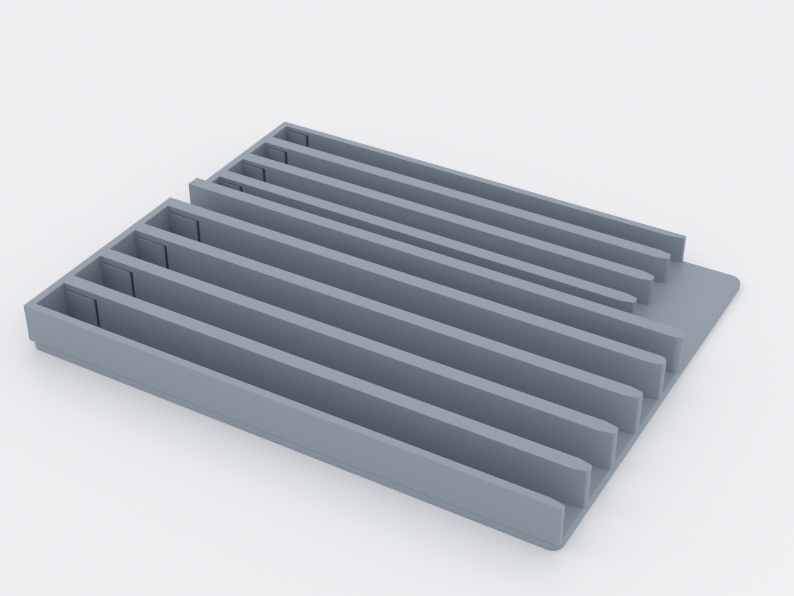
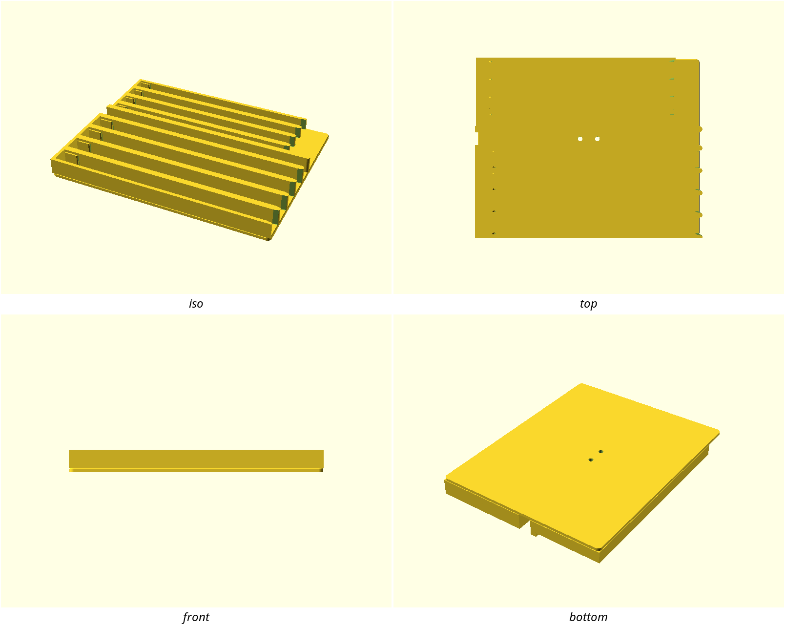
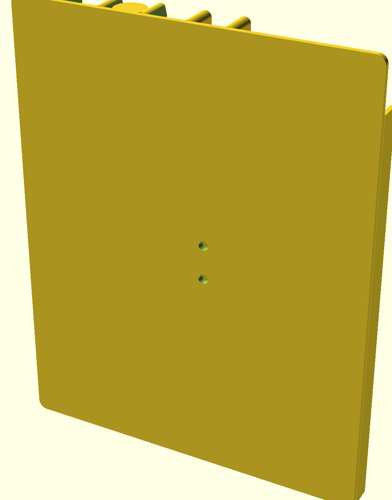
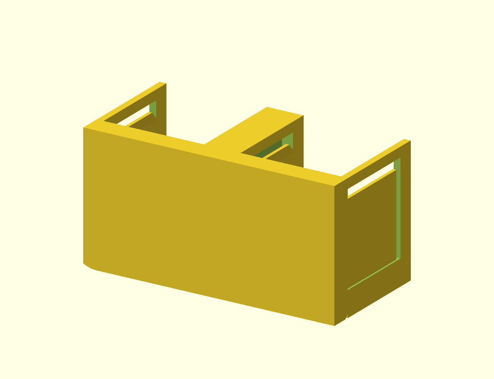

# Battery caddy — spring-retained AA/AAA wall rail

A one-piece wall-mounted caddy that stores AA and AAA cells in gravity-fed
lanes and dispenses them one-handed: each lane's bottom cell is pinched by
printed spring blades, so you pull it out against a firm, tuned release force
and the column simply drops the next cell into the grip. Screw it to a wall,
shelf side or printer enclosure and the household battery drawer stops being
a box of rolling cells.

## What you get

- `battery-caddy` — the whole caddy in one print: 4 AA lanes + 4 AAA lanes
  on a mounting spine, 206.5 × 164.4 × 18.1 mm as printed (mounts
  164.4 × 18.1 × 206.5 tall). Holds 16 AA + 16 AAA.
- `battery-caddy-coupon` — the print-this-first tuning coupon (one AA lane,
  two cells) for setting the spring release force in your material.

## Print settings

- **Material:** PETG preferred (the springs live through thousands of
  flexes); PLA workable with `finger_t = 1.2`
- **Layer height:** 0.2 mm
- **Infill:** 15 % — the walls and springs are perimeters, the body is mostly shell
- **Supports:** none — every feature prints support-free (the springs are
  vertical fins in the bed plane)
- **Orientation:** as rendered — back plate flat on the bed
- **Brim:** recommended; the walls are long and only 18 mm tall

Print the coupon first and tune `finger_t` before committing 178 g to the
full body (see the coupon section below).

## Parameters

| Parameter | Default | What it does |
|---|---|---|
| `finger_t` | 1.3 mm | Spring blade thickness — **the** release-force knob (stiffness ∝ t³) |
| `pinch` | 0.35 mm | How far each blade protrudes past the cell surface |
| `cell_clearance` | 0.4 mm | Bore over cell Ø — raise if your cells caliper fat |
| `aa_lanes` / `aaa_lanes` | 4 / 4 | Lane counts; either can be 0 |
| `aa_cells` / `aaa_cells` | 4 / 4 | Cells a lane holds (sets lane height) |
| `mount_pitch` | 16 mm | Vertical spacing of the two M4 mounting holes |

All parameters are at the top of `battery-caddy.scad`, grouped in Customizer
sections; override on the command line with `-D 'finger_t=1.2'`.

## Assembly & use

Mount with two M4 screws through the spine (holes are Ø 4.5 clearance,
16 mm apart) into anchors appropriate for the surface. Load cells from the
top — the funnel guides the cell in and the springs ride its shoulder open;
pull the bottom cell out the front to dispense.

**Storing mixed orientations:** terminals of adjacent cells in one lane can
touch end-to-end. Storing a lane all one way round (or mixing charged /
flat consistently) avoids terminal contact — worth a habit, not a redesign.

**No lid:** the lanes are open at the top and front of the bottom grip, so a
*fully inverted* caddy spills its column. Mounted or shelf-standing upright,
shaking will not release anything — the grip holds the bottom cell and the
bores leave the rest ~0.2 mm of play.

**Print this first:** `battery-caddy-coupon.scad` — one AA lane at
production spring geometry. If the pull is too hard, drop `finger_t` by 0.1
and reprint; if cells slide out on their own, raise `pinch` to 0.45. The
full tuning walkthrough is in NOTES.md.
