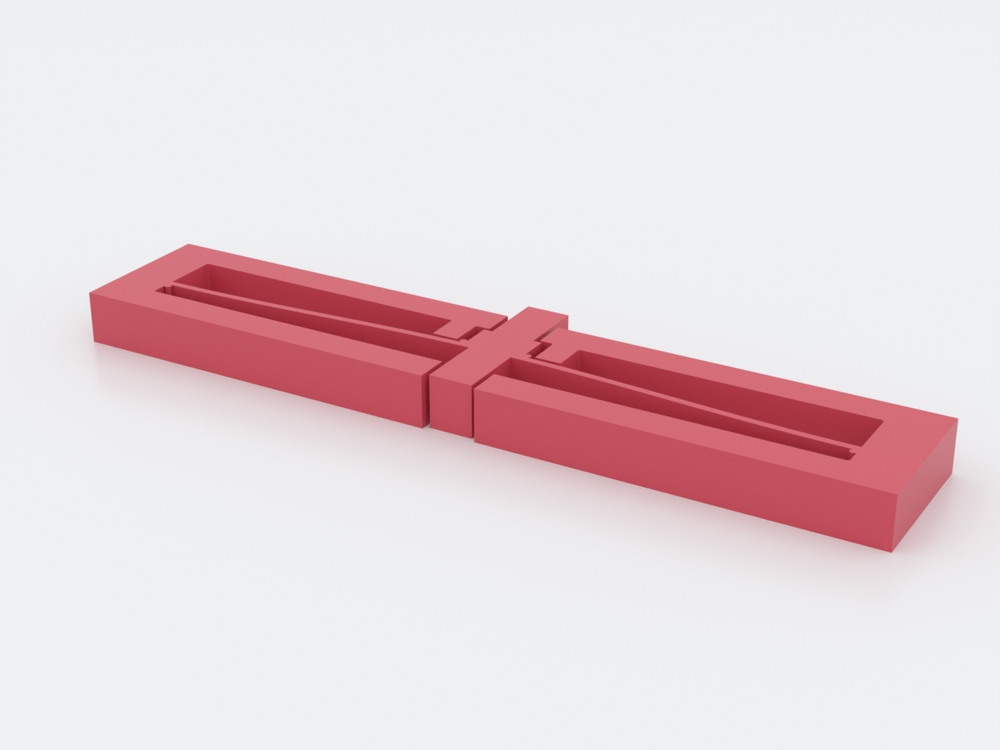
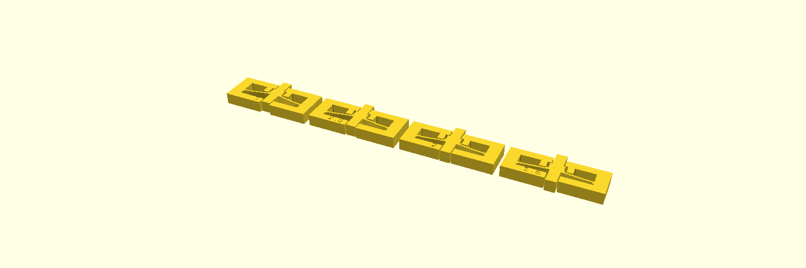
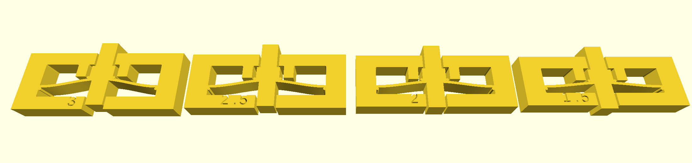
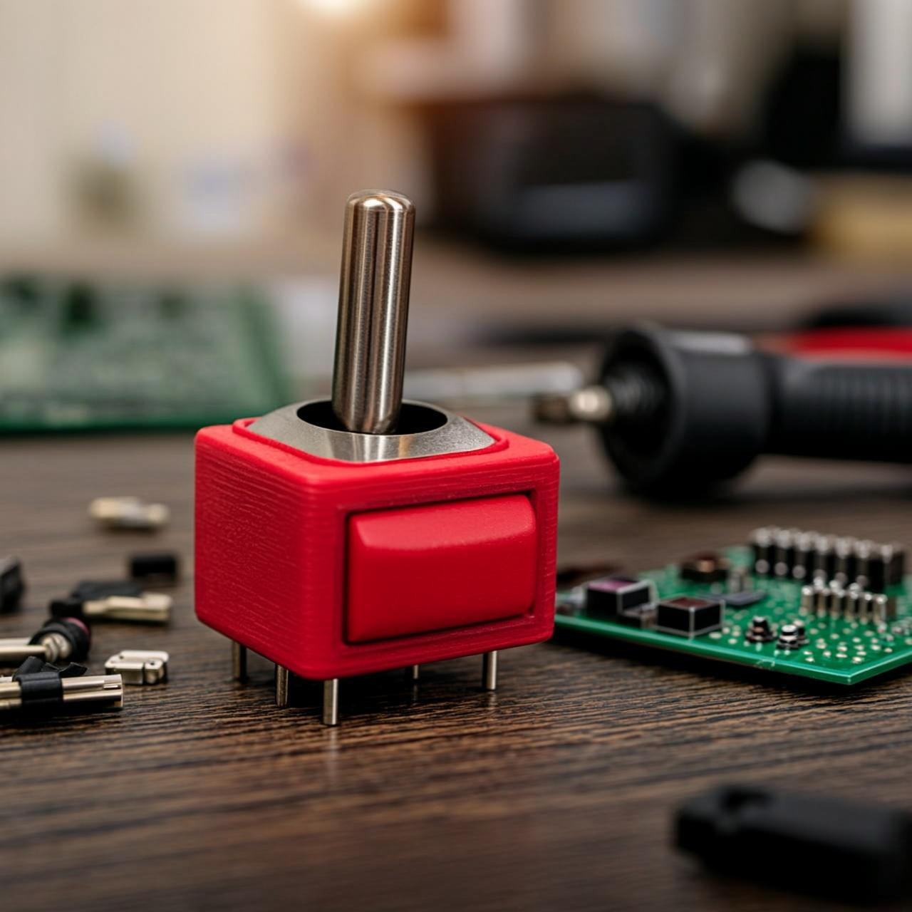

# bistable-toggle

A monolithic **bistable push switch**: a pre-buckled arch with two stable states
(bowed up / bowed down) separated by a negative-stiffness region. Press the
proud push stem and the arch snaps through flat to the other state and *stays*
there — power is only needed to switch, never to hold. The stems are a mirrored
pair riding the arch centre through windows in the stop cage: whichever state
the toggle is in, exactly one stem stands proud of the cage, and pressing it is
the next switch — one motion of one finger, in both states. Dimensioned from
feel targets, not by eye: a **3 N fingertip snap** with **4 mm of travel** —
*predictions* solved back from published fixed–fixed-arch constants against a
textbook PETG modulus, for the coupon to verify on your printer, not
guarantees. A worked example of the bistable / constant-force family
(`docs/advanced-techniques.md`, Domain 1).

## What you get

- `bistable-toggle` — one flat part, ≈ 94 × 21 × 6 mm. The arch snaps inside a
  rigid stop cage (lid above, base bar below, rails flanking the nub) that
  absorbs over-travel and sideways shoves, so the flexure only ever feels the
  motion it was solved for. The lid and base bar are windowed over the push
  stems, and the over-travel stops sit **outside the push column**: the +Y stop
  is the nub's shoulders catching the lid-window jambs at the same 0.4 mm gap,
  and the −Y stop is the arch meeting the base-bar jambs beside its window
  (first contact ≈ 0.43 mm at the window edge — the 0.4 design gap plus the
  arch's curvature drop across the half-window). Use it as a latch, a damper
  hold, or a tactile toggle that holds state with zero power.
- `bistable-toggle-coupon` — **print this first**: a 4-cell strip sweeping the
  bistability threshold on *your* printer (below).

**How to press it:** the push is in the part's plane. Lying flat on the table
the stems point along the table, not at the ceiling — press the proud stem
straight in, like a doorbell set into the frame's edge, until the snap carries
it through; then the opposite stem stands proud for the return press. (Pressing
the part's broad top face does nothing: that is the ~50× stiffer out-of-plane
axis, and no push face lives there.)

**Fixing & which way up:** there are no fastener holes by design — the frame is
the ground, so fix the part by its **end-post faces only**. Never bond the base
bar's or lid's outer face flush: the hidden stem crosses that plane by 3.5 mm
on every snap, so glue or tape there sits innocently flush and bricks the
switch on the first press (if you must mount by that face, relieve ≥ 3.5 mm
behind the window zone). A printed pocket should grip the **end posts** — a
full-length slot on the 6 mm frame clamps the arch and stems solid, since
everything on this part is the same 6 mm thick. Loose on a desk, the 6 g part
skates under its own 3 N button — pinch the end posts or fix it first. Either
face may be "up": the mechanism is symmetric through its plane — mount it so
the stem you'll press most often faces the operator.

## Print settings

- **Material:** PETG — the easy path, and the only one the solve's
  `E = 2000 MPa` datum actually describes. PP and nylon flex just as well but
  are traps on stock hardware: PP barely adheres to PEI (strap the plate with
  packing tape), and un-dried nylon loses layer adhesion exactly where the beam
  lives (dry box + enclosure). **Not PLA** — the second state holds a small
  residual stress in a live flexure, and PLA creeps under sustained load: a PLA
  toggle stops clicking within months and just sits there half-snapped.
- **Layer height:** 0.2 mm
- **Infill:** 100 % / high perimeters
- **Supports:** none — everything, the stop cage included, is pure profile and
  prints flat face-down. Keep auto-supports **off**; the mechanism needs none
  and painted ones would weld it.
- **Orientation:** flat, as modelled — the arch snaps in the layer plane, so
  bending stress runs across roads within a layer, not between them
- **Plate:** textured PEI if you have it — PETG over-welds on smooth, and the
  moving clearances touch the bed (next line)
- **First layer:** set **Elephant foot compensation: 0.2 mm** — stock
  profiles ship it at 0.0, so "enabled" isn't a state the machine has, a
  number is. Every moving clearance here is a layer-1 clearance: the 0.4 mm
  stop gaps at the nub, the rail faces and the 0.6 mm stem↔window slots all
  run the full height *including layer 1*, where squish can pinch the
  thinnest to a hairline web. Expect a gritty first press: it shears the
  layer-1 tack webs *and* the PETG wisps strung across every through-height
  gap — the stem windows, the rail gaps, the stop gaps — normal, not damage.
  The through-cut windows give the debris somewhere to go, so the *second*
  press should feel clean; only if it doesn't is there anything to tune (each
  coupon cell has the same slots, so the strip shows you the feel first)
- **Seam:** Back (cosmetic — nothing mates on a perimeter)

The 0.82 mm arch beam prints as two clean perimeters at a 0.4 mm nozzle. If the
first snap feels dead or the "2.5" coupon cell only springs back, your material
landed outside the solve — calibrate with the coupon before blaming the part.

## How it's dimensioned

Pick the feel you want, the geometry follows: `h = u_tr/1.98` and
`l = (1486.57·E·I·h/f_s)^(1/3)` with `I = w·t³/12`. The defaults invert to
`f_s ≈ 3 N`, `u_tr ≈ 4 mm` (echoed at render, asserted against the targets).
Bistability requires `mid_rise/beam_t ≳ 2.3` — below that it's just a spring,
and the design refuses to build it. The full solve chain is in `NOTES.md`.

## Parameters

| Parameter | Default | What it does |
|---|---|---|
| `target_fs` | 3 N | target switch force — the solve derives `span` from it |
| `target_utr` | 4 mm | target centre travel — the solve derives `mid_rise` from it |
| `E` | 2000 MPa | Young's modulus (PETG datum) — scale to your measured snap |
| `mid_rise` | 2.02 mm | arch rise `h` (derived from `target_utr`) |
| `beam_t` | 0.82 mm | arch thickness `t` — window [0.8, 0.878]: 0.8 is the two-perimeter floor, 0.878 the bistability cap |
| `span` | ≈ 82 mm | clamped span `l` (derived from `target_fs`) |
| `width` | 6 mm | out-of-plane width = print height |
| `stop_gap` | 0.4 mm | travel past a stable state before a hard stop bites |
| `stem` | [5, 3.5] mm | push stem [width, proud height]; proud must exceed the rise `h` or the finger bottoms on the cage before snap-through (asserted) |
| `stem_clear` | 0.6 mm | stem↔window clearance — kept above `stop_gap` so the ±X rails always bite before a stem touches its jamb |

Bistability holds while `mid_rise/beam_t ≥ 2.3`. All parameters are at the top of
`bistable-toggle.scad`; override with `-D 'target_fs=2.5'` and the derived
dimensions follow.

## Print this first: the coupon

`bistable-toggle-coupon.scad` prints four small cells labelled **3 / 2.5 / 2 /
1.5** — their `mid_rise/beam_t` ratios at the production thickness. Left to
right: bistable, bistable (the production ratio), monostable, monostable. Four
cells because this is a family calibration with negative controls, not a copy
of the part: two cells are deliberately dead so you know the test can fail.
Press each cell's proud stem — every cell carries the same stems and windows as
the production part, so the strip teaches the same motion. Feel the snap die
between 2.5 and 2 — that is your printer landing where the solve assumed. If
2.5 only springs back for you, raise `mid_rise`; if the production snap is too
fierce, lower it. Steps in `NOTES.md` → "Print this first".

Two expectations, so the strip reads right: the cells are short (`l = 35` vs
the part's ~82) and switch force scales as `1/l³`, so they snap roughly **13×
harder** than the part — feel for whether each state *holds*, not for the
production force (~3 N), and hold the strip down while you press. And the strip
is the bigger commitment on purpose: about **1 h 26 m / 15 g** of insurance
against the toggle's **~32 m / 6.3 g** — the honest first evening is both on
one plate. The strip is ~197 mm long: on beds under ~210 mm, print it rotated
45° or two cells at a time — and if you add a brim for adhesion it will bridge
the 3 mm gaps and print the strip as one piece (harmless to the calibration;
just break the cells apart at the web before pressing).

*AI-styled scene — generated impression for illustration only; geometry is approximate and may not exactly match the printed part. See the studio render and contact sheet above, and the STL, for the true shape.*
