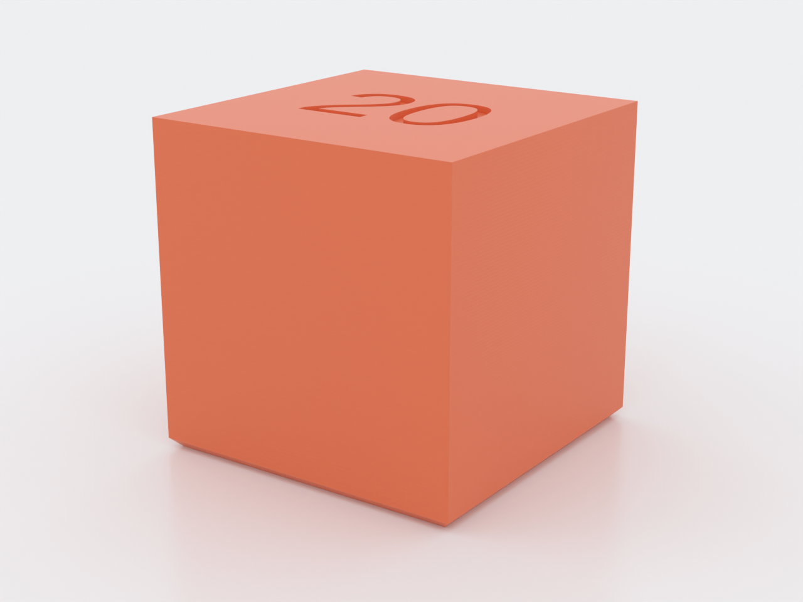
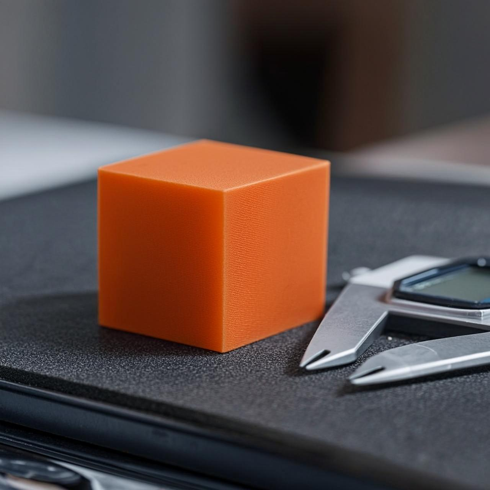
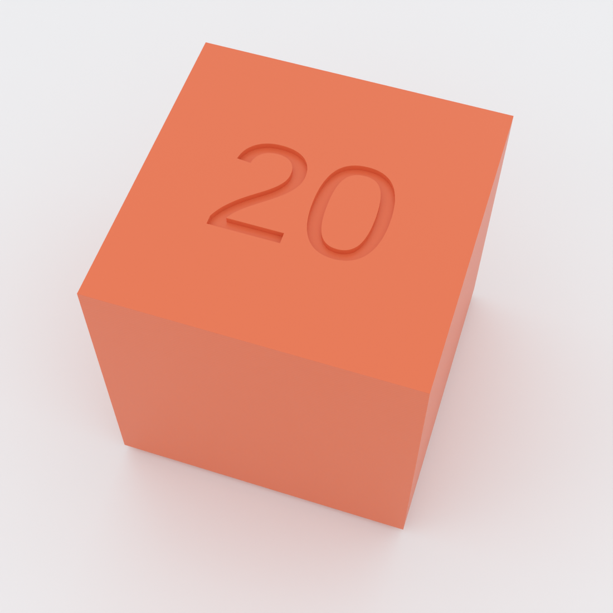
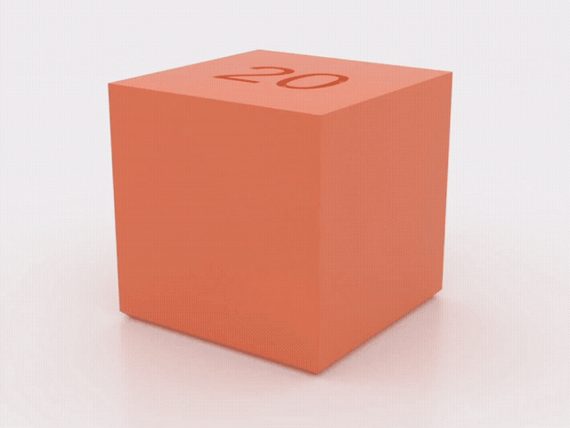

# calibration-cube

A 20 mm test cube for checking your printer's dimensional accuracy — and the
starter design demonstrating this repo's parameter conventions. The bottom
edges carry a 0.6 mm 45° chamfer so the first layer releases cleanly, and the
top face is engraved with the cube's edge length, so every print labels its
own intended size.

*AI-generated impression for general illustration only — geometry is approximate and may not exactly match the printed part; see the studio render above and the STL for the true shape.*

*AI-generated motion impression for general illustration only — geometry is approximate and may not exactly match the printed part, and the movement shown is illustrative, not a simulation; see the deterministic previews above and the STL for the true shape.*

## What you get

A single printable part, no assembly:

- `calibration-cube` — one cube, 20 × 20 × 20 mm at default settings, with
  chamfered bottom edges and the edge length engraved 0.4 mm deep into the
  top face.

## Print settings

- **Material:** any — use the filament you want to calibrate
- **Layer height:** 0.2 mm or finer (the engraved marker is sized to survive
  slicing at 0.2 mm layers)
- **Infill:** 100% if you'll check dimensional accuracy under load; otherwise
  your usual default
- **Supports:** none needed
- **Orientation:** as modeled — flat face down

## Parameters

| Parameter | Default | What it does |
|---|---|---|
| `size` | 20 mm | Edge length of the cube; the engraved marker updates to match |
| `bottom_chamfer` | 0.6 mm | 45° chamfer on the bottom edges so the first layer releases cleanly (0 to disable) |
| `$fn` | 64 | Curve resolution — 32 while iterating, 64+ for production |

All parameters are at the top of `calibration-cube.scad`, grouped in
Customizer sections; override on the command line with `-D 'size=25'`.

## Assembly & use

Nothing to assemble. Print it, then measure the X, Y, and Z faces with
calipers and compare against the number engraved on top. If you want a
different reference size, change `size` and reprint — the marker follows
automatically.

Design rationale and modeling decisions live in [NOTES.md](NOTES.md).
