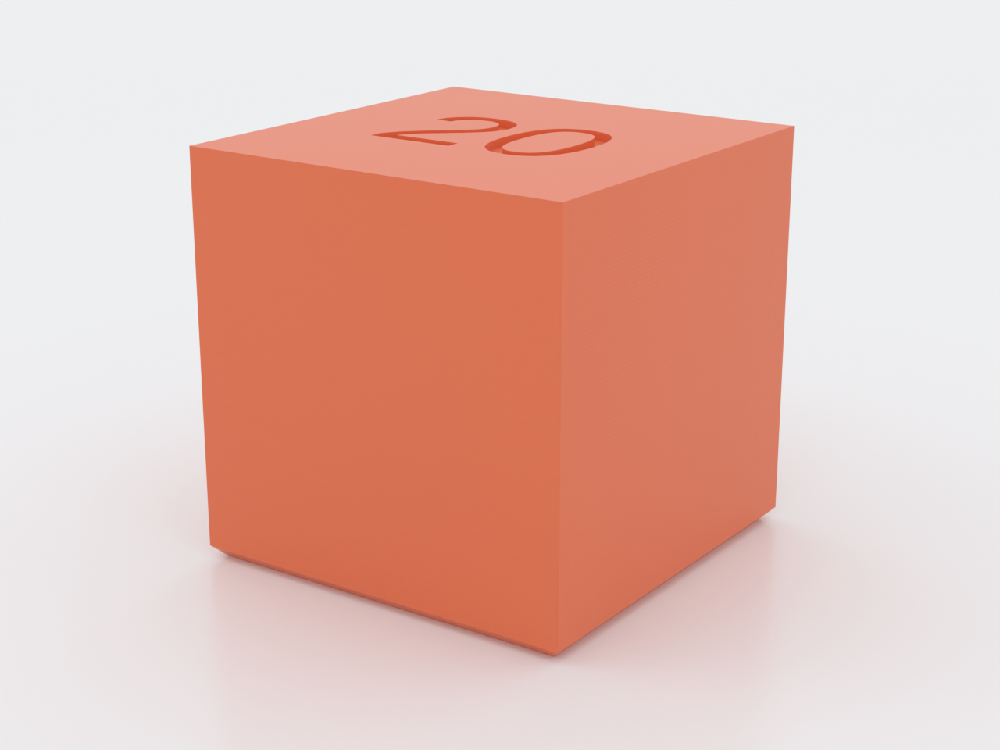
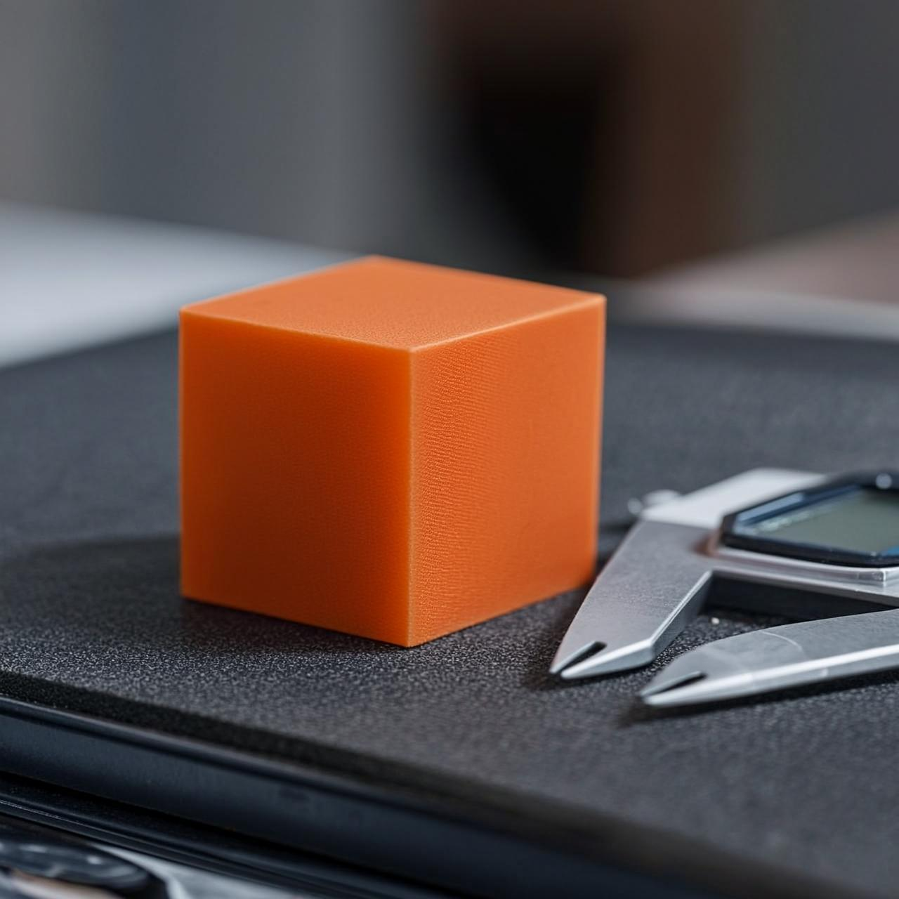
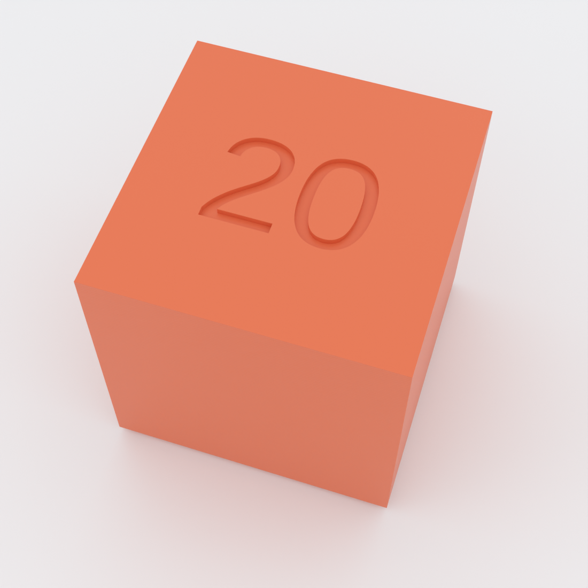
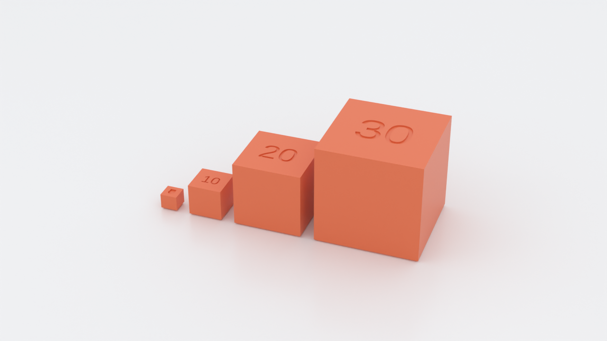
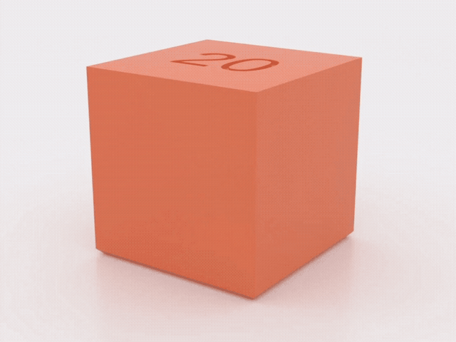

# calibration-cube

A 20 mm test cube for checking your printer's dimensional accuracy — and the
starter design demonstrating this repo's parameter conventions. The bottom
edges carry a 0.6 mm 45° chamfer so the first layer releases cleanly, and the
top face is engraved with the cube's edge length, so every print labels its
own intended size.

*AI-generated impression for general illustration only — geometry is approximate and may not exactly match the printed part; see the studio render above and the STL for the true shape.*

*AI-generated motion impression for general illustration only — geometry is approximate and may not exactly match the printed part, and the movement shown is illustrative, not a simulation; see the deterministic previews above and the STL for the true shape.*

## What you get

No assembly. Two ways to print:

- `cube` — the starter single cube, 20 × 20 × 20 mm at default settings
  (`size` is parametric), with chamfered bottom edges and the edge length
  engraved 0.4 mm deep into the top face. Optional X/Y/Z side letters are
  **off** by default (`face_letters`).
- **Multi-size strip** — four separate cubes (5 / 10 / 20 / 30 mm) as
  distinct objects on one plate, not a fused bar. The 10 / 20 / 30 tops
  read as those numbers. The 5 mm cube is the **smallest** on the plate
  (`cube5`); its top engraving is a blob at showroom and slice scale, not
  a readable 5 — do not treat that mark as the size label.

**Deliverable for the strip.** STL carries no object separation, so the
printable strip is the multi-object 3MF from
`./scripts/plate.sh calibration-cube`
(`build/calibration-cube-plate.3mf`) — `cube5`, `cube10`, `cube20`,
`cube30` as four objects. `part="sweep"` is a layout preview only; do not
slice that STL. Import the plate (or the four part STLs) and keep them as
**separate objects**, **side by side and flat**. Leave the 4 mm air gap;
do not add a brim. The 5 mm cube's first layer after the 0.6 mm chamfer is
a 3.8 mm patch — small, but that is the dimensional sample, not a defect
to pad.

## Print settings

- **Material:** any — use the filament you want to calibrate
- **Layer height:** 0.2 mm or finer (the engraved marker is sized to survive
  slicing at 0.2 mm layers)
- **Infill:** 100% if you'll check dimensional accuracy under load; otherwise
  your usual default
- **Supports:** none needed
- **Brim:** no brim — PrusaSlicer's skirt default is fine. On the multi-size
  strip, leave the 4 mm air gap between cubes; Bambu Studio's stock **Auto**
  brim can pad the 5 mm cube's 3.8 mm first-layer patch and chain the four
  objects across that gap.
- **Orientation:** as modeled — flat face down
- **Seam:** park the seam on a **rear corner** before you measure. A stock
  aligned seam on a face leaves a ridge a caliper will catch. This is
  slicer guidance (the model does not force a face seam): PrusaSlicer →
  Seam position → **Rear**, or paint the seam to a back corner; Bambu
  Studio → Seam position → **Back**, or use scarf seam / paint the seam to
  a back corner.

## Parameters

| Parameter | Default | What it does |
|---|---|---|
| `part` | `cube` | `cube` (parametric), `cube5`/`cube10`/`cube20`/`cube30` (fixed strip sizes), or `sweep` (layout preview) |
| `size` | 20 mm | Edge length of the `cube` part; the engraved marker updates to match (ignored by fixed-size parts) |
| `bottom_chamfer` | 0.6 mm | 45° chamfer on the bottom edges so the first layer releases cleanly (0 to disable) |
| `face_letters` | `false` | Engrave X / Y / Z on the side faces so a caliper reading names its axis; off keeps the clean dimensional cube. Faces under 10 mm (the 5 mm cube) stay blank. |
| `$fn` | 64 | Curve resolution — 32 while iterating, 64+ for production |

All parameters are at the top of `calibration-cube.scad`, grouped in
Customizer sections; override on the command line with `-D 'size=25'`,
`-D 'part="cube10"'`, or `-D 'face_letters=true'`.

## Assembly & use

Nothing to assemble. Print a cube (or the strip plate), then measure the
X, Y, and Z faces with calipers and compare against the intended size — on
X and Y, measure above the bottom chamfer, not on the bed footprint. The
default 20 mm cube (and the 10 / 20 / 30 strip cubes) engrave that size on
top. The 5 mm cube does not: identify it as the smallest object on the
plate. If you want a different single reference size, change `size` and
reprint — the marker follows automatically. Turn on `face_letters` to stamp
X / Y / Z on the side faces when you need to attribute which axis is off.

Design rationale and modeling decisions live in [NOTES.md](NOTES.md).
