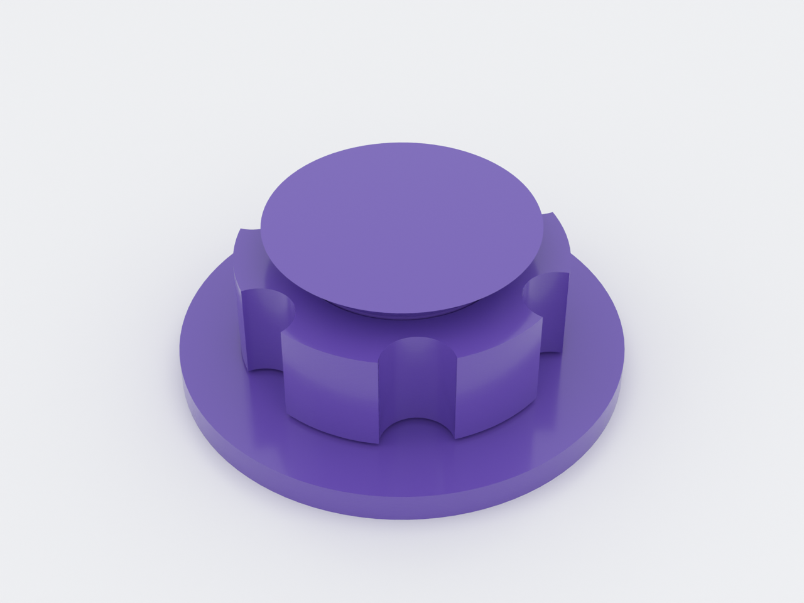
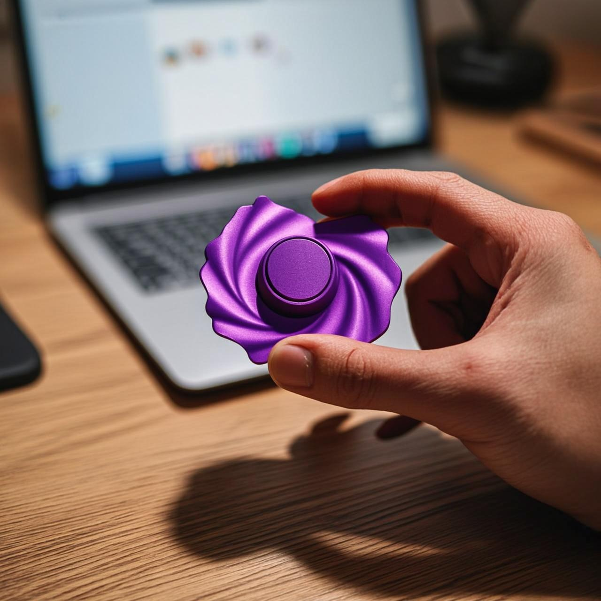

# captive-spinner

A one-piece fidget spinner that comes off the print bed already assembled and
spinning — no supports, no assembly. A rotor is captured on a fixed post under a
45° cone cap; the first spin shears the microscopic print-in-place fusion and
then it runs free. A worked example of print-in-place kinematics
(`docs/advanced-techniques.md`, Domain 3).

*AI-generated impression for general illustration only — geometry is approximate and may not exactly match the printed part; see the studio render above and the STL for the true shape.*

## What you get

- `captive-spinner` — one print, 44 mm across × 16.8 mm tall, made of two
  separate bodies (fixed base+post+cap, and the free rotor ring, OD 32 × 10 wide
  with six finger scallops).

## Print settings

- **Material:** PLA is fine
- **Layer height:** 0.2 mm (the clearances are quantized to it — see below)
- **Infill:** 15–20 %
- **Supports:** none needed — the ring's underside bridges over the axial gap by
  design, and the cap's cone is a self-supporting 45° lip
- **Orientation:** as modelled (base on the bed, axis vertical)
- **First use:** give the rotor a firm first spin to break it free.

The two gaps are deliberately **different numbers** because different physics
govern them: the radial bore↔post gap is spread-limited so it's tight and
**derived from your process constants** (`k_xy · line_w ≈ 0.21` with a 0.4 mm
nozzle), while the axial float below/above the rotor is sag-limited and snapped
to whole layers (`z_layers · layer_h = 0.4`). A single global tolerance is the
classic print-in-place bug.

## Parameters

| Parameter | Default | What it does |
|---|---|---|
| `k_xy` | 0.45 | radial clearance factor — the tuning knob for the rotor↔post fit |
| `z_layers` | 2 | axial float in whole layers (sag-limited) |
| `nozzle_d` | 0.4 mm | your nozzle — drives `line_w` and therefore `xy_tol` |
| `layer_h` | 0.2 mm | drives the axial gap quantization |
| `rotor_or` | 16 mm | rotor outer radius (ring OD 32) |
| `cap_lip` | 3 mm | how far the cap overhangs the bore (capture) |
| `scallops` | 6 | finger grip notches |

All parameters are at the top of `captive-spinner.scad`; override with
`-D 'k_xy=0.5'`. If the rotor won't free, print a copy with `k_xy` +0.05 —
start with the coupon (`captive-spinner-coupon.scad`) to tune fast.
