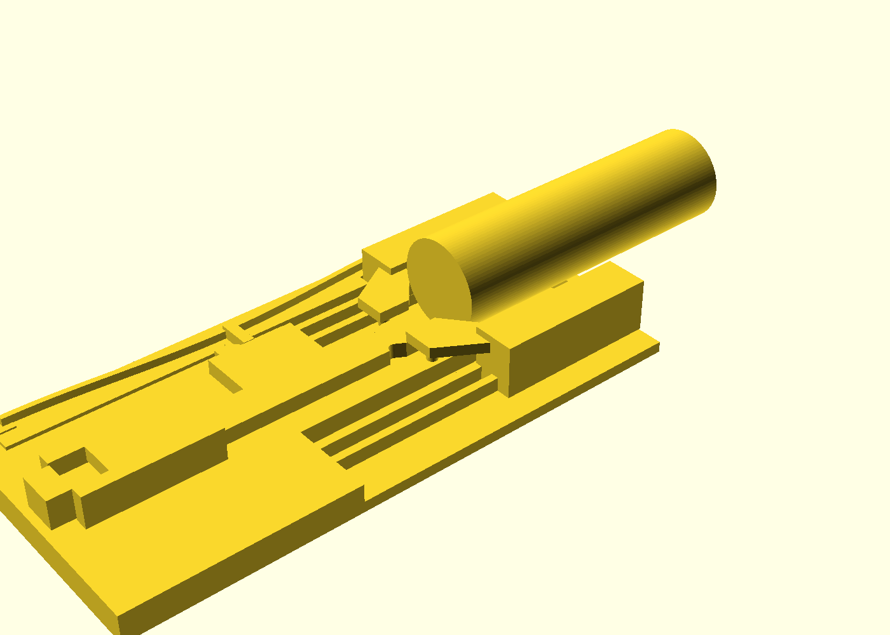
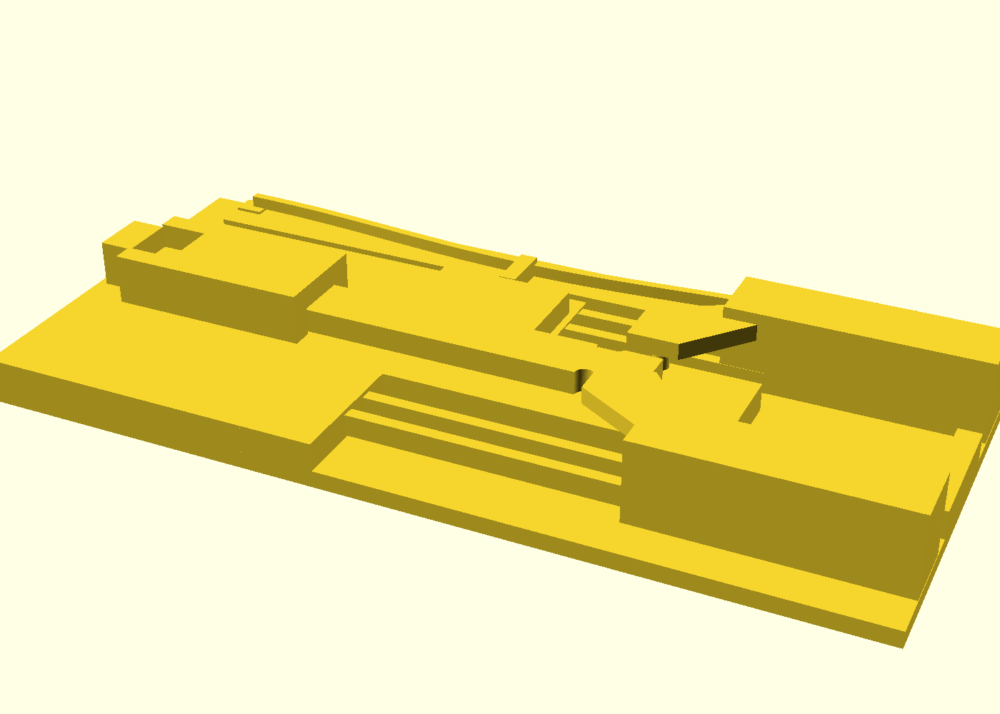
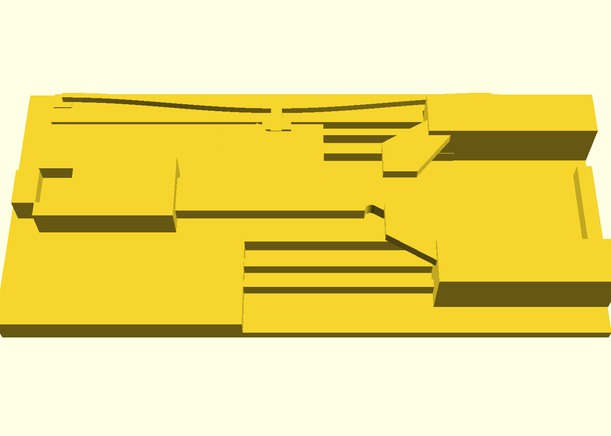
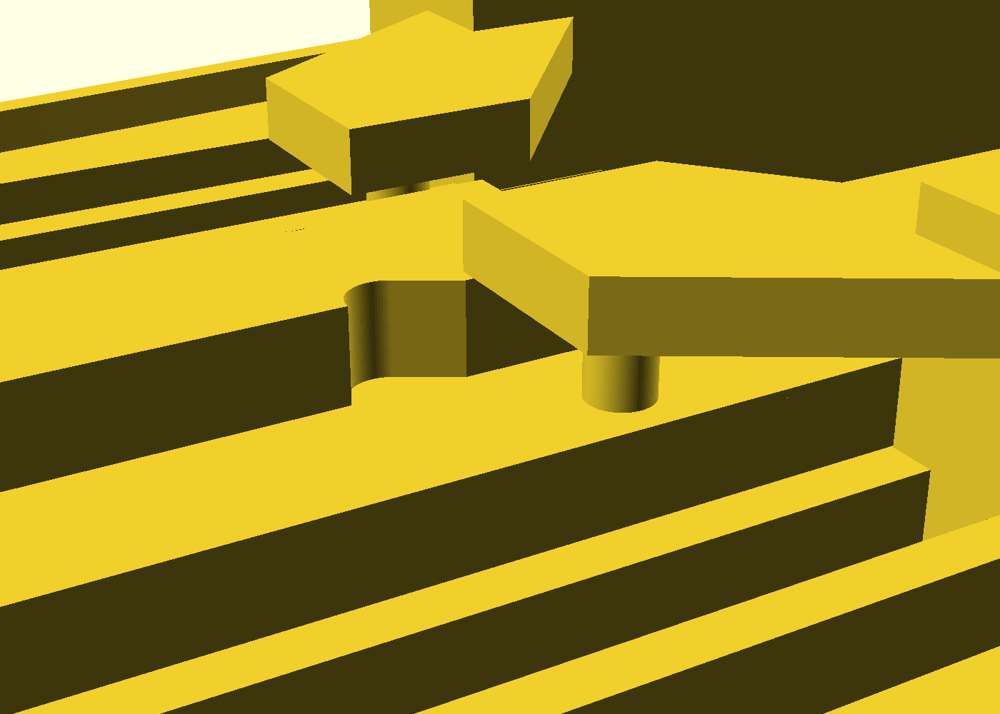
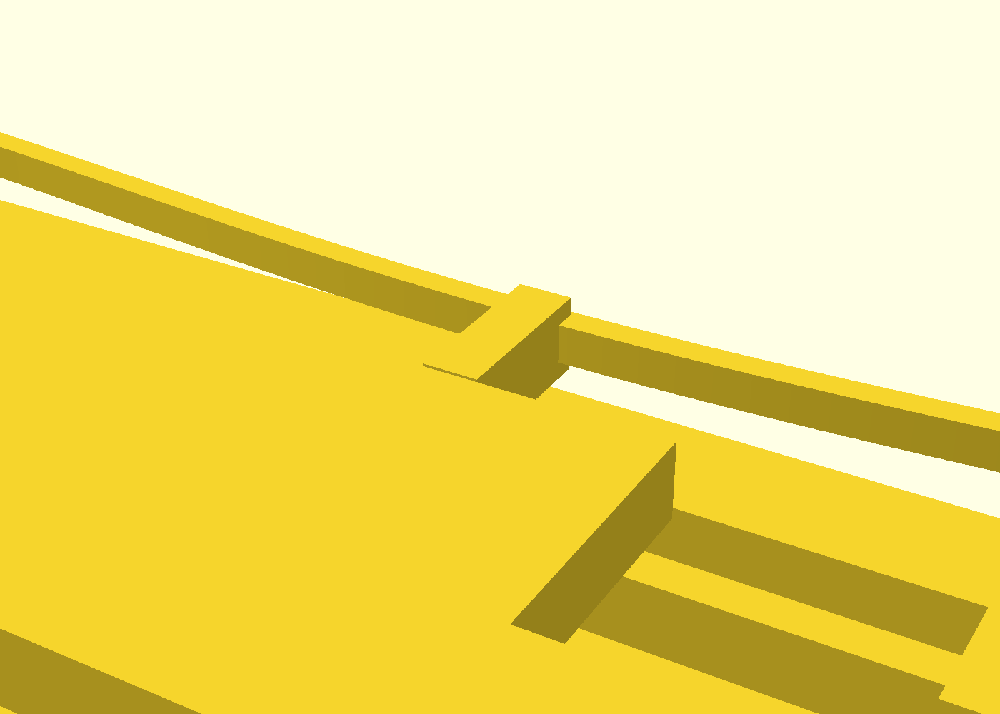
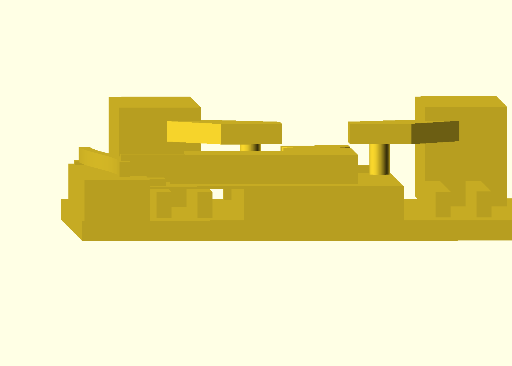

# compliant-gripper

A print-in-place **parallel-jaw gripper** — one piece, off the bed assembled and
working. Push the tab and both jaws close **in parallel** (they stay mutually
parallel through the whole travel, so they clamp a cylinder on its full face,
not at two points); a bistable detent clicks in and **holds the grip with zero
applied force**. Pull the tab, the detent releases, and the leaf flexures spring
the jaws open. One of the "advanced" reference parts: it fuses all three domains
of `docs/advanced-techniques.md` in a single print.

Loaded — a Ø 25 mm rod (the as-shipped grip size) lying in the trough between
the jaws, tail overhanging the front edge. The rod is a preview prop, never
part of the print:

The cam that converts tab push into jaw closing (close-up) — the pin posts ride
the diagonal notches cut into the plunger blade's edge:

The bistable detent (close-up) — the pre-buckled arch's tip snaps over the crest
into the valley on the plunger wing and holds the clamped state:

## What you get

- `compliant-gripper` — the part, **156 × 71 × 18 mm**, printed flat in one
  piece. Grips a **Ø 25 mm** cylinder with 0.5 mm of preload per jaw (the pads
  close to a 24.0 mm gap); **8 mm** of jaw travel; toggle force ≈ 3.8 N
  (a firm thumb push), held by the detent until you pull ≈ 5.7 N to release —
  both **modeled** figures, derived from the geometry; the field-test log owns
  the measured values.
- The as-shipped **working window is Ø 24–25.8 mm**: under Ø 24 the pads seat
  before they touch the rod, and the trough clears 25.8. A 1″ (25.4 mm) dowel
  fits — at *nominal* 25.4: the window is narrower than the variance of the
  stock it names (retail dowels run ±0.5 mm), so **measure your stock, not
  the label**. A Ø 20 dowel grips air; a US quarter (Ø 24.26 mm) seats in the
  window — a free desk demo. For other stock, re-derive from `grip_od` — the
  parameter table below is the recipe.
- It is a **positioner, not a vise**: at the seat each pad presses with the
  leaf preload — about 0.4 N, roughly 40 g of squeeze. That registers a rod in
  the trough while you file, sand or glue, and holds that state hands-free; it
  will not resist bearing down on the work — nor torque about the rod's own
  axis: a cylinder in side pads spins under the first crosswise file stroke,
  so work along the axis or expect to steady the rod. Locate and hold, don't
  clamp.
- `compliant-gripper-coupon` — the **print-this-first** coupon: the same
  mechanism with the grip zone shortened. Honest price tag: it costs nearly as
  much as the part itself (~4 h 11 m vs 4 h 37 m sliced), because the leaves must stay at
  production length to prove the detent force balance — what it buys is
  knowing the fit and the snap before the real print, not a cheaper print.
  If 0.2 mm print-in-place clearances are known-good on *your* printer, print
  the part first — the coupon is the tuning instrument for when a fit sticks.

## Print settings

- **Material:** PETG (the leaf flexures and the detent arch are live springs;
  PLA works but tires)
- **Layer height:** 0.2 mm, 0.4 mm nozzle — the clearances are quantized to
  whole layers, so keep both
- **Infill:** 30–40 %
- **Supports:** none needed — and none wanted. If your slicer flags print
  stability or offers supports: expected on this shape — the roof gaps are
  the design, and a support inside the mechanism welds it shut.
- **Slicer, set these two:** gap-closing radius **0.1 mm** (the stock 0.2
  default merges gaps at or under 0.2 mm — exactly this part's sliding
  clearances) and seam position **Back** or scarf (an Aligned seam stacks a
  ridge somewhere on the blade's long sliding flanks). The two knob names are
  PrusaSlicer's — translate for your slicer.
- **Cooling:** keep part cooling up — PETG sags on bridges where PLA doesn't,
  and the part has two deliberate bridges (the race rail's underside, the wing
  table); a saggy rail underside is what closes the plunger's roof gap
- **Plate:** textured PEI prints it clean; brim only if the long corners lift
- **Orientation:** as modelled, **flat on the bed** — the whole mechanism is one
  XY profile extruded in Z; printing it any other way breaks the flexures'
  in-layer bending and hangs the moving parts over air
- **First use:** work the tab once through its full stroke to free the race,
  then push it again and feel the detent click. Grit or crunch on the first
  stroke → check the two bridge undersides (the rail over the race, the wing
  table over the leaves) for PETG drool before changing any tolerance. Open,
  the plunger floats on its clearances and may tick faintly when jostled;
  clamped, it is preload-quiet — the sound story, not a defect.
- **The scoot:** pushing the plunger is ~20× what the part's own weight
  resists (a 3.8 N thumb push vs ~59 g of PETG on the bench) — hold the
  frame, or butt the long edge against a bench stop.
- **Storage:** store it **open**. Clamped, the detent holds the PETG arch
  deflected 2.2 mm, and PETG creeps under sustained load — an overnight
  glue-up is the use case and is fine, but parking it clamped for weeks may
  cost hold force.

## How it works

Each jaw rides a **parallelogram of two leaf flexures**, so it translates in Y
without rotating — that is what keeps the grip faces parallel. A captive
**plunger** runs down the middle; its blade carries **diagonal edge-notches**,
and pin posts on the jaws ride in them, so one tab push converts into equal and
opposite jaw travel (a 30° wall: ×1.73 grip force per unit tab force, still
shallow enough to slide back on release). A pre-buckled **arch** along one edge
carries the detent tooth: push the tab and its tip climbs the ramp, passes the
crest, and drops into a **valley** whose floor holds the arch deflected — the
seat presses the tip against an 80° hold face, which holds the jaws' 3.9 N
spring-back with a 6.2 N wall (both modeled). Pull past it and everything
springs open.

The fusion: **leaf-flexure jaws + the bistable arch** (compliant mechanisms) ×
**captive plunger, pin arms and detent tip printed in place** with the PIP
clearance recipe (0.2 mm vertical walls, 0.4 mm = 2-layer roof gaps) ×
**support-free flat printing** (the flexures bend in-layer; every moving
underside — and every fixed feature the frame carries over the pocket — floats
exactly two layers over a solid floor, shelf or table). The cross-section at
the detent station shows the whole z-stack in one frame:

Committed fit-checks (`ci.fitchecks`) prove the plunger is a free captive body
**and** that the cam mouth actually opens through the blade — and a fuse-check
(`ci.fusecheck`) proves nothing welds shut.

## Parameters

| Parameter | Default | What it does |
|---|---|---|
| `grip_od` | 25 mm | what it grips — the pads preload this Ø by 0.5 mm per jaw |
| `jaw_travel` | 8 mm | how far each jaw moves in Y (total gap closure 2×) |
| `preload` | 0.5 mm | grip interference at the clamped seat (the grip force) |
| `ramp_ang` | 30° | cam wall angle — force ratio vs self-return |
| `xy_tol` | 0.2 mm | wall-to-wall clearance of every captive sliding pair |
| `z_layers` | 2 | roof gaps, in whole 0.2 mm layers (0.4 mm) |
| `leg_l` / `leg_z` | 55 / 3.8 mm | leaf flexure length/thickness — the jaw spring rate |
| `arch_rise` / `arch_t` | 3.8 / 1.6 mm | the detent arch's rise and thickness — the toggle force |
| `seat_u` / `hold_ang` | 2.2 mm / 80° | detent valley depth and hold-face angle — the holding margin |

All parameters are at the top of `compliant-gripper.scad`, grouped in Customizer
sections; override on the command line with `-D 'grip_od=30'`. If you change the
grip size, the stroke and detent placement re-derive automatically — but keep
the detent's hold margin (the guards in the file refuse a set that loses it).

## If a fit is off

Print the coupon first. Plunger fused **at its sides** → raise `xy_tol` by
0.05 and reprint; rattles → lower it the same. Plunger fused **under the
rail** → that is a Z problem, not XY (the roof gap closed — PETG bridge sag is
the usual culprit; check cooling first): raise `z_layers` to 3, and `base_t`
to 9 with it — the wing table lives in the band the bigger gap eats, and the
file's guard walks you through it — at the cost of 0.2 mm of captive height.
Detent won't hold → do **not** steepen `hold_ang`; raise `seat_u` (deeper
preload) or thin the leaves — the file's guards will tell you which way the
force balance still closes.
