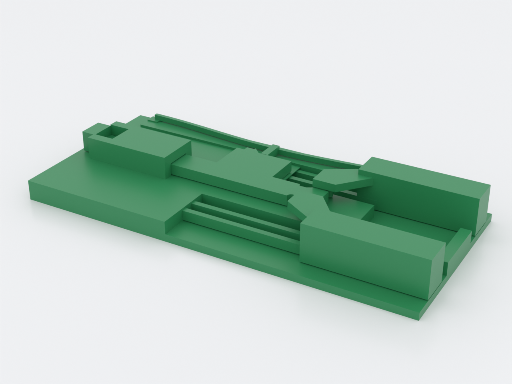
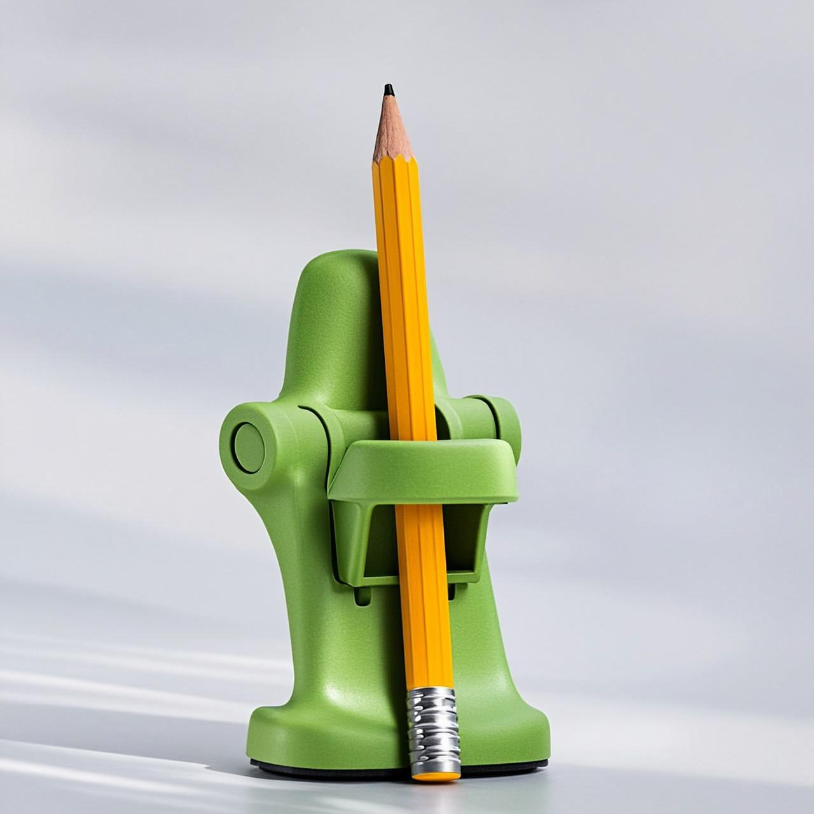

# compliant-gripper

A print-in-place **collet grabber** that comes off the bed assembled and working.
Slotted flexure fingers form an outward cone; a captive collar prints already
around them and cams them shut as it slides up (grip a rod in the bore); release
and the flexures spring back. One of the "advanced" reference parts because it
fuses all three domains of `docs/advanced-techniques.md` in a single print.

*AI-generated impression for general illustration only — geometry is approximate and may not exactly match the printed part; see the studio render above and the STL for the true shape.*

## What you get

- `compliant-gripper` — one print, ≈ 29 mm across × 29 mm tall, in **two separate
  bodies** (fixed base+fingers, and the free sliding collar). Grips rods
  **≈ 10.5–14 mm Ø** (fat markers, 12 mm dowels): the collar bore is the hard
  stop, so the jaws floor at 2·(`collar_ir` − `finger_wall`) ≈ 10.4 mm — a
  standard ~7–8 mm pencil falls through; shrink `ro_tip`/`finger_wall` for
  thinner stock.

## Print settings

- **Material:** PETG / nylon (the fingers are live flexures); PLA works for light
  use but tires fast
- **Layer height:** 0.2 mm
- **Infill:** 30–40 %
- **Supports:** none needed
- **Orientation:** as modelled (base on the bed, axis vertical) — the fingers are
  ~6° off vertical (self-supporting) and only the collar underside floats, caught
  by the base across a 2-layer gap.
- **First use:** slide the collar up and down once to free it.

The fusion: **flexure fingers** (Domain 1) + a **captive sliding collar** (Domain
3, with the radial gap spread-limited and the axial float sag-limited — the CC3
anisotropy) + **support-free vertical print** (Domain 2). A committed fit-check
(`ci.fitchecks`) proves the collar is a genuinely separate captive body.

## Parameters

| Parameter | Default | What it does |
|---|---|---|
| `fingers` | 3 | number of collet fingers |
| `xy_tol` | 0.35 mm | collar↔finger radial clearance (spread-limited) |
| `ro_tip` | 10 mm | cone tip radius — the flare the collar cams on (also the capture) |
| `ro_base` | 7 mm | radius at the finger roots |
| `finger_h` | 26 mm | finger length |

All parameters are at the top of `compliant-gripper.scad`; override with
`-D 'fingers=4'`. If the collar is fused, reprint with `xy_tol` +0.05.
