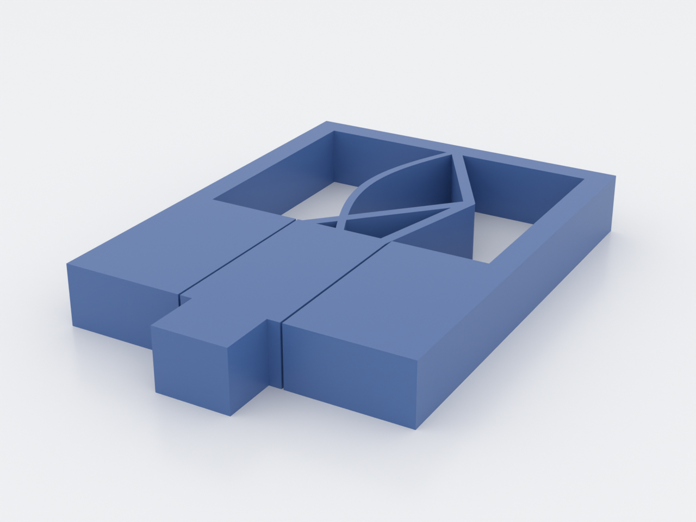
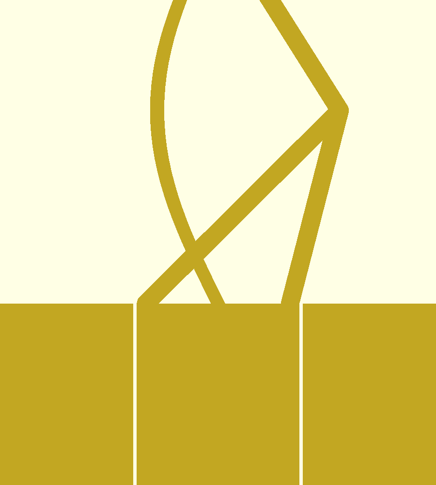

# constant-force-slider

A linear shuttle that moves under **~constant force** across its stroke, returned
by a quasi-zero-stiffness (QZS) compliant spring and guided by a print-in-place
slot. It's the capstone reference part: it fuses the hardest compliant idea in
`docs/advanced-techniques.md` (constant force from a negative spring in parallel
with a positive one) with a print-in-place slide.

The QZS spring (ortho top): a pre-buckled arch (negative stiffness, bowing left)
in parallel with a V-beam chevron (positive stiffness, apex right):

## What you get

- `constant-force-slider` — one flat print, ≈ 56 × 81 × 10 mm, with a push knob
  that travels ~10 mm against a near-constant restoring force.

## Print settings

- **Material:** PETG / PP / nylon (live flexures). **Not PLA.**
- **Layer height:** 0.2 mm
- **Infill:** high perimeters (thin flexures)
- **Supports:** none needed
- **Orientation:** flat, as modelled — flexures bend in the layer plane; the
  guide-slot walls are vertical.

How the constant force works: the **V-beam** resists motion with positive
stiffness; the parallel **pre-buckled arch** contributes *negative* stiffness over
its snap region. Tune `arch_rise` so the two slopes cancel and net stiffness ≈ 0,
which flattens the force curve. The shuttle rides a guide slot with a
print-in-place sliding clearance (`slide_tol`); the spring tethers it.

## Parameters

| Parameter | Default | What it does |
|---|---|---|
| `arch_rise` | 6 mm | negative-spring magnitude — the cancellation tuning knob (rise/`arch_t` ≥ 2.3) |
| `vbeam_t` | 1.8 mm | positive-spring (V-beam) stiffness |
| `arch_t` | 1.4 mm | arch beam thickness |
| `stroke` | 10 mm | shuttle travel |
| `slide_tol` | 0.35 mm | print-in-place guide clearance per side |

All parameters are at the top of `constant-force-slider.scad`; override with
`-D 'arch_rise=7'`. `demo_push` is a preview pose only — print at 0.
