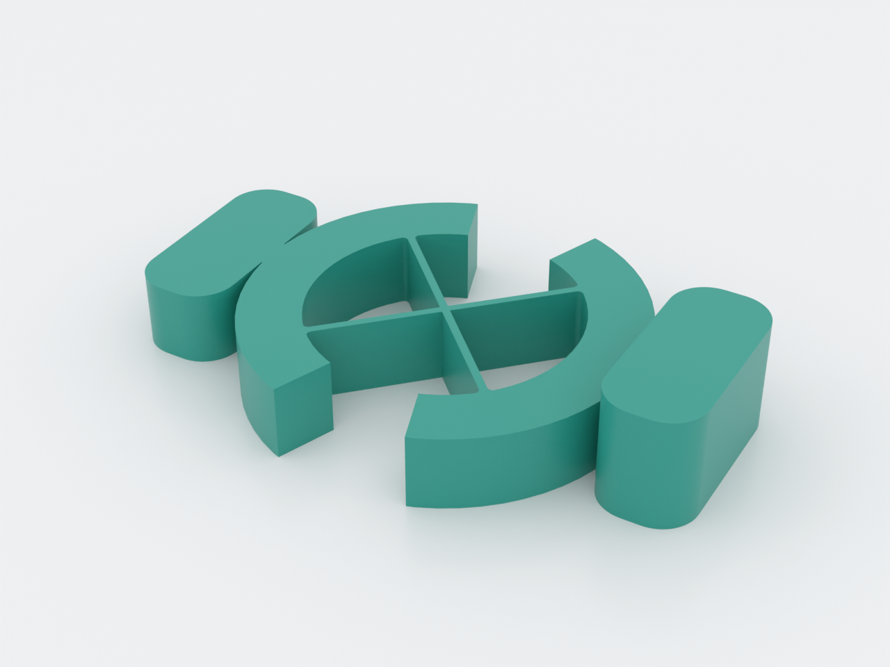
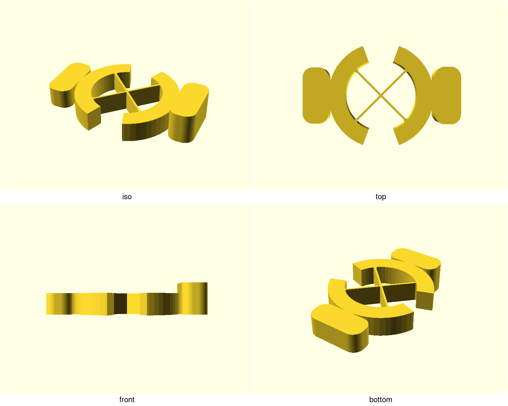
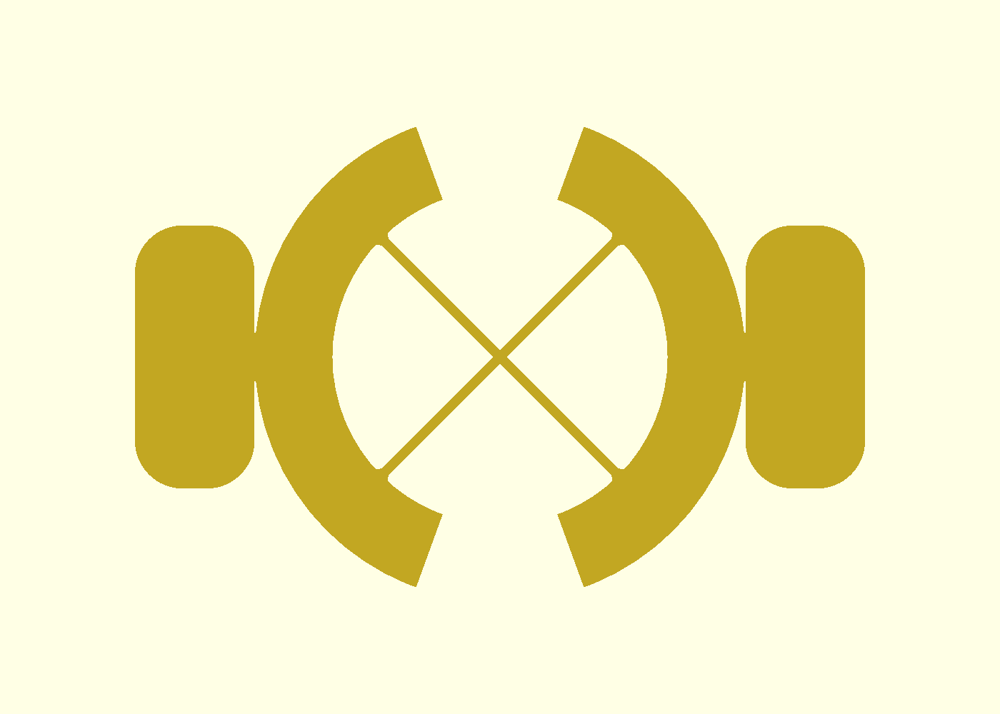
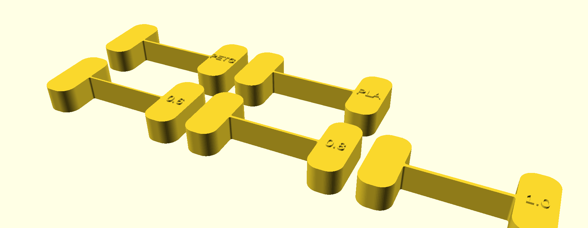
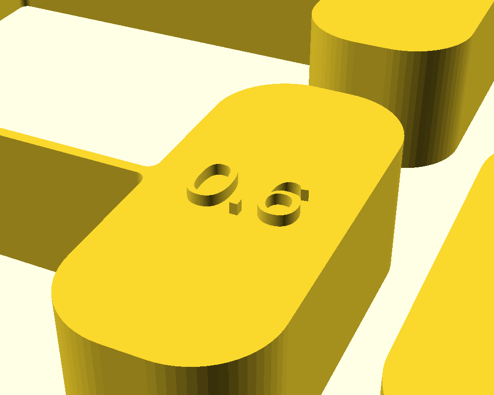

# cross-axis-flexure-pivot

A pinless hinge that rotates about a **near-fixed virtual center**: two
slender beams cross at mid-span, weld where they meet, and twist through
±40° between two rigid ring arcs whose faces are the hard stops. This is the
cross-axis pivot of the compliant-mechanism families
(`docs/advanced-techniques.md`, Domain 1) — unlike a single small-length
flexural pivot it does not wander under light load, and unlike a printed pin
joint it has nothing to wear, nothing to assemble, and no slop. Dimensioned
from the doc's leaf relations, not guessed: stiffness `K = 2·E·I/L` ≈
49 N·mm/rad, root stress bounded at 40 MPa at full travel
(≈ 0.8 × PETG's yield, the coupon is the truth), fingertip force ≈ 1.3 N.

## What you get

- `cross-axis-flexure-pivot` — one print-in-place part, 61 × 38.5 × 12 mm,
  ≈ 6.8 g. Hold the frame tab, twist the stage tab; it stops face-to-face at
  ±40° both sides.
- `cross-axis-flexure-pivot-coupon` — the **print this first** strip
  (152 × 50 × 8.6 mm, ≈ 12.9 g): five single-beam fatigue specimens — the
  thickness ladder **0.6 / 0.8 / 1.0** plus identical production-t twins to
  print in PETG and PLA, so the material ranking is measured, not assumed.

## How it works

A rigid frame arc and a rigid stage arc share one center — the **virtual
center** at the origin, left open (neither body covers it). Two beams at
±45° span the 28 mm between the arcs' inner faces, weld to each other where
they cross, and root into the arcs with fillets. Twist the stage and both
half-beams bend in an S through the weld; because the two beams are
symmetric about the axis, the first-order lateral drift of one cancels the
other and the stage rotates about a center that stays put — the property a
single cantilever flexure cannot give you. All compliance belongs in the
beams: the ring arcs are 6.5 mm walls, deliberately rigid. The arcs' end
faces meet face-to-face exactly at ±40°, so an over-twist bottoms out on
plastic over the full ring wall instead of folding the beams.

| Preview | What it shows |
|---|---|
|  | The mechanism diagram: the X of the welded beams, both arcs sharing the open virtual center, the two grip tabs, the four pockets flanking the crossing |
|  | The signature detail: both beams fused at the origin, root fillets where each meets its arc, the open center |
|  | The print-this-first strip — five independent specimens, every label embossed on its pad |
|  | One grip close up: the embossed "0.6" at the scale where the letters resolve |

## Print settings

- **Material:** **PETG** — the design datum (E = 2000 MPa assumed behind the
  echoed stiffness and stress). PLA works and feels snappier (higher E), but
  is far worse in cyclic flexure; the coupon's PETG/PLA twins exist so you
  can rank them on *your* printer rather than take this page's word.
- **Layer height:** 0.2 mm. The beams are 0.8 mm — four layers — and their
  layer faces are the fatigue-critical surface; go finer if you have the
  patience, not coarser.
- **Infill:** 15–20 % — the arcs and tabs are chunky and the beams are
  effectively all-perimeter.
- **Supports:** none — the whole part is one bed-plane silhouette extruded
  upward; every surface is vertical or flat.
- **Orientation:** **flat, as modelled — load-bearing.** The silhouette is
  authored in the bed plane so each beam bends *within* a layer; bending
  stress runs across the roads inside a layer, never across the bond between
  layers (the doc's CC1 rule). Printed upright the beams delaminate almost
  immediately.
- **Seam:** if your slicer lets you place it, park it off the thin beams —
  a z-seam scar on a 0.8 mm beam root is a crack starter. Anywhere on the
  arcs or tabs is fine.

## Print this first

`cross-axis-flexure-pivot-coupon.scad` prints the five specimens in ~1 h
(≈ 13 g). Each is one production beam between two grips, straight from the
production dimensions. Test method, per specimen: hold one grip flat on the
desk, twist the other grip in the **layer plane** to about ±40°, return,
repeat, and count cycles until you see whitening at a root — whitening is
the warning, a crack is the verdict.

1. **Read the ladder 0.6 → 0.8 → 1.0.** The 0.6 row will feel lovely and
   die early — that is the point: it is under the 0.8 mm production floor
   (two extrusion widths) on purpose, to show *why* the floor exists. The
   1.0 row is the durability ceiling at this L; it also runs root stress
   proportionally higher per degree.
2. **Rank PETG vs PLA** on the two identical 0.8 twins. Same geometry,
   different filament — the cycle counts are the material's answer.
3. Then retune the pivot if you want a different feel, in this order:
   **`t`** — stiffness ∝ t³, stress ∝ t; **`L`** — stress ∝ 1/L, and it is
   free until the footprint grows; **`root_fillet`** last, keeping
   ≥ 0.5·`t` (asserted). `stop_angle` raises root stress linearly — climb
   toward 60° only if a coupon row survived.

## Parameters

| Parameter | Default | What it does |
|---|---|---|
| `t` | 0.8 mm | beam thickness — **the highest-leverage knob** (K ∝ t³, σ ∝ t); production floor 0.8, asserted ≥ 0.5 |
| `L` | 28 mm | beam free span between the arcs' inner faces; longer = lower stress for the same angle |
| `w` | 8 mm | beam width = part height; multi-perimeter so one bad road doesn't kill the beam |
| `stop_angle` | 40° | hard-stop angle both sides — the arcs' faces meet here exactly (measured bound ±0.5°) |
| `alpha` | 45° | crossing half-angle; 45 keeps all four beam roots at the same radius |
| `root_fillet` | 0.6 mm | beam-root radius; fatigue rule ≥ 0.5·`t` (asserted) |
| `arc_wall` | 6.5 mm | ring-arc radial thickness — rigid by design, all compliance belongs in the beams |
| `tab_len` / `tab_w` / `tab_r` | 10 / 22 / 4 mm | grip tab size and corner radius |
| `h_pad` | 4 mm | raised finger-pad height on the stage tab (0 disables) |
| `E` | 2000 MPa | assumed PETG modulus behind the echoed K / σ / F — a datum, not a measurement |
| `coupon_ts` | [0.6, 0.8, 1.0] | the coupon's thickness ladder |

All parameters are at the top of `cross-axis-flexure-pivot.scad`, grouped in
Customizer sections; override with `-D 'stop_angle=50'`. `K`, the root-stress
band and the fingertip force are echoed at render time — see NOTES.md for the
derivations, the stop-face geometry and the ROM measured bound.

## Use

No assembly — it comes off the bed a working hinge. Hold the **frame tab**
(the plain one), put a fingertip on the **stage tab's raised pad**, and twist:
the stage swings ±40° and stops face-to-face. The echoed fingertip force is
≈ 1.3 N at the 25.5 mm handle radius — firm, not fighty; retune `t` if you
disagree with the design datum.

For the doc's **compression** behaviour: with the stage at rest, push it
straight toward the frame along the long axis. The beams bow in an S — that
is the "weak in compression" half of the cross-axis family, the load case the
hard stops do *not* protect (they bound rotation, not translation). Bending
it back is harmless within the stress band; this demo is why the doc pairs
cross-axis pivots with tension loading.
