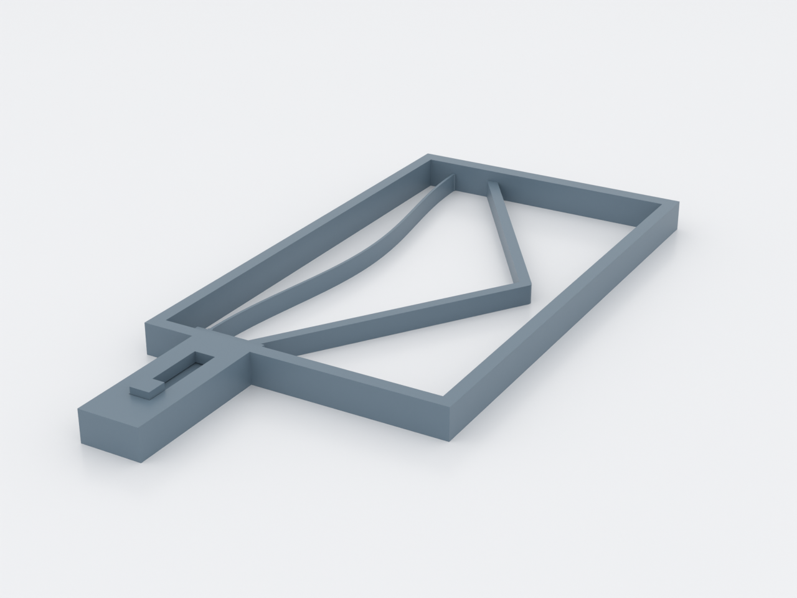
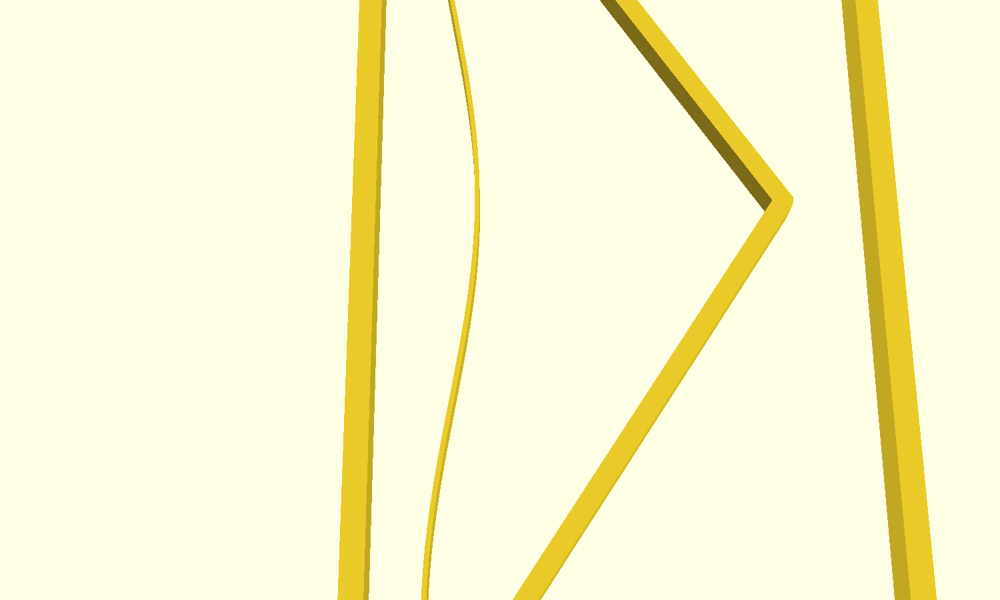

# czs-slider — the constant-force print-in-place slider

A one-piece captive slider that glides at a near-constant ~2 N across its
whole 20 mm stroke instead of fighting a rising spring — a quasi-zero-
stiffness mechanism: a pre-buckled arch (negative stiffness) and a chevron
V-beam (positive stiffness) in parallel, sized so their slopes cancel. Push
the knob; it moves like a good drawer slide, not a spring. Printed in place,
no supports, no assembly.

Top-down over the whole mechanism — the guided slot at left, the spring
chamber at right: the pre-buckled arch bows −X from its chord while the
chevron opens +X, both anchored between the same head and far bar:

Mid-span close-up — the arch band and the V legs crossing paths without
touching, with the sweep clearances to the chamber walls:

The print-this-first coupon — three fit cells (the k_xy = 0.40/0.45/0.50
sweep, cell 2 is production) and the ~9 N feeler cell:

## What you get

- `czs-slider` — the mechanism, one piece, ~200 × 93 × 12 mm
- `czs-slider-coupon` — print this first: three slider-fit cells plus a
  feeler cell (~9 N plateau) to tune the fit and check your printer's spring
  character before the ~5 h main print

## Print settings

- **Material:** PETG (a live flexure — not PLA; PP or nylon also work)
- **Layer height:** 0.20 mm
- **Infill:** 15–20%; the frame is solid-walled, the springs are solid
- **Supports:** none — the model prints flat and the only bridge is the
  10.4 mm capture deck over the slider channel
- **Orientation:** as drawn, profile on the bed; every flexure bends in the
  layer plane
- **Bed:** ~200 × 93 mm footprint (one axis ≥ 210 mm); elephant-foot
  compensation on — the sliding gaps sit at z = 0
- **First motion:** the slider lightly micro-welds to its roof when printed;
  the first push shears it. Expected, not a defect.

## Parameters

The ones worth touching (all in `czs-slider.scad`, Customizer-grouped):

| Parameter | Default | What it does |
|---|---|---|
| `k_xy` | 0.45 | Sliding-fit spread factor — **the tuning knob**. Coupon cells 1/2/3 sweep 0.40/0.45/0.50; welded → up a cell, rattles → down |
| `z_layers` | 2 | Roof gap in whole layers (sag budget over the slider) — raise to 3 only if the deck welds |
| `target_force` | 2.0 N | Plateau level; the geometry re-solves around it |
| `stroke` | 20 mm | Travel; the flat zone is the middle 70% |
| `demo_u` | 0 mm | Preview pose only — **print at 0** |

Everything else is derived: the arch (t, h, span, switch force) from the
`bistable-toggle` (#389) nondimensional solve, the V-beam (leg thickness,
apex) from matching the arch's negative slope at the flat-zone ends,
clearances from the process constants (`nozzle_d`, `layer_h`). `NOTES.md`
has the full chain and the predicted force–stroke curve.

## Assembly & use

None — it prints assembled. Push the knob through the deck slot: the glide
you feel *is* the mechanism (arch force falling, chevron force rising, sum
flat). It holds ~1 N of preload at rest against the back stop and arrives
firmly at the far stop. Tune the fit with the coupon first; if the plateau
character is off on your spool (a hard ramp means your PETG runs stiffer
than the 2000 MPa datum), the coupon's feeler cell tells you which way —
see "Print this first" in `NOTES.md`.
