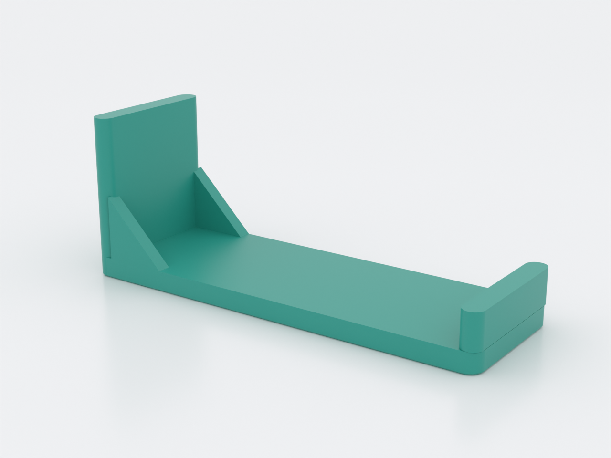
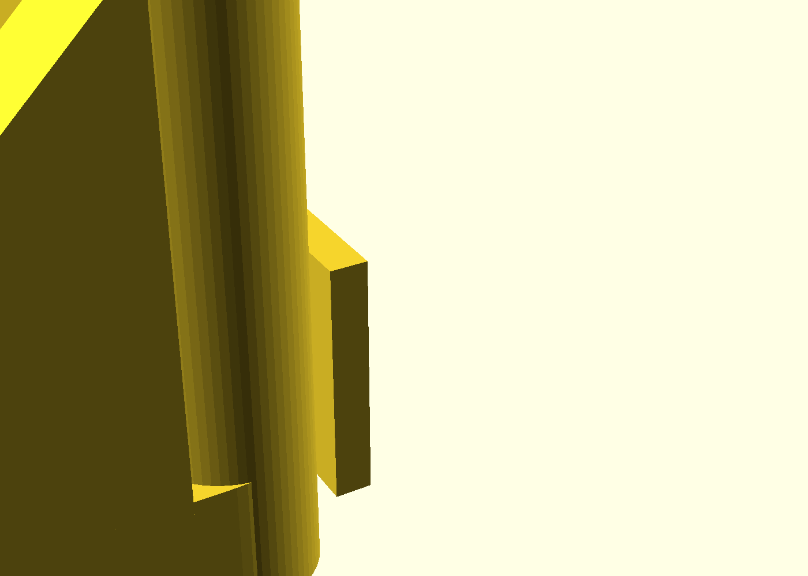
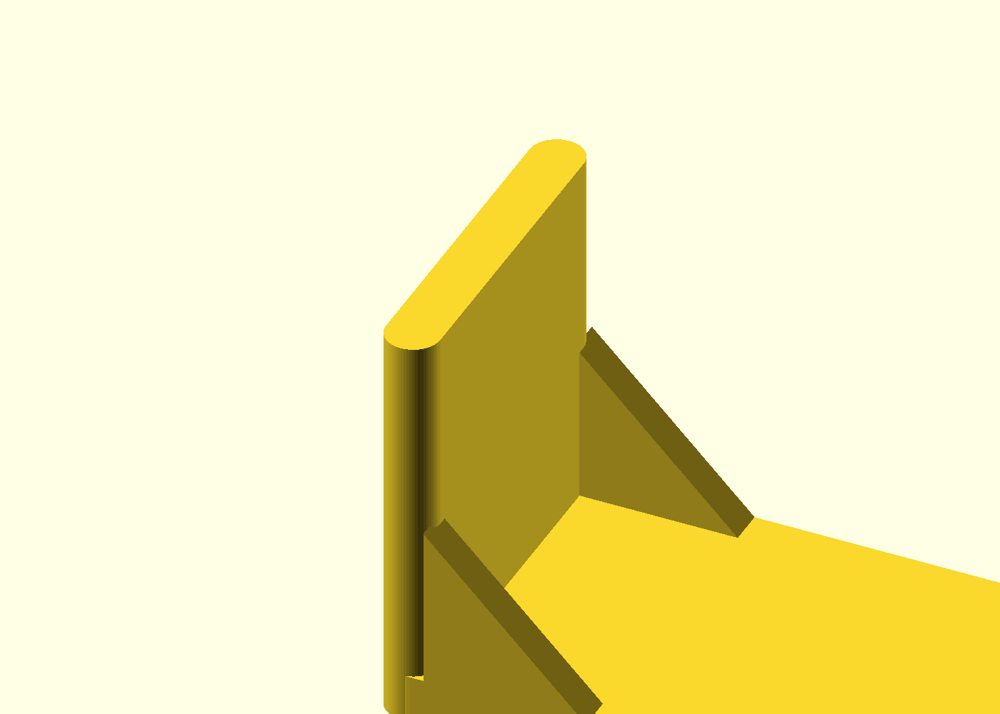
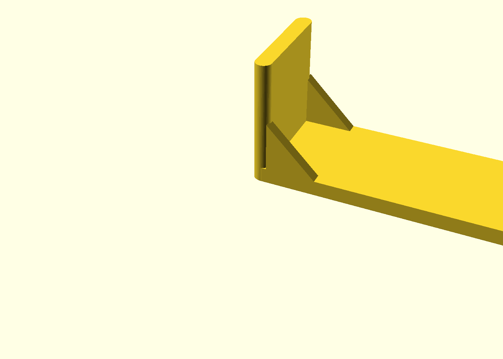

# Extrusion Shelf Bracket

A shelf corner bracket that locks into the **side slot of standard 2020
T-slot aluminum extrusion**: hammer-head lugs on the back of the plate slide
along the slot, so a shelf board mounts anywhere along a rail with **no
T-nuts, no bolts, no frame teardown**. The horizontal arm carries the board
between two 45° gussets and a front stop lip. One printed part per corner —
print four, slide them on, drop a shelf board in.

## What you get

- `bracket` — the corner bracket (120 × 40 × 46 mm), arm flat on the bed in
  the print, lugs sliding into the rail's side slot in use.
- `coupon` — the print-this-first fit check (~46 × 20 × 66 mm): both
  production lug fins on a strip of the production plate. **Print this
  first** and tune the fit before committing to brackets.

## Print settings

- **Material:** PETG (some give under clamp load; PLA fine for light duty)
- **Layer height:** 0.2 mm
- **Infill:** 25% gyroid
- **Supports:** none — the part is authored in its use orientation so every
  overhang is either 45° or a constant cross-section that stacks
- **Orientation:** as modeled — arm flat on the bed, back plate and stop lip
  standing. Do not rotate; the lug fins print as identical stacked layers,
  which is what makes the hammer heads come out clean.
- **Brim:** 3–4 mm on the **coupon** only — it is deliberately tall and
  narrow (9.5 × 20 mm footprint, 42 mm) because it must print in the
  production orientation to test the real fit. The bracket needs no brim.

## Parameters

| Parameter | Default | What it does |
|---|---|---|
| `slot_fit_tol` | 0.15 mm | Slide clearance per side of the lug neck in the slot mouth — **the one to tune** (coupon first, 0.05 steps; 6.2-mouth rails need ~0.20) |
| `slot_mouth` | 6.0 mm | T-slot mouth width — 6.2-variant rails: set 6.2 |
| `lug_hook` | 2.2 mm | How far each head hooks under a lip (head = mouth + 2×hook) |
| `shelf_t` | 16 mm | Shelf board thickness — sets the stop-lip height |
| `reach` | 120 mm | Extrusion face → front edge; how far the shelf extends |
| `gusset_run` | 18 mm | 45° gusset size — up for stiffer, down for more shelf span |

All parameters are at the top of `extrusion-shelf-bracket.scad` in
Customizer sections; override with `-D 'slot_fit_tol=0.2'`.

## Assembly & use

Slide each bracket onto the rail's **side slot from an open end** — the
heads are wider than the mouth, so the bracket slides along the rail axis
and cannot be pressed straight on (that's the lock working). Two brackets
per rail at shelf width, board drops between the back plates, the front
stop lip keeps it from sliding off, the gussets carry the load down the
rail. Removal is the reverse: slide along the rail to an open end.

If the fit is off, don't reprint the bracket — reprint the **coupon**
(`extrusion-shelf-bracket-coupon.scad`) at a new `slot_fit_tol` first; see
the "Print this first" section of `NOTES.md` for the tuning ladder.

