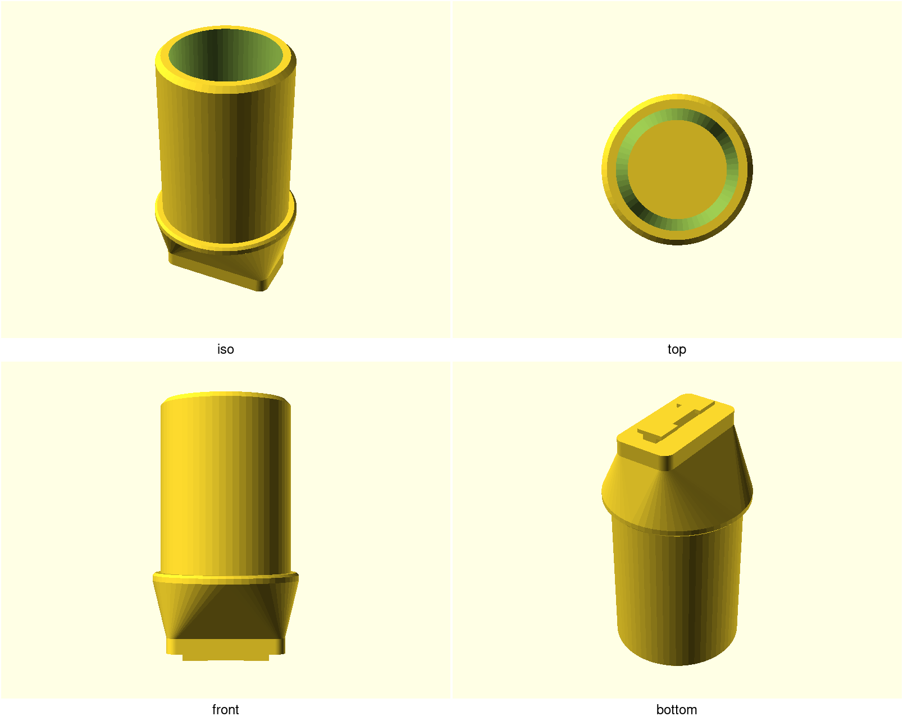
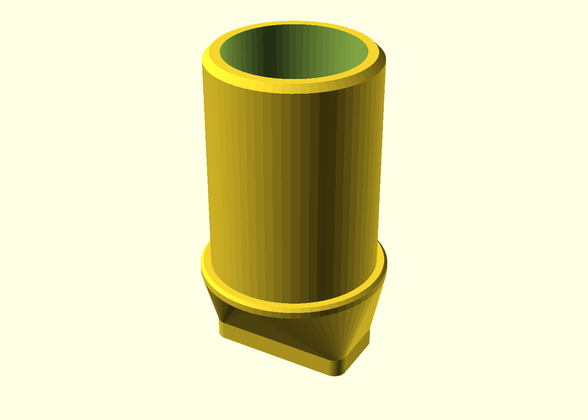
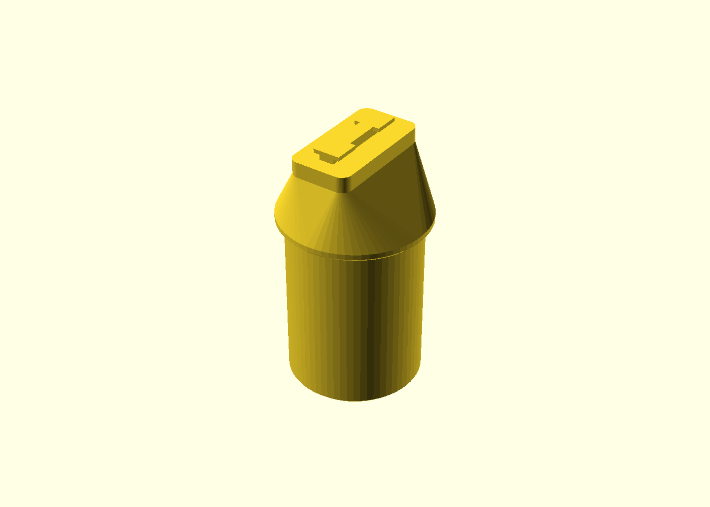
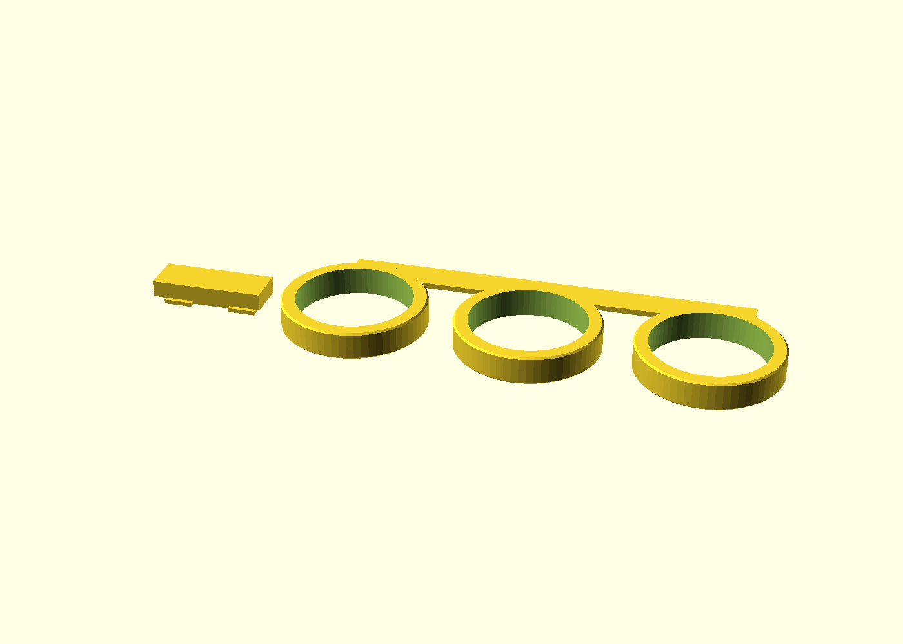
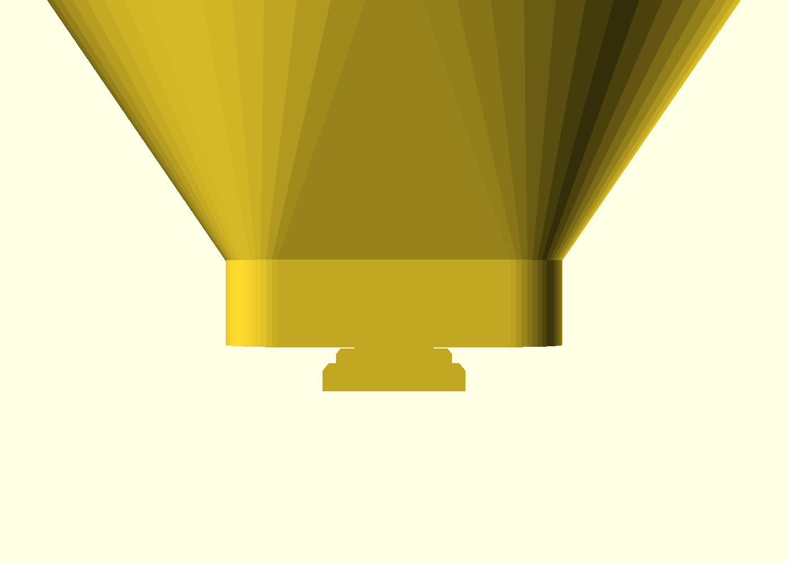

# 2020 T-slot filament spool peg

A one-part spool holder that locks into the side slot of standard 2020
T-slot extrusion: slide it on from any open rail end, drop your 1 kg
filament spool onto the cantilevered stub, and it spins freely on the
spool's own bore — zero hardware, zero bearings, no supports, one ~62 g
print.

## What you get

- `peg` — the holder (prints 58 × 58 × 103 mm in its print pose, ~62 g):
  a slide-in T-lug blade, face plate, flaring trunk and a hollow axle stub
  with a Ø58 seat shoulder.
- coupon — the print-this-first fit strip (~223 × 68 mm): tune the slot
  and bore fits on your actual rail and spool before committing 4 hours.

## Print settings

- **Material:** PLA or PETG (PLA is stiffer and creeps least; skip it in a
  warm enclosure)
- **Layer height:** 0.2 mm
- **Walls:** ≥3 perimeters (the stub's 5 mm wall resolves to 6)
- **Infill:** 15%
- **Supports:** none needed — the part prints in a support-free pose with
  only short ≤9 mm bridges under the face plate
- **Orientation:** as rendered — the two hammer-head lugs flat on the bed
- **Seam:** random (or scarf, if your slicer has it) — an aligned seam
  stacks a ridge up the stub, and the stub's OD *is* the bearing surface:
  the spool would tick once per revolution
- **Brim:** 5–6 mm — the blade strip is a tall slim footprint (the test
  slice flags first-layer stability without one); let the plate cool fully
  before popping it off

## Parameters

The fits worth tuning (defaults suit Prusament/Polymaker/eSUN-style 1 kg
spools and standard European square-slot 2020):

| Parameter | Default | What it does |
|---|---|---|
| `spool_bore` | 52 mm | your spool's bore — caliper it; 55 and 30 are common `-D` overrides |
| `bore_clearance` | 0.6 mm | diametral spin clearance stub-to-bore; tune via the coupon's 0.3/0.6/0.9 ring sweep |
| `slot_fit_tol` | 0.15 mm | slide clearance per side of the lug neck in the slot mouth; 0.05 steps |
| `slot_mouth` | 6.0 mm | your extrusion's slot width (6.2 variants exist) |
| `standoff` | 28 mm | rail face to spool seat (brief minimum 25) |
| `axle_len` | 68 mm | stub length past the shoulder — keep ≥ your spool's width |
| `shoulder_d` | 58 mm | seat ring OD; the inboard keeper the spool cannot pass |

All parameters sit at the top of `extrusion-spool-holder.scad` in
Customizer sections; override on the command line with
`-D 'spool_bore=55'`.

## Assembly & use

1. **Print the coupon first** and set `slot_fit_tol` / `bore_clearance`
   from it (steps above; one coupon, ~2 h, saves a failed 4 h peg).
2. Slide the peg onto the rail **from an open end of the slot** — the
   hammer heads enter the cavity and slide along it; never press straight
   on, the mouth is narrower than the heads.
3. Drop the spool's bore over the stub until the near flange lands on the
   Ø58 shoulder ring — it now spins on its own bore.
4. **Vertical rails:** a loaded peg holds by friction with a thin margin
   (~11 N retention vs the ~10 N spool weight). Prefer a horizontal top
   rail, or drop an M5 T-nut into the slot just below the plate as a
   mechanical stop — no reprint needed.

The lugs at bed level: a 10.4 mm hammer head over a 5.7 mm neck — the head
hooks the 2 mm slot lips once the blade is slid home, which is why it goes
in from an open rail end.

If a fit is off: slot drags → `slot_fit_tol` +0.05; spool binds or wobbles
→ pick a different ring from the coupon sweep and set `bore_clearance`.
