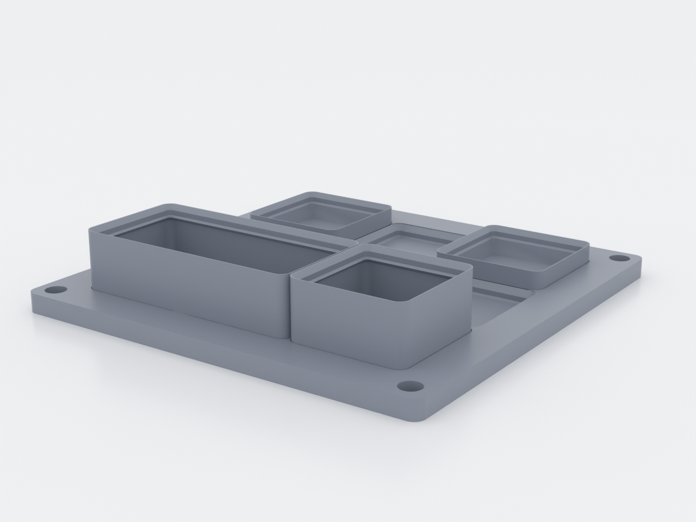
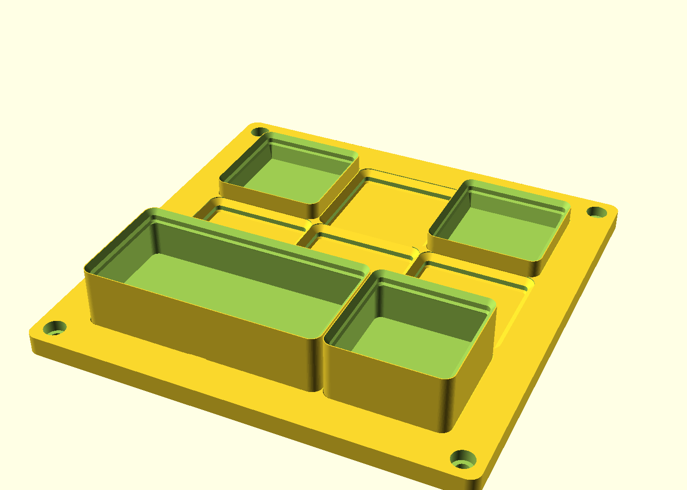
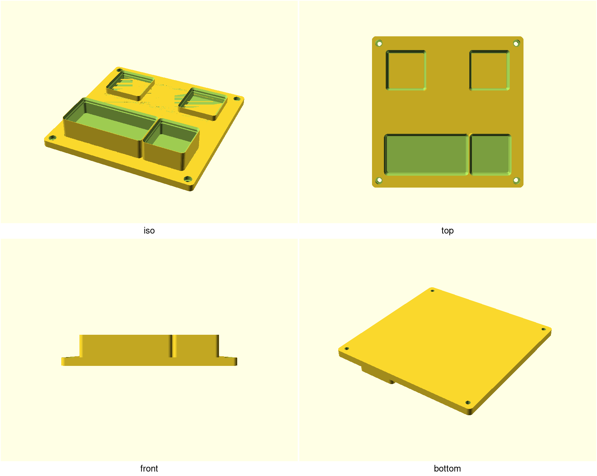

# Gridfinity starter set

A screw-down Gridfinity baseplate (3×3 by default) and the three open bins
that drop into it — printed from a clean-room, numbers-only implementation of
the open Gridfinity standard, so every part here also mates with the
community's bins and plates. If you want one print that turns a drawer or
shelf into organized tool storage, this is it.

<!-- Lead with the product shot (studio raytrace, rendered by CI from the
     manifest in shots.conf): previews/product-hero.png -->

## What you get

- `baseplate` — 3×3 grid, 154 × 154 × 7 mm, four M4 socket-head corner
  mounts in the border (screws from the top; heads sit flush)
- `bin-1x1` — one cell, 3U tall (≈ 41.5 × 41.5 × 25.4 mm)
- `bin-2x1` — two cells, 3U tall (≈ 83.5 × 41.5 × 25.4 mm)
- `tray-1x1` — one cell, 1U low tray (≈ 41.5 × 41.5 × 11.4 mm)

Any bin can carry interior dividers (`dividers_x`/`dividers_y`) — the
gated proof print is `bin-2x1-div`, a 2×1 bin with one wall on the cell
boundary.

All four also ship as one multi-object 3MF plate (`build/
gridfinity-starter-plate.3mf`) — import it and your slicer sees four
separate parts, not a welded lump.

Bins stack (the lip is the socket profile), and the front lip carries a flat
label plate — set `label_text` before printing to emboss it, or leave it
blank for stickers.

## Print settings

- **Material:** PLA or PETG
- **Layer height:** 0.2 mm (spec heights are 0.1 mm multiples)
- **Infill:** 15 % grid — walls and floors carry the structure
- **Supports:** none — every taper is the spec's own 45°; the flat socket
  ceilings (plate) and bin floors are ~36 mm bridges that the CI test-slice
  cuts clean on stock bridging
- **Brim:** recommended on the bins — the stacking lip ends in the spec's
  0.3 mm rim, a knife-edge first layer (~50 mm² of bed contact)
- **Orientation:** as exported (bins opening-down, plate grid-down); do not
  reorient
- **Print first:** the coupon (`gridfinity-starter-coupon.scad`) — one
  socket + one tray on one bed, to check the `fit` clearance on your printer
  before committing to the full set

## Parameters

| Parameter | Default | What it does |
|---|---|---|
| `grid_x` / `grid_y` | 3 / 3 | Plate size in cells (42 mm each) |
| `margin` | 14 mm | Solid border around the grid; carries the M4 mounts |
| `mounts` | true | Cut the four M4 socket-head corner mounts |
| `bin_units` | 3 U | Bin height in Gridfinity units (1U = 7 mm, base included) |
| `wall` | 1.2 mm | Bin wall above the base block (community: 0.95) |
| `label_text` | `""` | Text raised on the front label plate |
| `dividers_x` / `dividers_y` | 0 / 0 | Interior divider walls per axis, evenly spaced (the first lands on the cell boundary of a multi-cell bin); compartments stay ≥ 8 mm |
| `fit` | 0.1 | Socket clearance from the bin boss — 0.25 mm/side at the wall, 0.35 at the floor; tune with the coupon |

All parameters are at the top of `gridfinity-starter.scad`, grouped in
Customizer sections; override on the command line with
`-D 'grid_x=4'`. Bin grid sizes are chosen by the `part` values
(`bin-1x1`, `bin-2x1`, `tray-1x1`).

## Assembly & use

Screw the plate down (or just set it in a drawer — the margin keeps it
stable), drop the bins in. A bin that's stiff to seat on a new printer:
raise `fit` by 0.02–0.05 in the plate and re-print just the plate — the bins
never need reprinting. Magnet pockets, weighted baseplates and plate
interconnect are deliberate follow-ups, not missing features.
