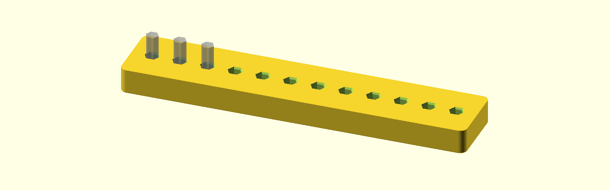
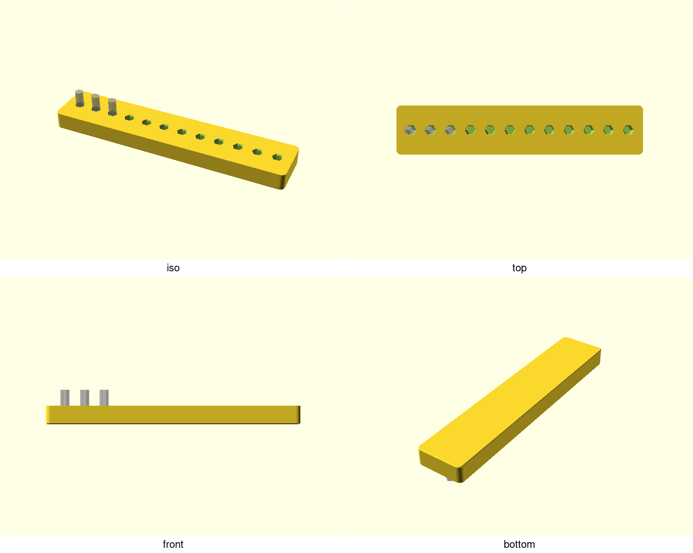
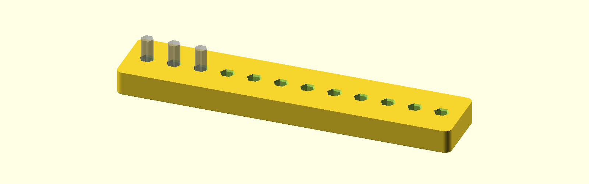
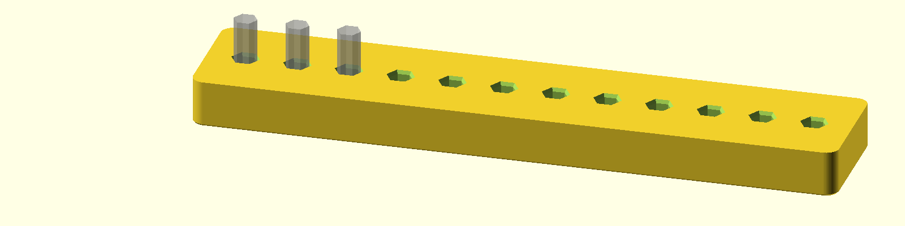

# hex-bit-rail — a tuned-fit bench rail for ¼″ hex driver bits

A bench-top rail that stores twelve ¼″ hex driver bits standing up, each held
by a printed hex pocket and presented label-up — no more fishing through a
drawer for the one bit you need. The engineering is the fit: the pocket's
across-flats is a parameter, tuned on a small test coupon so the bits click in
and still release one-handed on your printer, with your bits.

## What you get

- `rail-short` — twelve pockets for standard ¼″ bits (200 × 40 × 14.4 mm)
- `rail-long` — the same rail with an 18 mm socket for long (50/75 mm) bits
  (200 × 40 × 20.4 mm)
- `hex-bit-rail-coupon` — the print-this-first fit strip: six pockets
  sweeping across-flats at −0.15 / 0 / +0.15, values embossed beside each
  (152 × 18.4 × 14.4 mm)

The two rails print separately; the deliverable is the multi-object plate
(`build/hex-bit-rail-plate.3mf`), never a merged STL. Bits stand ~13 mm
proud of the short rail — enough to grab with a fingertip.

## Print settings

- **Material:** PLA (a stiff rail, not a flexing member); PETG if pockets
  wear loose
- **Layer height:** 0.2 mm — a 6.35 mm hex resolves cleanly
- **Infill:** 15 % grid; the walls carry the load
- **Perimeters:** 3
- **Supports:** none needed — pockets print open-top, exactly as drawn
- **Orientation:** flat on the bed, pockets up (as rendered)
- **Print the coupon first** (below), then the rails at the winning fit

## Print this first: tune the fit

Printed hex holes come out undersize, and every printer disagrees by a
couple of tenths. The coupon sweeps the fit so you don't gamble a two-hour
rail print:

1. Caliper two or three of your bits across the flats. Not ≈ 6.35 mm? Set
   `bit_af` to your measurement first.
2. Print the coupon in the rail's material.
3. Drop a bit in each pocket pair: you want the tightest pocket the bit
   still **clicks into and pulls out one-handed** without rocking.
4. Print the rails at the winner: `-D 'hex_fit=<value>'` (or edit the
   parameter).
5. Record the result in NOTES.md's field-test log so the next owner starts
   from your measurement.

## Parameters

| Parameter | Default | What it does |
|---|---|---|
| `bit_af` | 6.35 mm | your bits' hex across-flats — caliper before trusting the coupon |
| `hex_fit` | 0.1 mm | clearance added to the pocket across-flats; the coupon's winner goes here |
| `pockets` | 12 | pockets per rail |
| `pitch` | 16 mm | pocket centre-to-centre spacing |
| `pocket_depth_short` | 12 mm | short-rail pocket depth |
| `pocket_depth_long` | 18 mm | long-rail socket depth |
| `rail_w` | 40 mm | rail width |
| `mouth_break` | 0.6 mm | 45° chamfer at each mouth — one-handed insertion |

All parameters are at the top of `hex-bit-rail.scad`, grouped in Customizer
sections; override on the command line with `-D 'pockets=8'`. Fit proofs and
the cutaway render are selected with `part`.

## Use

Drop a bit into a pocket — the 45° mouth break forgives a slightly
off-angle start — and it stands ~13 mm proud, label up, gripped on all six
flats. Pull straight out one-handed; the rail is stiff enough that
extraction never tips it. Print the long rail for 50/75 mm bits: same
pockets, deeper socket.
