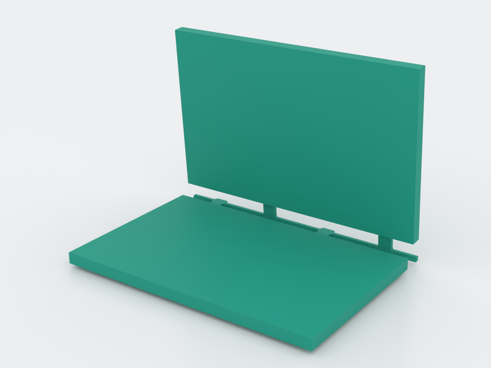
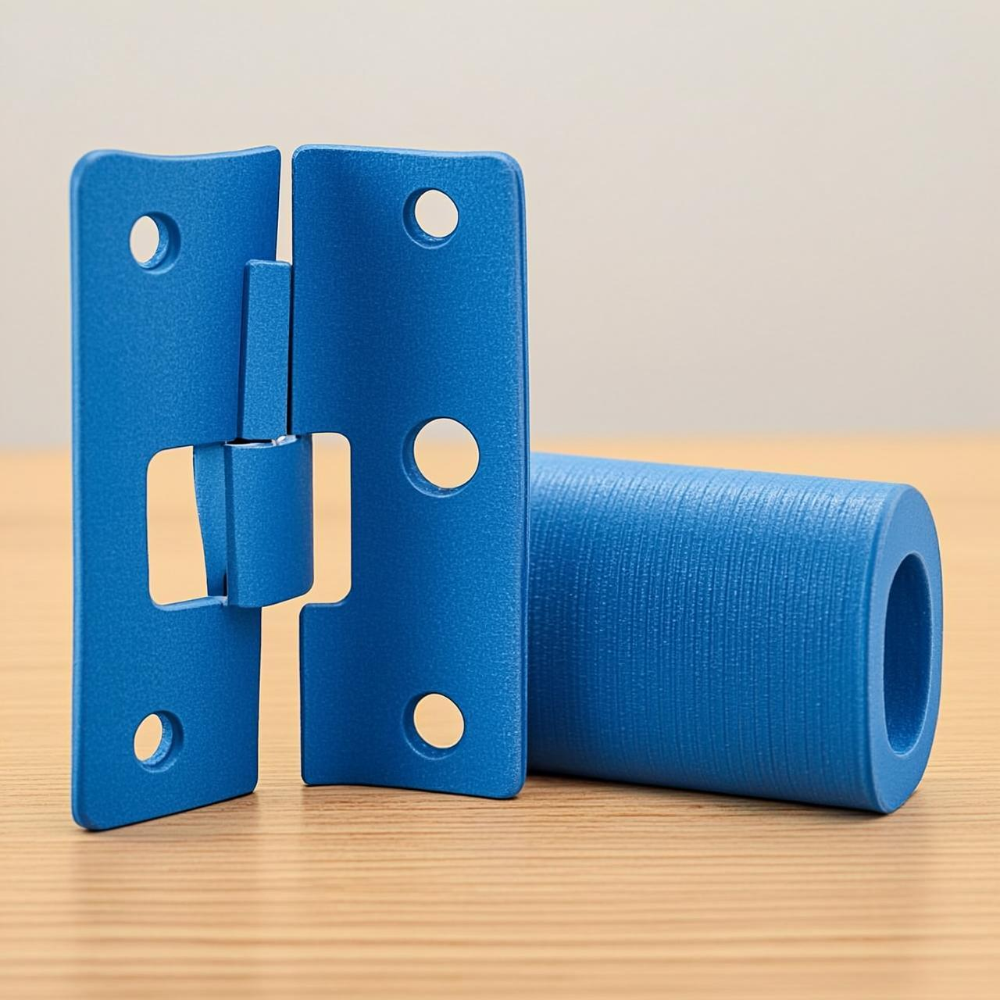
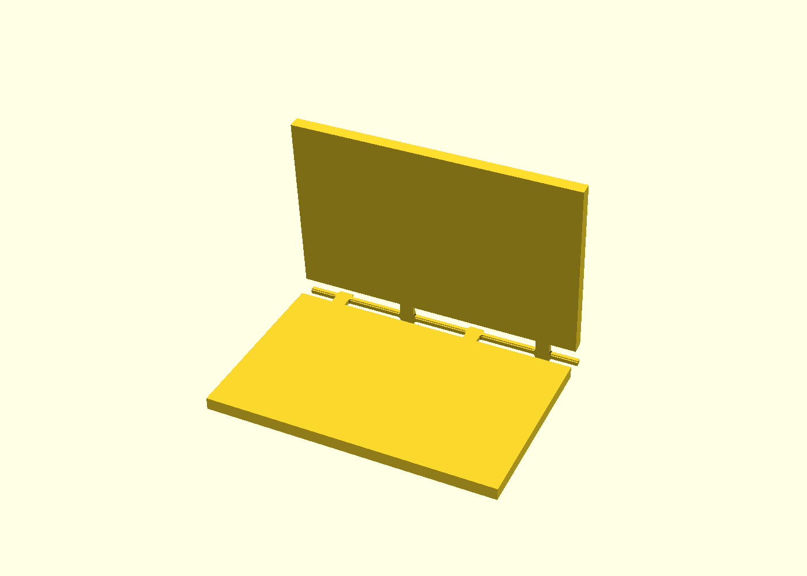

# let-folding-panel

Two rigid 3 mm panels joined by a **Lamina-Emergent Torsional (LET) joint** — a
compliant hinge fabricated flat from a single sheet that folds up to 90° with
zero clearance, zero assembly and no rattle. LET joints are the best flexure
match for FDM because they print dead flat, so the torsion bar twists in the
layer plane — exactly where a printed part is toughest (`docs/advanced-techniques.md`,
Domain 1, lamina-emergent family).

*AI-generated impression for general illustration only — geometry is approximate and may not exactly match the printed part; see the studio render above and the STL for the true shape.*

Folded to ~90° (preview pose — the printed part is always flat):

## What you get

- `let-folding-panel` — one flat part, **70 × 102 × 3 mm** as printed (the
  hinge zone is 1.2 mm), that folds along its centre line. Two 70 × 45 mm
  panels either side of the joint.

## Print settings

- **Material:** PETG / PP / nylon / TPU (they fold for hundreds of cycles).
  **Not PLA** — it cracks at a live flexure.
- **Bed surface:** textured PEI, or drop the bed to ~70 °C after the first few
  layers — PETG welds to smooth PEI, and this 70 × 102 mm solid-contact flat is
  close to maximum stick area.
- **Layer height:** 0.2 mm
- **Infill:** 100 % or high perimeters (it's a thin sheet)
- **Supports:** none — it's flat
- **Orientation:** flat on the bed (the only orientation). The torsion bar
  twists in the layer plane, which is what makes the joint durable.

**Print the coupon first** (`let-folding-panel-coupon.scad`, the same joint at
hand scale): fold it to 90° and cycle it ~50 times before committing to the
full sheet. Too stiff? That's `t` — see Parameters. Tearing? That's strain —
lengthen `L`, don't thicken `t`.

How it works: a thin **torsion bar** on the fold line is reached by each panel
through interdigitated **fingers**. Folding twists the bar segments between
fingers (torsion) and bends the finger roots — high range of motion, low stress.
Every finger↔bar junction carries a root fillet (`r ≥ 0.5·t`).

## Parameters

| Parameter | Default | What it does |
|---|---|---|
| `t` | 1.2 mm | torsion-bar thickness — **the dominant knob** (stiffness ~ t³) |
| `L` | 14 mm | free torsion span between fingers — the **tear** knob (strain ~ 1/L) |
| `w` | 2.0 mm | torsion-bar width across the fold line |
| `r` | 0.8 mm | root fillet at every finger↔bar junction (rule: `r ≥ 0.5·t`) |
| `theta_max` | 90° | fold angle the echoed stiffness/stress predictions quote |
| `fingers` | 4 | interdigitated fingers — more = more torsion spans sharing the fold |
| `finger_w` | 3.5 mm | finger width along the fold line |
| `finger_reach` | 6 mm | finger run across the fold line (bending length) |
| `hinge_w` / `panel_d` / `panel_t` | 70 / 45 / 3 mm | the panels |

All parameters are at the top of `let-folding-panel.scad`; override with
`-D 't=1.0'`. A labeled tolerance sweep is built in:
`./scripts/render.sh let-folding-panel --sweep t=0.8:1.6:0.2`.
`demo_fold` is a preview pose only — print at 0. The render echoes the
predicted joint stiffness and root stresses as starting points; the coupon is
what arbitrates.
