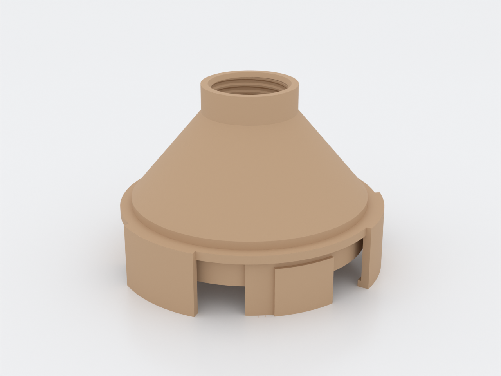
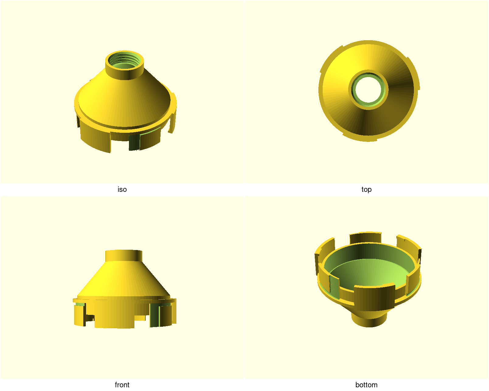

# NUGGS bottle adapter

Turn a standard off-the-shelf water bottle into a drop-in module of a
N.U.G.G.S. hamster habitat: this one printed part screws onto any PCO-1881
bottle finish (the world soda/water-bottle neck) and plugs into the standard
genderless quarter-turn NUGGS port — no special bottles, no fasteners, no
tools. Swap water bottles in seconds; wash and refill the bottle, not the
habitat plumbing.

## What you get

- `adapter` — the one-part bottle-to-NUGGS adapter (approx. Ø97 × 66 mm):
  the coupling port below, a PCO-1881 threaded throat above.
- `coupon` — the print-this-first fit checker: the port stub plus four
  labelled thread rings to find your printer's `bottle_tol` before you commit
  to the body (approx. 187 × 97 × 31 mm).

## Print settings

- **Material:** PLA (dry service) or PETG (hot washing)
- **Layer height:** 0.2 mm with a 0.4 mm nozzle — the thread ridges are 3
  layers wide; coarser loses the thread
- **Infill:** 15% (all working surfaces are perimeters)
- **Supports:** none needed — steepest surface is the 44° interior funnel
- **Orientation:** as rendered, port down on the coupling sector tips
- **Seam:** random (or rear) — an aligned seam stacks a ridge inside the
  threaded bore that can catch the bottle at one spot in the turn
- **First layers:** the sector tips print as separate islands and merge into
  the ring a few layers up — normal for the NUGGS family pose; keep supports
  off anyway
- **PETG note:** expect some droop on the 44° funnel ceiling — cosmetic only,
  the flow path is set by the land opening
- **Print first:** the coupon, and set `bottle_tol` from the ring that grips
  a real bottle best (see below)

## Parameters

| Parameter | Default | What it does |
|---|---|---|
| `bottle_tol` | 0.25 mm | Thread clearance — **the** tuning knob; sweep it on the coupon (0.15–0.38) and set what grips |
| `f_thread_depth` | 0.6 mm | Female thread depth; capped near 0.85 by the printable-profile fit inside one pitch |
| `nuggs_port_tol` | 0.30 mm | Coupling clearance (the NUGGS standard default) |
| `land_opening_d` | 22.0 mm | Hole in the sealing floor; never below the bottle's own 21.74 mm orifice |
| `funnel_deg` | 44° | Interior funnel ceiling; keep ≤45° for supportless printing |
| `shell_h` | 16 mm | Full-round wall behind the coupling face |

The PCO-1881 table (`bottle_thread_od`, `bottle_thread_pitch`, …) is the
standard, not knobs — don't tune those; tune the clearance. All parameters
are at the top of `nuggs-bottle-adapter.scad` in Customizer sections;
override on the command line with `-D 'bottle_tol=0.22'`.

## Assembly & use

1. Print and check the **coupon** first: screw a washed PCO-1881 bottle into
   each labelled ring and find the tol that grips without cracking or
   skipping; put that number in `bottle_tol` and print the adapter.
2. Screw the bottle into the adapter mouth-down until its lip seats on the
   land (about 1.8 turns from first contact). The bottle's weight rests on
   the printed land — the thread only keeps it from unscrewing.
3. Quarter-turn the coupling into any NUGGS port, the same as every module.
4. If the bottle bottoms out before seating (you feel the tamper ring hit),
   your bottle's finish runs long — the design clears the standard's 10.8 mm
   band; a capful of filing on the rim fixes nonstandard ones.

The adapter does not seal: it passes what the bottle's own orifice passes,
through a printed land. For wet service see the design's backlog (an O-ring
groove variant); for gating flow, pair it with the `nuggs-shutter-valve`.
