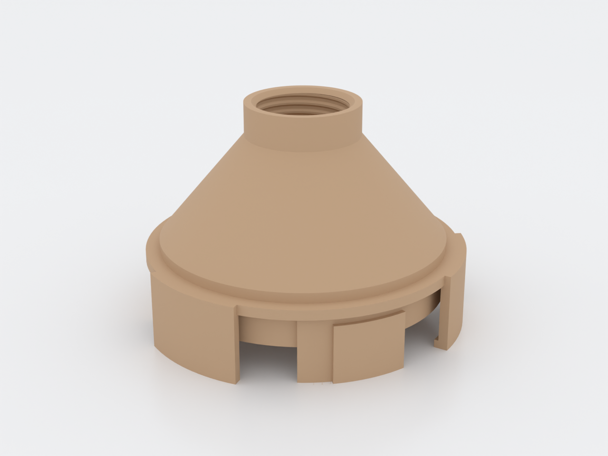
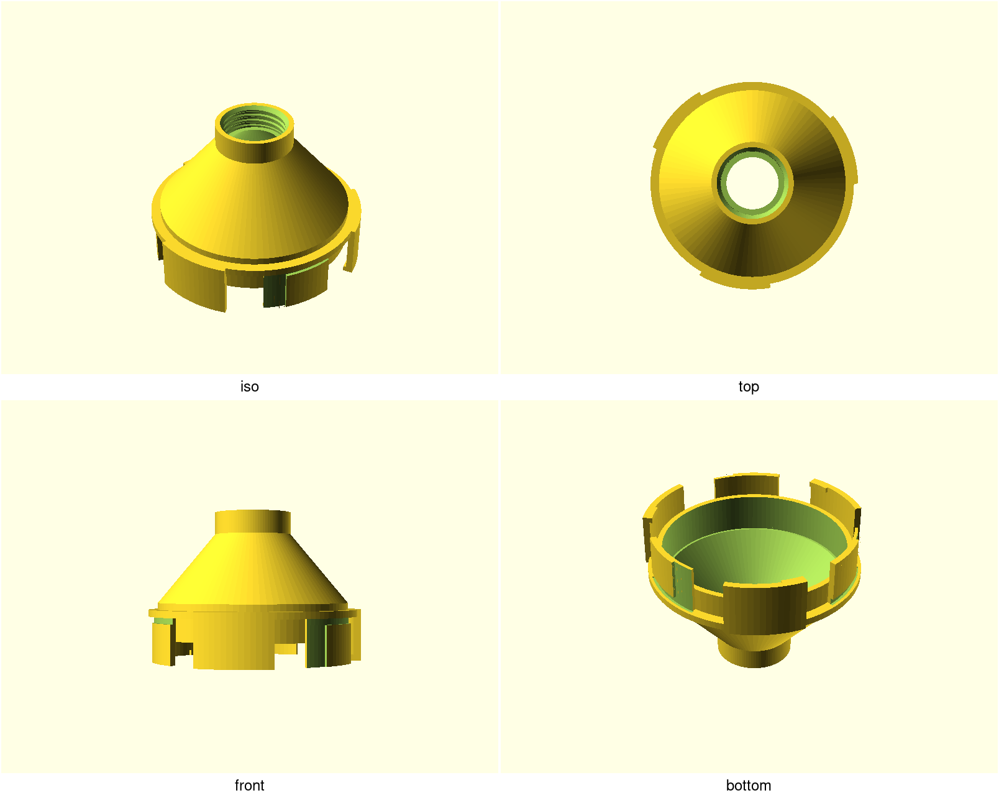
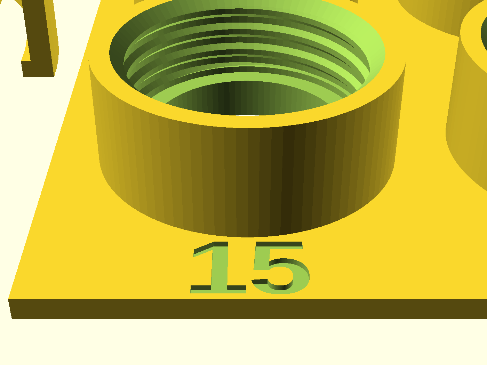

# NUGGS bottle adapter

Turn a PCO-1881 soda/water bottle into a drop-in module of a N.U.G.G.S.
hamster habitat: this one printed part screws onto that standard neck finish
and plugs into the genderless quarter-turn NUGGS port — no special bottles,
no fasteners, no tools. It does **not** seal on its own; it passes what the
bottle's orifice passes, so treat it as a **dispenser**, not a watertight
waterer — pair with `nuggs-shutter-valve` when you need to gate flow. Swap
bottles in seconds; wash and refill the bottle, not the habitat plumbing.

## What you get

- `adapter` — the one-part bottle-to-NUGGS adapter (approx. Ø97 × 66 mm):
  the coupling port below, a PCO-1881 threaded throat above.
- `coupon` — the print-this-first fit checker: the port stub plus four
  labelled thread rings to find your printer's `bottle_tol` before you commit
  to the body (approx. 187 × 97 × 31 mm).

**Which bottles fit:** PCO-1881 is the standard Coke/Pepsi soda neck — not
every "water bottle" uses it. Before you commit filament: if the cap from a
Coke bottle fits yours, or the neck measures about 28 mm inside, you're on
PCO-1881; when unsure, the coupon is the proof.

## Print settings

- **Material:** PLA (dry service) or PETG if you hand-wash warm — family N7 still
  applies; see Use & care
- **Layer height:** 0.2 mm with a 0.4 mm nozzle — the thread ridges are 3
  layers wide; coarser loses the thread
- **Infill:** 15% (all working surfaces are perimeters)
- **Supports:** none needed — steepest surface is the 44° interior funnel
- **Orientation:** as rendered, port down on the coupling sector tips
- **Seam:** random (or rear) — an aligned seam stacks a ridge inside the
  threaded bore that can catch the bottle at one spot in the turn
- **First layers:** the sector tips print as separate islands and merge into
  the ring a few layers up — normal for the NUGGS family pose; keep supports
  off anyway
- **PETG note:** expect some droop on the 44° funnel ceiling — cosmetic only,
  the flow path is set by the land opening
- **Print first:** the coupon, in **the same material as the adapter**
  (PETG vs PLA moves this ladder by about one ring), and set `bottle_tol`
  from the ring that grips a real bottle best (see below). Rings are marked
  `15 / 22 / 30 / 38` (`= bottle_tol × 100`). The coupon being heavier and
  slower than the adapter body is intentional: a full throat rehearsal
  (port stub + bottle rings), not a bug to "fix" (~4 h 57 m / 62.55 g vs
  the adapter's ~4 h 10 m / 53.16 g)
- **Bed:** the coupon strip is ~187 mm — keep it clear of the stock X1/P1
  front-left exclusion (~18 × 28 mm) on “256” beds. The adapter alone fits
  smaller beds; the coupon needs ~190 mm+

On dark filament the shadow-read engraving can be hard to see under kitchen
light — dab acrylic paint or a white gel pen into the digits before you
trust a ring number.

## Parameters

| Parameter | Default | What it does |
|---|---|---|
| `bottle_tol` | 0.25 mm | Thread clearance — **the** tuning knob; sweep it on the coupon (0.15–0.38) and set what grips |
| `f_thread_depth` | 0.6 mm | Female thread depth; capped near 0.85 by the printable-profile fit inside one pitch |
| `nuggs_port_tol` | 0.30 mm | Coupling clearance (the NUGGS standard default) |
| `land_opening_d` | 22.0 mm | Hole in the sealing floor; never below the bottle's own 21.74 mm orifice |
| `funnel_deg` | 44° | Interior funnel ceiling; keep ≤45° for supportless printing |
| `shell_h` | 16 mm | Full-round wall behind the coupling face |

The PCO-1881 table (`bottle_thread_od`, `bottle_thread_pitch`, …) is the
standard, not knobs — don't tune those; tune the clearance. All parameters
are at the top of `nuggs-bottle-adapter.scad` in Customizer sections;
override on the command line with `-D 'bottle_tol=0.22'`.

## Assembly & use

1. Print and check the **coupon** first, in the same filament as the adapter:
   screw a washed PCO-1881 bottle into each labelled ring (`15 / 22 / 30 / 38`
   = `bottle_tol` × 100) and find the tol that grips without cracking or
   skipping; put that number in `bottle_tol` and print the adapter.
2. Screw the bottle into the adapter mouth-down until its lip seats on the
   land (about 1.8 turns from first contact). The bottle's weight rests on
   the printed land — the thread only keeps it from unscrewing. Any rotational
   "label clock" for which way the bottle brand faces the room is fine
   mechanically; there is no preferred orientation.
3. Quarter-turn the coupling into any NUGGS port, the same as every module.
4. If the bottle bottoms out before seating (you feel the tamper ring hit),
   your bottle's finish runs long — the design clears the standard's 10.8 mm
   band; a capful of filing on the rim fixes nonstandard ones.

The adapter does not seal: it passes what the bottle's own orifice passes,
through a printed land. For wet service see the design's backlog (an O-ring
groove variant); for gating flow, pair it with the `nuggs-shutter-valve`.

## Use & care

When you wash the adapter (or the bottle while it stays screwed in), hand-wash
it (NUGGS family **N7**): ≤ 50 °C only, mild unscented dish soap is fine, rinse
and dry fully — **never a dishwasher** (the heated dry cycle exceeds even
PETG, and a warped port is a narrowed bore).

The printed bottle thread is the high-cycle joint on bottle swaps — expect on
the order of hundreds of turn cycles a year once you're in the rhythm of
refills. A ring of plastic dust under the bottle, or a grip that skips when
you seat it, means **reprint the adapter** (~4 h 10 m and ~53 g per CI's
printcheck numbers on this design) — cheap compared with a full bottle dropping
from the port.
