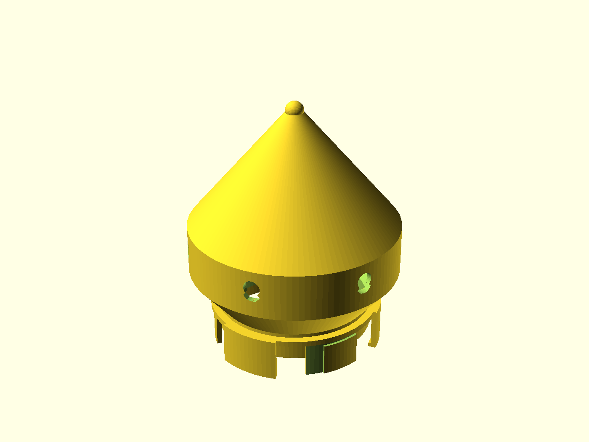
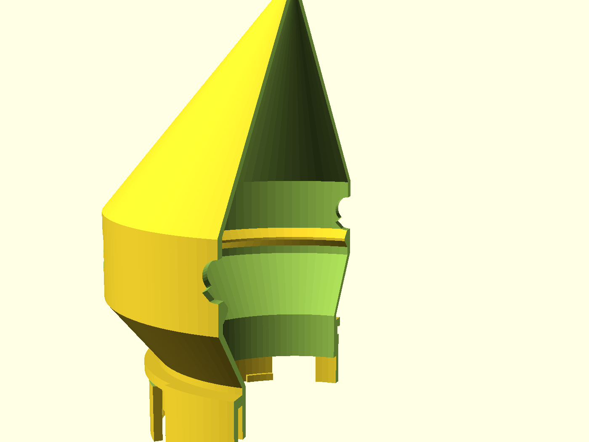

# N.U.G.G.S. Den

A **terminal refuge** for the N.U.G.G.S. hamster-tunnel system: a single-port
rounded burrow bulb that caps the end of a run, so a short bridge ends in a
place to hide and hoard instead of a flat wall. It carries the same genderless
quarter-turn port every NUGGS module shares, so it clicks onto any face either
way round. Not a tube, not an elbow — the one module you *stop* at.

> **Designed for a hamster, by (the fiction goes) a hamster.** Every feature
> here is a piece of Syrian-hamster husbandry a person plumbing a tube kit
> wouldn't think to add — an opaque refuge, a *flank* scent-rub rail, a
> convective vent chimney, and a cheek-pouch-relief mouth. The reasoning for
> each is in [`NOTES.md`](NOTES.md).

> **Work in progress — nothing in this system has been printed yet.** The den
> passes `gate.sh --slice` and is watertight in geometry, but `port_tol = 0.30`
> is an untested guess inherited from the shared standard. **Print the coupon
> first** (see Assembly & use) and expect to tune it.

## Read this first — where a den belongs

A den is a **dead-end**. Its clear internal width (110 mm at defaults) is less
than a Syrian's body length, so the animal **cannot turn around** in it and
must reverse out. Under the NUGGS welfare rule a den therefore does **not**
reset the run-length count — it is a *refuge*, not a turnaround. Use it to cap
a **short** stub, where the reverse-travel budget isn't already spent by the
tube feeding it. It buys refuge, opacity and ventilation for a run end; it does
not buy length. The full rule and its source live in
[`designs/nuggs/PM.md`](../nuggs/PM.md) (N2) and
[`docs/nuggs-research.md`](../../docs/nuggs-research.md).

## What you get

One printed part: a domed refuge chamber with a NUGGS port on the underside.

- `chamber` — the den (≈ 116 × 116 × 139 mm at defaults). One genderless port,
  a hollow opaque bulb, six chimney vents, an internal flank-rub rail.

## The four hamster features

- **Opaque refuge bulb.** Clear tube gives a prey animal nowhere to be unseen.
  The den is the one NUGGS module deliberately **closed and windowless** — a
  solid-walled room to be out of sight in.
- **Flank scent-gland rub rail.** A Syrian marks territory by dragging the
  glands on its *flanks* along a surface (a dwarf uses its belly — different
  animal, different feature). So the mark it wants is a horizontal **ridge at
  flank height**: a rounded full-circle rail on the inner wall, a rub and never
  a chew edge.
- **Chimney vents.** A closed refuge condenses worst of all, so the crown
  carries a ring of vents and warm breath rises out the top. They are
  **teardrops, point up**, so each one bridges its own roof and prints with no
  support — the tell of a design that has actually been sliced.
- **Pouch-relief mouth.** An animal arriving with both cheek pouches full is
  wider at the face than the body. The entry is **flared** so a loaded arrival
  is funnelled in and never scrapes a lip.

## Print settings

- **Material:** PLA or PETG. It is opaque by nature — that is the point of a
  refuge; a translucent filament would defeat it.
- **Layer height:** 0.2 mm.
- **Infill:** 15–20 % is plenty; the shell does the work.
- **Supports:** **none needed.** Every shoulder and the crown sit at ~40° from
  vertical, the roof closes to a self-supporting point, and the vents are
  teardrops — the whole part is support-free in the as-modelled orientation.
- **Orientation:** as modelled — **port sectors down on the bed**, bulb up.
  Do not rotate it; the coupling is meant to print standing on its lug tips.
- **Brim:** **yes.** The part stands on three small sector tips (~530 mm²
  contact), so a brim is worth it for a tall part. This is the same first layer
  every NUGGS module prints on.
- **Heads up:** it is a substantial part — ~127 g and ~10 h at defaults,
  because a refuge is a real room. Shrink `bulb_r` if you want it smaller.

## Parameters

The handful most worth tuning; the rest are grouped in the Customizer sections
at the top of [`nuggs-den.scad`](nuggs-den.scad).

| Parameter | Default | What it does |
|---|---|---|
| `bore_d` | 80 mm | Internal bore — the shared NUGGS headline number. Floored at 70 mm by the coupling library (Syrian entrance minimum). |
| `port_tol` | 0.30 mm | The one fit knob for the quarter-turn joint. Tune on the coupon in ±0.05 steps. |
| `bulb_r` | 58 mm | Half the chamber OD. Bigger = more room, but a taller, heavier print (the crown must stay support-free). |
| `bulb_wall` | 3.0 mm | Chamber shell thickness. |
| `eq_h` | 26 mm | Equator-band height; the vents and rail live on it. |
| `n_vent` | 6 | Number of chimney vents. |
| `vent_d` | 9 mm | Teardrop vent diameter. |
| `rail_h` | 4 mm | How far the flank rub rail reaches into the bulb. |

Override on the command line with, e.g., `-D 'bulb_r=50'`.

## Assembly & use

1. **Print the coupon first.** `nuggs-den-coupon.scad` is a bore-clean port
   stub. Mate two of them (or one to any NUGGS module) and step `port_tol` in
   ±0.05 until the quarter-turn seats snugly without forcing. Set that value in
   `nuggs-den.scad` before printing the den.
2. **Print the den** with a brim, no supports, port-side down.
3. **Fit it** onto any NUGGS face: push together, twist a quarter turn either
   way. It comes apart the same way, with the animal free to leave.
4. Place it capping a **short** run (see *Read this first*). Give it a handful
   of bedding; a Syrian will find the rub rail and claim it.
