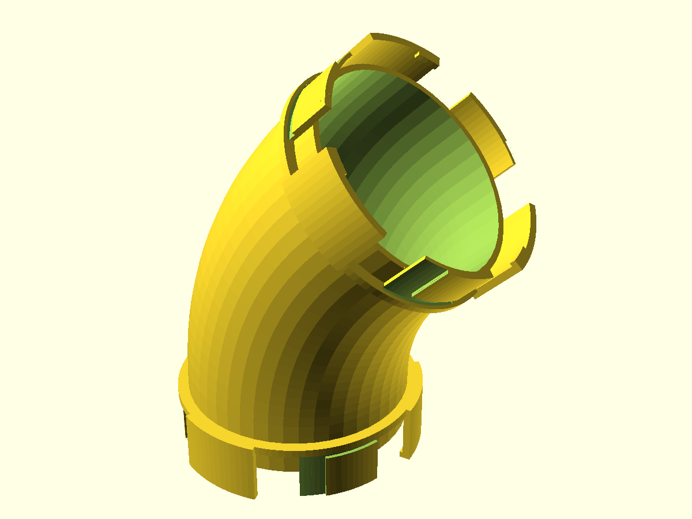
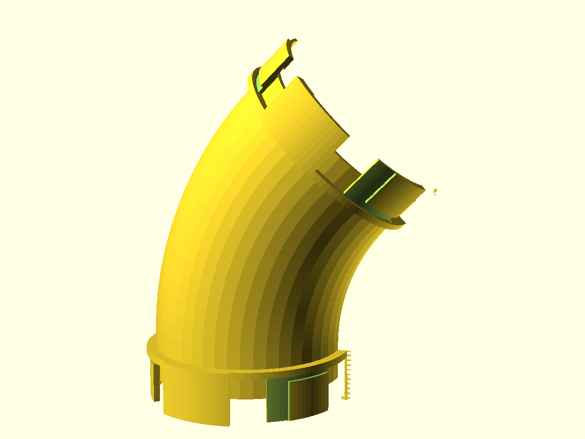

# nuggs-elbow

A curved **N.U.G.G.S.** module that routes an 80 mm-bore hamster tunnel run
around a corner. It carries the genderless quarter-turn NUGGS port on **each
end**, so it drops into any run between two other modules — a straight, a
bulkhead, another elbow — and twists shut a quarter turn either way. The bore
stays a continuous, smooth 80 mm circle *through the bend*: a NUGGS welfare
non-negotiable, because a live animal travels this corner and any interior ledge
or step is a hazard.

The default is a **45° elbow** — the supportless, welfare-clean maximum for a
vertically-printed enclosed bore (see Print settings). A full 90° corner is two
of these coupled; because every NUGGS face mates with every other, a pair makes
any 0–90° turn in any plane.

## What you get

One printable part: a bent tube with a NUGGS port at each end, printed as a
single piece.

- `elbow` — the 45° elbow (approx. 134 × 95 × 161 mm envelope; ~126 g at the
  slicer defaults below). Inherits every coupling dimension from the NUGGS
  standard (`lib/nuggs-coupling.scad`): 80 mm bore, 84.8 mm tube OD, 96.8 mm
  coupling-ring OD.

The `pair` and `cutaway` views (`-D part="pair"`, `-D part="cutaway"`) are
review previews, not separate prints.

## Print settings

The elbow is designed to print **standing on its inlet flange**, the same
orientation as the NUGGS straight — the three coupling-sector tips are the bed
contact.

- **Material:** PLA or PETG.
- **Layer height:** 0.2 mm.
- **Infill:** 15–20 % (walls carry the load; the tube is 2.4 mm / 6 perimeters).
- **Supports:** none for the default 45° bend. This is the whole reason the
  default turn is 45°: a vertically-printed enclosed bore has a ~45° overhang
  ceiling, so at 45° the bore ceiling holds itself up and no support ever lands
  *inside* the bore (which the smooth-bore welfare rule forbids). **Turning
  `bend_angle` past 45° needs support inside the bore** — don't, unless you have
  a reason to accept it; couple two 45° elbows for a 90° corner instead.
- **Orientation:** inlet flange down, bore vertical at the inlet. printcheck
  confirms this is as good as any axis-aligned alternative.
- **Brim:** recommended. The part stands on three sector tips, so the
  first-layer contact patch is small (~530 mm²); a brim keeps it planted.

At the committed quality the part scores **76/100 — printable with caveats** in
`printcheck` (watertight, one body, no critical issues; the caveats are the 2 %
bend-belly overhang and the small bed-contact patch, both inherent and both
addressed above).

## Parameters

All parameters are at the top of `nuggs-elbow.scad`, grouped in Customizer
sections; override on the command line with `-D 'bend_angle=60'`.

| Parameter | Default | What it does |
|---|---|---|
| `bend_angle` | 45° | Turn angle of the elbow. 45° is the supportless maximum; up to 90° is allowed but needs bore support. |
| `bend_radius` | 120 mm | Centerline radius of the bend (~1.5× bore). Gentler = shallower overhang; the bore stays a full circle regardless. |
| `port_stub` | 16 mm | Straight full-round shell each port fuses to, past the coupling collar (also a short grip). |
| `bore_d` | 80 mm | Internal bore, the headline number. A NUGGS-standard value; asserted ≥ 70 mm (welfare floor). |
| `wall` | 2.4 mm | Tube shell thickness (6 perimeters at a 0.4 mm nozzle). |
| `port_tol` | 0.30 mm | The coupling fit clearance — owned by the NUGGS standard, tuned on the `nuggs` coupon, not here. |

The coupling parameters (`lug_r`, `port_proj`, `n_lug`, `lug_deg`, `twist_deg`,
…) are the NUGGS standard defaults: **change them and this elbow no longer mates
with other NUGGS modules.** They are exposed for the Customizer, not for tuning.

## Assembly & use

- **Into a run:** push a port onto any other NUGGS port and twist a quarter turn
  either way; the bayonet ribs seat. The joint is genderless, so orientation
  never has to be got right, and it is hand-releasable.
- **A 90° corner:** couple two elbows. The second one's clocking is free (the
  quarter-turn joint retains at any of its clockings), so rotate it to aim the
  outlet wherever the run needs to go.
- **Welfare:** this elbow is a *bend*, and per the NUGGS charter a bend is **not**
  a break in an enclosed run — it does not reset the per-run length limit. Count
  it as continuously enclosed bore when you plan a run length (see
  `designs/nuggs` and its NOTES.md for the run-length rule and its source).
