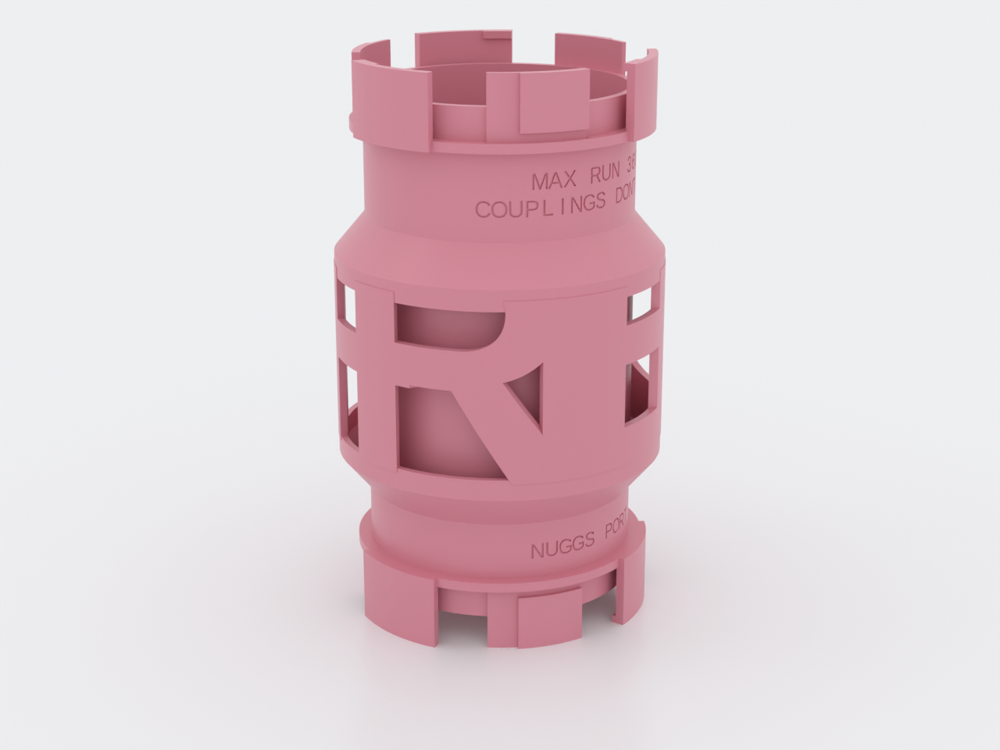
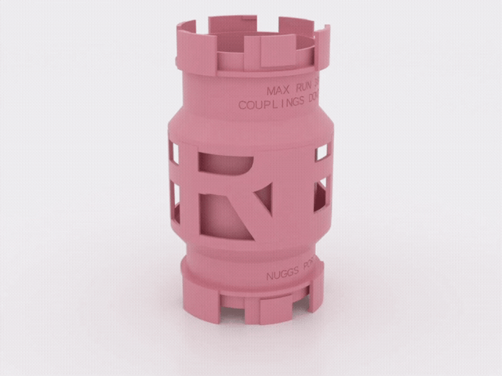
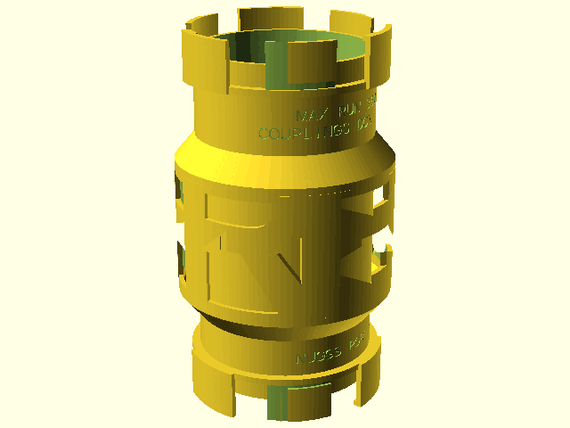
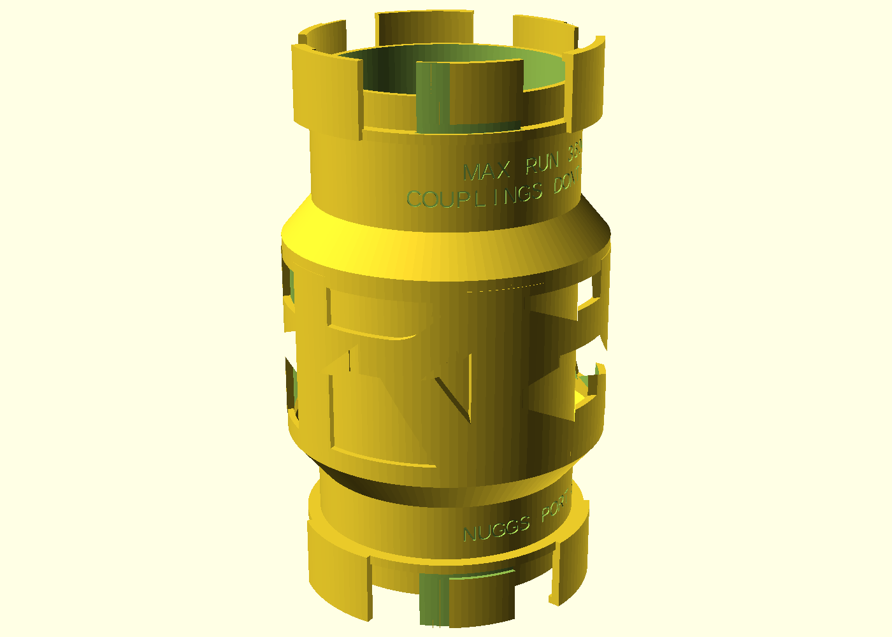

# nuggs-frieda

A [NUGGS](../nuggs/)-compatible hamster-tunnel module that is *made of its
resident's name*: a standard 80 mm-bore straight whose midspan wears a
structural letter cage spelling **FRIEDA**, Word-World style — the word wraps
289° around the tube between a base rail and a cap rail. It carries the same
genderless quarter-turn port as every NUGGS module (same standard, same
revision, same defaults), so it couples with any of them, either way round,
and works as a drop-in replacement for the plain straight. Print it for the
hamster whose bridge should say whose it is.

*AI-generated motion impression for general illustration only — geometry is approximate and may not exactly match the printed part, and the movement shown is illustrative, not a simulation; see the deterministic previews above and the STL for the true shape.*

The name is a **second wall, not the enclosure wall**: inside the letter cage
runs a full, continuous, standard NUGGS tube, so the bore is never narrowed
(70 mm welfare floor), no opening between glyphs is reachable from inside,
and every letter edge stays outside the enclosure. A stencil tube — letters
as the bore wall itself — was considered and refused; the reasoning is in
[NOTES.md](NOTES.md).

## What you get

- `bridge` — the name bridge (Ø 104.8 mm over the letters, 180 mm end to
  end including both port projections; 160 mm face to face)
- `coupon` — two bore-clean port stubs (≈ Ø 97 × 35 mm each) to tune
  `port_tol` before committing to the full print. **Print this first.**

## Print settings

- **Material:** PETG preferred (hand-wash-only rule of the NUGGS system);
  PLA works
- **Layer height:** 0.2 mm, 0.4 mm nozzle
- **Infill:** any — the part is almost all 2.4 mm walls
- **Supports:** none needed. Both cage skirts are 50° cones; letter
  internals print as short anchored bridges
- **Orientation:** upright, exactly as rendered — bore axis vertical,
  standing on one port's sector tips
- **Brim:** recommended (180 mm tall part on three small sector tips)

## Parameters

| Parameter | Default | What it does |
|---|---|---|
| `name` | `"FRIEDA"` | The word. Capitals A–Z only (every glyph must anchor rail to rail; the file explains) |
| `letter_size` | 80 | Font size in mm; cap height ≈ 0.69 × this |
| `letter_kern` | `[8,0,0,8,0]` | Per-gap weld: mm removed after each glyph so free arm ends (F, E) fuse into the next stem instead of printing as cantilevers |
| `port_tol` | 0.30 mm | The one fit knob of the whole port standard. Tune on the coupon in ±0.05 steps |
| `straight_len` | 160 mm | Face-to-face tube length. 160 = drop-in for the nuggs straight |
| `bore_d` | 80 mm | Internal bore. Asserted ≥ 70 mm (welfare floor) by the library — never lower that floor |

All parameters are at the top of `nuggs-frieda.scad`, grouped in Customizer
sections; override on the command line with `-D 'letter_size=70'`. Change a
`[The NUGGS standard]` parameter and nothing you already printed fits.

## Assembly & use

Couples like every NUGGS module: push the port faces together at the
insertion clocking, twist ~14° either way, done — and one twist opens it
again. The engraved rules on the tube are load-bearing, not decoration:
**MAX RUN 360MM / COUPLINGS DONT RESET** — modules twisted together are one
continuously enclosed run, so don't chain name bridges past the limit for a
180 mm animal (two of these coupled measure 340 mm of enclosed bore: legal,
and the ceiling). Grip the letter cage to twist; it clears a mating module's
coupling ring by design. Hand wash only, ≤ 50 °C; water that gets between
the tube and the cage drains back out through the letter openings.

Want a different name? Set `name` (capitals only) and review the kern: any
letter with free-ended arms (E, F, L, T) wants a weld into its right-hand
neighbour — see F3 in [NOTES.md](NOTES.md).
