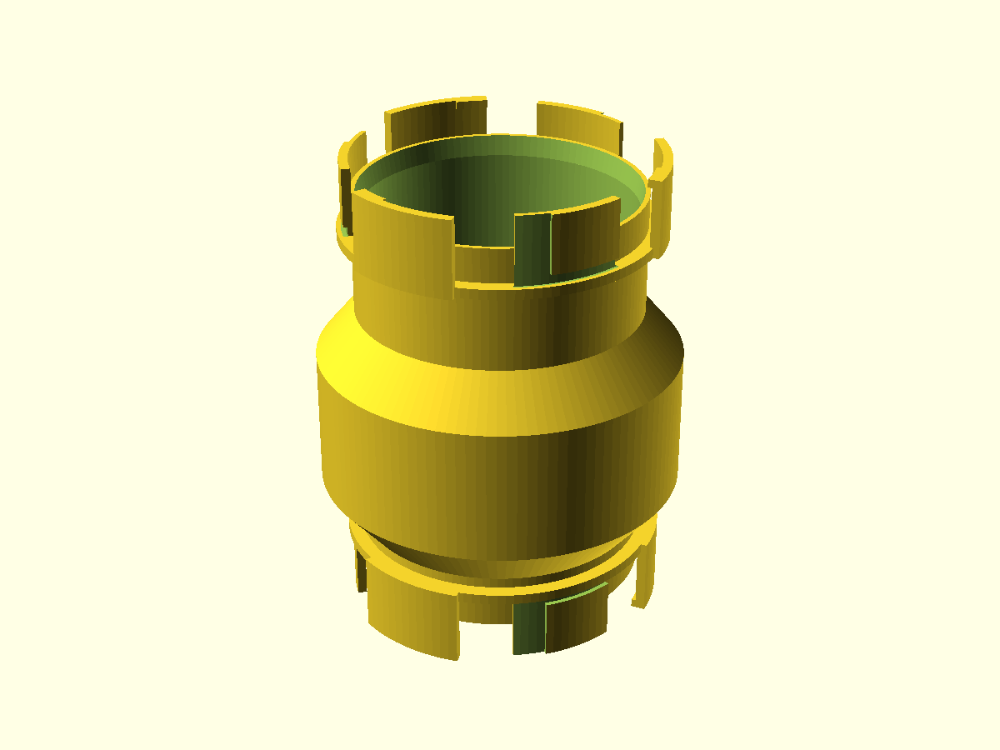
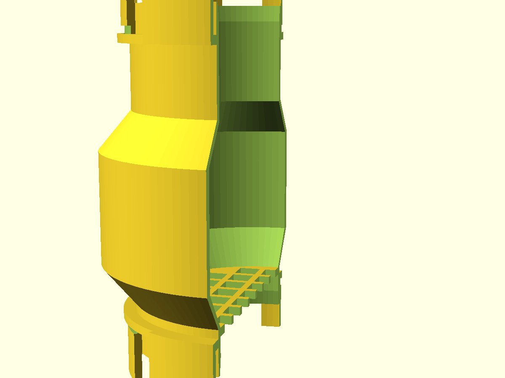
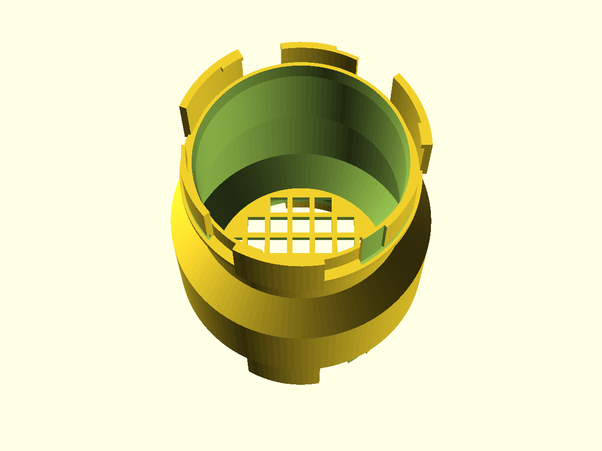

# N.U.G.G.S. Feeder Hopper

The **gravity-fed top-fill food module** for the N.U.G.G.S. hamster-tunnel
system: a bulbous hopper that clicks onto any NUGGS face, holds a few days of
pellets behind an 8 mm mesh floor, and lets them drop into the enclosure as
they are eaten. The owner refills it from outside the cage, straight down
through the open top port — no dismantling, no reaching in. Same genderless
quarter-turn coupling every NUGGS module shares, so it threads onto a run, an
elbow, or a cage-wall stub either way round.

> **Work in progress — nothing in this system has been printed yet.** The
> hopper passes `gate.sh --slice` and is watertight in geometry, but
> `port_tol = 0.30` is an untested guess inherited from the shared standard.
> **Print the coupon first** (see Assembly & use) and expect to tune it.

## What you get

One printed part: the hopper, with a NUGGS port at each end and the mesh
floor built in — no separate steel mesh, no parts to lose.

- `hopper` — the module (≈ 108 × 108 × 140 mm at defaults, printed standing
  on its bottom coupling sectors). Bore 80 mm top and bottom, bulb 102 mm
  clear inside, 37-cell mesh floor at the bulb's base.
- `coupon` — the print-this-first port stub (≈ 95 × 95 × 31 mm) you tune the
  quarter-turn fit on before committing to the full print.

## How it feeds

- **Gravity is the only mechanism.** Pellets sit on the mesh floor; the ones
  over an open cell fall through into the enclosure below. As they are eaten,
  the next ones settle. No metering, no anti-hoarding auger — deliberately:
  the brief scoped those out, and a mechanism that can jam is worse than a
  mesh that can't.
- **The 8 mm cell is the barrier.** Small enough to stop a head or a stuffed
  cheek pouch, wide enough to pass a standard pellet. It is a welfare-capped
  parameter: `mesh_open` may be tuned for your pellet size but never past
  12 mm.
- **Refill from outside.** The top port is the fill mouth. Pour pellets in
  through it; the flared mouth funnels them home. Twist the hopper off for a
  full wash instead.

## Print settings

- **Material:** PLA or PETG. PETG edges out PLA for anything food-adjacent
  (less brittle, survives washing); either prints the part as modelled.
- **Layer height:** 0.2 mm.
- **Infill:** 15–20 %; the shell and mesh ribs do the work.
- **Supports:** **none needed.** The bulb's shoulders sit at ~40° from
  vertical, the mesh floor's cells are 8 mm across (the slicer bridges them
  on layer 1), and the coupling sectors print on their tips by design.
- **Orientation:** as modelled — **bottom port's sectors down on the bed**,
  bore straight up, fill port printed last. Do not rotate it; the coupling is
  meant to print standing on its lug tips.
- **Brim:** **yes.** The part stands on three small sector tips (~530 mm²
  contact) and is tall — the same first layer every NUGGS module prints on.
- **Heads up:** it is a substantial part — ~153 g and ~12 h at defaults.
  Shrink `bulb_r` or `body_len` if you want it smaller.

## Parameters

The handful most worth tuning; the rest are grouped in the Customizer sections
at the top of [`nuggs-hopper.scad`](nuggs-hopper.scad).

| Parameter | Default | What it does |
|---|---|---|
| `bore_d` | 80 mm | Internal bore — the shared NUGGS headline number. Floored at 70 mm by the coupling library (Syrian entrance minimum). |
| `port_tol` | 0.30 mm | The one fit knob for the quarter-turn joint. Tune on the coupon in ±0.05 steps. |
| `mesh_open` | 8 mm | Mesh cell width — the pellet-passes / head-stops barrier. Tunable for your pellet, **never past 12 mm** (welfare bound). |
| `mesh_rib_w` | 2.4 mm | Rib width between cells. Keep ≥ 1.2 mm (gnaw floor). |
| `body_len` | 120 mm | Port-face-to-port-face span. More = more capacity, taller print. |
| `bulb_r` | 54 mm | Half the bulb OD (108 mm at defaults). Bigger = more capacity. |
| `eq_h` | 40 mm | Height of the bulb's straight equator band — the pellet column sits here. |
| `shoulder` | 1.2 | Bulb taper rate; 1.2 ≈ 40° from vertical, self-supporting. Do not go below 1.0 (45° ceiling). |

Override on the command line, e.g. `-D 'mesh_open=9'` or `-D 'bulb_r=50'`.

## Assembly & use

1. **Print the coupon first.** `nuggs-hopper-coupon.scad` is a bore-clean port
   stub. Mate two of them (or one to any NUGGS module) and step `port_tol` in
   ±0.05 until the quarter-turn seats snugly without forcing. Set that value
   in `nuggs-hopper.scad` before printing the hopper.
2. **Print the hopper** with a brim, no supports, bottom-port down.
3. **Fit it** onto any NUGGS face pointing up or sideways: push together,
   twist a quarter turn either way. For a cage-wall mount, pair it with a
   cage-wall stub so the hopper stands outside, ports vertical.
4. **Fill it** through the top port: a handful of pellets, and gravity does
   the rest. Wash by twisting off and rinsing — the mesh floor is monolithic,
   so there is nothing to disassemble and lose.
