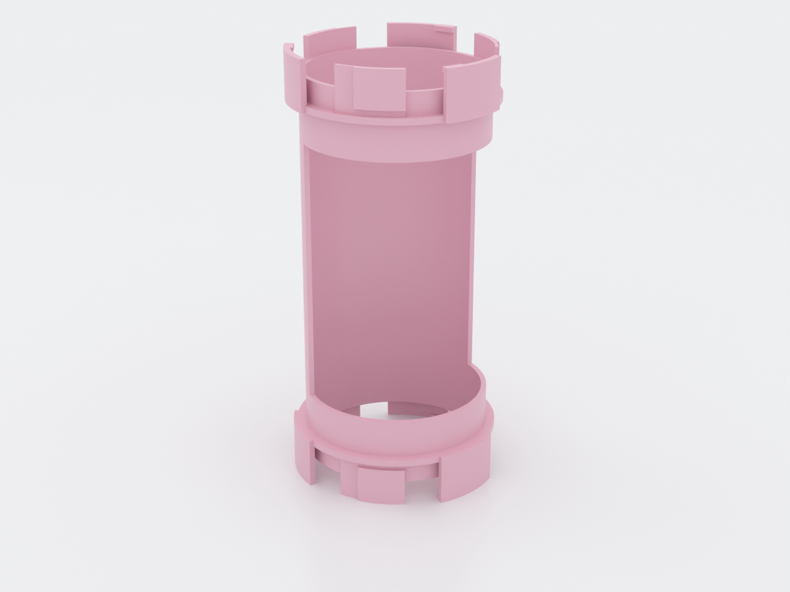
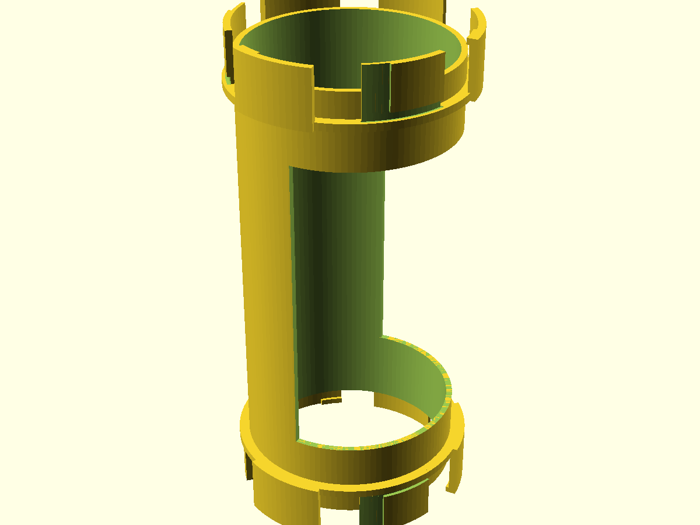
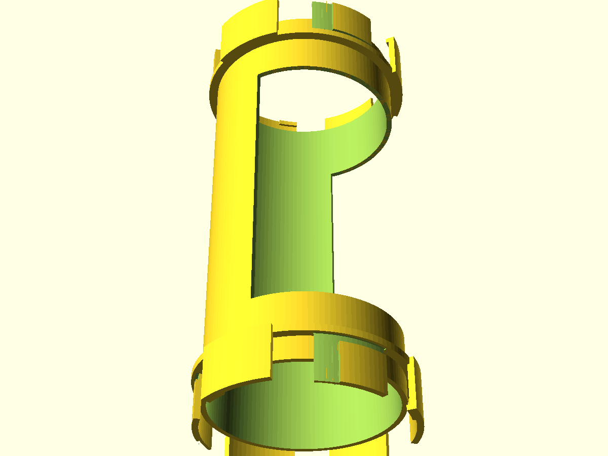
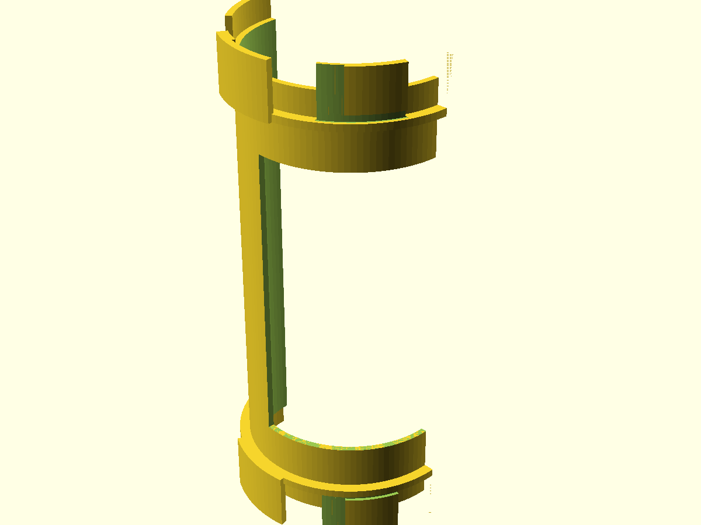
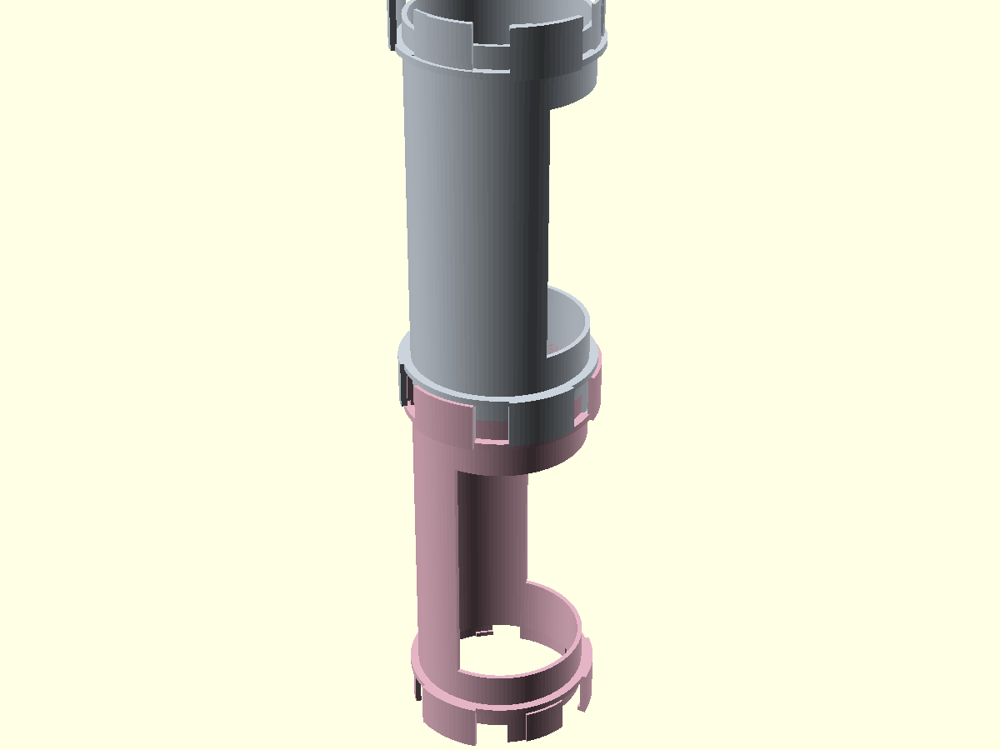

# NUGGS open module

An 80 mm-bore straight with a **longitudinal window** cut through the middle
span — the part that **resets a run**. Under the NUGGS length rule no
continuously-enclosed run may exceed 2 × your animal's body length, and an
**open module** — a window of at least 180° whose floor is still the bore's
own arc — is one of the only three things that break a run (an open end, an
open module, a turnaround node). Drop this into a run anywhere you want to see
and reach the animal without disconnecting anything, or to split a long bridge
into legal runs. For the NUGGS owner extending past one straight, this is the
part that makes it possible.

## What you get

- `open` — the windowed module, ⌀96.8 × 200 mm overall at defaults (a 180 mm
  face-to-face body, coupling sectors projecting 10 mm past each face)
- `coupon` — one port stub (`nuggs-open-coupon.scad`); print two and mate them
  to tune the coupling fit before committing to the big print

The `pair` and `cutaway` renders above are review previews, not printable
parts — each module prints alone, standing on its port.

## Print settings

- **Material:** PETG (the family default — its stiffness holds the window's
  rim walls) or PLA. Natural/uncoloured if the run lives between enclosures.
- **Layer height:** 0.2 mm
- **Perimeters:** 5 (fills the 2.4 mm wall)
- **Infill:** 20 %
- **Supports:** none needed — every downward-facing surface is ≥ 50°
- **Orientation:** tube axis vertical, standing on the port's sector tips,
  exactly as it renders. This is the only self-supporting pose: the two window
  mouth planes print as flat 2.4 mm bridges and the rim walls stand vertical.
  The window's azimuth (which way it faces around the tube) is
  print-irrelevant — every layer is the same 170° annulus segment.
- **Brim:** recommended, `outer_and_inner`, 5 mm — same reasoning as the
  straight: the part stands on three sector-tip pads, and a 200 mm tall part
  on that footprint wants the extra anchored area. It does not bridge between
  the pads.
- **Bed fit:** ⌀96.8 mm × 200 mm tall — fits a 256³ build volume.

Print the coupon first (see below) — the coupling fit is the one thing that
changes per printer.

## Parameters

| Parameter | Default | What it does |
|---|---|---|
| `bore_d` | 80 mm | Internal bore. The headline number; asserted ≥ `min_bore_mm` |
| `open_deg` | 190° | Window arc. **≥ 180° is what makes this a break in a run** — lower and the module is a lie (a straight with a slot). 190 ships for shrink margin; raise toward 220 for easier hand access |
| `body_len` | 180 mm | Face-to-face length, same as the straight's, so runs alternate predictably |
| `neck_len` | 30 mm | Full-round shell kept at each end. Must stay ≥ the port zone (asserted); it is what the coupling's inner sectors fuse to |
| `min_bore_mm` | 70 mm | Welfare floor (DTSchB pouch-full entrance minimum). Never lower it |
| `port_tol` | 0.30 mm | **The one fit knob.** Uniform clearance on every coupling surface. Tune on the coupon in ±0.05 steps — the number you find applies to every NUGGS module |
| `wall` | 2.4 mm | Tube shell and window rim; 6 perimeters at a 0.4 mm nozzle |
| `lug_deg` | 40° | Coupling sector width — also the bed-contact width, since the part stands on these tips |

All parameters are at the top of `nuggs-open.scad`, grouped in Customizer
sections; override on the command line with `-D 'open_deg=210'`.

## Assembly & use

Couple it like any NUGGS module: push onto the port, twist 14° to lock,
either direction. The window does not couple to anything — it faces wherever
you want it the moment you lock the joint.

**One rule this part exists for:** an open module **resets the run budget**
on both sides of it. A bridge of straight − open − straight is two runs, each
needing only its own half of the budget, where the same three modules with a
straight in the middle would be one illegal run. The length rule and what
counts as a break are on
[`nuggs`'s page](../nuggs/README.md#the-length-rule-and-how-far-to-trust-it).

To reach the animal: no disassembly needed — that is the point. The window's
floor is the bore's own arc (there is no shelf to catch a paw anywhere along
it), and at 190° the opening is the widest part of the void, so a loaded
animal lifts straight out.

**Print this first:** `nuggs-open-coupon.scad` — one port stub. Mate two (or
one against any NUGGS module you already printed) and tune `port_tol` until
the quarter-turn seats without forcing, **then** print the module. The fit is
the shared standard, tuned once for every module.
