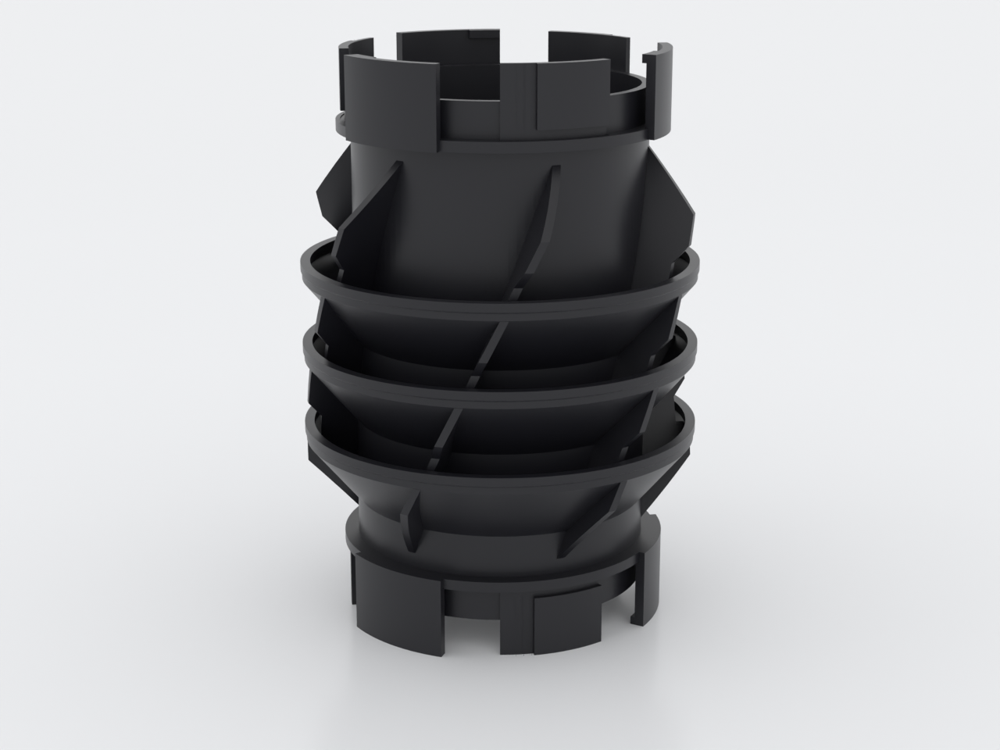
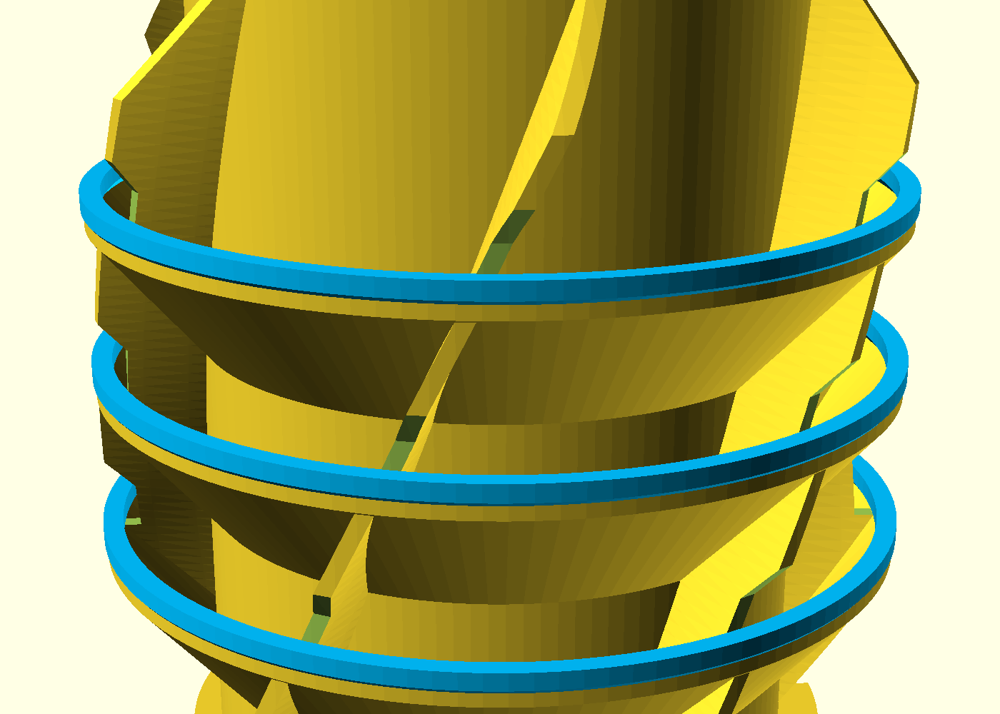
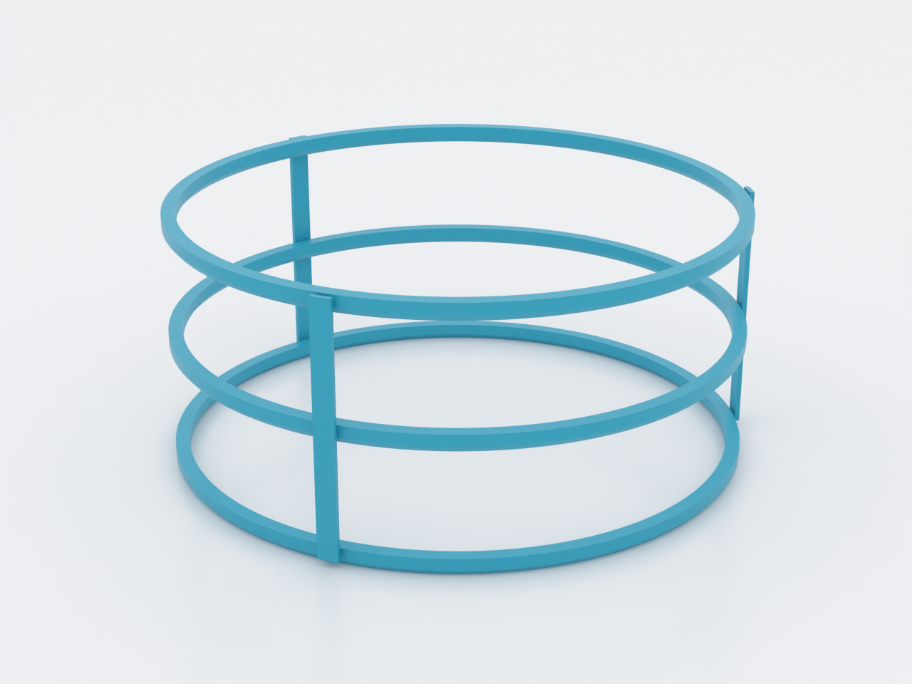
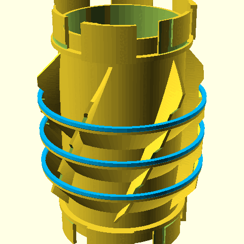

# nuggs-orrery

A kinetic, dual-material module for the [NUGGS](../nuggs/) tube system: the
standard genderless 80 mm-bore port at both ends, and around the outside a
vortex of six helically twisted fins carrying **three free-spinning orbit
rings printed in a second material on the same plate**. The rings' holes are
smaller than the fin cage they circle, so the assembled state cannot be
assembled — it can only be printed. It exists for anyone with a dual-nozzle
printer (Bambu H2-series or similar, AMS optional for color) who wants the
part of the hamster highway that visitors ask about.

Everything the animal touches is the plain NUGGS bore in the body material;
the sculpture is entirely external. In the intended bin-bridge placement the
module hangs between enclosures, out of the animal's reach.

## What you get

Two co-print STLs share one coordinate frame — import both into your slicer
as a single object with two parts and assign one extruder to each:

- `nuggs-orrery-body` — the module: tube, both NUGGS ports, fin vortex and
  the three conical bearing races (≈ 114 × 114 × 166 mm, ~193 g). PETG.
- `nuggs-orrery-orbit` — the three captive rings plus their break-away sprue
  frame (≈ 115 × 117 × 52 mm as printed, ~12 g). PLA, any color you like.

Plus one separate print — do not import it with the pair:

- `nuggs-orrery-coupon` — a single-station fit coupon. **Print this first**,
  on its own plate, to tune `race_gap` for your material pairing (see below).

After the print: snap the nine sprue tabs (flush cutters), lift the three
spars away, and each ring drops ~0.1 mm onto its conical race and spins
free. No support material is generated anywhere — each ring prints directly
on its race, and the PETG↔PLA interface that supported it becomes the
bearing it runs on.

## Print settings

- **Material:** body in PETG (natural or dark), rings in PLA — the material
  *pair* is functional: PETG and PLA do not weld, which is what releases the
  rings from their races. Same-material prints need `race_gap ≥ 0.20` and a
  firm first twist to crack the interface.
- **Printer:** dual-nozzle (one material per nozzle). A single-nozzle
  multi-material unit will technically slice this, but the rings change
  material every layer for their whole height — the purge waste and swap
  count make it impractical, and per-layer temperature cycling between PETG
  and PLA through one nozzle is not a real print.
- **Layer height:** 0.2 mm.
- **Infill:** 15 % gyroid (the part is mostly walls).
- **Supports:** none — every downward face in both STLs is at 50° or is a
  designed micro-bridge; the rings are supported by their races.
- **Orientation:** exactly as exported, both parts. Do not re-arrange or
  drop the parts independently — the shared frame *is* the mechanism.
- **Brim:** required for the body, `outer_and_inner` — like every NUGGS
  module it stands on six port-sector tips. Keep the brim under ~5 mm so it
  stays clear of the orbit frame's footprint.
- **First:** print the coupon (both materials, ~48 g) and tune `race_gap`
  until the ring releases with a light twist and spins without slop you can
  hear across the room.

## Parameters

| Parameter | Default | What it does |
|---|---|---|
| `race_gap` | 0.10 mm | **The** dual-material fit knob: vertical gap between each ring and its race at print time. Tune ±0.05 on the coupon; 0.05–0.15 for PETG/PLA, 0.20–0.30 for a same-material fallback. |
| `fin_twist` | 75° | Total helical twist of the fin vortex. Guarded so the fin surface never leans past 40° from vertical. |
| `ring_seats` | [44, 68, 92] | Ring station heights. Guards keep every station inside the full-radius fin band. |
| `tube_len` | 146 mm | Port face to port face. Asserted against the per-run welfare limit (couplings do not reset a run). |
| `fin_n` / `fin_r` | 6 / 57 mm | Fin count and cage radius. `fin_r − ring_r_in ≥ 1.5 mm` is the captivity guard — the reason the rings cannot come off. |

All parameters are at the top of `nuggs-orrery.scad`, grouped in Customizer
sections; override on the command line with `-D 'race_gap=0.15'`.

## Assembly & use

> **One run, 360 mm.** This module adds its full 146 mm to whatever run it
> is built into, and a coupling is not a break — the limit is per run of
> continuously enclosed bore (engraved on the wall: `MAX RUN 360MM`).

Couples like any NUGGS module: push onto any NUGGS face at the insertion
clocking, twist ~14° either way to lock. The sculpture never enters the
mate's envelope, so it couples on both ends simultaneously, mid-run or at a
bulkhead. The rings are toys for the humans — spin them; they cannot be
removed, which is the point. If a ring ever binds after a wash, a drop of
water displaced with a twist clears the race; never lubricate anything on
an animal enclosure.

Hand wash only, ≤ 50 °C — the ring material is PLA and deforms above that.
