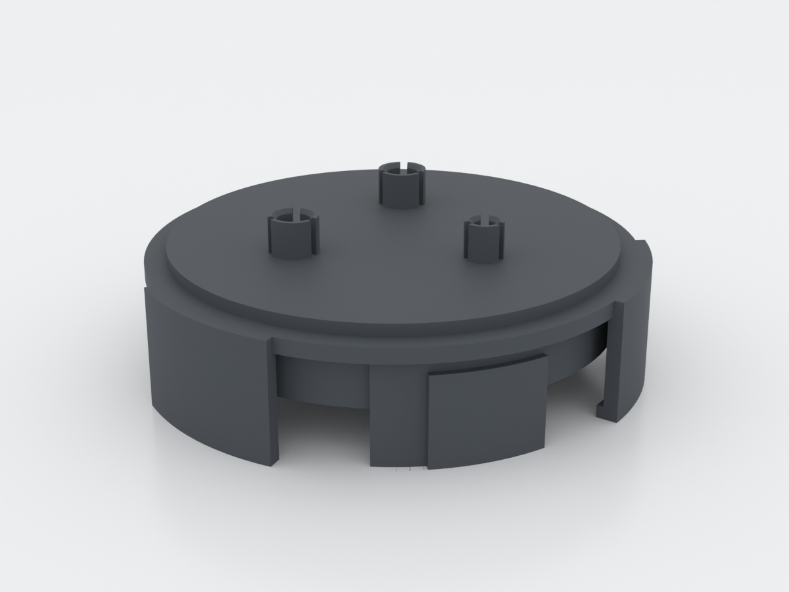
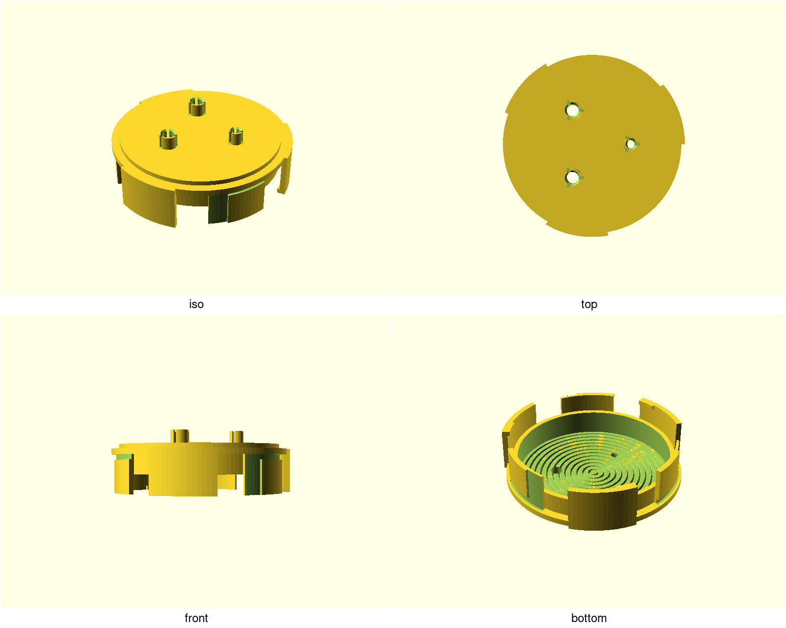
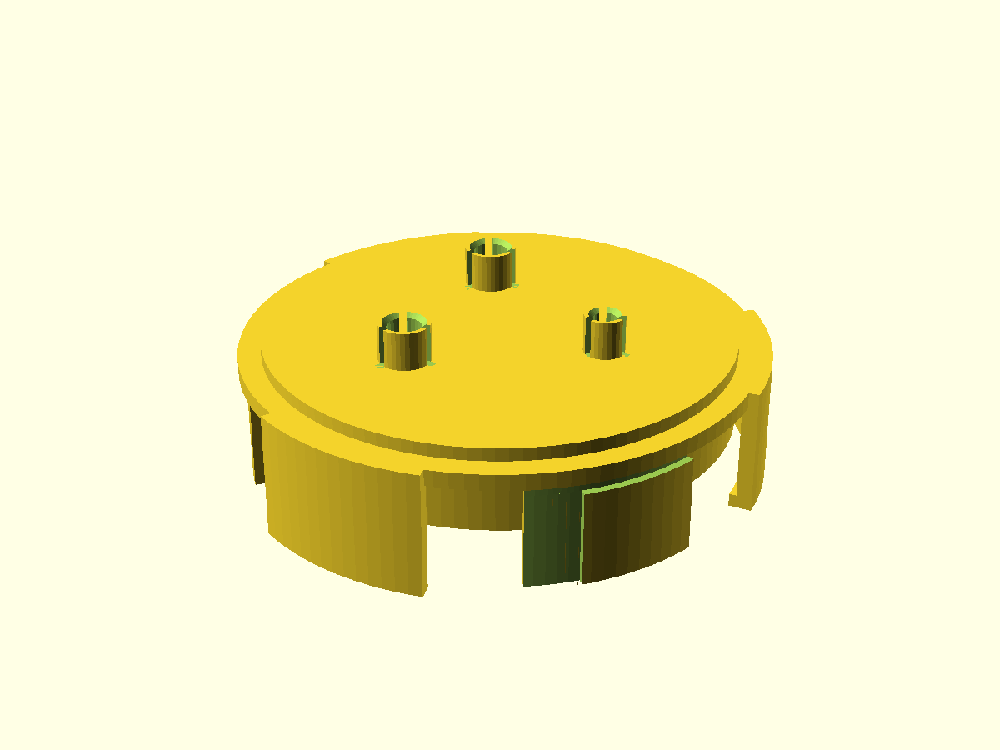
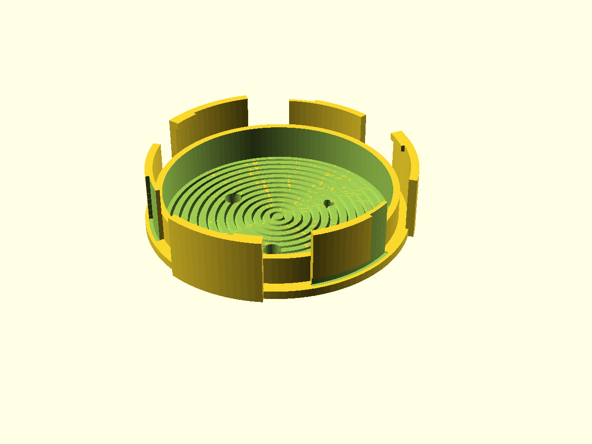
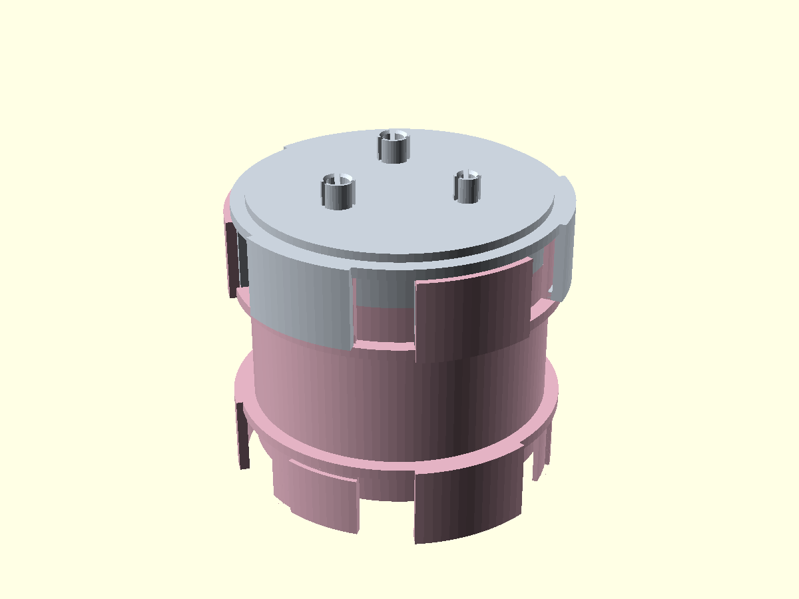

# nuggs-probe-cap — sealed sensor end-cap for NUGGS tubes

A NUGGS end-cap that **closes** the open end of any module while letting
temperature probes and their cables pass through the wall — sealing the bore
against bedding, seed husks and drafts instead of opening it. The NUGGS
catalog had open end-caps (#514, #515) and a deliberately breathing vent-cap
(#592); nothing both sealed the bore **and** passed a sensor. This is that
piece.

Sealing is a **printed split-finger grip**: each pass-through is a bore at
nominal + clearance whose boss wall is slit into compliant fingers that
conform around what passes and close the annulus. It keeps out bedding, husks
and drafts. It is **not rated airtight** — it is a dust-and-draft seal, not a
pressure vessel.

The keeper-side face: two probe grips and one cable gland at 120°, radius
20 mm from the axis. Each boss is a vertical tunnel with three axial slots
cut through its wall — the fingers that close onto what passes.

As it prints: port face down on the three sector tips, no supports. The
underside carries concentric V-groove corrugation (the ceiling relief) so
every downward surface prints supportless — there is no flat ceiling over the
mate's bore.

The quarter-turn bayonet seated on a module: flush, centered, flange over the
tube wall, bosses up. Same joint as every other NUGGS module.

## What you get

- `cap` — the sealed sensor end-cap: NUGGS quarter-turn port + shell + sealing
  plate with corrugated underside + two probe grips and one cable gland
  (Ø 94.9 × 32.4 mm, ~40 g, ~3 h 20 m)
- `coupon` — print this first: both grips at production parameters on one tab
  (1.75 g, ~18 min) for tuning the fit before you commit the big print

Two Ø 6 mm probe bores (DS18B20 stainless probes) and one Ø 4.2 mm gland bore
that takes up cables from Ø 3.4 to Ø 5 mm.

## Print settings

- **Material:** PETG preferred (the fingers flex every probe insertion — PETG
  tolerates the fatigue; PLA works with a coupon-tuned clearance)
- **Layer height:** 0.2 mm
- **Infill:** 15 % gyroid — the part is shell-dominated
- **Supports:** none needed — every surface prints at ≤ 50° or bridges under
  5 mm; **leave slicer supports off**
- **Orientation:** as rendered, port face down on the three sector tips.
  No brim needed (Ø 94.9 footprint).
- **Walls:** 3 perimeters (the 1.6 mm finger walls come out at 4)

## Parameters

| Parameter | Default | What it does |
|---|---|---|
| `grip_clearance` | 0.2 mm | Diametral clearance of every grip bore. **Tune this on the coupon** — 0.20 slides free and seals, 0.10 pinches and holds the probe by friction, 0.05 is a hard grip that needs PETG fingers. |
| `probe_d` | 6.0 mm | Probe diameter, both bores. **Caliper the owner's probes before freezing** — DS18B20 clones vary ±0.2 mm. |
| `gland_d` | 4.0 mm | Cable gland nominal; the fingers take up everything down to `probe_cable_d`. |
| `probe_cable_d` | 3.4 mm | Thinnest cable the gland must grip. |
| `n_probes` | 2 | Probe bores (1–3; layout asserts keep spacing sane). |
| `port_radius` | 20 mm | Distance of the grip cluster from the cap axis. |
| `finger_wall` | 1.6 mm | Boss/finger wall thickness. |
| `boss_h` | 7.0 mm | Grip finger length above the plate. |

All parameters are at the top of `nuggs-probe-cap.scad`, grouped in
Customizer sections; override on the command line with
`-D 'grip_clearance=0.10'`.

## Assembly & use

1. **Print the coupon first** (`nuggs-probe-cap-coupon.scad`) and tune
   `grip_clearance` in ±0.05 steps per the ladder above — on the owner's
   actual probes and cables, not a drill bit of the nominal size.
2. Print the cap, port face down, supports off.
3. Drop each probe through its grip until it homes (~25 mm of the 30 mm
   length projects past the plate underside — its depth is held by the
   keeper, not the cap). Feed the cable through the gland.
4. Quarter-turn the cap onto any NUGGS module's open end — same bayonet,
   same 14° twist as every module.

**If a fit is off:** probe too loose → reprint at `grip_clearance=0.10`;
cable squirming past the gland → 0.05 on the gland side. Both are coupon-size
reprints (~18 min), not cap reprints.

**Honesty note:** this seal keeps out solids and drafts. It is not rated
airtight or watertight — if you need gas-tight sensing, the vent-cap (#592)
plus a port plug is the honest pairing, and a gasketed variant is backlog.
