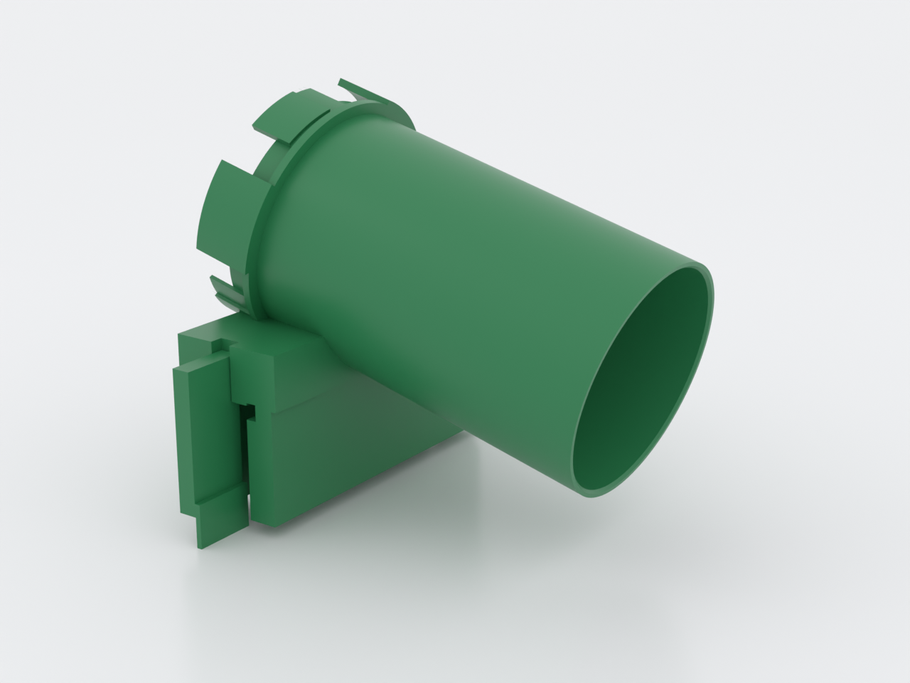
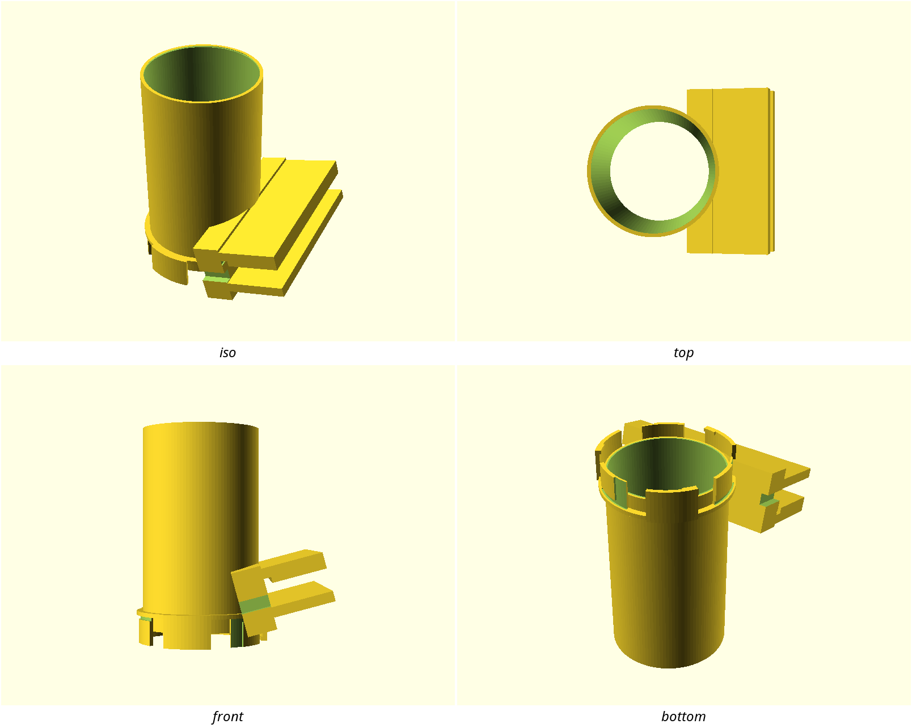
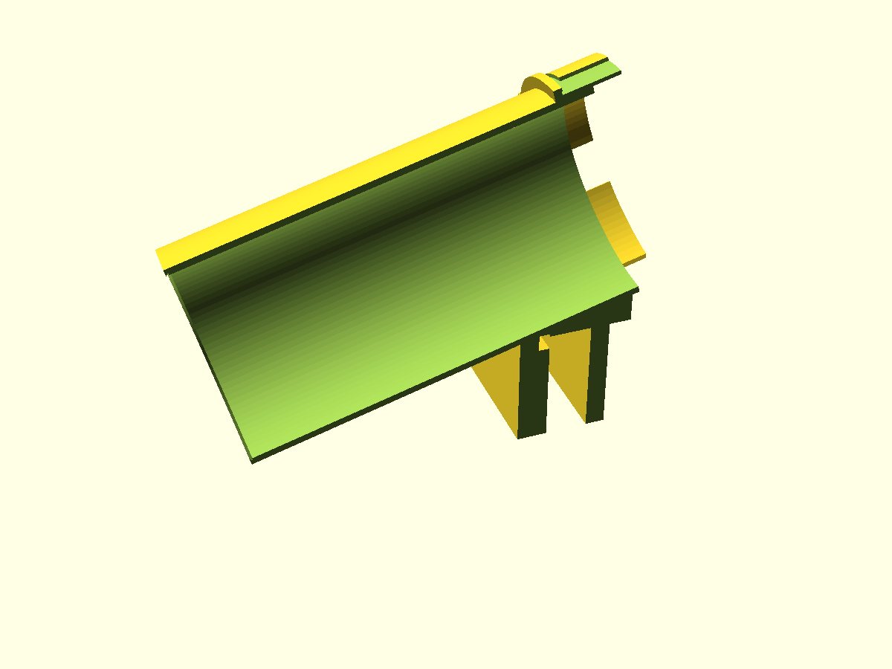
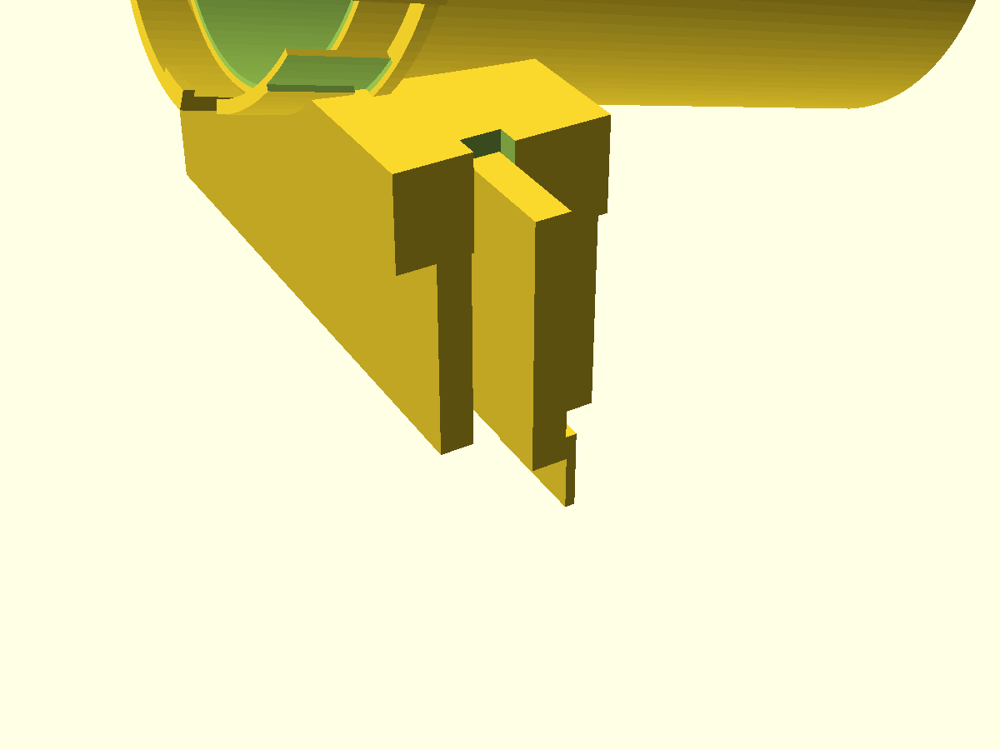
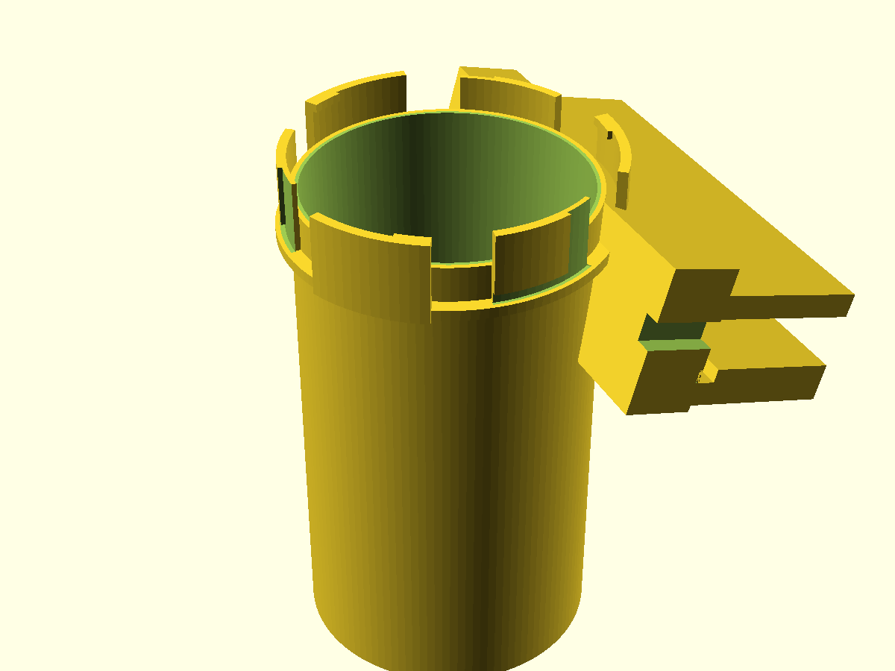

# nuggs-rim-saddle

A [NUGGS](../nuggs/)-compatible **glass-enclosure entry port** that clamps over
the top rim of a glass cabinet — **no drilling** (the rim is tempered glass;
it shatters), no adhesive, no frame modifications — and carries one standard
NUGGS genderless quarter-turn port, so a run starts from a glass tank exactly
the way it starts from a plywood bulkhead. The whole module is one straight
80 mm-bore tube inclined 15° down into the enclosure: the port couples on the
outside, and the internal ramp *is* the bore's invert — one smooth arc down,
the same arc back up, no step anywhere (the welfare rule: an animal walks out
the surface it walked in). Default dimensions fit the IKEA Detolf (43 × 39 ×
163 cm); every rim number is a parameter, so a different cabinet is a `-D`
override plus a coupon print.

The clamp is two **identical** compliant arms (one spare serves either side).
Each arm drops onto a flange at the foot of the outer skirt: its pad bears the
frame lip while a hook latches under the bar. Both outboard tabs pulled
together with a two-finger spread releases the saddle in **one action, no
tools** — the rule that matters when you need the port open *now*. The saddle
bears on glass and frame only: the inner skirt's bearing pad starts below the
top-edge silicone seam, and a relief pocket keeps the bead zone clear.

## What you get

- `body` — the port, inclined tube and clamp bridge in one part (137.5 ×
  124.8 × 154.9 mm standing, port-down)
- `arms` ×2 — the identical latch arms (41.2 × 63 × 24 mm the pair, printed
  flat so the layers lie in the bending plane)
- `coupon` — port stubs ×2 and the latch fixture with both arms: one ~6 h /
  ~79 g print that proves both fits before you commit to the 13 h body.
  **Print this first, in the same PETG as the arms** — a fit tuned in PLA
  reads ~0.05 mm tight in PETG.
- `nuggs-rim-saddle-plate.3mf` — body + arms as a two-object plate: the
  printable deliverable (an assembled STL would slice as one fused lump)

## Print settings

- **Material:** **PETG for the arms, mandatory** — a clamp is a bending
  member and PLA creeps loose. Body: PETG or PETG-HT. Hand-wash ≤ 50 °C,
  never dishwashered (NUGGS material rule)
- **Layer height:** 0.2 mm, 0.4 mm nozzle
- **Seam:** **Scarf, not Aligned** — the bore's invert is the walking
  surface, and Bambu's default Aligned seam grows a stacked ridge down its
  full length
- **Infill:** ≥ 15 %; **4 walls on the arms**
- **Orientation:** as rendered — body standing port-down on the sector tips;
  arms flat on their back; coupon flat
- **Supports:** body — yes, **tree** (the shell grows out of the vertical
  tube; ~11 % of its surface, ≈ 12 600 mm², 13 h / ~195 g on a 0.2 mm
  profile — tree supports anchor the tall body and leave less to clean than
  grid); arms and coupon — none. Afterward **deburr every face that touches
  glass or frame**: a support nick under a pad is a point load on tempered
  glass
- **Brim:** body — **mandatory** (155 mm tall standing on three sector tips
  ≈ 527 mm² of bed contact; the slicer itself flags stability); arms and
  coupon no
- **Bed:** 256 × 256 mm fits every part, but **place the coupon centered** —
  at 204 × 206 mm it would clip the front-left exclusion zone on X1/P1 beds

## Parameters

| Parameter | Default | What it does |
|---|---|---|
| `glass_t` | 4.0 mm | Glass panel thickness. **Measure yours** — the clamp reach and the fitcheck both key off it |
| `lip_d` / `lip_h` | 3.0 / 12.0 mm | Frame lip depth (inboard of the glass) and height below the rim top. Measure with calipers |
| `seam_w` / `seam_h` / `seam_clear` | 3.0 / 4.0 / 1.0 mm | Silicone bead width/height at the top edge, and the standoff kept from it. Nothing bears on the bead |
| `skirt_h` | 42 mm | How far the skirts reach down over panel + lip. Must clear the latch zone (asserted) |
| `grip_gap` | 0.20 mm | The one clamp-fit knob: standoff between the arm pad and the frame lip. Tune on the coupon in ±0.05 steps |
| `incline_deg` | 15° | Bore incline down into the tank. **Asserted ≤ 15°** (the welfare cap) and > 0 |
| `bore_d` | 80 mm | Internal bore, asserted ≥ 70 mm by the library — never lower that floor |
| `port_tol` | 0.30 mm | The one fit knob of the port standard (same as every NUGGS module) |

All parameters are at the top of `nuggs-rim-saddle.scad` in Customizer
sections; override on the command line with `-D 'glass_t=5'`. Change a rim
number and re-run the coupon before reprinting the saddle.

## Assembly & use

1. **Print the coupon first** (same PETG as the arms) and tune: `port_tol` on
   the two port stubs (snap, twist), `grip_gap` on the latch fixture (snap an
   arm on, lift the tab). Sloppy → −0.05; won't seat → +0.05. Peel the brim
   and deburr the stub feet before judging — first-layer squish lands exactly
   on the sectors you're testing.
2. Measure your actual rim: panel thickness, lip depth and height. Re-render
   with your numbers if they differ from the Detolf defaults.
3. Slide the saddle over the rim — inner skirt inside the tank, bridge
   seated on the rim top, bead clear — and push both arms down onto their
   flanges until the hooks latch. Removal is the reverse: two-finger spread
   on the outboard tabs, one action.
4. Couple your NUGGS run to the port at the insertion clocking, twist ~14°.
   **Run accounting:** this module contributes its own enclosed length only
   (port face to mouth ≈ 145 mm axial); the mouth discharges into the
   enclosure, which counts as a break, so a new run starts here. The max-run
   rule engraved on every NUGGS tube still applies to whatever you couple
   outside.

Never drill the rim to add a second port — print another saddle (or a
compatible module) instead. Hand wash only, ≤ 50 °C.
