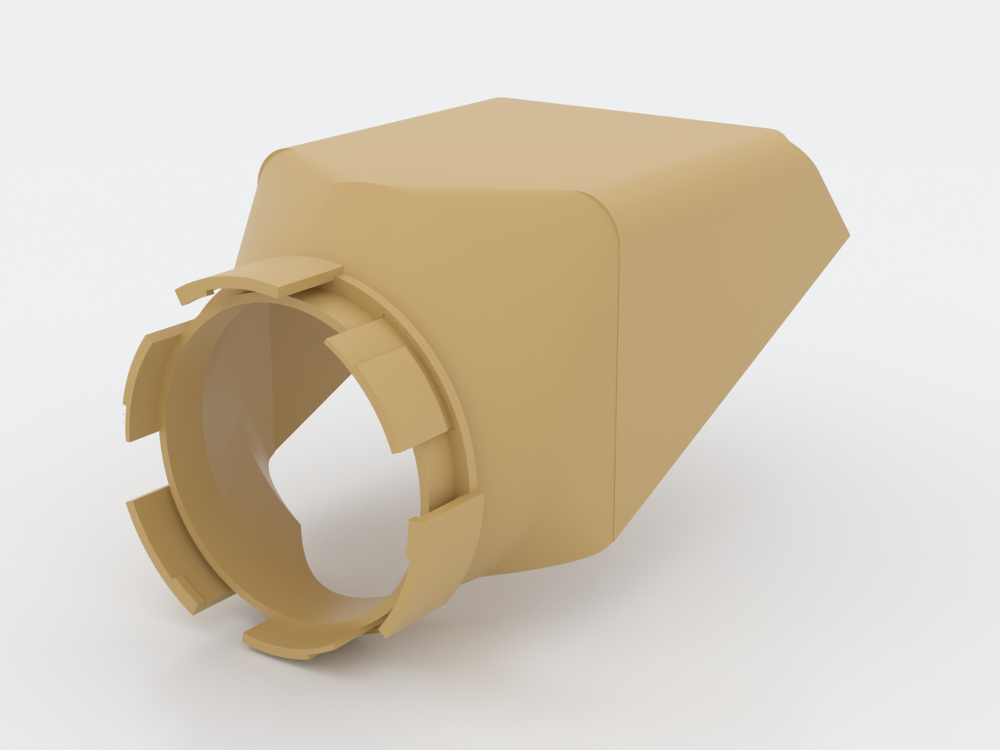
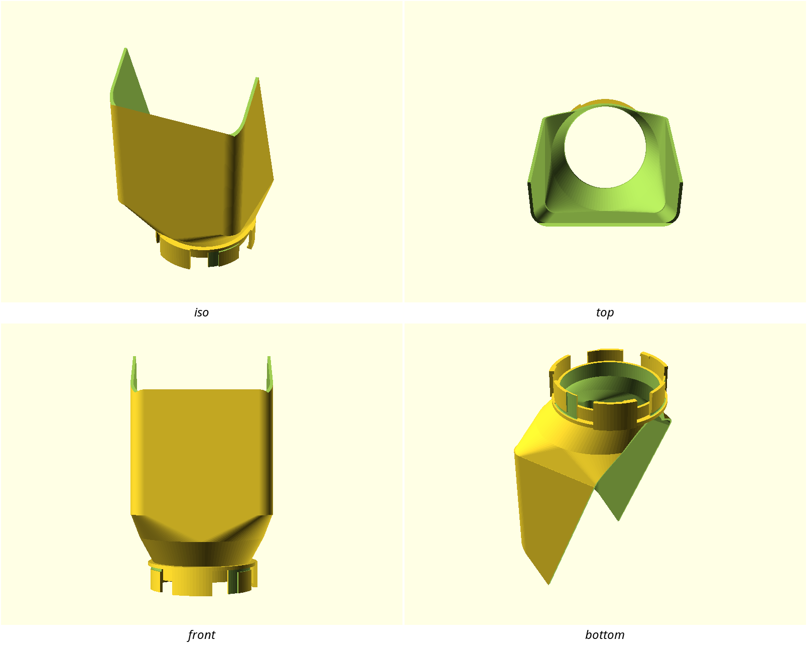
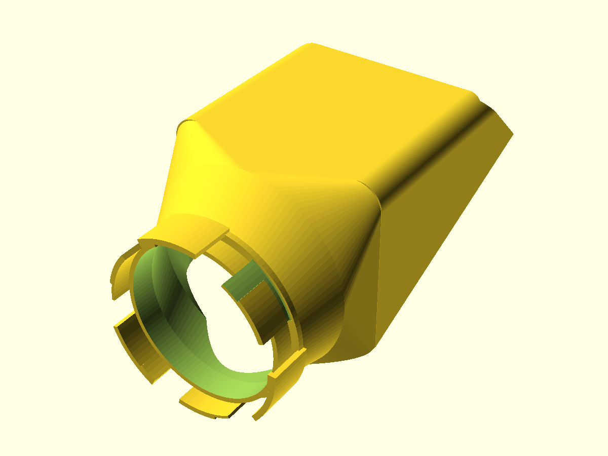
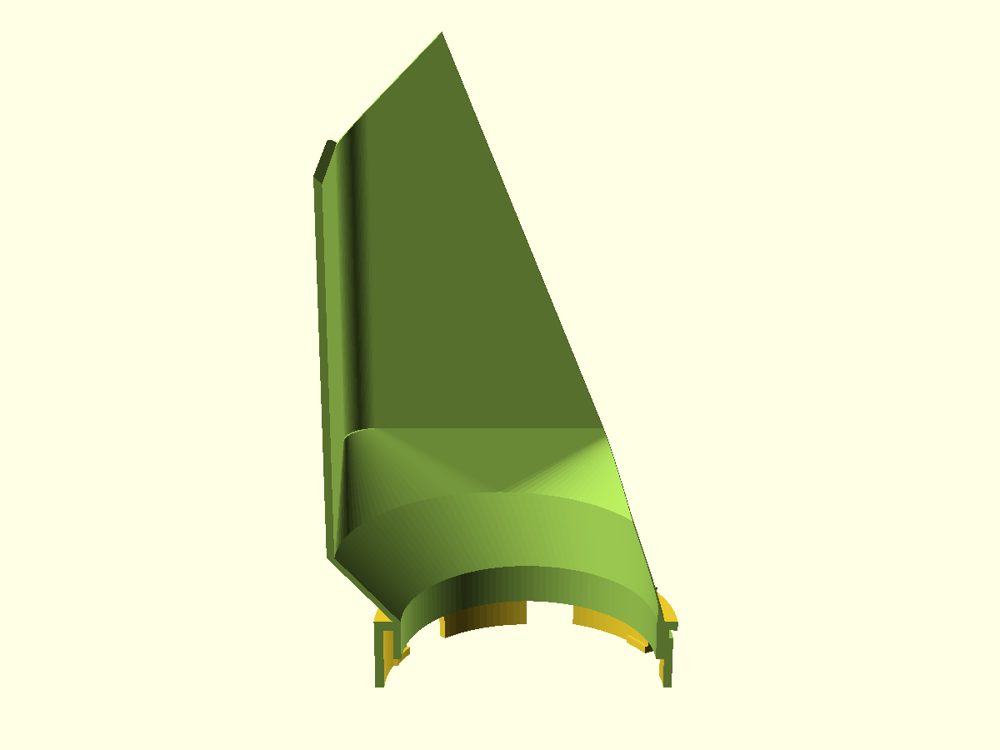

# NUGGS Sand Bath

The grooming module the NUGGS hamster-tunnel system was missing: an open-topped
bathing-sand dish that quarter-turns onto any standard 80 mm NUGGS port face.
The animal walks the bore, crosses a gentle ramp down to a wide sand floor,
rolls and grooms, and walks back out — and the sand stays in the dish, not the
run. One printed part, no supports, no hardware.

## What you get

- `body` — the sand bath module (approx. 115 × 109 × 197 mm printed; 110 mm
  inside width, ~245 mL of bathing sand, 18 mm deep)
- `coupon` — two port stubs to tune the coupling fit *before* the long print

## Print settings

- **Material:** PLA or PETG (PETG if it will be washed often or sees
  enthusiastic digging — sand is abrasive and PLA will haze at the sand line
  long before it's washed)
- **Layer height:** 0.2 mm, 0.4 mm nozzle
- **Infill:** 10–15 %
- **Supports:** none needed — every sloped surface is at or under 45°; leave
  slicer supports **off**
- **Orientation:** as modelled — standing on the port's sector tips, dish
  growing upward
- **Brim:** yes, 4–5 mm — the part stands on three small tips (a stability
  warning from the slicer is expected; the brim answers it)
- **Print the coupon first** (see below) — the port tolerance is untested on
  any printer
- Roughly 9 h / 130 g for the body

## Parameters

The handful worth tuning — the rest live at the top of
`nuggs-sand-bath.scad` in Customizer sections, overridable with
`-D 'param=value'`.

| Parameter | Default | What it does |
|---|---|---|
| `sand_depth` | 18 mm | Bathing sand depth on the floor (welfare guidance: 2–3 cm; must stay ≥ 2 mm below the lip) |
| `floor_run` | 96 mm | Flat floor length — the capacity knob. On a printer taller than 200 mm, `-D floor_run=140` buys a bigger bath |
| `dish_w` | 110 mm | Inside width of the dish, across the port axis |
| `lip_h` | 20 mm | Containment lip: port invert above the dish floor |
| `freeboard` | 15 mm | Dish wall height above the sand line |
| `port_tol` | 0.30 mm | The one fit knob — coupling clearance, tuned on the coupon in ±0.05 mm steps |

## Assembly & use

Quarter-turn the module onto any NUGGS port face — it is genderless, so either
way round, and it locks with a twist in either direction. Mount it as a
**destination at the end of a run**: the open top counts as a run break under
the NUGGS length rule (same reasoning as an open module), so treat it as
somewhere to visit, not a corridor to pass through.

Fill through the open mouth with **bathing sand (0.1–0.5 mm grain) — never
chinchilla dust**, which is a respiratory irritant for hamsters. About 245 mL
fills it to the designed line; a dig will fling some against the 15 mm
freeboard, and the 20 mm lip keeps it out of the tunnel. To clean, sift or
replace the sand and rinse the dish — no glued seams, everything is printed.

If the port feels loose or rocks when locked, print the coupon
(`nuggs-sand-bath-coupon.scad` — about 4.5 h and 60 g, so budget an evening;
the stubs stand on their sector tips too, so give them the same brim). Mate
the two stubs, or mate one to any NUGGS module you already own, and adjust
`port_tol` ±0.05 mm at a time.

