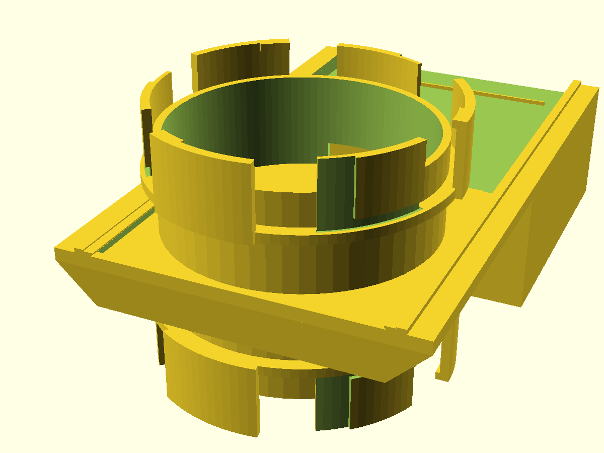
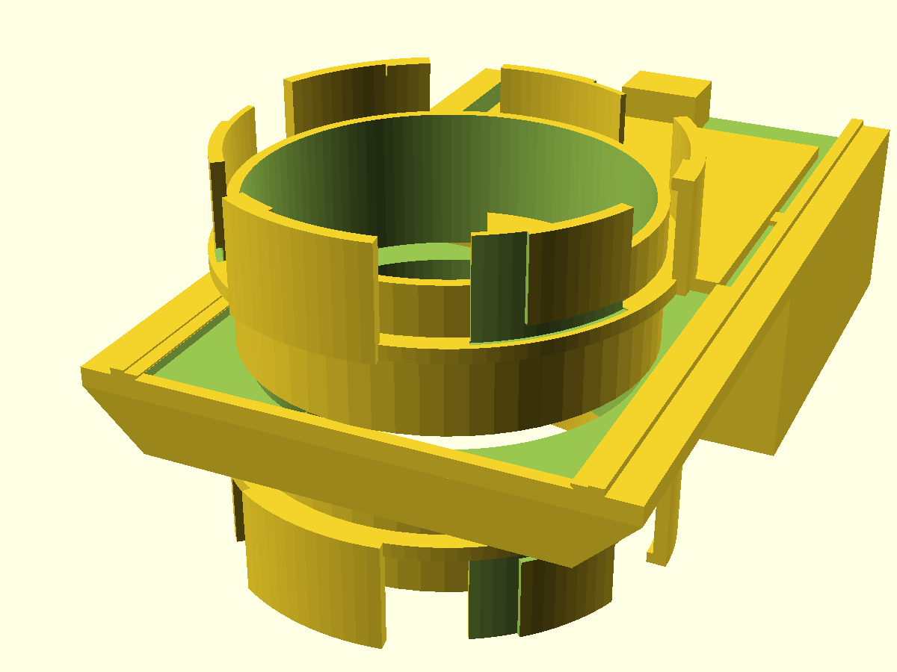
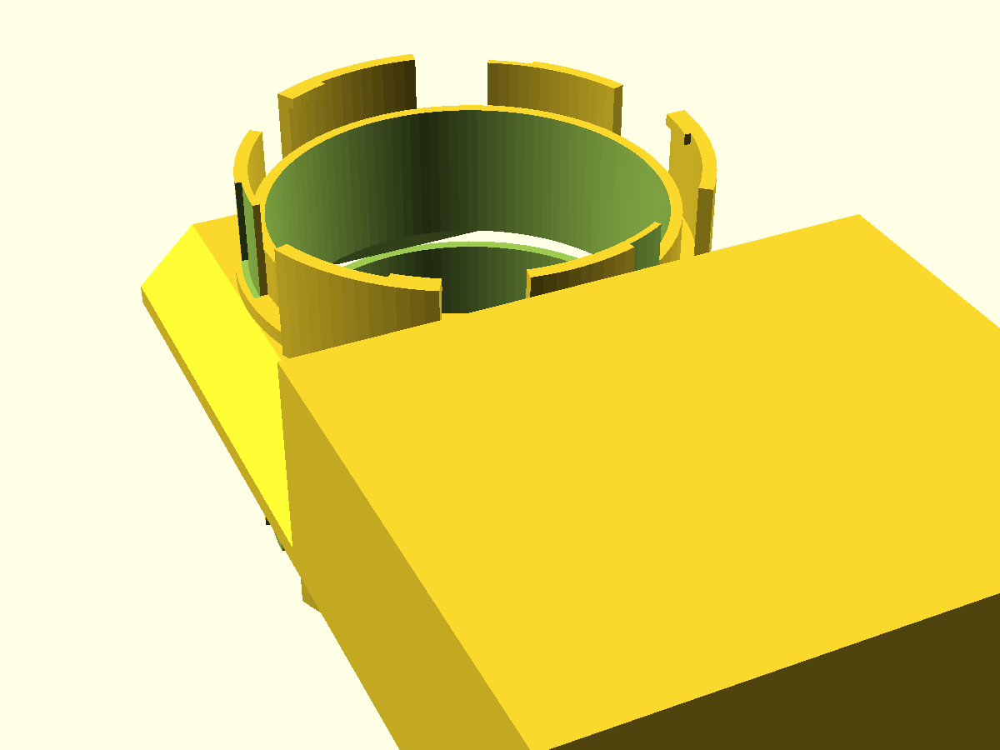

# NUGGS shutter valve

A drop-in **stop-gate** for an 80 mm-bore NUGGS hamster-tube run. It is a short
straight section carrying the genderless quarter-turn NUGGS port on each end, with
a **captive print-in-place shutter** that slides across the bore to seal a run —
so you can keep an animal off part of a tube network without taking anything
apart — and retracts **fully clear** of the bore to reopen it. Human-operated by
a pull-handle above the tube; the animal can't work it. It clicks into every
other NUGGS module (straights, elbows, the bin bridge), because it inherits the
NUGGS coupling standard unchanged.

## How it works

The shutter is a flat plate riding on a continuous captive lip (built from the
`print-in-place` library's battleship-tuned, rattle-free clearances). Slide it in
and it covers the whole 80 mm bore; slide it out and it parks in an open-topped
pocket, leaving the bore continuous and smooth — no interior ledge or step for the
animal, which is a NUGGS welfare non-negotiable.

It prints as **one piece, gate captive**, in the pose below: tube vertical on its
port tips, the shutter parked open over its support pedestal so it prints as a
trivial 0.6 mm bridge onto solid material. Snap it closed after printing.

## Print settings

- **Print this first:** `nuggs-shutter-valve-coupon.scad` — a small fixture
  (~100 × 50 × 9 mm, minutes to print) that reproduces the slide fit. Tune the
  gate until it slides **freely but without rattling** before committing to the
  full valve. See `NOTES.md → Print this first`.
- **Orientation:** as modelled — tube vertical, standing on the bottom port's
  sector tips and the pedestal base. No support material needed; the 45° skirt
  and the pedestal carry the wide drawer.
- **Material / nozzle:** PLA or PETG, 0.4 mm nozzle. Wall 2.4 mm = 6 perimeters.
- **Layer height:** 0.2 mm (the 0.6 mm print gap under the gate is 3 layers).
- **Supports:** none.
- **Bed:** fits Bambu P2S (256 mm) and H2C; module footprint ≈ 114 × 195 mm.
- **After printing:** free the captive gate with a gentle slide, then work it
  closed/open a few times to seat the fit.
- **Heads-up:** it is a large, long print (the full-bore gate + its support
  pedestal). That is inherent to a full-bore sideways gate printed tube-up.

## Parameters

Everything in the `[The NUGGS standard]` group is inherited from `nuggs_cfg()` and
should not be changed — altering a coupling number means it no longer mates with
other NUGGS modules. The tunable parameters:

| Parameter | Default | What it does |
|---|---|---|
| `door_fit` | 0.0 mm | The one slide clearance you may tune (on the coupon), + = looser, −0.2…0.5. The rail clearances stay the library's — do not loosen them. |
| `gate_t` | 3.0 mm | Shutter plate thickness. |
| `gate_over` | 3.0 mm | How far the plate overreaches the bore edge, so it seals with margin. |
| `lead_in` | 30 mm | Straight full-round shell behind each port (grip + port backing). |
| `detent_h` | 0.4 mm | Height of the light click that holds the gate open/closed. |
| `port_tol` | 0.30 mm | NUGGS coupling clearance — owned by the standard; tuned on the base `nuggs` coupon, not here. |
| `open` | 0 | Preview only: gate position, 0 = closed, 1 = open. The printable part always renders open. |

Render previews with `./scripts/render.sh nuggs-shutter-valve --previews`; gate it
with `./scripts/gate.sh --slice nuggs-shutter-valve`.
