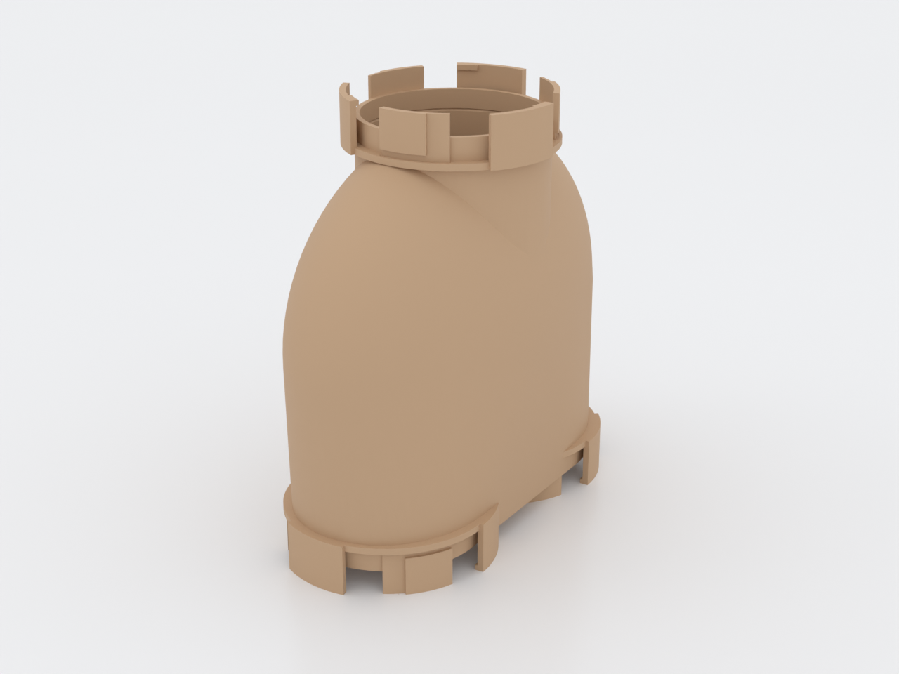
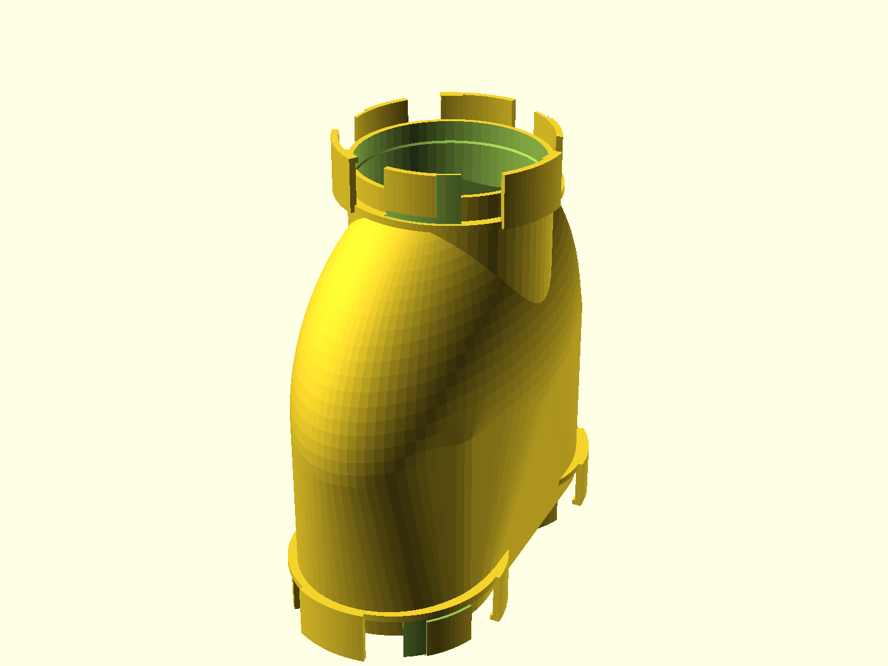

# N.U.G.G.S. Turnaround Tee

The **through-and-back** node for the N.U.G.G.S. hamster-tunnel system: the
[turnaround](../nuggs-turnaround/README.md) with a **third port on the crown**.
Enter low, leave low and doubled back — or go **straight over the top**: the
crown port is anti-parallel to the two bed ports, so a run can pass through
this node end-to-end without turning at all, or take any pairing of the three
mouths. Same Ø80 mm bore, same genderless quarter-turn coupling, same
revision — it mates with every module the two-port node does, and adds the
one thing a layout always runs out of: **a corner that isn't a dead end and
isn't a switchback either.**

> **Work in progress — nothing in this system has been printed yet.** The node
> passes `gate.sh --slice` (printcheck + a real test-slice, support-free), but
> `port_tol = 0.30` is an untested guess inherited from the shared standard.
> **Print the coupon first** (see Assembly & use) and expect to tune it.

## What this is, relative to the turnaround

This is a **derivative** of the two-port
[`nuggs-turnaround`](../nuggs-turnaround/README.md) (lineage in
[`derives.conf`](derives.conf)); everything the parent's page documents — the
dish-not-a-floor, the vents, the coupling, the welfare rules — is inherited
unchanged and documented there, once. The delta is exactly three things:

1. **A third port (C) on the chamber crown**, mouth up in the print pose,
   anti-parallel to the bed ports. Its axis sits 3 mm off the chamber centre
   toward the dish floor — not for looks: the through-route hands off from
   the dish onto port C's flat bore floor at **13.9°**, inside the 15°
   welfare ceiling (on-centre it would grade 19°, illegal).
2. **The chamber is 6 mm flatter** (z semi-axis 84 mm, parent 90), so the
   crown port's ring and sectors still fit the 256 mm build class this family
   gates on — the whole node is **197 mm tall** as it prints. The clear
   internal width — the number that makes the chamber a legal run *break*
   under the welfare rules — is untouched at **200 mm**.
3. **A repaired crown.** The parent's chamber roof has a known defect (a
   through-slot where its vault outruns the dome — issue
   [#499](https://github.com/shaiss/print-bench/issues/499)); the tee cannot
   inherit it, because port C's collar would open
   into open air. The tee closes the same crown with the vault **plus a hip**:
   two extra roof planes descending across the chamber, so every ceiling
   surface is steep enough to print support-free and the shell keeps ≥ 2.7 mm
   over the cavity everywhere. Asserted by sampling in the `.scad`, not
   eyeballed.

## What you get

- `turnaround` — the node (≈ 101 × 206 × 197 mm at defaults): an oblate
  chamber over a solid web, two Ø80 mm ports on the underside, the third on
  the crown, six ceiling vents.
- `coupon` — the standard NUGGS port stub (~21 mm, ~2 h to print) for tuning
  the joint fit before you commit ~20 h of printing. Port C is the same port
  rigidly rotated, so one coupon covers all three mouths.

The bed-port faces are in the contact sheet's bottom-iso quadrant; the crown
port and the through-route are in the sections below.

## The two routes the shape is doing

- **The switchback (inherited).** Enter port A, step ~1 mm *down* onto the
  dish, cross, pivot in the 200 mm bowl, leave port B. Grade peaks at 14.6°,
  and eases to flat at the bottom of the bowl.
- **The through-route (new).** Enter port A, cross to the bowl, climb the
  far side of the dish — the grade *falls* as you climb, from 14.6° to
  **13.9°** at the handoff — and step onto port C's flat bore floor, which
  runs straight up and out the crown. No lip in either direction: the dish
  floor only ever widens onto the bore floor.

Both routes are proven the same way the parent proves its one: a Ø60 animal
envelope swept along every route must stay inside the part's own material
(`path-clear` renders zero facets; a deliberately shifted control must
interfere — the check is demonstrated able to fail).

## Print settings

- **Material:** PLA if it lives at room temperature; PETG for a node that
  will be scrubbed or run warm.
- **Layer height:** 0.2 mm.
- **Infill:** 15–20 % is plenty; the shell does the work.
- **Seam:** Back (or scarf) — same setting for the coupon and the node; stock
  Aligned stacks a ridge on the port collar that reads as `port_tol` too
  tight.
- **Supports:** **none needed.** The two bed ports print down on their sector
  tips exactly as the parent's do, the crown port prints mouth-up with its
  collar on the dome, and the repaired roof keeps every enclosed ceiling at
  or steeper than the coupling's proven 45° class. Keep auto-supports **off**
  even if your slicer offers them: anything it builds inside the chamber is
  unreachable through six Ø9 mm vents.
- **Orientation:** as modelled — bed ports down, crown port up. Do not rotate
  it.
- **Brim:** off. Only the bed ports' sector tips touch the bed; the first
  ~50 layers print as twelve small islands that merge at the port plane —
  expected, not a fault, and a brim would weld across the mating feet.
- **Heads up:** **197 mm tall** — check your Z before you start. It fits the
  256×256×256 class this family gates on, but it is a big print: CI's
  test-slice reports ~20 h and ~300 g at 0.2 mm (the coupon is ~2 h).

## Parameters

The handful most worth tuning; the rest are grouped in the Customizer sections
at the top of [`nuggs-turnaround-tee.scad`](nuggs-turnaround-tee.scad).

| Parameter | Default | What it does |
|---|---|---|
| `port_tol` | 0.30 mm | The one fit knob for the quarter-turn joint. Tune on the coupon in ±0.05 steps. |
| `port_c_x` | 3.0 mm | Crown-port axis offset toward the dish floor. Sets the through-route's handoff grade (13.9° at +3; 19.0° and illegal at 0). |
| `port_c_face` | 177 mm | Crown-port face height — sets the node's total print height (197 mm at defaults; 199 is the gate's test-slice ceiling). |
| `tee_az` | 84 mm | Chamber half-height. Pairs with `tee_zc` (= `tee_az` + wall, the pole-flush belly rule). |
| `hip_deg` | 46° | Slope of the repaired roof's cross-planes. Just past the 45° supportless ceiling. |
| `bore_d` | 80 mm | Internal bore — the shared NUGGS headline number. |
| `chamber_ay` | 100 mm | Chamber half-width along the turn axis — the clear internal width is 2× this (200 mm at defaults). |
| `max_incline_deg` | 15° | The welfare ceiling on route grade. Both routes' grade asserts key on it. |
| `n_vent` / `vent_d` | 6 / 9 mm | Ceiling vent count and diameter. |
| `wall` | 2.4 mm | Shell thickness — about six perimeters at a stock 0.42 line width. |

Override on the command line with, e.g., `-D 'port_c_x=5'`. Every dimension
above is enforced by an `assert` in the `.scad` — including the two the
parent lacked: a sampled minimum roof-shell check and a sampled every-governing-
surface-≥45° check, both held over a grid rather than at the section plane
alone.

## Assembly & use

1. **Print the coupon first** (`nuggs-turnaround-tee-coupon.scad`, ~21 mm
   stub) — in the same material as the node. Mate two of them (or one to any
   NUGGS module): it must insert to the collar face and lock with a light
   quarter turn — firm, no rattle, no forcing. Forcing loose → raise
   `port_tol` +0.05; will not lock → lower 0.05. If it inserts but the
   quarter-turn grinds near the lock, deburr the sector tips' first layer
   with a blade before touching `port_tol` — or set Elephant foot
   compensation to 0.2 mm for the coupon and the node.
2. **Print the node** bed-ports-down, no supports, no brim.
3. **Fit it** one port at a time — push together, twist a quarter turn
   whichever way. With three mouths there are three pairings; the crown port
   couples exactly like the others (it is the same port rigidly reoriented —
   quarter-turn either way, no handedness to match).
4. **Place it** where the run needs both a corner and a way through: the
   crown port takes a riser, a shelf hop-up, or a second storey; the bed
   ports take the switchback. In use the node stands 197 mm along the riser
   and 206 mm across the run. Bedding will collect in the dish — strip it at
   the weekly clean (the vents' no-purchase argument assumes the ceiling
   stays a full standing reach away), and hand-wash only, lukewarm (≤ 50 °C),
   never the dishwasher: heat deforms the shell, and a deformed tube is a
   *narrowed* tube — the material failure mode is the injury failure mode
   (family charter N7).
