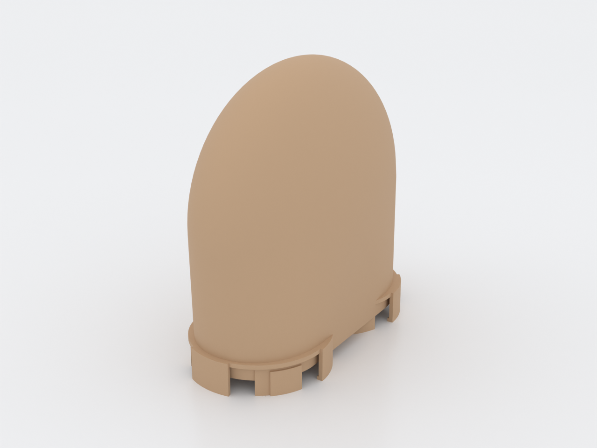
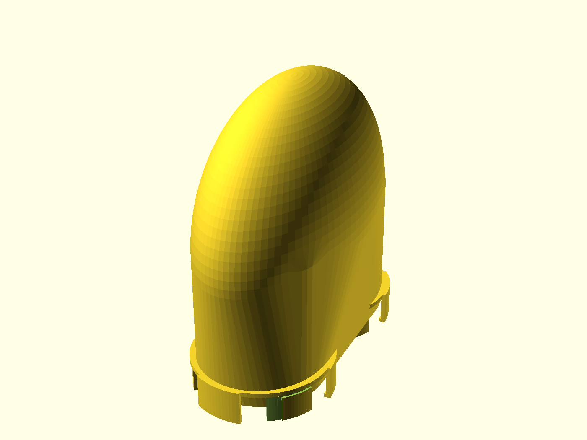
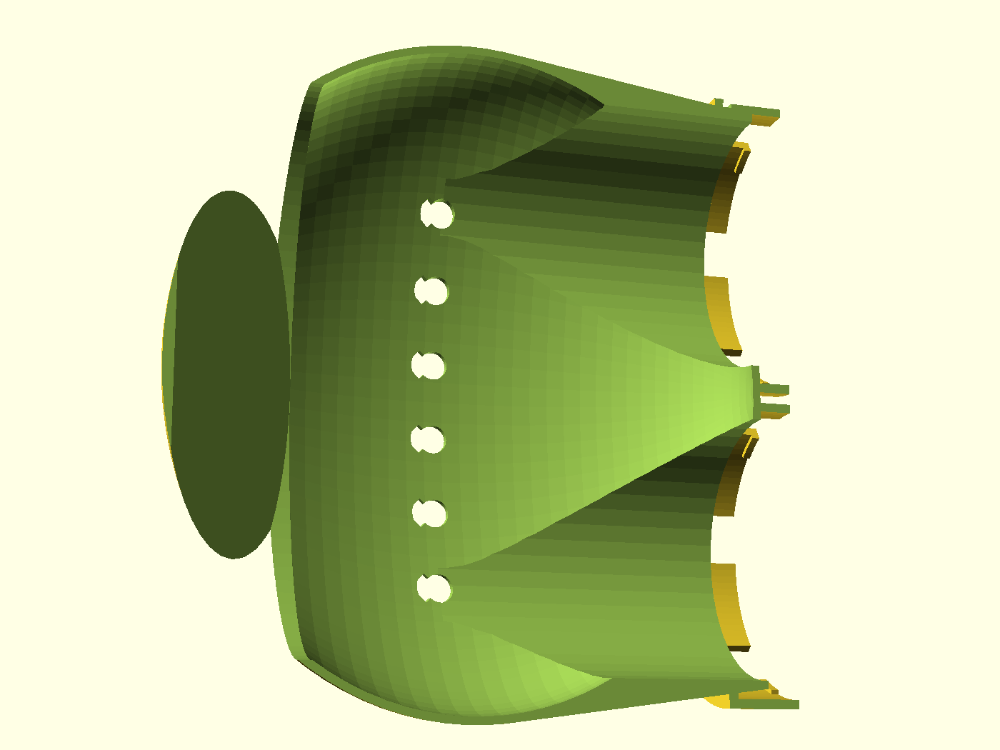
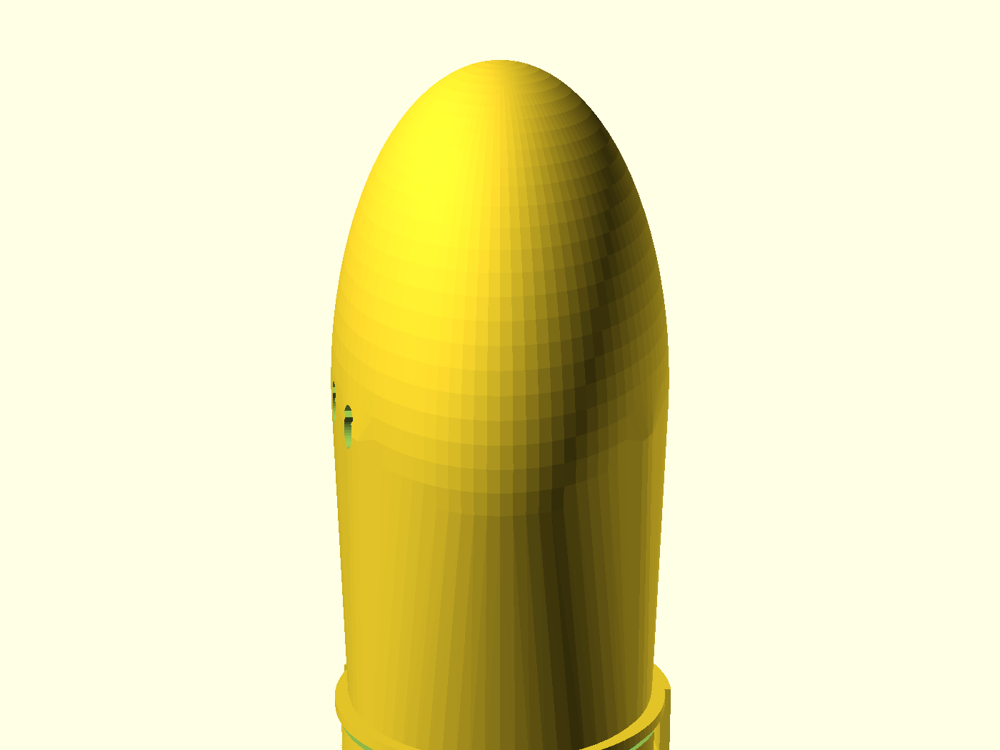
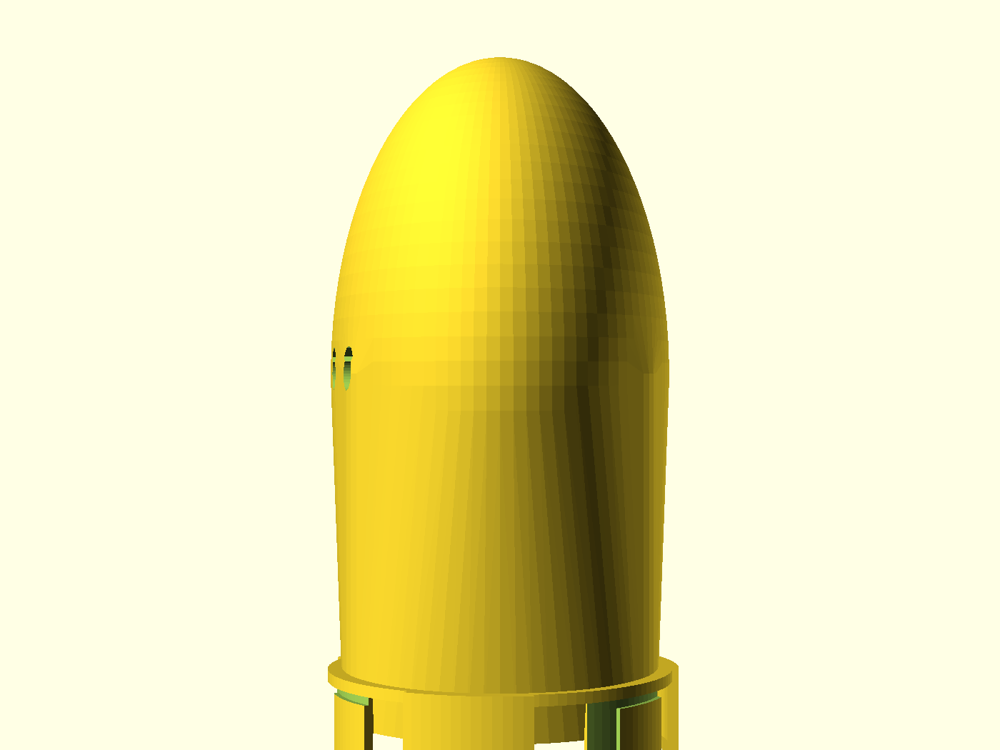

# N.U.G.G.S. Turnaround Node

The **run-resetter** for the N.U.G.G.S. hamster-tunnel system: a widened
chamber carrying the standard genderless quarter-turn port on **two faces**, so
an adult Syrian can enter one port, pivot 180° on a shallow dish, and leave the
other — doubling a run back on itself. This is the module that makes layouts
larger than one straight tube legal: the welfare rule caps any continuously
enclosed run at two body lengths between *breaks*, and a chamber this wide that
is itself open to ventilated air is one of only three breaks.

> **Work in progress — nothing in this system has been printed yet.** The node
> passes `gate.sh --slice` (printcheck + a real test-slice, support-free), but
> `port_tol = 0.30` is an untested guess inherited from the shared standard.
> **Print the coupon first** (see Assembly & use) and expect to tune it.

## Where a turnaround belongs

It is the counterpart of the [den](../nuggs-den/README.md), and the opposite
job: the den is a dead-end **refuge** (too narrow to turn in, does *not* reset
the run count); this is a **pass-through** wide enough to turn in, which does.
Put it wherever a run has to double back — along a wall, at the end of a
shelf-line, in the middle of a loop. The two ports are parallel and 97 mm
apart, so the modules mating them leave side by side; that spacing is derived
(`≥ 2 × port radius`) so two mating modules never collide. The full rule and
its source live in [`designs/nuggs/PM.md`](../nuggs/PM.md) (N2) and
[`docs/nuggs-research.md`](../../docs/nuggs-research.md).

## What you get

- `turnaround` — the node (≈ 99 × 205 × 195 mm at defaults): an oblate chamber
  over a solid web, two Ø80 mm ports on the underside, six ceiling vents.
- `coupon` — the standard NUGGS port stub (~21 mm, ~2 h 17 m to print) for
  tuning the joint fit before you commit ~21 h of printing.

## The three things the shape is doing

- **A dish, not a floor.** The chamber floor is the widened bowl's own curve,
  and it meets each bore mouth ~1 mm *below* the bore floor — the route steps
  down, never onto a lip. The grade across the dish peaks at **14.6°**, inside
  the welfare ceiling of 15°, and eases to flat at the bottom of the bowl.
- **A vault, not a dome.** An enclosed near-flat ceiling cannot print
  support-free, and a domed crown over a chamber this wide would be one. The
  chamber closes instead on a **barrel vault** — two roof planes at ~46°
  meeting at a ridge — every surface self-supporting by construction. That
  took the printcheck overhang figure from 9% to 2% of surface.
- **Vents where the air is.** Six Ø9 mm teardrop vents on the use-ceiling,
  the same count and size the den's chimney derivation gives, over ~2.4× the
  air volume with the same one-animal occupancy. Open to ventilated space is
  what makes the chamber a *legal* run break, not just a wide room; the
  teardrop profile prints support-free and gives a gnawing incisor no purchase.

## Print settings

- **Material:** PLA or PETG; PETG if the run lives in a warm room.
- **Layer height:** 0.2 mm.
- **Infill:** 15–20 % is plenty; the shell does the work.
- **Supports:** **none needed.** Ports down on their sector tips, the bore
  ceilings close at the coupling's proven 45° class, the web is a 12 mm
  anchored bridge, the belly dome is pole-flush on the bed, and the crown is
  the vault above. The whole part is support-free as modelled.
- **Orientation:** as modelled — both ports down, sector tips on the bed, the
  chamber up. Do not rotate it.
- **Brim:** optional; the sector tips and web give ~150 cm² of contact.
- **Heads up:** ~195 mm tall — check your Z. It fits the 256×256×256 class
  this family gates on, but it is a big print: CI's test-slice reports
  **~21 h and ~300 g** at 0.2 mm (the coupon is ~2 h 17 m).

## Parameters

The handful most worth tuning; the rest are grouped in the Customizer sections
at the top of [`nuggs-turnaround.scad`](nuggs-turnaround.scad).

| Parameter | Default | What it does |
|---|---|---|
| `port_tol` | 0.30 mm | The one fit knob for the quarter-turn joint. Tune on the coupon in ±0.05 steps. |
| `bore_d` | 80 mm | Internal bore — the shared NUGGS headline number. |
| `body_len_mm` | 180 mm | The animal's body length. The clear-width assert keys on it: the chamber must stay at least this wide inside. |
| `chamber_ay` | 100 mm | Chamber half-width along the turn axis — the clear internal width is 2× this (200 mm at defaults). |
| `chamber_ax` | 47 mm | Chamber half-width across the route — sets the dish the animal crosses and the bore-mouth handoff. |
| `max_incline_deg` | 15° | The welfare ceiling on route grade. The dish-grade assert keys on it (14.6° at defaults). |
| `n_vent` / `vent_d` | 6 / 9 mm | Ceiling vent count and diameter. |
| `wall` | 2.4 mm | Shell thickness — exactly 3 perimeters at a 0.4 mm nozzle. |

Override on the command line with, e.g., `-D 'port_tol=0.35'`. Every dimension
above is enforced by an `assert` in the `.scad`, so a value that breaks the
welfare geometry fails the render instead of shipping.

## Assembly & use

1. **Print the coupon first** (`nuggs-turnaround-coupon.scad`, ~21 mm stub).
   Mate it with a printed port from any other NUGGS module — it must insert to
   the collar face and lock with a light quarter turn: firm, no rattle, no
   forcing. Forcing loose → raise `port_tol` +0.05; will not lock → lower 0.05.
2. **Print the node** ports-down, no supports, optional brim.
3. **Fit it** between any two NUGGS faces: push together, twist a quarter turn
   either way, on both ports.
4. **Place it** where the run doubles back. The animal enters, climbs the
   ~1 mm step *down* onto the dish, crosses, pivots in the 200 mm-wide bowl,
   and leaves the second port. Bedding will collect in the dish; that is fine —
   it is a pass-through, not a refuge, and the den is the module that wants the
   bedding.
