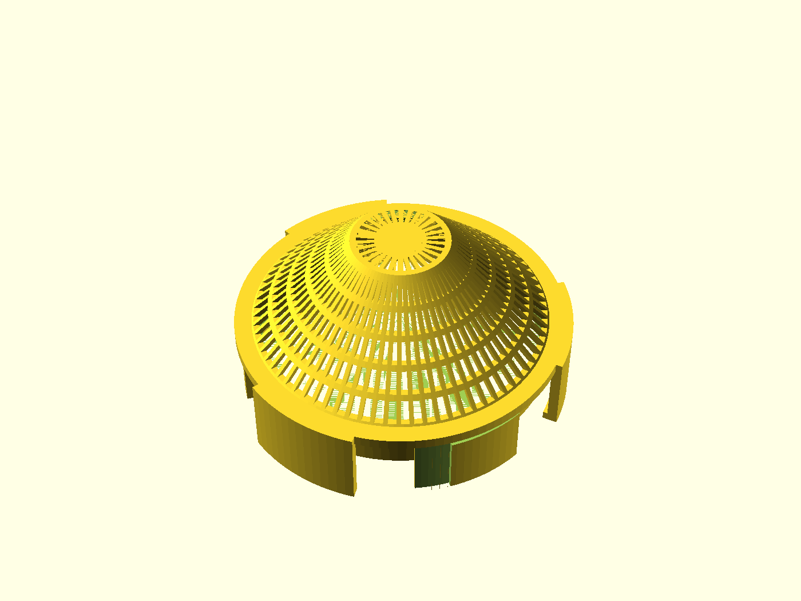
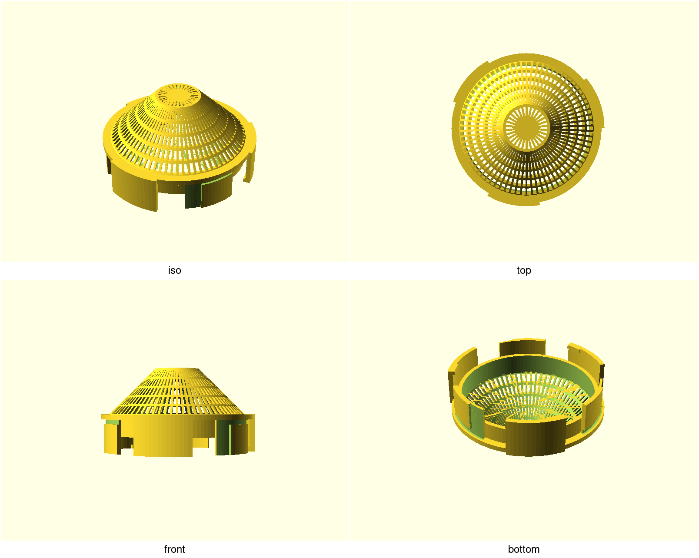
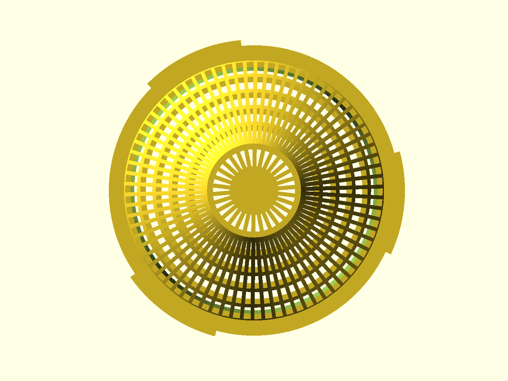
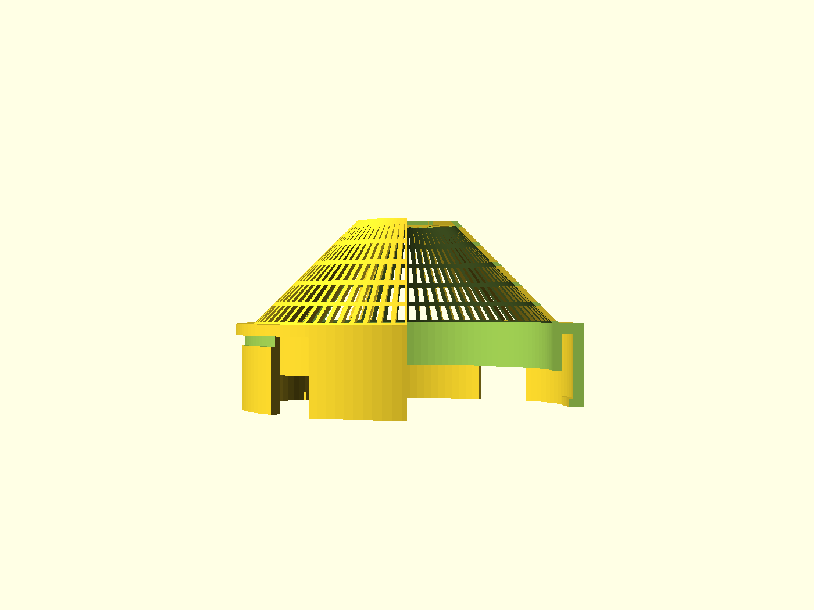

# NUGGS vent cap

The breathing end-cap: the standard NUGGS quarter-turn port closed by a
support-free **lattice dome**. Air and light pass, bedding stays in, the
animal cannot get out — an enclosed run end that doesn't seal the system dead.
Prints upright with no supports, clicks into any existing NUGGS module, and
tunes its whole welfare envelope with two numbers.

## What you get

- `vent-cap` — the lattice cap. **Ø94.9 mm** across the coupling ring, **51 mm**
  tip-to-crown (41 mm of that above the port face), 80 mm bore. ~30 g in PETG
  at 15 % infill (slice-measured).
- `vent-cap-solid` — the closed variant (`lattice=false`): the same 45° cone
  run to a solid tip, **65 mm** tall. Maximum light block-out, minimum airflow.
- `coupon` — the print-this-first plate: a port stub to tune `port_tol` with,
  beside a flat gauge of the dome's own cell. See the README in
  [`NOTES.md`](NOTES.md) for the tuning steps.

The cap is one printed part. Its port face is every `nuggs_cfg()` default, so
it mates with the straight, the elbow, the den, the turnaround — any module on
the standard.

## Print settings

- **Material:** PETG (gnaw-durable); PLA fine for a calm cage
- **Layer height:** 0.2 mm
- **Infill:** 10–15 % grid, guides only — the lattice is the structure
- **Supports:** **none** — the dome is a 45° lattice cone by design; every
  strand underside is a sub-5 mm bridge, and the crown disc bridges its own
  ~10 mm spokes
- **Orientation:** as modeled — port axis vertical, standing on the coupling's
  sector tips
- **Brim:** none; the sector tips are the family's standard bed contact

## Parameters

| Parameter | Default | What it does |
|---|---|---|
| `aperture_max` | 6.0 mm | Largest passage through the lattice — the welfare number. The ¼″ hardware-cloth ceiling for a Syrian; **dwarf keepers: 5.0**. An assert refuses anything over 6.0. |
| `strand_w` | 1.2 mm | Lattice strand width — three perimeters at a 0.4 mm nozzle. Raise to 1.6 if your printer under-extrudes thin strands. |
| `dome_rise` | 28.0 mm | Dome height above the port zone. The length-vs-bridge trade: lower = shorter cap, bigger crown bridge. |
| `port_tol` | 0.30 mm | The fit knob. **Unmeasured** — tune on the coupon in ±0.05 steps before printing the cap. |
| `lattice` | true | false = the solid variant (`vent-cap-solid`): blocked, taller. |
| `bore_d`, `wall`, … | 80 / 2.4 | The NUGGS standard, at `nuggs_cfg()` defaults. Changing these un-mates the cap from every module you already printed. |

All parameters are at the top of [`nuggs-vent-cap.scad`](nuggs-vent-cap.scad),
grouped in Customizer sections; override on the command line with
`-D 'aperture_max=5'`.

## Use & care

- **Fit:** push onto any NUGGS port face and twist a quarter turn. It should
  click firm with no rock — if not, tune `port_tol` on the coupon first
  (0.30 is the standard's default and has never been measured on a printer).
- **Clocking:** any quarter-turn position seats; the port is genderless like
  the rest of the system.
- **Condensation:** a breathing cap still traps humid air at the dome's crown.
  In humid rooms, pull and dry the cap weekly, and keep bedding off the dome's
  underside.
- **Airflow:** the lattice holds ≥ 30 % open area by construction. If a keeper
  reports stuffiness, the lever is `aperture_max` (within the welfare ceiling)
  — never thinner strands.
- **Filtration:** this is a vent, not a dust filter. Fine particulate
  filtration is out of scope by design.
- **No hardware:** nothing to buy — no mesh, no screws, no glue.

## Design notes

The dome's shape is forced by an integral, not a taste call: support-free
surfaces climb at most 45°, so a *continuous* closure of an 80 mm bore needs
≥ 40 mm of rise — more than the cap-length budget holds. The lattice cone
spends its 28 mm of rise closing 28 mm of radius and hands the last 12 mm to a
bridged crown disc. The full derivation, the welfare numbers and the
decisions log live in [`NOTES.md`](NOTES.md).
