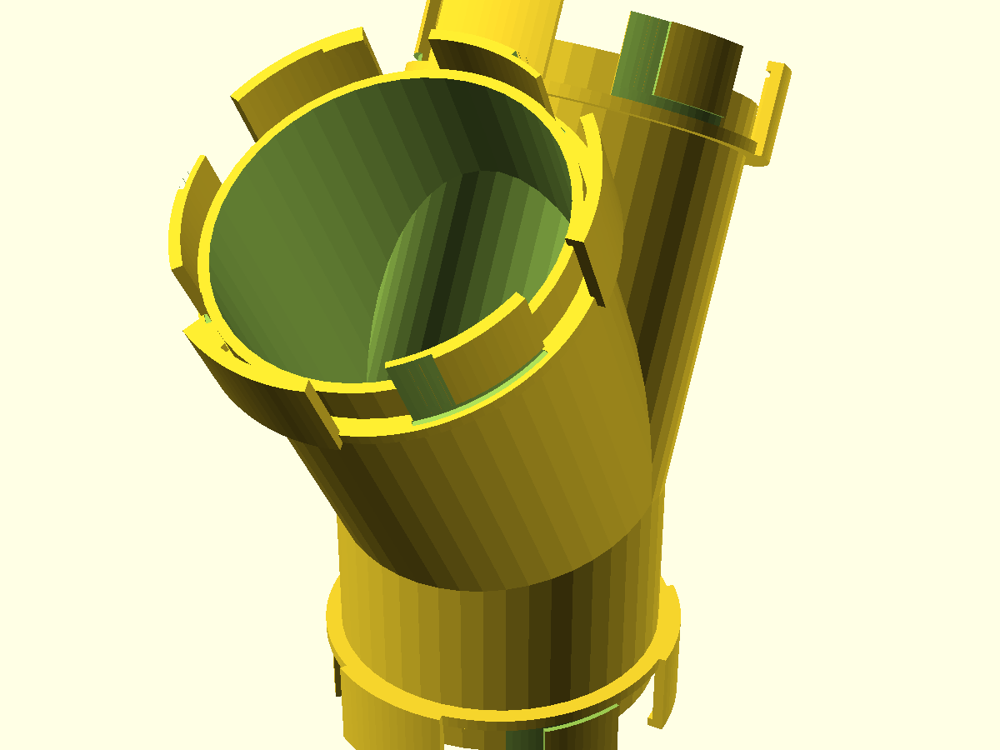
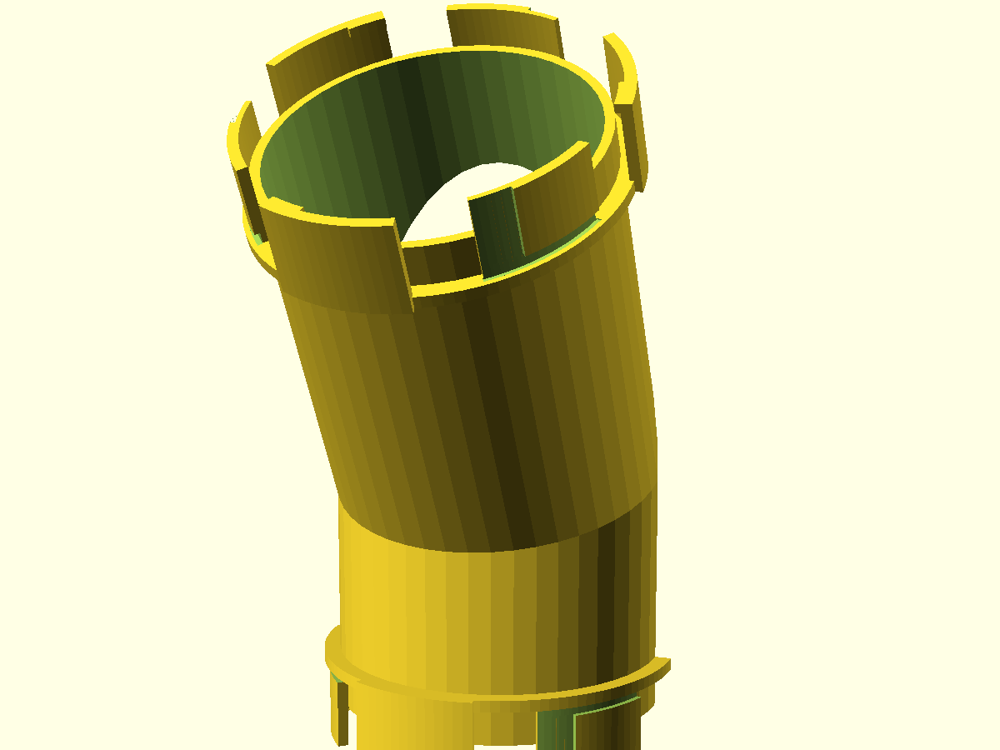

# nuggs-y-splitter

The branch the **N.U.G.G.S.** run was missing: a Y-junction that splits one
80 mm-bore hamster-tunnel path into two. One inlet port, two symmetric outlets
at a 60° included angle, and all three faces carry the standard genderless
quarter-turn NUGGS port — so both branches drop into any existing run of
straights, elbows and bulkheads, and twist shut a quarter turn either way.
The bore stays a continuous, smooth 80 mm passage *through the fork*: a NUGGS
welfare non-negotiable, because a live animal travels this junction and any
interior ledge is a hazard.

Branching was the one topology the ecosystem could not do — every other NUGGS
module is a two-port single-path part. This is it.

## What you get

One printable part: a Y-shaped tube with a NUGGS port on every face, printed
as a single piece.

- `ysplit` — the Y-splitter (approx. 95 × 193 × 191 mm print-pose envelope;
  ~200 g at the slicer defaults below). Inherits every coupling dimension from
  the NUGGS standard (`lib/nuggs-coupling.scad`): 80 mm bore, 84.8 mm tube OD,
  96.8 mm coupling-ring OD.
- `nuggs-y-splitter-coupon.scad` — the print-this-first fit coupon (see Print
  settings).

The `cutaway` view (`-D part="cutaway"`) is a review preview, not a print.

## Print settings

The splitter prints **standing on its inlet port**, the same orientation as
the NUGGS straight and elbow — the three coupling-sector tips are the bed
contact, the bore vertical at the inlet, both branches rising at 30°.

- **Material:** PLA or PETG.
- **Layer height:** 0.2 mm.
- **Infill:** 15–20 % (walls carry the load; the tube is 2.4 mm / 6 perimeters).
- **Supports:** none — by construction, not by luck. Every junction surface
  stands 30° from vertical, under the ~45° supportless ceiling a
  vertically-printed enclosed bore allows; measured off the exported mesh,
  **zero** interior-bore surface needs support. What overhang printcheck flags
  (3 %) is exterior: bed-side port faces and branch sector tips.
- **Orientation:** inlet port down, bore vertical at the inlet. printcheck
  confirms this is as good as any axis-aligned alternative.
- **Brim:** recommended. The part stands on three sector tips, so the
  first-layer contact patch is small (~527 mm²); a brim keeps it planted.
- **Print this first:** `nuggs-y-splitter-coupon.scad` — two production port
  stubs side by side. Mate them to each other (quarter-turn, firm click, no
  rattle) and caliper the bore: **under 79.0 mm means your printer is
  shrinking** — raise `port_tol` in ±0.05 steps on the coupon until the pair
  mates, then set the same value in the splitter before committing ~200 g of
  filament to the full print.
- **Bed:** the print-pose envelope is 95 × 193 × 191 mm. That is deliberately
  inside a 256 × 256 × 256 bed *and* under the 250 mm height a stock slicer
  profile enforces — raising `inlet_len` past ~64 mm pushes the part over that
  wall (asserted).

At the committed quality the part scores **76/100 — printable with caveats** in
`printcheck` (watertight, one body, no critical issues; the caveats are the 3 %
exterior overhang and the small bed-contact patch, both inherent and both
addressed above).

## Parameters

All parameters are at the top of `nuggs-y-splitter.scad`, grouped in Customizer
sections; override on the command line with `-D 'branch_half=25'`.

| Parameter | Default | What it does |
|---|---|---|
| `branch_half` | 30° | Each outlet's angle off the inlet axis (60° included fork). 30° keeps every junction surface supportless; the allowed 20–40° range is asserted. |
| `inlet_len` | 60 mm | Inlet axis length, fork centre to coupling face. Sized to the bed (see Print settings); the brief's assumed ~80 mm did not fit a 250 mm-tall profile. |
| `port_stub` | 16 mm | Straight full-round shell each port fuses to, past the coupling collar. |
| `bore_d` | 80 mm | Internal bore, the headline number. A NUGGS-standard value; asserted ≥ 70 mm (welfare floor). |
| `wall` | 2.4 mm | Tube shell thickness (6 perimeters at a 0.4 mm nozzle). |
| `port_tol` | 0.30 mm | The coupling fit clearance — owned by the NUGGS standard, tuned on the coupon, not re-tuned here. |

`branch_len` (the outlet arms) is **derived, not a knob**: it is pinned from
below by the assembly clearance — a mating module sliding onto one outlet
sweeps its sector tips past that face, and the other outlet's coupling ring has
to stay out of the sweep — so the arms are as short as coupling a neighbour
allows, never shorter. The coupling parameters (`lug_r`, `port_proj`, `n_lug`,
`lug_deg`, `twist_deg`, …) are the NUGGS standard defaults: **change them and
this splitter no longer mates with other NUGGS modules.** They are exposed for
the Customizer, not for tuning.

## Assembly & use

- **Into a run:** push any port onto any other NUGGS port and twist a quarter
  turn either way; the bayonet ribs seat. The joint is genderless, so
  orientation never has to be got right, and it is hand-releasable.
- **Branching:** the inlet goes where the run was; each outlet takes its own
  run of straights, elbows and endcaps. Both outlets clock independently, so
  the two paths can leave the fork in any two directions in the fork plane.
- **Welfare:** per the NUGGS charter a junction is **not** a break in an
  enclosed run — count both branches as continuously enclosed bore when you
  plan run lengths (see `designs/nuggs` and its NOTES.md for the run-length
  rule and its source). The fork interior only ever widens (a blend sphere
  swallows every cavity cap), so there is no lip anywhere a paw could catch.
