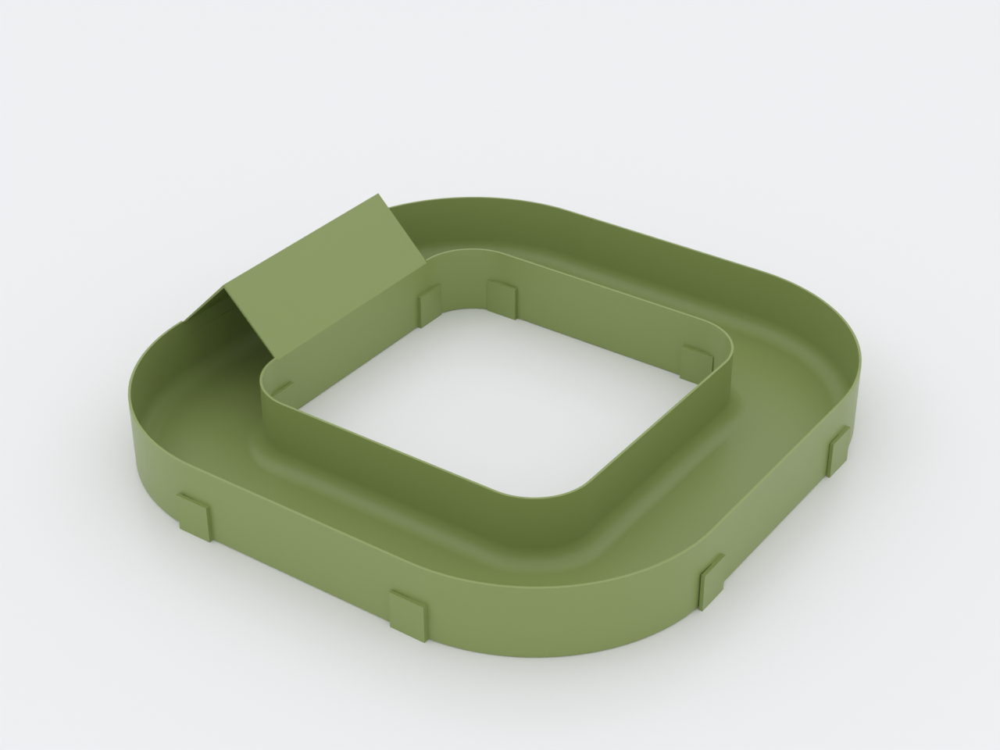
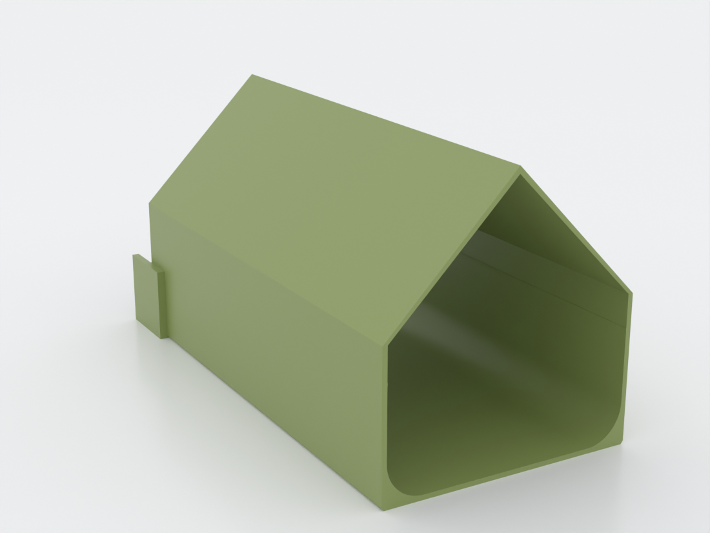

# N.U.G.G.S. Yard

> [!NOTE]
> **Archived at v0.1 (2026-08-07) — frozen, not actively maintained.** This
> design is retired from active CI to save render cycles. To improve it, fork
> the repo, update it against current CI, and contribute it back as a
> derivative per the repo's [lineage tracking](../../docs/derivative-designs.md)
> (see also [CLAUDE.md](../../CLAUDE.md) → "Archived designs"). It was frozen
> **before it was ever printed or physically validated** (see the work-in-progress
> note below), so its geometry is unproven — a revival should start there.

<!-- -->

> **Superseded joint — this kit does not interoperate with `nuggs` today.**
> As of 2026-08-03, N.U.G.G.S. is a system with **one** genderless
> interlock standard, and it is `nuggs`'s quarter-turn port. This design's
> gendered lap-skirt joint is superseded by it: a Yard module and a `nuggs`
> module will not mate, in either direction. A rebuild onto the shared port
> — as **open modules with a round arc floor**, not flat troughs — is
> planned as its own PR. Until it lands, treat the two kits as separate.
> The welfare length rule quoted below has also been re-attributed and
> re-scoped; the corrected version lives in
> [`designs/nuggs/PM.md`](../nuggs/PM.md) (N2) and
> [`docs/nuggs-research.md`](../../docs/nuggs-research.md) §11.

An **open-top playpen run** for an adult Syrian hamster: turns, branches, a
covered hide, and a closed circuit with no dead ends in it anywhere. It is a
kit of modules you lay out on the floor of a playpen during free-roam time —
not a tube system, and nothing goes in the cage.

> **Work in progress — nothing here has been printed yet.** All six parts
> pass `gate.sh --slice` at 100/100 and the covered segment's bore is
> measured on the exported mesh, not just asserted. What no one has checked
> is how the joint behaves in plastic: `joint_tol = 0.30` is a starting
> guess, so **print the coupon first**. Design request:
> [issue #73](https://github.com/shaiss/print-bench/issues/73).
> `NOTES.md` has the decisions and the open items.

## Why this one is open at the top

The sibling design [`nuggs`](../nuggs/) is an *enclosed* tunnel, and its
product page leads with an uncomfortable fact: the expert consensus (PLOS
One 2022 EXOPET-II; TVT Merkblatt 62) is that hamster tube systems **should
not exist**. They cannot be ventilated, they condense, they cannot be
cleaned, and a long tube is somewhere an animal can get stuck and cannot be
reached. Those objections are why `nuggs` is short and straight — and why it
refuses exactly the loops and branches this design is built from.

Take the roof off and most of those objections stop applying, because every
one of them is a consequence of enclosure:

| Objection to tube systems | An open-top run |
|---|---|
| Length limit — he cannot reverse, you cannot reach him | He steps out anywhere along it. So does your hand |
| Cannot be ventilated, condenses | Nothing encloses air |
| Cannot be cleaned | It is a trough. Lift a module out and wash it |
| Dead ends trap and stress | A **closed circuit** has no terminus at all |
| Eats cage floor and substrate | Lives in the playpen, not the cage. Zero substrate cost |

What does **not** change is anything about the animal's body. Wherever this
design puts a roof on — the refuge — the full 70 mm bore floor applies, and
the whole run is flat, because Syrians climb well but have almost no depth
perception and will walk off a raised edge.

**"Loop" here means a closed circuit, not a loop-the-loop.** Twists,
switchbacks, S-bends, spurs and figure-eights are all fine. A helix, a
spiral ramp or a vertical loop is refused by the model.

## What you get

Six parts from one `.scad`. Every module is 80 mm wide inside with a flat
floor, prints flat on the bed, and needs **no supports**.

| Part | Size (mm) | Filament | Time |
|---|---|---|---|
| `straight` | 172.0 × 88.6 × 48.6 | 62.11 g | 5h 14m |
| `curve90` | 124.3 × 133.6 × 48.6 | 49.49 g | 4h 18m |
| `curve45` | 97.1 × 98.0 × 48.6 | 26.65 g | 2h 27m |
| `wye` | 183.3 × 165.6 × 48.6 | 76.28 g | 6h 40m |
| `refuge` (covered) | 172.0 × 88.6 × 89.3 | 91.89 g | 7h 18m |
| `nuggs-yard-coupon` | 57.0 × 208.8 × 48.6 | 40.40 g | 3h 39m |

Masses and times are the gate's own PrusaSlicer test-slice at 0.2 mm /
0.4 nozzle, **PLA at 1.24 g/cm³**. PETG is about 2.4% heavier.

The **refuge** is the one covered part, and it is where the welfare numbers
bite. Its roof is a 45° gable rather than an arch so both slopes print
without support, and the measured inscribed circle through it is **70.75 mm**
— checked on the exported mesh at six stations along its length, not merely
asserted in the source.

A `wye` is the same 160 mm face-to-face as a `straight`, so it drops into
any layout in place of one.

## Suggested builds

Pick one to suit your spool. **Print the coupon (40 g) before any of them.**

| Build | Parts | Filament | Footprint |
|---|---|---|---|
| **Oval + branch** ⭐ | 4 × `curve90`, 1 × `wye`, 1 × `refuge` | **366 g** | ~406 × 246 mm |
| Oval circuit | 4 × `curve90`, 1 × `straight`, 1 × `refuge` | 352 g | ~406 × 246 mm |
| Square circuit | 4 × `curve90`, 3 × `straight`, 1 × `refuge` | 476 g | ~409 × 409 mm |
| Open S-run (no circuit) | 2 × `curve90`, 2 × `straight` | 223 g | fits anything |

Totals are summed from the gate's unrounded figures and then rounded once, so
adding up the rounded per-part masses above can land a gram out.

The starred build is the recommendation: it has the loop, the branch and the
hide, and lands at **407 g including the coupon**.

**Storing it.** There is no tunnel to find a home for: assembled, the starred
oval is flat and shelves as-is at about 406 × 246 mm (its footprint in the
builds table above) — a tabletop or closet top, not a bookshelf. Taken apart,
the six parts neither nest (identical walls can't interleave) nor stack, so a
loose pile wants *more* floor than the assembled oval, not less. So keep it
assembled — and carry it flat, a hand under each side or on a board, since the
lap joints lift apart by design.

**Shorter run, more stops.** The evidence base for hamster welfare
(Hauzenberger et al. 2006) puts substrate depth and foraging — not tunnel
length — at the centre of enrichment. A 2 m circuit of bare channel is a
corridor; a 1.2 m circuit with things to do on it is a foraging route. Scatter
feed along the run and stand a shallow ceramic dish of sand beside it. That
costs 0 g of filament and does more than another metre of channel.

## Print settings

- **Material:** PLA or PETG. PETG is the welfare-safer answer for the same
  reason as `nuggs` (its glass transition is well above any wash you would
  give it), PLA is cheaper and easier and changes `joint_tol` slightly.
- **Layer height:** 0.2 mm
- **Perimeters:** 4 (fills the 1.6 mm wall)
- **Infill:** 20%
- **Supports:** **none — for any part.** The steepest downward-facing
  surface in the whole kit is the refuge's 45° gable.
- **Orientation:** exactly as each part renders — flat on the bed; printcheck
  reports "current orientation is as good as any axis-aligned alternative"
  for all six.
- **Seam position:** put the Z-seam on a **back or outer wall** (or use a
  scarf/gradual seam). The skirts lap the *sidewalls*, so a seam blob left on
  that mating band is what makes a good-fit joint feel gritty — an aligned seam
  there reads as slop when the fit is fine.
- **Brim:** not needed. Every module has a full flat footprint (unlike the
  `nuggs` straight, which stands 160 mm tall on a 2.4 mm ring and does).
- **Plate:** a `straight` is 88.6 mm wide, so **two** fit side by side on a
  256 mm bed (three would need 266 mm). A 350 mm-class bed takes three.

**Cleaning:** hand wash, ≤ 50 °C, unscented mild dish soap, dry fully. Never
a dishwasher — the heated dry cycle exceeds even PETG, and a deformed
covered segment is a *narrowed* one.

## Parameters

| Parameter | Default | What it does |
|---|---|---|
| `joint_tol` | 0.30 mm | **The one fit knob.** Clearance between a skirt and the wall it laps. Tune on the coupon in ±0.05 steps |
| `inner_w` | 80 mm | Internal floor width. Asserted ≥ `min_run_width` |
| `min_run_width` | 80 mm | Welfare floor for the open run's width, and what `inner_w` is asserted against. Lower it and the guard moves with it |
| `side_h` | 47 mm | Sidewall height. **Set by the refuge, not the open run** — it is the smallest value at which a covered segment still clears the 70 mm bore floor. At 45 mm the refuge measures 69.1 mm and is non-compliant |
| `min_covered_bore` | 70 mm | Welfare floor for any covered segment. Never lower it |
| `body_len_mm` | 180 mm | Your animal's head-and-body length; caps `refuge_len` at 2× it |
| `straight_len` | 160 mm | Face-to-face module length; `wye_len` and `refuge_len` match it so modules interchange |
| `curve_r` | 80 mm | Curve centreline radius. Bigger sweeps are gentler and cost more |
| `wall` | 1.6 mm | Shell thickness; 4 perimeters at a 0.4 mm nozzle |
| `wye_junction` | 50 mm | Where the branch leaves the main run. Moving it forward thins the crotch — asserted |

All parameters are at the top of `nuggs-yard.scad`, grouped in Customizer
sections; override on the command line with `-D 'curve_r=100'`.

## Assembly & use

Modules simply sit on the pen floor. Each has **skirts at one end and a bare
end at the other**: slide a skirted end over the neighbour's bare end. Keep
every module facing the same way round the circuit and any module mates with
any other.

To take a module out — for cleaning, or because you want the layout
different — **lift it straight up**. The skirts wrap the sidewalls only and
never pass under the neighbour's floor, so nothing has to be slid along the
run to free one piece in the middle.

### Print this first

`nuggs-yard-coupon.scad` gives you two 45 mm stubs for 40 g. Mate them:

- **Rocks or falls off** → lower `joint_tol` by 0.05 and reprint.
- **Will not seat, or the skirt splays** → raise it by 0.05.

A proud **seam blob** on the lapped band can feel like a bad fit but isn't one —
move the seam to a back wall (see Print settings) before you touch `joint_tol`,
and judge the fit only once the seam is off the mating face.

Do not commit 92 g to a refuge before a stub mates cleanly.

### Layout rules the model cannot check for you

1. **No dead ends.** Close the circuit, or leave a spur ending in open
   channel he can turn around in and step out of. Never point a spur into a
   corner he can be cornered in.
2. **Keep it flat.** Do not prop, stack or ramp any module. The whole design
   assumes level ground.
3. **One covered segment per run, and keep it short.** The refuge is the only
   roofed part and it is sized to the 2 × body-length budget on its own.
   Coupling two refuges end to end doubles the enclosed length and breaks it.
4. **Supervised free-roam only.** This is playpen furniture, not housing.
