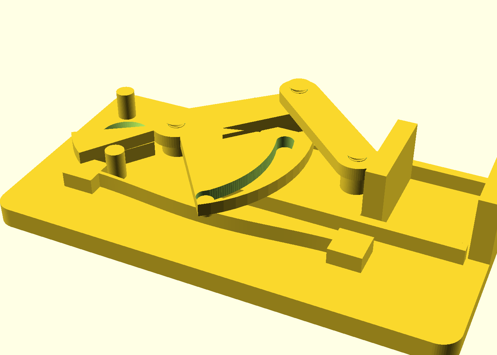
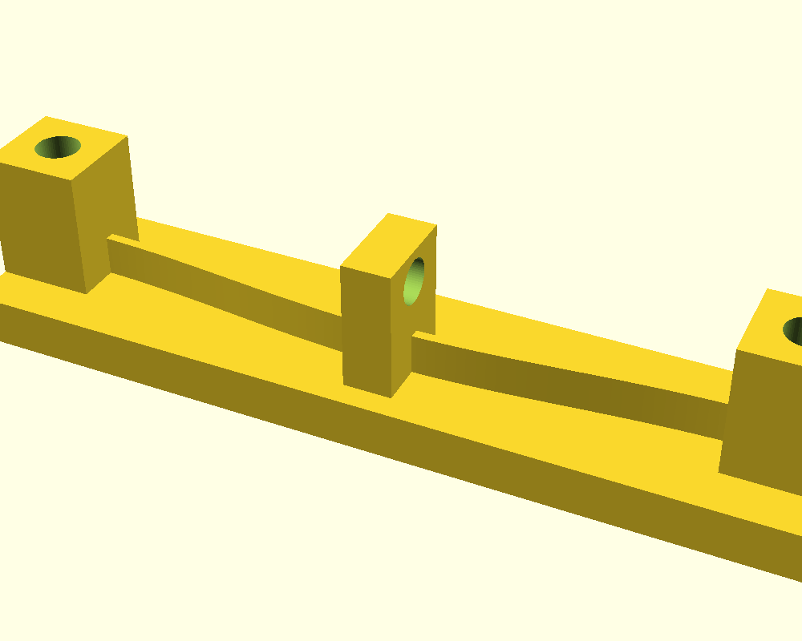
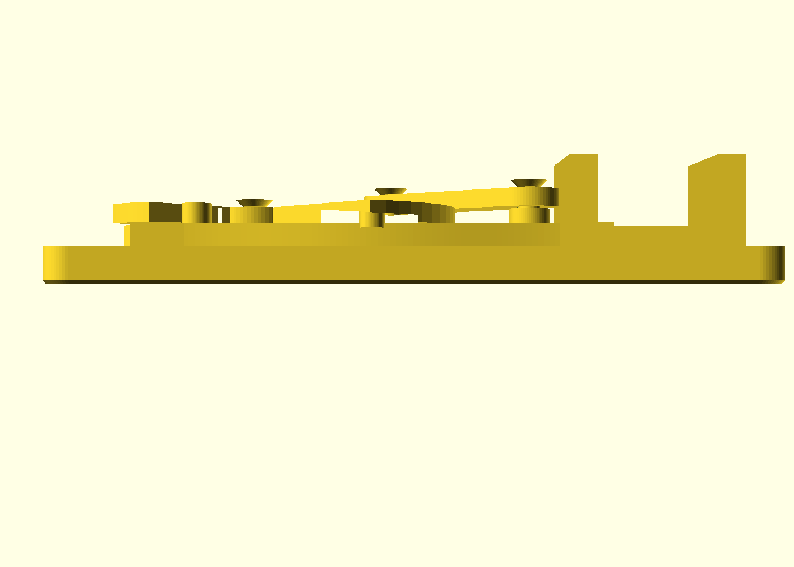
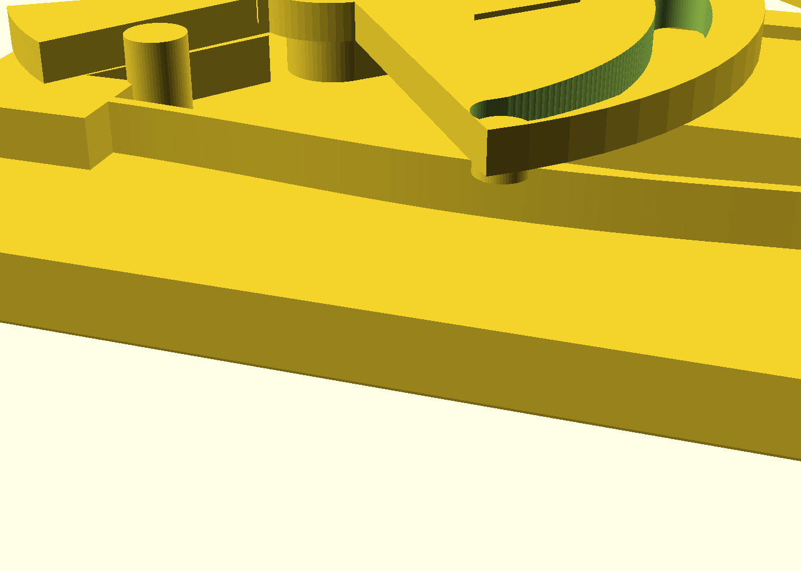

# Over-center toggle clamp

A print-in-place toggle clamp for bench-top workholding: squeeze the lever,
the jaw closes on your workpiece, the linkage crosses dead center and seats
on a hard stop — for stock in the locked band the workpiece's own reaction
then torques the lever *into* that stop, not out of it — and a buckled-beam
arch gives the toggle a positive snap in both directions. One PETG print,
four moving parts, zero assembly hardware, no supports.

**What "self-locking" honestly means here.** A fixed linkage locks a *band*
of thickness, not a whole range. Out of the box the over-center lock engages
for stock about **1.4–1.6 mm** thick (a 1.6 mm PCB is the design target);
from there up to **~6 mm** the arch spring holds the jaw closed — fine for a
soldering or filing session, but PETG creeps, so don't trust a spring-held
glue-up overnight; **above ~6 mm the lever will not stay closed**, and below
~0.8 mm (the dead-center gap) the jaws cannot touch the work at all. Other
stock is a parameter change, not a redesign: set `dead_center_gap` ≈ your
thickness − 0.5 mm and reprint — the `[over-center]` echo lines print the
locked band for whatever numbers you set.

## What you get

- `over-center-toggle-clamp` — the clamp, ~140 × 89 × 27 mm (the handle
  sweep sets the width; a plate tab rides under the printed-pose crank eye).
  Jaws open to **25 mm**, faces **30 mm** deep and **20 mm** tall; grips per
  the bands above; mounts with two M5 screws at 40 mm centres.
- `over-center-toggle-clamp-coupon` — print this first: the same production
  flexure in a test frame, ~103 × 24 × 22 mm, and the **force-measuring
  artifact** (see below).

## Print settings

- **Material:** PETG (PP works; do not use PLA — the flexure fatigues)
- **Layer height:** 0.2 mm (the Z clearances are two layers; coarser layers
  change the fit)
- **Infill:** 25 %, 3 perimeters
- **Seam:** scarf or random — never aligned: a stacked seam on the arch's
  tensile face is a fatigue notch, and an aligned seam can eat a 0.25 mm
  pivot film
- **Bridges:** 100 % bridge cooling. The ~40 mm link span sags by design
  into a 4.8 mm clearance — a hairy underside there is cosmetic. Textured
  PEI is kinder to the big first layer than smooth sheets.
- **Supports:** none — everything prints flat as rendered; the moving parts
  ride 0.4 mm films (the lever band prints its first layer as a film over
  sacrificial shelves, the rail tops and the arch)
- **Orientation:** exactly as rendered (plate down, lever open) — the flexure
  must bend across printed roads, which the flat pose guarantees
- **Before the real print:** run the coupon. It proves two things — your
  arch's snap force (hang ~1.1 kg on the tab) and your flow calibration. It
  contains no films, so it does *not* prove the clamp's joints print free;
  the fuse gate proves that for the design geometry, and your coupon-proven
  calibration covers the rest. A dead clamp costs ~5 h and ~61 g of PETG;
  the coupon costs ~1 h 45 m and ~16 g — about a third of the time and a
  quarter of the filament to know your snap and flow before you bet the
  evening.

## Parameters

| Parameter | Default | What it does |
|---|---|---|
| `jaw_gap_max` | 25 mm | Jaw opening at the printed pose |
| `jaw_depth` | 30 mm | Gripping depth of the jaw faces |
| `jaw_height` | 20 mm | Jaw face height above the base plate |
| `dead_center_gap` | 0.8 mm | Jaw gap left at dead center — the locked-band knob: locked thickness ≈ this + 0.5 mm |
| `theta_closed` | −6° | Closed-seat angle, **negative = past dead center** (the locked side; the render refuses a positive value) |
| `arch_rise` | 3 mm | Arch rise — the snap-strength knob (with `arch_t`) |
| `arch_t` | 1.2 mm | Flexure thickness; ≥ 1.2 mm (3 perimeters) |
| `E_mod` | 2000 MPa | PETG modulus; set 1500 for PP. Tune from the coupon |
| `k_struct` | 200 N/mm | Estimated clamping-loop stiffness — sizes the echoed locked band, never the geometry |
| `pip_xy` / `pip_z` | 0.25 / 0.4 mm | Sliding film / layer-snapped film — raise `pip_xy` by 0.05 if a joint is tight |

All parameters are at the top of `over-center-toggle-clamp.scad` in
Customizer sections; override with `-D 'arch_rise=3.4'`. The file echoes its
derived numbers on every render (`[over-center]` lines): the locked band,
the closed-state torque direction, snap force, switch force, apex map,
stress — check them against what you meant.

## Assembly & use

None to assemble — the clamp arrives working off the plate (if a joint feels
frozen, flex it gently; the fuse gate proves the geometry printed free *on a
calibrated printer* — the coupon you just ran is that calibration). Mount
with two M5 flat-heads at 40 mm centres, and **seat the heads flush or a
touch under**: a flush head clears the carrier's slide by exactly its 0.4 mm
film, so a proud head jams it. Best first mount: a sacrificial MDF plate you
clamp in your vise (or a T-track plate) — the bench stays hole-free.

To use: press the handle over — you will feel the arch snap — until the
lever seats on its stop. For locked-band stock the workpiece reaction drives
the lever *into* the stop (vibration cannot release it); thicker stock up to
~6 mm is held closed by the arch spring instead. Lift the handle back over
center to open.

**Duty:** ~3 kgf of grip — glue-ups, soldering, light filing on small bench
work: PCBs, thin boards, blanks and shims in the bands above. Not a
drill-press vise, and not for construction lumber.

**First-print checks:** the lever snaps through both ways; the link clears
the rails; every joint flexes free before you force anything.

**Living with it:** if the snap softens over the months, bump `arch_rise`
and reprint. A joint gone loose after a year of slides is also a reprint,
not a tweak — there is no screw to tighten, by design.

**Measuring the forces:** the coupon is the instrument. Bolt its posts to
anything rigid with the pull tab hanging down, add weight to the tab hole
until the beam snaps through — that weight is the arch's snap force
(~1.07 kg predicted). Switch force at the handle ≈ that weight × 1.16;
holding force in the locked band is set by the linkage lock and the jaw
structure, not the flexure (~30 N design budget). If the snap weight is
more than ~35 % off prediction, tune `E_mod` to your roll of PETG and let
the asserts re-derive the rest.

