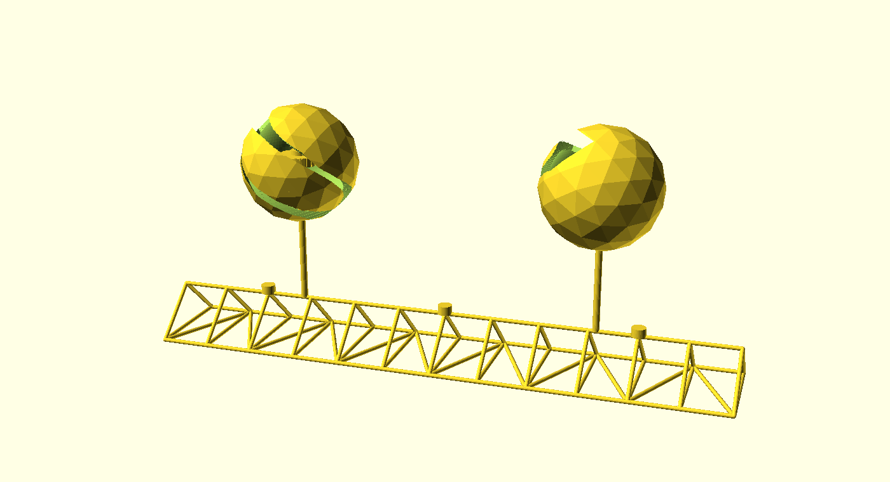
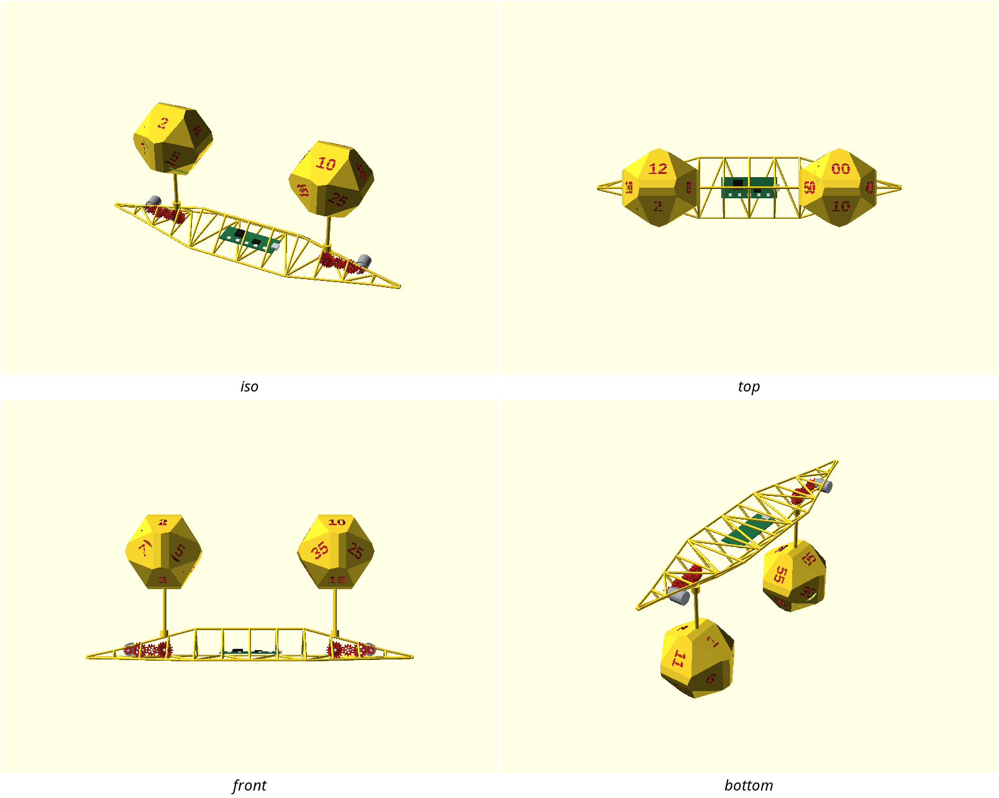
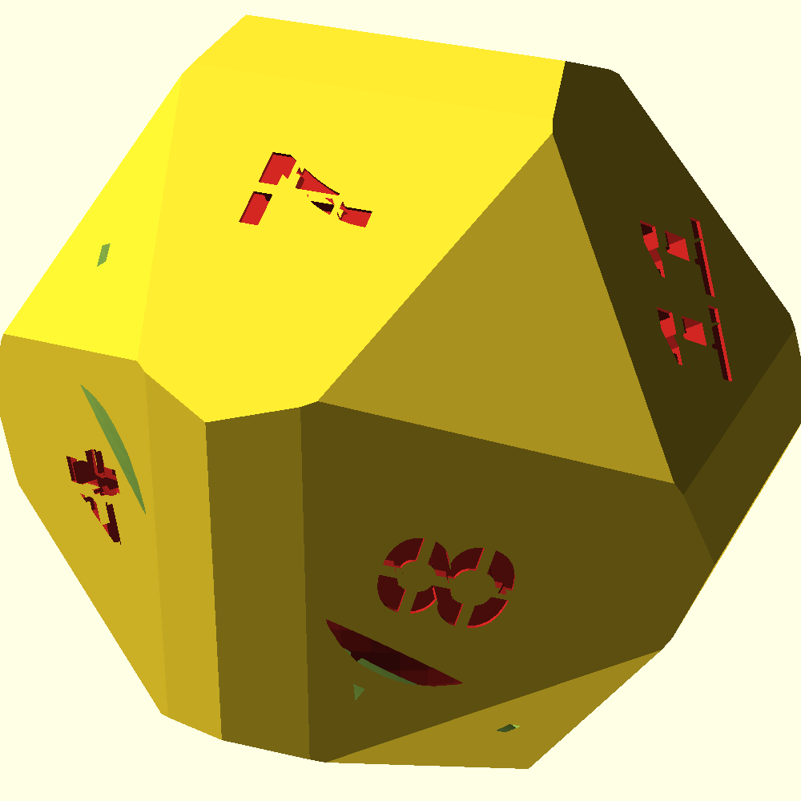

# ovodyo — kinetic dice-ball clock

A desk clock that tells the time on two slowly tumbling faceted balls: the left
ball shows the hour, the right ball the minutes in five-minute steps, each number
sitting on one of twelve pentagon plaques. A helical slot cut through each shell
frames the gears inside, so the mechanism is the ornament. This is a clean-room
re-creation, in print-bench, of the "ovodyo" clock by Mectolab — built as a
**v0 base** the improvement backlog ([#599](https://github.com/shaiss/print-bench/issues/599)) refines.

> **v0 — a working substrate, not the finished clock.** The geometry renders,
> gates and slices, and the signature look is here: chunky faceted dice-balls
> (chamfered dodecahedra — twelve flush pentagon faces plus triangular corner
> facets), **bold numerals cut clean through** each shell to a red interior
> (stencilised so no counter drops out), and the reference's **exposed gearing in
> the base** — a geared stepper and reduction gear-train at each pod, a bevel
> take-off up each stalk, and a central electronics bay. The base drivetrain and
> the red interior are shown as **preview-only coloured parts** (a single-material
> print is one colour; the two colours are the intent). Several things are still
> deliberately simplified and tracked as issues: the base gears *represent* the
> drive but aren't a real meshing involute differential, and the base has no red
> structural core or reusable space-frame library ([#603](https://github.com/shaiss/print-bench/issues/603)/[#604](https://github.com/shaiss/print-bench/issues/604)); the balls
> split as crude hemispheres (a proper flat seam is [#602](https://github.com/shaiss/print-bench/issues/602)); the slot isn't
> yet a tunable brand module ([#601](https://github.com/shaiss/print-bench/issues/601)); and there's no committed two-tone
> reveal render yet ([#600](https://github.com/shaiss/print-bench/issues/600)). See NOTES.md.

## What you get

The printable parts (the assembled render is a preview only — a single STL of the
whole clock would print as one fused lump):

- `hours-half` / `minutes-half` — one hemisphere of each ~78 mm faceted ball,
  printed flat-face-down (print two of each for a full ball).
- `base-segment` — the constant-section **centre** truss segment (~127 mm).
- `base-end` — one of the two **tapering end wings** that come to a needle point
  and carry a stalk boss over the motor pod (print two; three segments total make
  the ~383 mm base).
- `mock-drive` — a single representative reduction gear from the base train,
  kept as a gated printable part.

The base drivetrain (gear-trains, steppers, bevels, PCB) and the balls' red
interior are **preview-only** — colours are ignored on STL export, so they are
not printable parts. See them assembled in the hero image and the `base-mech`
gallery preview. Select a part with `-D 'part="hours-half"'` (or `base-mech` /
`pod-drive` to preview the mechanism); the default render is the assembled clock.

## Print settings

- **Material:** PLA (white shell + red interior/mechanism is the intent; v0 is
  single-material).
- **Layer height:** 0.2 mm.
- **Infill:** 15–20 %.
- **Supports:** the truss and mock drive print support-free; the faceted ball
  **dome does have overhangs** in v0 (an inherent hemisphere caveat) — light
  supports on the ball halves are acceptable until the seam/orientation work in
  [#602](https://github.com/shaiss/print-bench/issues/602).
- **Orientation:** ball halves cut-face-down; truss segments bottom-chord-down
  (as modeled); mock drive flat.

## Parameters

The handful most worth tuning (all at the top of `ovodyo.scad`, grouped in
Customizer sections; override with `-D 'name=value'`):

| Parameter | Default | What it does |
|---|---|---|
| `ball_d` | 78 mm | ball outer diameter (across the pentagon faces) |
| `wall` | 2.2 mm | shell wall thickness at the pentagon faces |
| `glyph_h` | 14 mm | numeral height (bold, near the pentagon inradius) |
| `numerals_through` | true | cut numbers clean through to the red interior; false = debossed recess |
| `bridge_w` | 1.2 mm | stencil bridge width — the ties that keep 0/4/6/8/9 counters attached |
| `slot_width` | 10 mm | helical mechanism-window width |
| `slot_turns` | 0.5 | how far the slot wraps |
| `seg_len` | 127 mm | one base-segment length (×3 = 383 mm) |

The ball's faceting is `_GB_TRI_K` in `geodesic-ball.scad` (default 1.05):
1.0 gives the biggest triangular corner facets (≈ an icosidodecahedron), ≥1.12
a plain dodecahedron with clean corners.

## Assembly & use

Print two halves per ball and join them around the drive (v0: glue/tape the crude
hemisphere seam — a real captive seam is [#602](https://github.com/shaiss/print-bench/issues/602)). Three truss
segments bolt end to end; a brass rod (≈4.5 mm) is the support stalk from each pod
to a ball centre. The real clock is driven by a geared stepper through a bevel
differential and homed with a hall sensor — the electronics and true drive are out
of scope for this geometry v0 (see NOTES.md and the backlog).
