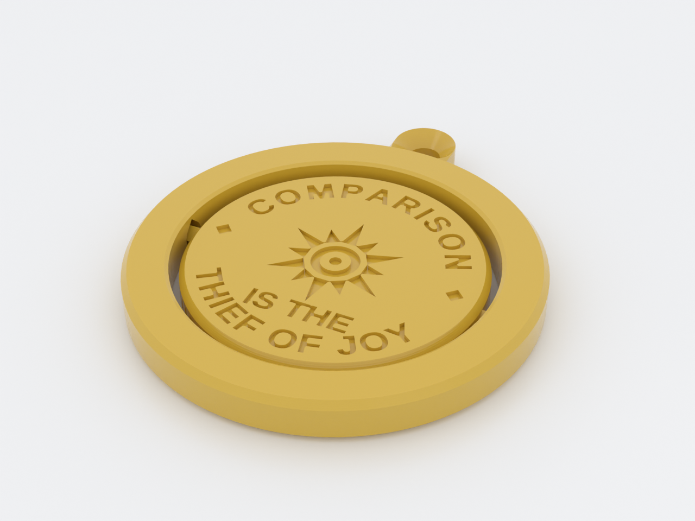
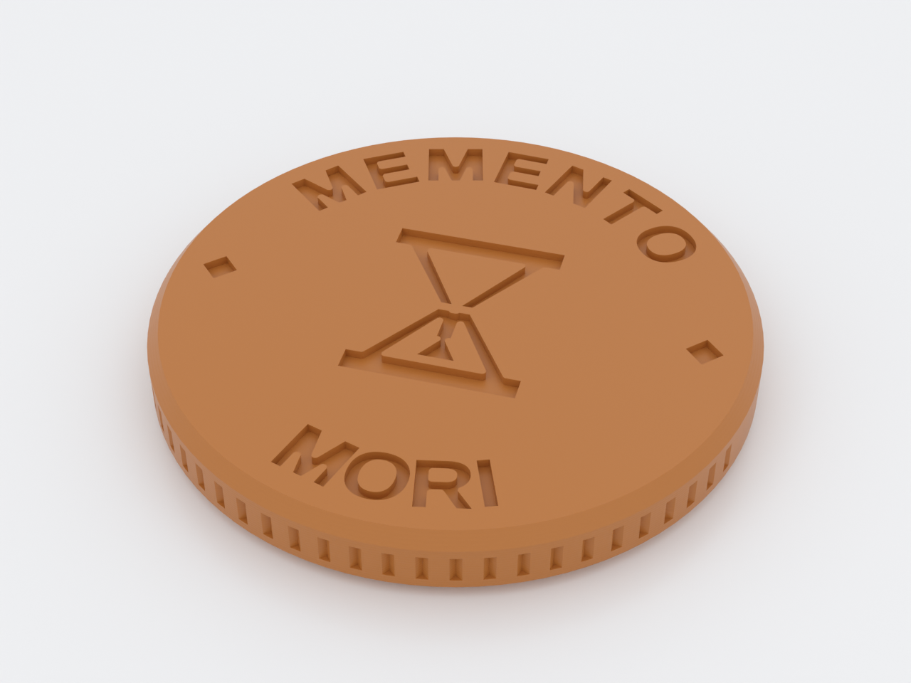
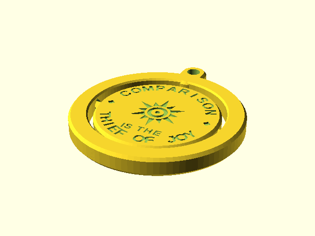
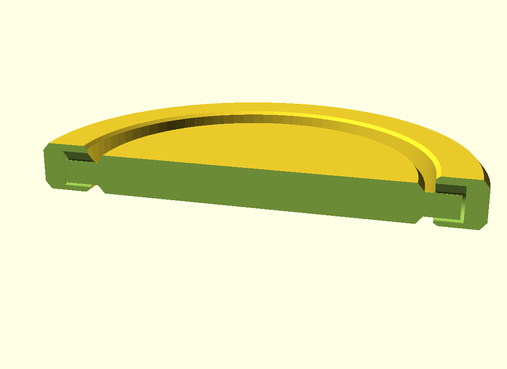

# Perspective Coin

A two-sided pocket coin of the two engravings John Cena keeps on his watch
(as he tells it in an [interview clip shared on
Reddit](https://www.reddit.com/r/MotivationalThoughts/s/q9BbhOayrd)) —
**"COMPARISON IS THE THIEF OF JOY"** around a radiant sun on one face, for the
days you don't feel like enough, and **"MEMENTO MORI"** around an hourglass on
the other, for the days your head gets too big. Print the bare coin for your
pocket, or the **flipper**: a print-in-place keyring gimbal that holds the coin
on two tiny axles, so you flip it — literally — to the reminder you need.
A keeper of perspective, not time.

## What you get

- `flipper` (default) — the coin captured in a keyring ring, printed as one
  piece: ~Ø54 × 6 mm plus the loop. No assembly; flip it firmly once to free
  the pivot.
- `coin` — the bare two-sided coin, Ø40 × 5 mm, reeded edge, chamfered rims.
- `perspective-coin-coupon` — a 24 mm pivot-tuning flipper. Print this first.

| Face A | Face B |
|---|---|
|  |  |

## How the mechanism prints

The coin carries two diamond-section stub axles (45° cross-section — its own
overhang self-supports) that ride in **teardrop** sockets inside the ring, so
the socket roof never bridges. A 1.2 mm moat separates coin from ring
everywhere else; the only printed fusion is the thin axle/socket annulus, and
the first firm flip shears it. The engraved faces are in coin-flip alignment
about the pivot, so the back face reads upright after a flip.

## Print settings

- **Material:** any rigid filament — PLA is the reference; gold silk PLA if
  you want it to look the part
- **Layer height:** 0.2 mm. Use a height that **divides 0.6** (0.12 / 0.15 /
  0.2 / 0.3) — the engravings are exactly three 0.2 mm layers, and a draft
  0.24 / 0.28 profile quantizes their depth off that grid.
- **Plate:** a **smooth** plate shows the bed-side (MEMENTO) legend best — it
  is the first layer, and a textured sheet stipples it. Textured still prints
  legibly, just softer.
- **Ironing:** **on for the top surface** — it smooths the JOY legend field
  (a big win on silk/metallic PLA).
- **Seam:** set seam position **Rear** (or scarf, on Bambu) so the ring seam
  lands on the loop's outer arc where the split ring hides it — the default
  "nearest" stacks it in the tab junction and leaves a visible scar.
- **Infill:** 15–25 % (it's a coin — top it up to 100 % if you want the heft)
- **Supports:** none needed — teardrop sockets, 45° axles, top-side counterbore
- **Orientation:** as modeled, flat on the bed; the flipper prints in place
- **Print order:** the coupon first — tune the fit for your printer (see the
  coupon note below), then print the real thing

### Two-color faces (optional, any single-extruder printer)

The engraving is 0.6 mm deep on each face, so a plain filament swap gives both
legends a contrasting color with no model change. **The layer numbers below
assume the reference 0.2 mm layer height** — the swap *heights* are what matter,
so pause by Z height, not by layer index:

1. Load your **field** color. Print to **z = 0.6 mm** (layer 3 at 0.2 mm), then
   swap to the **legend** color — the MEMENTO face's engraved voids fill with it.
2. Print to **z = 4.4 mm** (`coin_t − engrave_depth`; layer 22 at 0.2 mm), swap
   back to the field color.
3. The remaining engraving (the COMPARISON face's void floors) stays the
   legend color. Two manual swaps, both faces two-tone.

Both swap heights are multiples of 0.2 mm, so at 0.2 mm they fall exactly on
layer boundaries. `z = 0.6` also divides 0.12 / 0.15 / 0.3 mm cleanly, but
`z = 4.4` does **not** (e.g. 4.4 / 0.15 = 29.3) — at any non-0.2 mm height,
round the second swap to the nearest layer boundary at or above 4.4 mm. Scale
both heights if you change `engrave_depth` or `coin_t`.

## Parameters

| Parameter | Default | What it does |
|---|---|---|
| `coin_d` | 40 mm | Coin diameter (legend artwork is tuned to 40) |
| `coin_t` | 5 mm | Coin thickness; the pivot axis sits at half of it |
| `pivot_clear` | 0.35 mm | **Radial** fit: axle-to-socket clearance (across-axis rattle) — tune on the coupon |
| `socket_end_clear` | 0.4 mm | **Axial** fit: end-play along the pivot (along-axis rattle) — tune on the coupon |
| `rim_gap` | 1.2 mm | Moat between coin edge and ring bore |
| `loop_thick` | 3 mm | Wrap thickness at the keyring hole (counterbored so a split ring threads easily) |
| `axle_r` | 1.5 mm | Axle diamond vertex radius |
| `reed_n` | 64 | Reeded-edge groove count (0 = smooth edge) |
| `engrave` | true | Face engravings on/off |
| `loop` | true | Keyring loop on the ring |

All parameters are at the top of `perspective-coin.scad`, grouped in
Customizer sections; override on the command line with `-D 'coin_d=45'`.

## Assembly & use

None to assemble. When the flipper comes off the bed the coin is lightly
fused to its sockets — hold the ring and flip the coin firmly once; after
that it swings freely. Ego inflating? Flip to the hourglass. Comparing
yourself into the ground? Flip to the sun: you are enough. The two engraved
diamonds at 3 and 9 o'clock mark the pivot so you always know where to push.

The coin has **no detent** — whichever face is up when you pull your keys out
is whatever the last jostle left. That is on purpose: *the coin picks your
reminder*, and half the time it picks the one you weren't looking for.

Threading it onto a keyring: the loop is counterbored so a standard split ring
climbs over ~3 mm, not the full ring. If the pivot is stiff or sloppy, reprint
the **coupon**: raise `pivot_clear` if it won't break free, lower `pivot_clear`
for across-axis wobble, lower `socket_end_clear` for along-axis end-play — then
carry the value into the full-size print.
