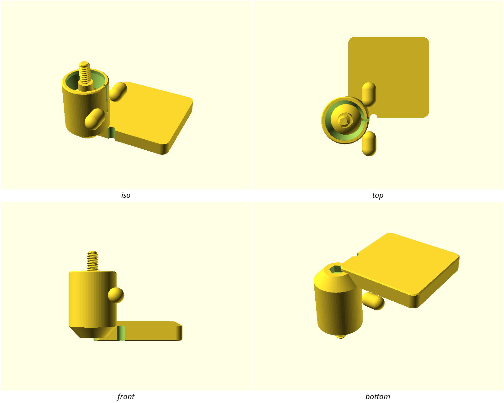
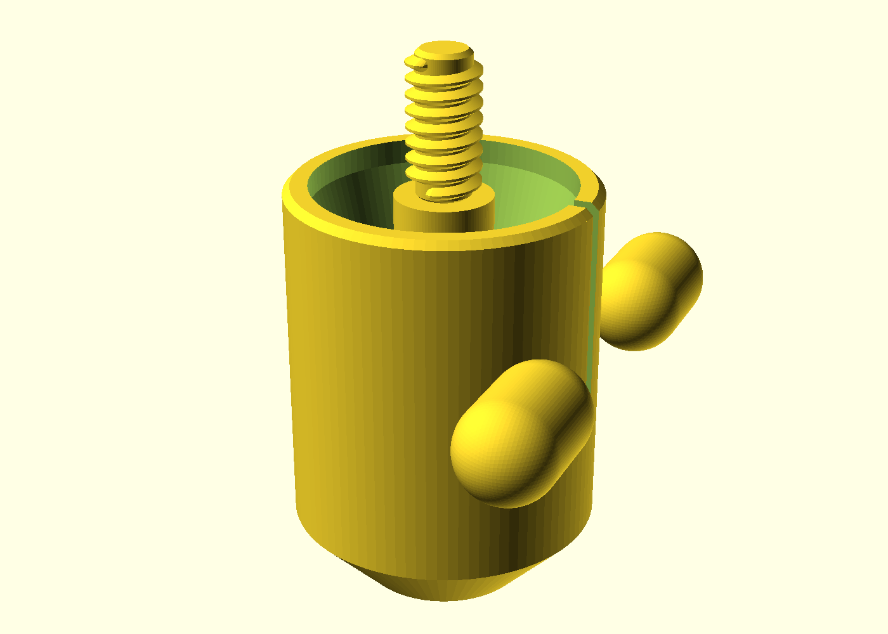
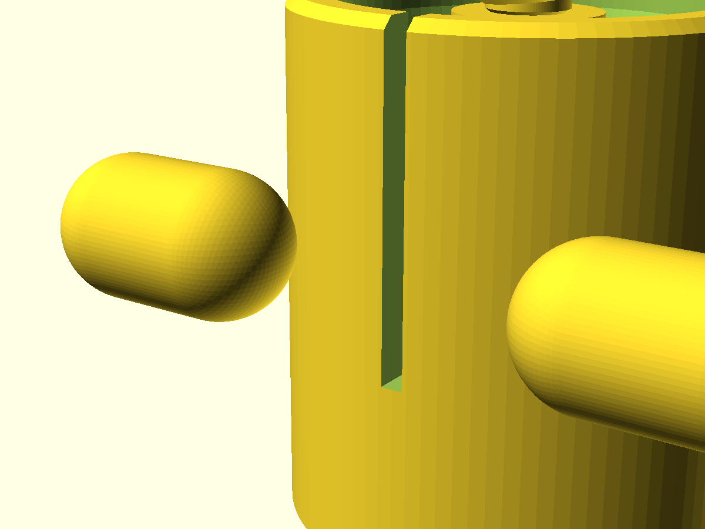

# pip-ball-socket-head

A tilting head on a **print-in-place ball-and-socket joint**: the head comes
off the bed assembled, its Ø20 mm ball already captive inside a clamping
socket, with a ¼″-20 stud on top for your webcam, reading light, mic or
sensor. Tilt it to aim, pinch the printed wings to lock — no supports, no
assembly at the joint, no hardware in the mechanism. It is the spherical
(3-DOF rotary) joint the other print-in-place designs here don't cover, and
the printed answer to the ubiquitous small ball-head mount.

## What you get

Two printed parts, joined by one M4 bolt:

- `head` — the print-in-place mechanism, one piece: stem tenon, socket ring
  with slit collar and clamp wings, the Ø20 ball and ¼″-20 stud printed
  captive inside it (≈ 46 × 46 × 38 mm over the wings)
- `base` — M4 foot plate, 48 × 48 × 8 mm, two mounting holes + the centre
  recess the head's tenon seats in

**Hardware (not printed):** 1× M4 × 16 bolt + M4 nut (head to base), 2× M4
screws (mounting — machine screws with nuts, or wood screws into a desk edge).

## Print settings

- **Material:** PETG for the `head` — the slit collar is a creep-loaded
  flexing feature and PETG tolerates repeated clamping better than PLA. PLA
  is fine for the `base`.
- **Layer height:** 0.2 mm. The break-in fusion at the cup floor and every Z
  gap in the joint are whole-layer numbers.
- **Infill:** 15–20 % gyroid, 3 perimeters.
- **Supports: none inside the joint — ever.** An auto-support inside the
  socket welds the ball into it, which is the exact failure this design
  exists to defeat; the capture cone (≤ 25° from vertical) and dome (15°)
  are shaped so no slicer support finds a surface in there. The clamp
  wings' undersides are the one external overhang printcheck flags
  (350 mm²); PETG at 3 perimeters prints them fine, and a support block
  under the wings alone is harmless if yours sag — it cannot reach the
  joint.
- **Orientation:** head stem-down (as modelled), base flat. Never print the
  head stud-down — the dome would have to bridge over the whole ball.

### Print this first

Slice `pip-ball-socket-head-coupon.scad` (or `build/pip-ball-socket-head-coupon.stl`):
four cells, one strip. Cells 1–3 sweep the ball-to-socket clearance
(0.15 / 0.20 / 0.25 mm); twist each ball free — the cell that frees with a
firm twist and then moves without rattle is your printer's value, set
`ball_xy_clear` to it. Cell 4 is the slit-collar station: pinch the wings,
the ball should lock and release. Details in NOTES.md.

### Break-in (first motion)

The ball is deliberately fused to the cup floor by one layer — that is the
design, not a defect. Grip the head, twist the ball **firmly**: it shears
with a soft crack, then moves freely. Work it through its full tilt cone a
dozen times before mounting a payload.

## Parameters

| Parameter | Default | What it does |
|---|---|---|
| `ball_xy_clear` | 0.2 mm | THE tuned fit — radial ball-to-socket clearance. Sweep on the coupon; raise 0.05 at a time if the joint won't free. |
| `max_tilt` | 20° | The articulation the geometry guarantees (CI proves the stud clears the dome at every pose). Raise only with a coupon re-check. |
| `ball_d` | 20 mm | Ball diameter — the whole joint scales from it. |
| `stud_undersize` | 0.15 mm | Printed-thread loosening; raise 0.05 steps if a camera body rejects the stud. |
| `slit_w` | 1.2 mm | The clamp slit — a real slot, never printed shut. |
| `base_hole_pitch` | 30 mm | Mounting-hole spread on the foot plate. |

All parameters are at the top of `pip-ball-socket-head.scad`, grouped in
Customizer sections; override on the command line with `-D 'ball_xy_clear=0.25'`.

## Assembly & use

1. Bolt the `base` to the desk edge, shelf underside or wall with two M4s.
2. Drop an M4 nut into the hex pocket in the head's tenon (it only fits one
   way round), seat the tenon in the base's centre recess, and pull it down
   with the M4 × 16 bolt from underneath. The torque path is the tenon
   shoulder, not the bolt.
3. Thread your camera/light onto the ¼″-20 stud, tilt to aim, pinch the
   wings to lock.

**Honest payload figure:** ≤ 250 g at a 60 mm lever is the design target
(assumed — a typical webcam is 100–200 g); it is a *field-test* number, not a
measured one. If the clamp can't hold your payload unaided, that is a finding
to record — the design ships no metal clamp screw to paper over it. PETG is
the material call for exactly this reason.

The ¼″-20 stud and the M4 base are deliberate departures from the
`workshop-utility` style pack's M3 vocabulary — camera standard and the
brief's own call respectively; recorded in NOTES.md (D4).
