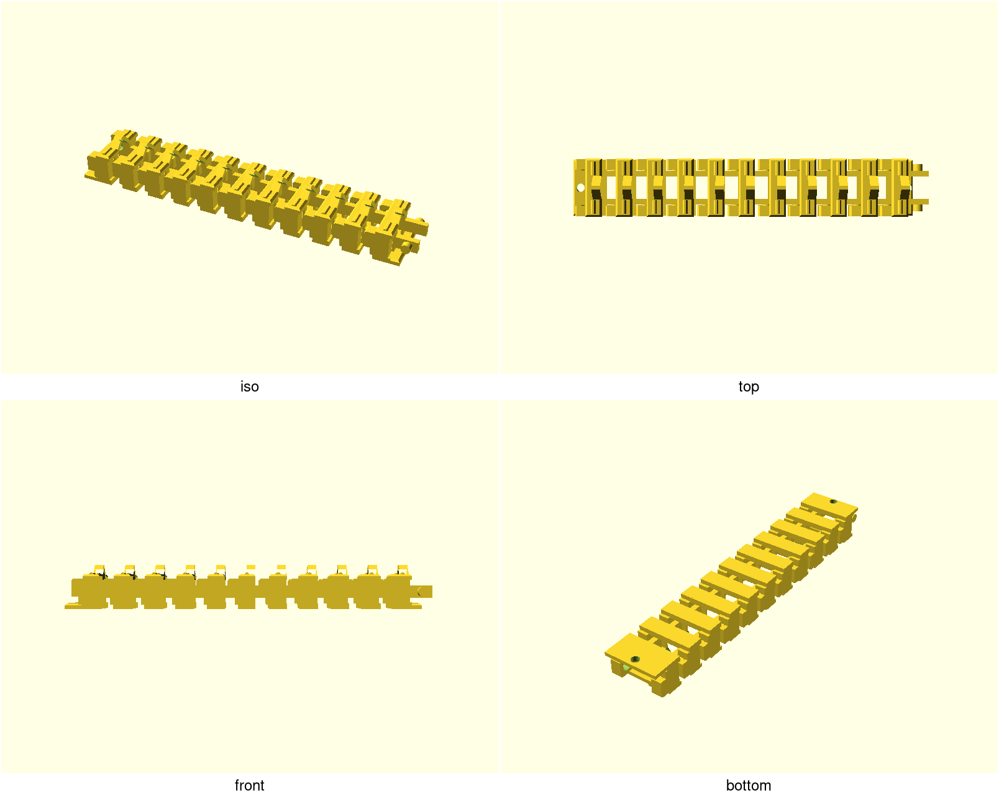
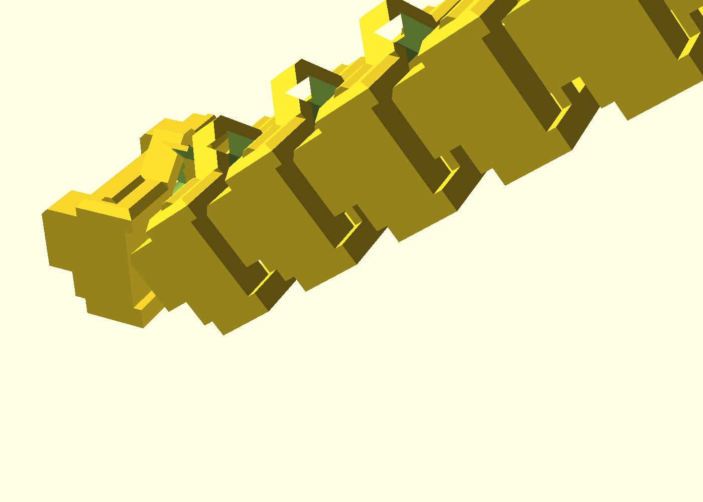
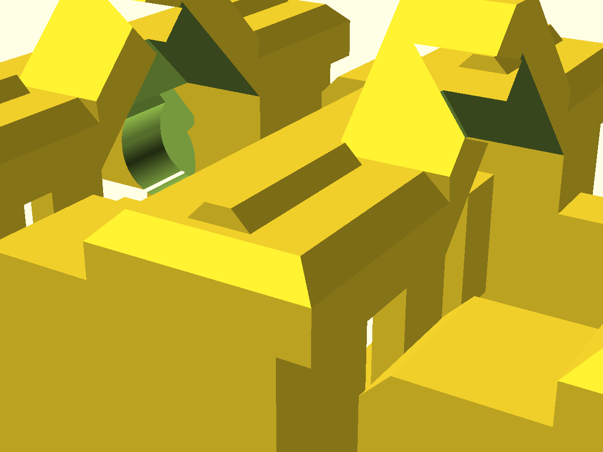

# pip-cable-chain

A print-in-place energy chain (drag chain): eleven links, each printed
already captured inside its neighbor's clevis, that comes off the bed as a
moving chain — flex it once to shear the break-in fusion and you have a
working cable chain with hard ±45° printed stops at every joint, ready to
route a moving cable loom. No assembly, no hardware in the joints, no
supports. Anyone routing cables to a moving gantry, lamp head, or enclosure
lid prints this instead of zip-tying a growing loop.

## What you get

- `pip-cable-chain.stl` — the full run: 11 links ≈ 189 mm long (fits a
  200 mm bed), 30.2 mm wide, 23.0 mm tall, with M4 mounting tabs on the
  first and last link. The cable passage is 12 mm tall × 18.8 mm wide
  between the joint bosses, with a 45° vaulted crown lifting headroom to
  ~21 mm over the center of each pocket — sized for a 12 mm loom with
  room to spare.
- `pip-cable-chain-coupon.stl` — the print-this-first coupon: 3 links, no
  tabs (~58 mm), two full joints in exactly the production cross-section,
  for tuning the fit before you commit 4 hours of filament.
- A parametric source: more links for a longer bed (`-D links=20`), a
  different passage (`-D passage_w=16 -D passage_h=10`), one clearance to
  tune.

The chain is printed straight and captured: each link's round pin stubs sit
inside the next link's blind teardrop bores, so the links cannot come apart
— the bores stop one `cap_t` short of the ear's outer face. The stops are
not extra parts: each link's tongue simply lands on the next link's pocket
plate at 45°, derived contact geometry, verified by rendered interference
checks at ±44° (clear) and ±47° (blocked).

**What is not in v1** (deliberate, see NOTES.md D6): at each joint mouth —
the ~7 mm between one link's pocket plates and the next — the passage is
open on top and bottom over the middle 12 mm, and the sides carry a small
slot. Between joints the cable is fully enclosed (floor, side walls,
vaulted ceiling); at the mouths a cable can lift or drop out. A snap-on
lid bridging the joints is the named follow-up. Route the loom before
flexing the chain if you need full retention end-to-end.

## Print settings

- **Material:** PLA or PETG (PETG preferred for a chain that flexes
  repeatedly)
- **Layer height:** 0.2 mm — the design derives its vertical joint
  clearances in whole 0.2 mm layers; a different layer height changes the
  fit (re-derive: `clear_z` follows `layer_h` automatically in the file)
- **Infill:** 15%, gyroid — the walls and plates carry the load
- **Supports:** none needed — the bore roofs are 45° teardrops, the tunnel
  ceiling is vaulted at exactly 45° (every downward roof face is at or
  steeper than the support-free angle by construction), everything else
  grows from the bed
- **Orientation:** exactly as rendered — flat, pin axes horizontal, teardrop
  roofs up. Do not rotate a joint 90°; that puts the whole-layer clearances
  on the wrong plane and the chain welds solid.
- **Print the coupon first** (see below) and confirm both joints swing to
  both stops before printing the full run.

## Parameters

| Parameter | Default | What it does |
|---|---|---|
| `links` | 11 | links in the run; 11 ≈ 189 mm fits a 200 mm bed, each link adds 16 mm |
| `clear_xy` | 0.25 mm | THE fit tunable: radial pin-to-bore clearance. Raise by 0.05 if a joint binds; never below 0.25 (the measured weld floor) |
| `passage_w` / `passage_h` | 12 / 12 mm | cable passage floor-to-ceiling and center width; the passage is wider than `passage_w` between the joint bosses and vaulted above `passage_h` |
| `pitch` | 16 mm | link length, pin axis to pin axis |
| `stop_angle` | 45° | articulation limit per joint; the plate placement derives from it |
| `end_tabs` | true | M4 mounting tabs on the first and last link |
| `pin_d` | 5 mm | pin stub diameter |

All parameters are at the top of `pip-cable-chain.scad`, grouped in
Customizer sections; override on the command line with
`-D 'links=20'`.

## Assembly & use

1. Print the coupon first. Flex each joint once to shear the break-in
   fusion. Both joints should swing to both stops and back freely.
2. Print the full run. Flex every joint once, working down the chain.
3. Bolt the chain down by its end tabs (M4), route your loom through the
   passage, and connect the moving end.
4. A joint that binds means welds in the bore: raise `clear_xy` by 0.05
   (`clear_z` re-derives to the next whole layer automatically) and
   reprint. A stub that snaps out means too loose: lower it by 0.05.

Tune `clear_xy` in one place — the coupon and the chain share every
parameter through the include.
