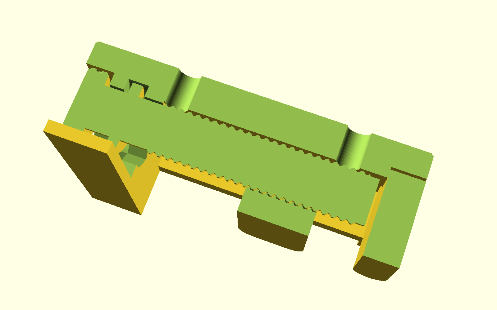

# pip-micrometer-vice

A bench vice whose entire drivetrain comes off the print bed assembled: one
twist of the knob turns a printed screw, and the jaw walks along it —
rotary to linear, zero assembly, zero hardware in the drive train. For
holding small work flat on a bench between two 40 × 20 mm faces, bolted
down through two M5 holes.

## What you get

- `pip-micrometer-vice` — the whole vice, printed in place as one job
  (approx. 80 × 58 × 30 mm): the base, a captive screw with its grip knob,
  and the moving jaw. Three bodies, one bed.
- `pip-micrometer-vice-coupon` — the print-first fit coupon (approx.
  100 × 54 × 18 mm): three screw/nut pairs and three channel/slider pairs
  to pick your tolerances before committing to the vice.

2.0 mm of travel per knob turn, 30 mm of opening, plain clamping faces.

The section is the whole print story: the screw never prints on air — its
shaft sits in a 0.5 mm guide bore through the rear block, its thread is
interleaved with the moving jaw's nut at the tuned fit, and the one exposed
span rides 0.4 mm above the centre saddle. The thrust collar (the disc at
the left) floats in a sealed chamber, so clamping force goes into the base,
not the printed thread.

## Print settings

- **Material:** PLA or PETG, one colour
- **Layer height:** 0.2 mm
- **Infill:** 25% (base and jaws solid-walled anyway at ≥3 perimeters)
- **Supports:** none — never. A support inside the screw thread welds the
  drivetrain shut, which is the one failure this design exists to prove
  can't happen. Leave slicer auto-supports off.
- **Orientation:** exactly as rendered — base flat on the bed, screw axis
  horizontal
- **Seam:** set Back (or scarf) — the default Aligned seam stacks a ridge
  straight through the thread crest and the saddle rails, and a ridge on a
  rotating or sliding surface is a fit you didn't tune
- **Print first:** the coupon, and read it before printing the vice

Digit row = screw fit (`thread_tol` 0.25 / 0.30 / 0.35, default **2**);
letter row = jaw guide fit (`clr_h` 0.25 / 0.30 / 0.35, default **B**).
Screw each nut onto its stud, push each slider down its channel, and keep
the station that turns smoothly without slop.

## Parameters

| Parameter | Default | What it does |
|---|---|---|
| `thread_tol` | 0.30 mm | screw-to-nut radial fit — pick from coupon row 1 |
| `clr_h` | 0.30 mm | jaw-to-rail side fit (the anti-rotation key) — coupon row 2 |
| `travel` | 30 mm | jaw opening range |
| `screw_lead` | 2.0 mm/turn | travel per knob turn (single-start: pitch = lead) |
| `print_opening` | 12 mm | the opening the vice is printed at |
| `demo_opening` | — | preview-only pose override; leave unset to print |

All parameters are at the top of `pip-micrometer-vice.scad`, grouped in
Customizer sections; override on the command line with
`-D 'thread_tol=0.35'`.

## Assembly & use

There is none — free the mechanism by working the knob back and forth
through its first few turns (the printed pose leaves every face standing
off, so nothing is welded). Mount through the two M5 holes on a 40 mm
grid. If the screw turns stiff, reprint the coupon one station looser
(`thread_tol` +0.05) before reprinting the vice.
