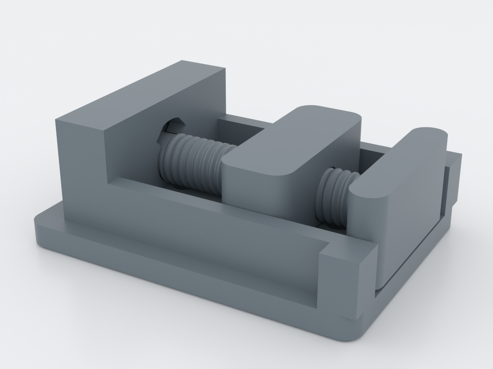
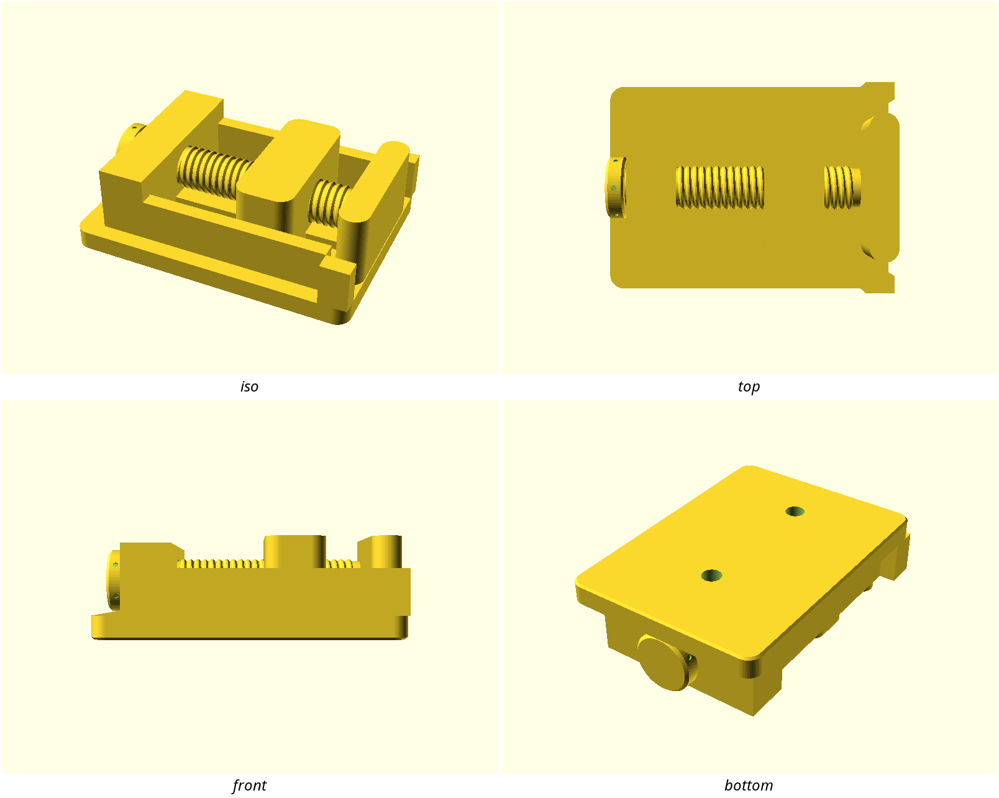

# pip-micrometer-vice

A bench vice whose entire drivetrain comes off the print bed assembled: one
twist of the knob turns a printed screw, and the jaw walks along it —
rotary to linear, zero assembly, zero hardware in the drive train. For
holding small work flat on a bench between two 40 × 20 mm faces, bolted
down through two M5 holes.

## What you get

- `pip-micrometer-vice` — the whole vice, printed in place as one job
  (approx. 80 × 58 × 27 mm): the base, a captive screw with its grip knob,
  and the moving jaw. Three bodies, one bed.
- `pip-micrometer-vice-coupon` — the print-first fit coupon (approx.
  100 × 54 × 18 mm): three screw/nut pairs and three channel/slider pairs
  to pick your tolerances before committing to the vice.

2.0 mm of travel per knob turn, 30 mm of opening, plain clamping faces.

## Print settings

- **Material:** PLA or PETG, one colour
- **Layer height:** 0.2 mm
- **Infill:** 25% (base and jaws solid-walled anyway at ≥3 perimeters)
- **Supports:** none — never. A support inside the screw thread welds the
  drivetrain shut, which is the one failure this design exists to prove
  can't happen. Leave slicer auto-supports off.
- **Orientation:** exactly as rendered — base flat on the bed, screw axis
  horizontal
- **Print first:** the coupon, and read it before printing the vice

## Parameters

| Parameter | Default | What it does |
|---|---|---|
| `thread_tol` | 0.30 mm | screw-to-nut radial fit — pick from coupon row 1 |
| `clr_h` | 0.30 mm | jaw-to-rail side fit (the anti-rotation key) — coupon row 2 |
| `travel` | 30 mm | jaw opening range |
| `screw_lead` | 2.0 mm/turn | travel per knob turn (single-start: pitch = lead) |
| `print_opening` | 12 mm | the opening the vice is printed at |
| `demo_opening` | — | preview-only pose override; leave unset to print |

All parameters are at the top of `pip-micrometer-vice.scad`, grouped in
Customizer sections; override on the command line with
`-D 'thread_tol=0.35'`.

## Assembly & use

There is none — free the mechanism by working the knob back and forth
through its first few turns (the printed pose leaves every face standing
off, so nothing is welded). Mount through the two M5 holes on a 40 mm
grid. If the screw turns stiff, reprint the coupon one station looser
(`thread_tol` +0.05) before reprinting the vice.
