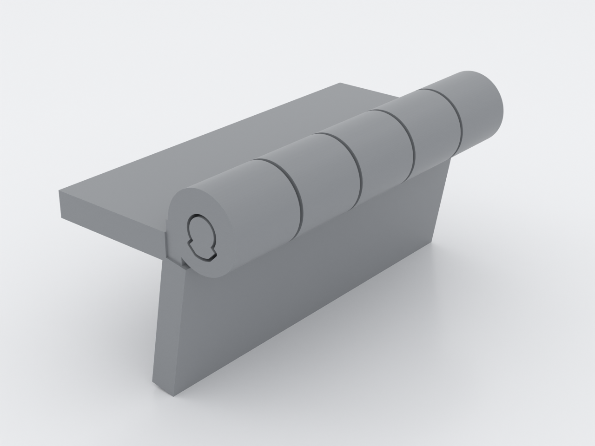
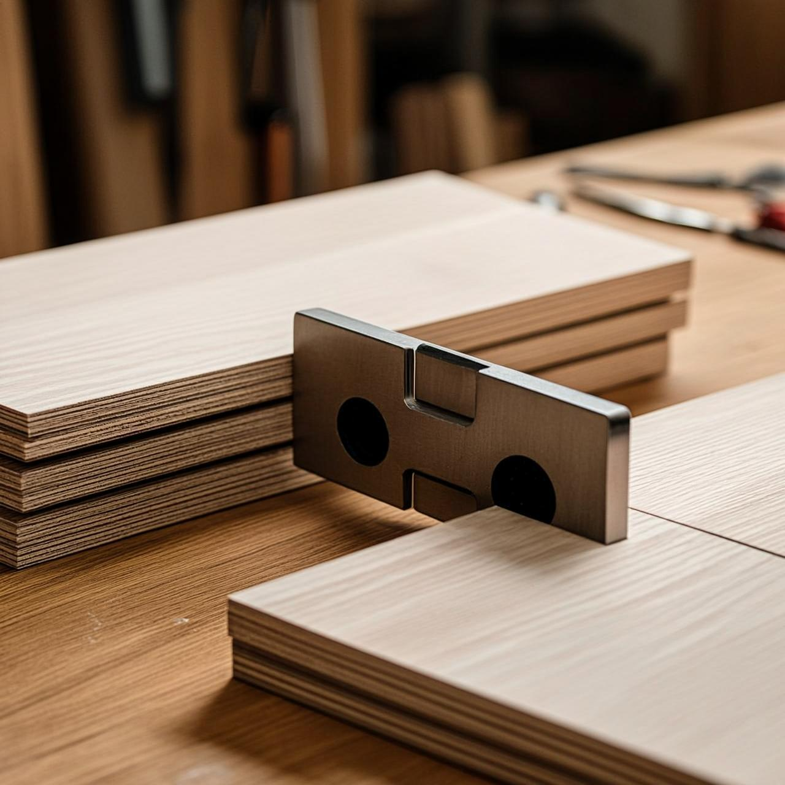
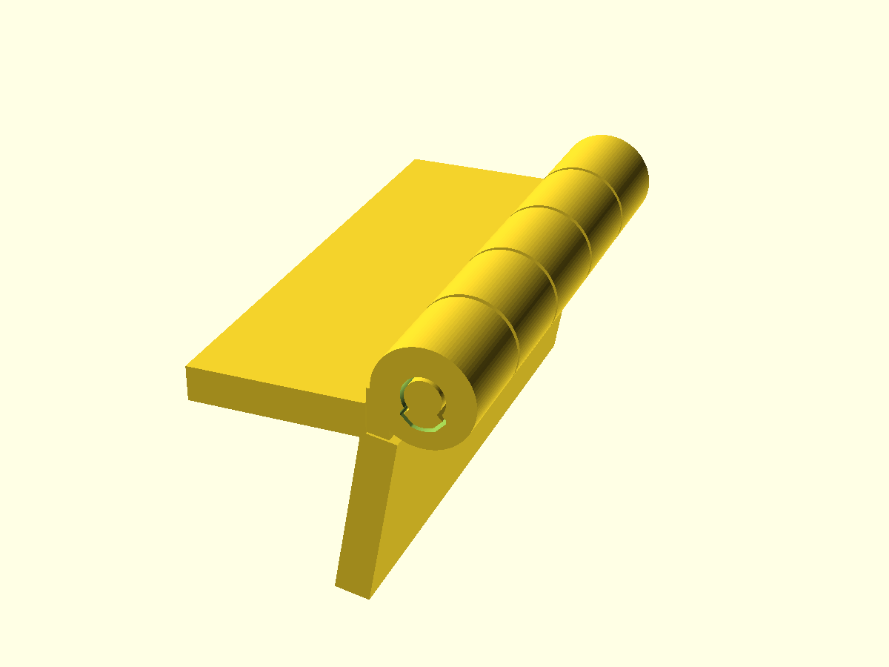

# pip-piano-hinge

A multi-knuckle piano hinge that comes off the print bed **already assembled and
swinging** — three separate bodies (two leaves and a free pin) printed in place,
no supports, no assembly. It's built on the repo's `lib/print-in-place.scad`
hinge primitive and adds the piano-hinge-specific defenses against tolerance
stacking (`docs/advanced-techniques.md`, Domain 3).

*AI-generated impression for general illustration only — geometry is approximate and may not exactly match the printed part; see the studio render above and the STL for the true shape.*

Folded (preview pose):

## What you get

- `pip-piano-hinge` — one print, ≈ 60 mm long, rendering as **3 separate
  bodies**: leaf A, leaf B, and the captive pin.

## Print settings

- **Material:** PLA/PETG both fine (the pin bore is a sliding fit, not a live flex)
- **Layer height:** 0.2 mm
- **Infill:** 20–40 %
- **Supports:** none needed
- **Orientation:** flat, as modelled (leaves on the bed, barrels on top, pin axis
  horizontal). The teardrop bores print roofless.
- **First use:** work the hinge back and forth once to free the knuckles.

The bore is grown from the pin's own profile by a true `offset(r=clear)` — **not**
a scaled teardrop, which would leave the flank planes coincident and weld the
print. Two extra clearances beat tolerance stacking: an `axial_gap` between
knuckles and a `leaf_gap` between each leaf and the opposing barrels. A committed
fit-check (`ci.fitchecks`) proves all three bodies clear.

## Parameters

| Parameter | Default | What it does |
|---|---|---|
| `clear` | 0.4 mm | radial pin clearance on every bore surface (≥ 0.25 guarded) |
| `axial_gap` | 0.6 mm | gap between consecutive knuckles |
| `leaf_gap` | 0.4 mm | gap between a leaf and the opposing barrels |
| `knuckles` | 5 | number of knuckles (≥ 3) |
| `hinge_len` | 60 mm | overall length |

All parameters are at the top of `pip-piano-hinge.scad`; override with
`-D 'clear=0.45'`. If a knuckle binds, reprint with `clear` +0.05.
