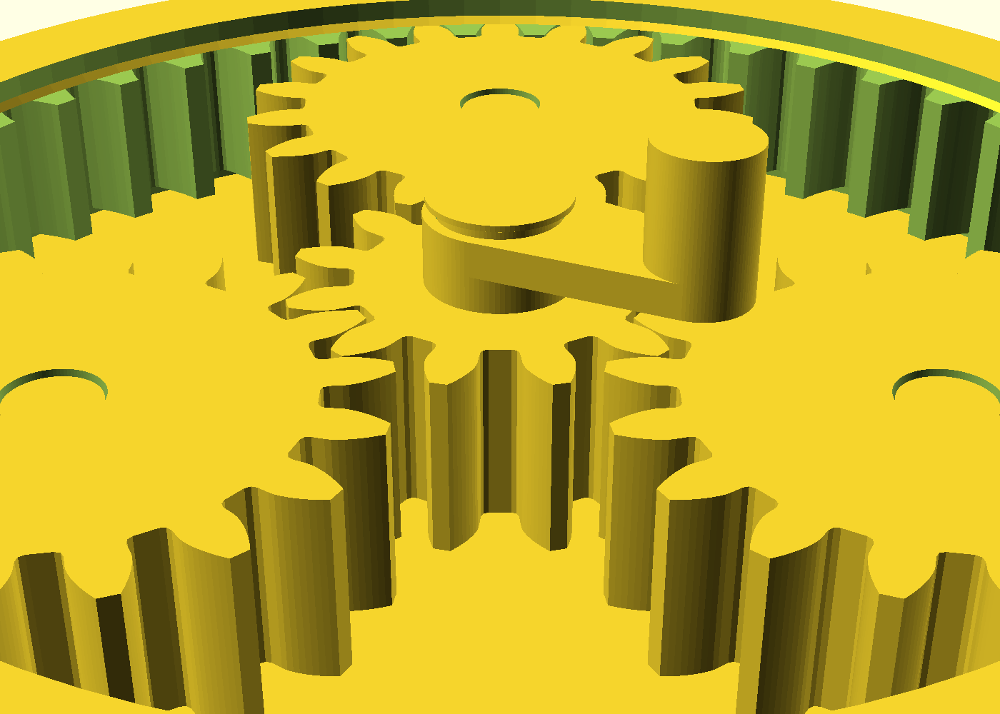

# pip-planetary — a print-in-place planetary gear set

A planetary (epicyclic) gear train — sun gear, three planets, internal ring —
printed as **one assembled part, no supports, no assembly**. Turn the sun's
molded crank and the carrier walks the planets round the ring at a **5:1
reduction**. The catalog's first toothed-gear design: mesh phasing, tooth
backlash and first-motion clearances all printed in place, proved by boolean
fit gates rather than eyeballed.

## What you get

- `pip-planetary` — the assembled unit, Ø110 × 32 mm, ~9 h / 103 g. Base ring housing with
  the internal gear teeth cut into its wall, the carrier disc and pins, the
  sun with its crank, and three planets — all captive, all printed in place.
- `pip-planetary-coupon` — the **print-this-first** coupon (~2 h 50 m, 32 g —
  a third of the full print): one pocket of the train (sun + one planet + the
  ring segment they engage) at full production tolerances, for tuning the mesh
  and pin fit on your printer. It cannot be smaller and still tell the truth:
  the sun and planet alone outweigh a 20-minute print at module 2, so the
  coupon keeps the real gears and drops two-thirds of the structure instead.

## How it works

The ring is fixed (part of the housing), the sun is the input (its crank), and
the carrier is the output — the Willis arrangement, ratio 1 + Zr/Zs = 1 + 48/12
= **5:1**. Turn the crank five times and the train walks round once. The three
planets space at exactly 120° because the tooth counts satisfy both assembly
conditions (48 = 12 + 2·18, and (12+48)/3 = 20, an integer) — all three mesh
the sun and the ring simultaneously, which is the alignment constraint this
design exists to demonstrate.

Backlash is **tooth thinning** (each gear cut 0.125 mm thin, 0.25 mm total in
the mesh), never center distance: each planet meshes the sun outside and the
ring inside at one fixed 30 mm axis radius, so moving the centers would open
one mesh by exactly what it closes the other.

## Print settings

- **Material:** PLA or PETG (PETG if you'll cycle it repeatedly)
- **Layer height:** 0.2 mm — the axial gaps (0.4 mm everywhere) are whole
  layers by design; a different layer height needs `z_gap_layers` re-derived
- **Infill:** 20%, gyroid
- **Supports:** none — the whole stack prints bottom-up on material
- **Orientation:** flat on the base plate, exactly as rendered

## Parameters

| Parameter | Default | What it does |
|---|---|---|
| `backlash_gear` | 0.125 mm | Tooth-thinning per gear; total mesh backlash is 2× |
| `pin_diam_clear` | 0.4 mm | Diametral clearance, planet bore ↔ carrier pin |
| `gear_module` | 2.0 | Tooth size — tooth depth ≈ 4.5 mm at module 2 |
| `face_w` | 12 mm | Gear face width |
| `z_gap_layers` | 2 | Axial gaps in whole 0.2 mm layers (sag-limited) |

All parameters are at the top of `pip-planetary.scad`, grouped in Customizer
sections; override on the command line with `-D 'backlash_gear=0.15'`.

## Assembly & use

None — it comes off the plate assembled. Give the sun's crank a firm first
turn to shear the break-free welds (the deliberate 0.4 mm gaps' first-layer
micro-fusion), then it turns freely. If the mesh feels stiff, print the coupon
and raise `backlash_gear` by 0.025; if a planet seizes on its pin, raise
`pin_diam_clear` by 0.1 — see NOTES.md "Print this first" for the full tuning
order.
