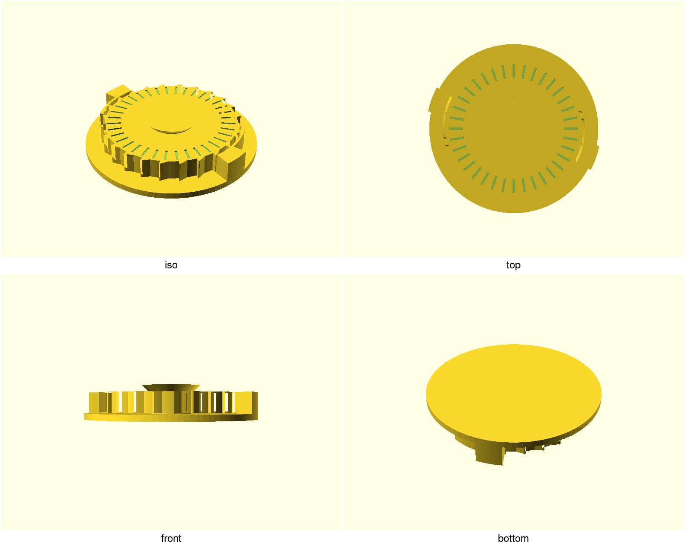
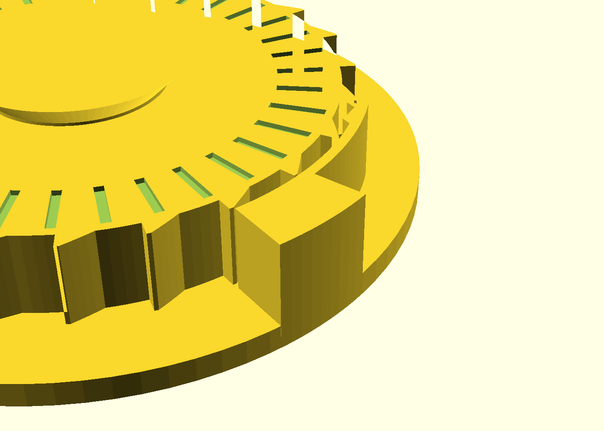
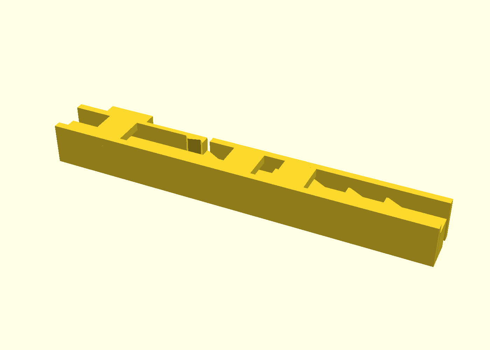

# pip-ratchet-pla

The [pip-ratchet](../pip-ratchet) print-in-place ratchet wheel — one piece,
freewheels with a click CCW, locks solid CW — re-sectioned for **PLA**: the
pawls are re-derived from PLA's stiffness so a PLA build clicks like the
shipped PETG one instead of ~1.75× harder. Same wheel, same teeth, same
frame; one beam dimension moves, and the coupon tells you whether your PLA
can live with it.







## What you get

Everything the parent's page describes — a one-piece captive 24-tooth wheel
between two diametric compliant pawls, ~69 × 69 × 13.7 mm, no supports, no
assembly — with the pawl beams at **1.0 mm** instead of the PETG build's
1.2 mm. Read the parent's [README](../pip-ratchet) for everything that did
not change; this page is only the delta.

## Why a derivative: the PLA re-derivation

PLA is stiffer than PETG (~3500 vs ~2000 MPa flexural modulus). Click force
scales with stiffness × thickness³, so the PETG beam in PLA clicks ~1.75×
harder *and* stresses ~46 % higher. Holding the click force constant means
holding E·t³ constant:

```
t_PLA = 1.2 · (2000/3500)^(1/3) = 0.996 → 1.0 mm
```

The ride-up stress at that section comes out **32.6 MPa** at the pawl root
(the PETG build's is 22.4) — fine against yield (~1.8× margin), but above
the fatigue band printed PLA is usually given. **So: print the coupon
first, cycle it, and count.** PLA is ranked far below PETG for living
flexures; this variant exists so your PLA build starts from the
force-matched section instead of the PETG one, and its coupon is the test
that says whether your PLA carries it. A coupon that dies early is the
design telling you to print the wheel in PETG — that is the parent's page.

## Print this first — the coupon is the qualification

Print `pip-ratchet-pla-coupon.scad` (or the sweep plate
`pawl_t=0.9:1.5:0.1`) **in PLA**, break the rack free, then:

1. Feel: the t = 1.0 lane should click like the PETG demonstrator — that
   is the force-match. Pick another lane by feel if you accept a different
   force (stiffness ~ t³).
2. **Cycle the t = 1.0 lane to a click-count death** at ~1–2 Hz and count
   (target: ≥ 1 000 clicks for a demo toy, ≥ 10 000 for a daily driver).
   Crack at the root, mushy clicks, or ridethrough all count as death.
3. Only on a coupon that lives: print the demonstrator.

Full protocol and the death criteria: `NOTES.md` → "Print this first".
Field results go in the Field test log there — that log is what turns
"conditionally viable" into an answer for the next person.

## Print settings

- **Material:** PLA (that is the point — for PETG use the parent)
- **Layer height:** 0.2 mm (the axial gaps are quantized to it — keep it)
- **Perimeters/walls:** 3 at a 0.4 nozzle; the 1.0 mm pawl beam is a
  2-perimeter feature — don't thin it further without redoing the math
- **Infill:** 15 %, any
- **Supports:** none needed
- **Orientation:** exactly as rendered, base down (the beams flex across
  roads within a layer — the orientation the fatigue ranking requires)

## Parameters

The Customizer listing is the parent's; the one parameter this derivative
owns is the delta:

- `pawl_t` — **1.0 mm**, the force-matched PLA section (from `e_pla` /
  `e_petg`, both editable in `pip-ratchet-pla.scad` if you have measured
  moduli for your filament). Stiffness ~ t³, ride-up stress ~ t; retune on
  the coupon, not by guess.

Everything else: see the parent's [parameters](../pip-ratchet).
