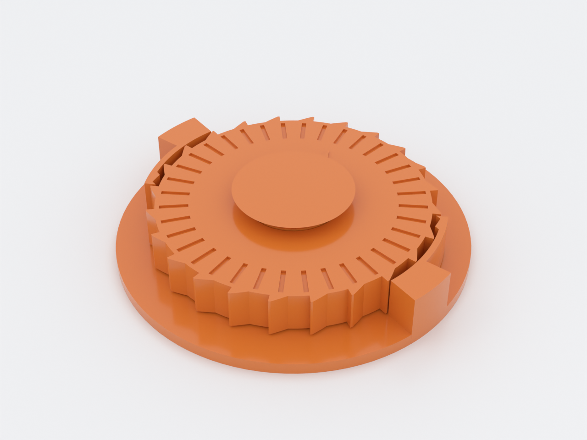
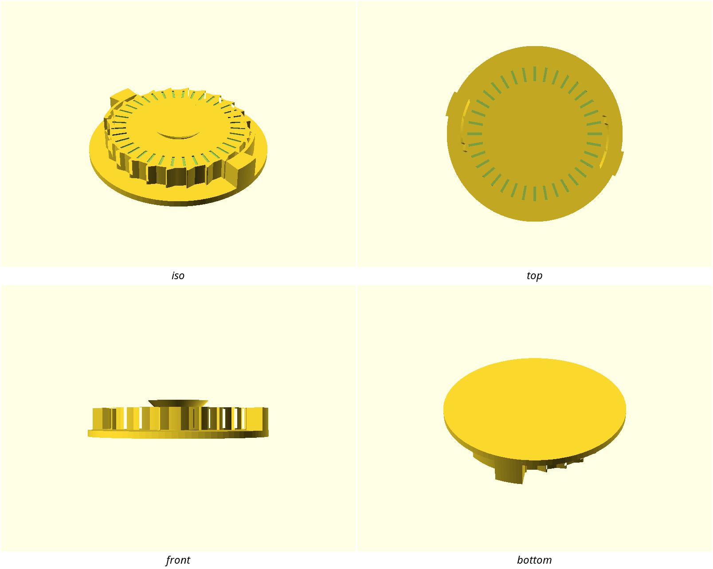
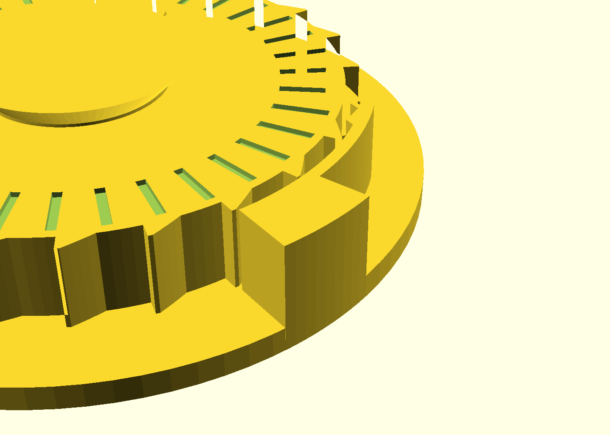

# pip-ratchet

A ratchet wheel printed as **one piece, in place**: spin it one way and it
clicks and freewheels; turn it the other and it locks dead. No supports, no
assembly, no fasteners — the wheel, its two springy pawls and the frame leave
the printer as a working mechanism after one firm break-free twist. The raised
arrow on the wheel marks the free direction.

## What you get

- `pip-ratchet` — the assembled demonstrator, one captive 24-tooth Ø56 wheel
  between two diametric pawls in a 69 × 69 × 13.7 mm frame (approx.)
- `pip-ratchet-coupon` — the tune-first rack-and-pawl strip for dialing the
  click feel on your printer before committing to the wheel

## Print settings

- **Material:** PETG — the pawls flex every click and PETG outlives PLA on
  cyclic flex by a wide margin
- **Layer height:** 0.2 mm — the internal axial clearances are quantized to
  whole layers at this height; keep it
- **Infill:** 15% (any)
- **Supports:** none needed — the capture cone is a self-supporting 45°, and
  the wheel's first layer over the base is a designed break-free gap
- **Seam:** set **Random** (or Back) — an aligned seam stacks one vertical
  ridge on the wheel rim that sweeps both pawls once per revolution
- **Orientation:** as rendered, base flat on the bed
- **First motion:** give the wheel a firm twist in the arrow (free) direction
  to shear the break-free layer, then enjoy
- **If the wheel welds:** the internal gaps are ~0.2 mm and a slicer's default
  gap-fill/gap-closing (0.2 mm) can eat exactly that — disable gap-fill or
  raise `k_xy` by 0.05, then reprint

Print the coupon first if you want to tune the click force — see NOTES.md
"Print this first" for the 0.1 mm sweep of pawl thickness. Expect the coupon's
strip to need a firm first slide too: the channel rails are a snug 0.3 mm and
first-layer squish plus bridge sag take a bite of that — that's the break-free
step doing its job, not a failed print.

## Parameters

| Parameter | Default | What it does |
|---|---|---|
| `wheel_dia` | 56 mm | tooth-tip diameter of the wheel |
| `teeth` | 24 | tooth count (even — the two pawls sit diametric) |
| `tooth_depth` | 1.6 mm | how deep the pawls ride over each tooth |
| `drive_flank_deg` | 60° | the ramp angle the pawl climbs — lower = softer click |
| `pawl_t` | 1.2 mm | pawl beam thickness — **the feel knob**: stiffness ~ t³ |
| `pawl_l` | 18 mm | pawl free length — longer = softer, less stress |
| `lock_gap` | 0.5 mm | nose-face to tooth-wall gap in the locked pose |
| `k_xy` | 0.45 | radial clearance factor — raise if the wheel welds, lower if it rattles |
| `z_layers` | 2 | axial clearance in whole 0.2 mm layers |

All parameters are at the top of `pip-ratchet.scad`, grouped in Customizer
sections; override on the command line with `-D 'pawl_t=1.0'`.

## Assembly & use

There is none — that's the point. After the break-free twist, the wheel
freewheels counter-clockwise (each tooth cams a pawl out of the way) and locks
clockwise (each tooth's radial wall butts a pawl's radial nose face — the
self-locking geometry, which cannot cam the pawl back out under load). To
change the lock direction, mirror the pawls: set `pawl_angle` per pawl and
flip the wheel phase — or just print it and use the arrow.

If the wheel is stiff to free or the clicks feel heavy, drop `pawl_t` by 0.1
(the coupon sweep shows the whole range on one plate). If anything welded,
raise `k_xy` by 0.05 and reprint.
