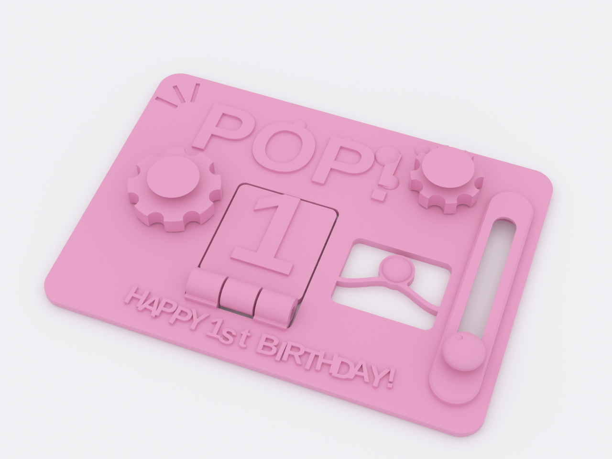
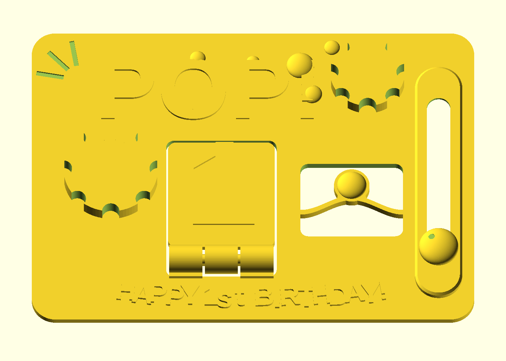
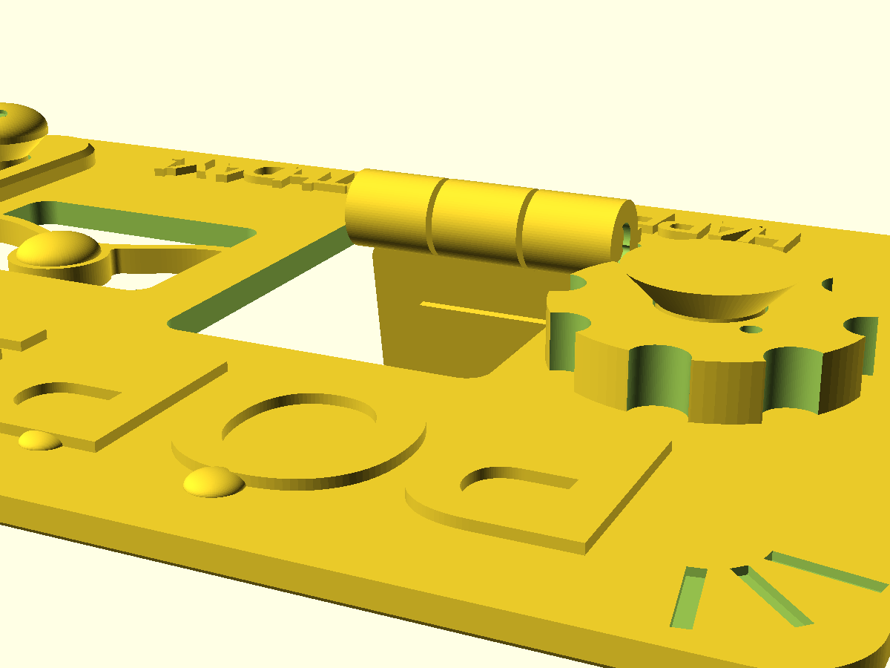
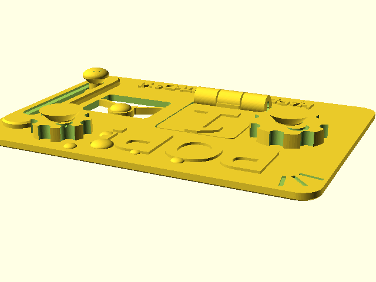
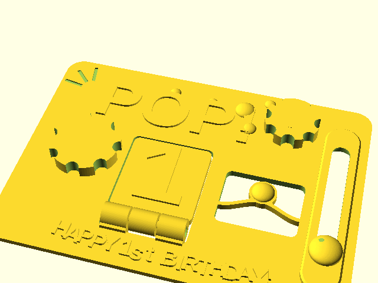
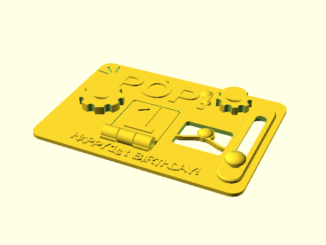

# pop-fidget-card

A print-in-place **1st-birthday card that is also a fidget toy** — for the
parents. The bubble-themed face carries four working mechanisms straight off
the print bed, no supports, no assembly: two captive **bubble spinners**, a
bistable **"pop" button** that snaps between two states, a captive **bubble
bead** gliding on a slider track, and a punched **easel flap** (the big "1")
that folds out on a print-in-place piano hinge to stand the card on a shelf.
Personalise it at slice time — the child's name is one parameter — and print
the whole thing in ~80 minutes on an MK4-class machine, closer to an hour on
a fast Bambu.

*The easel fold in motion — out to its ~100° built-in stop and back; the printed pose is flat (0°).*

*The hot path: the bubble spinners a thumb will work thousands of times, turning.*

*All the way around the bubble — the whole card, edge-on and slim, from every side.*

## What you get

- `pop-fidget-card` — the card, one print-in-place piece (112 × 80 × 2.4 mm
  plate; fidgets rise ≤ 8 mm above the face).
- `pop-fidget-card-coupon` — a 72 × 56 mm "print this first" tile with **all
  four mechanisms** (spinner, slider, hinge, pop button): a ~45-minute tile
  that saves an ~80-minute reprint, and the only way to feel the button's
  snap before the card commits.

## Print settings

- **Material:** plain or matte PLA (any color; pastels suit the theme — but
  skip silk and glitter fills: their strings land exactly in the 0.2 mm rotor
  gap and the bead slot; an optional filament
  swap at the first text layer two-tones the lettering — and every other
  raised feature with it, which is the charm; set the color change at
  **2.4 mm = layer 13** on the 0.20 profile, since everything raised lifts
  off the face together)
- **Layer height:** 0.20 mm (the axial clearances are quantized to it)
- **Infill:** 15 % (the plate is mostly top/bottom skins)
- **Supports:** none needed — every overhang is 45° by construction
- **Brim:** none — the moving parts are bed-anchored islands
- **Seam:** Back or scarf, not Aligned — the rotor bores are a mating
  surface, and an aligned seam stacks a ridge on both walls of the 0.2 mm
  gap. If a rotor stays stiff after break-in, also set gap-closing to
  0.1 mm (the 0.2 mm default merges exactly this clearance) and re-check on
  the coupon
- **Orientation:** as modeled, face up
- **First motion — break it in before you gift it:** spin both rotors and
  push the bead firmly once (this shears the deliberate break-free welds),
  pop the button a few times, fold the easel out to its stop (~76–80° shelf
  prop). Doing this the night before means the parents receive a working
  toy, and a mushy button surfaces at your desk, not at the party

A note for gift-givers: this is a keepsake for the grown-ups' shelf. It is
print-in-place, so nothing detaches by design, but it is **not a teether** —
don't hand it to the birthday kid unsupervised.

## Parameters

| Parameter | Default | What it does |
|---|---|---|
| `card_name` | `""` | The child's name — set at slice time with `-D 'card_name="ALEX"'`; empty prints the generic card. Setting a name **auto-shortens** the greeting (drops "BIRTHDAY") so `HAPPY 1st, <name>!` fits at full stroke width for names up to ~15 letters; a longer name fails the render with a clear error (shorten the name, or set `greeting_named`) |
| `greeting` | `HAPPY 1st BIRTHDAY` | Bottom line on the **unnamed** card (`!` appended) |
| `greeting_named` | `HAPPY 1st` | Bottom line on the **named** card — the name and `!` are appended (`HAPPY 1st, ALEX!`) |
| `spinner_count` | 2 | Bubble spinners (0–2) — drop to 1 to shave a measured ~11 minutes, the only time lever that pays (NOTES.md has the sweep; infill and card size barely move the meter) |
| `xy_tol` | 0.21 mm | Spinner bore ↔ post radial gap — tune on the coupon (field-set from 0.20) |
| `with_easel` | `true` | The punched "1" easel flap + hinge. Set `false` to print the card with no fold-out stand (the window fills solid) |
| `tog_beam_t` | 1.3 mm | Pop-button snap-beam thickness — 1.3 is PLA-tuned (softer snap); PETG can use 1.5 |
| `slide_tol` | 0.25 mm | Bead stem ↔ slot sliding gap per side |
| `hinge_clear` | 0.4 mm | Easel hinge pin clearance on every bore surface |
| `card_w` / `card_h` | 112 / 80 mm | Card face size |

All parameters are at the top of `pop-fidget-card.scad`, grouped in
Customizer sections; override on the command line with `-D 'name=value'`.

## Assembly & use

Nothing to assemble. Print the **coupon first** if this is your first run on
a printer (tuning order and steps are in NOTES.md "Print this first"), then
the card. After the break-free first motions everything runs free: the
spinners flick from the rim scallops, the pop button clicks between its two
states, the bead glides between the track ends, and the easel flap folds out
to its built-in stop so the card stands leaning back ~12–15° on a shelf. One
shelf habit: **park the button flat** (its as-printed state) — a PLA arch
left popped for months slowly creeps and the snap softens; parked flat it
will still snap for the second birthday. Printing it "stronger" doesn't
help: a deeper dome raises snap force and stored strain together. If a
fit is off, retune its parameter on the coupon and reprint. This design has
one real print behind it (2026-08-22, PLA) — the field-test log in NOTES.md
records what it found and what v0.2 changed (a hinge robustness fix, a
PLA-softer button beam, a sliceable bubble-shine, and an auto-shortened
named greeting).
