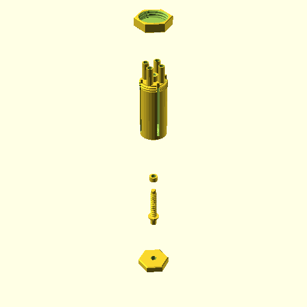

# Pre-roll elevator — 6 printed parts, no hardware — assembly

## Bill of materials

| Part | Qty | Description |
|---|---|---|
| `knob()` | 1 | hex twist knob (the bolt head); presses onto the screw's stub |
| `screw()` | 1 | central lead-screw + capture flange + hex torque stub; prints thread-up |
| `cap()` | 1 | press-on top stop; caps the screw tip after the elevator is threaded on |
| `body()` | 1 | threaded bolt-shank tube with 4 anti-rotation slots; prints base down |
| `elevator()` | 1 | carrier nut + 4 roll cups + 4 anti-rotation tabs; prints cups up |
| `lid()` | 1 | hex cap-nut lid; prints closed-top down |

## Assembly steps

1. Lower the screw into the body from the top — the flange's 45° cone nests in the floor's countersink and the hex torque stub passes through the floor bore and out the bottom.
2. Line the knob's hex socket up with the stub's flats by feel — rotate it until it stops clicking past the corners — then press the hex knob onto the protruding stub from below until it nearly meets the body underside. The screw is now captured by the floor (flange above, knob below) so it spins freely but cannot lift out, and the knob transmits your twist through its hex socket.
3. Thread the elevator onto the screw from the open top — its nut passes over the bare screw tip, then catches the thread — aligning its 4 tabs with the 4 body slots, and wind it down until the tabs run in the slots.
4. Press the top cap onto the screw tip poking up above the elevator. This is the pop-up stop that keeps the elevator from winding off the top; a firm press. Do NOT glue it — the cap must stay removable for the routine clean (pop it off, wind the elevator off the top). The cap is tiny (~0.9 g), so do this over a dish — a dropped cap costs you the stop.
5. Drop one pre-roll into each of the 4 cups, filter end down (mouth up). A tapered cone loaded mouth-down instead only perches on the cup rim and holds the lid open.
6. Twist the knob to lower the rolls fully inside, then screw the hex cap-nut lid onto the top to close.

