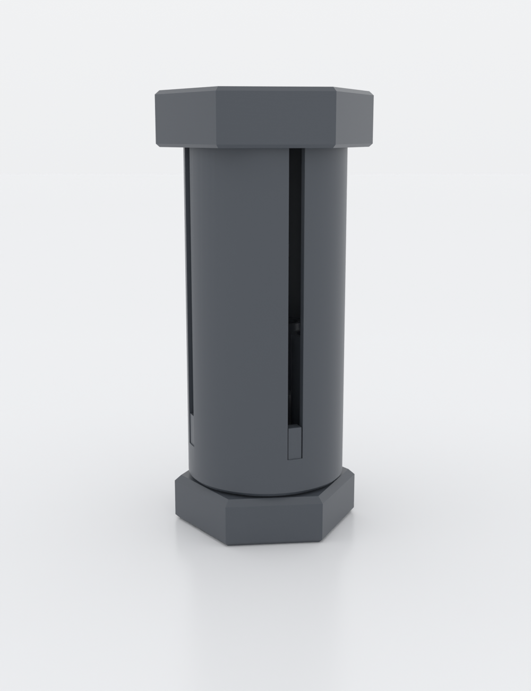
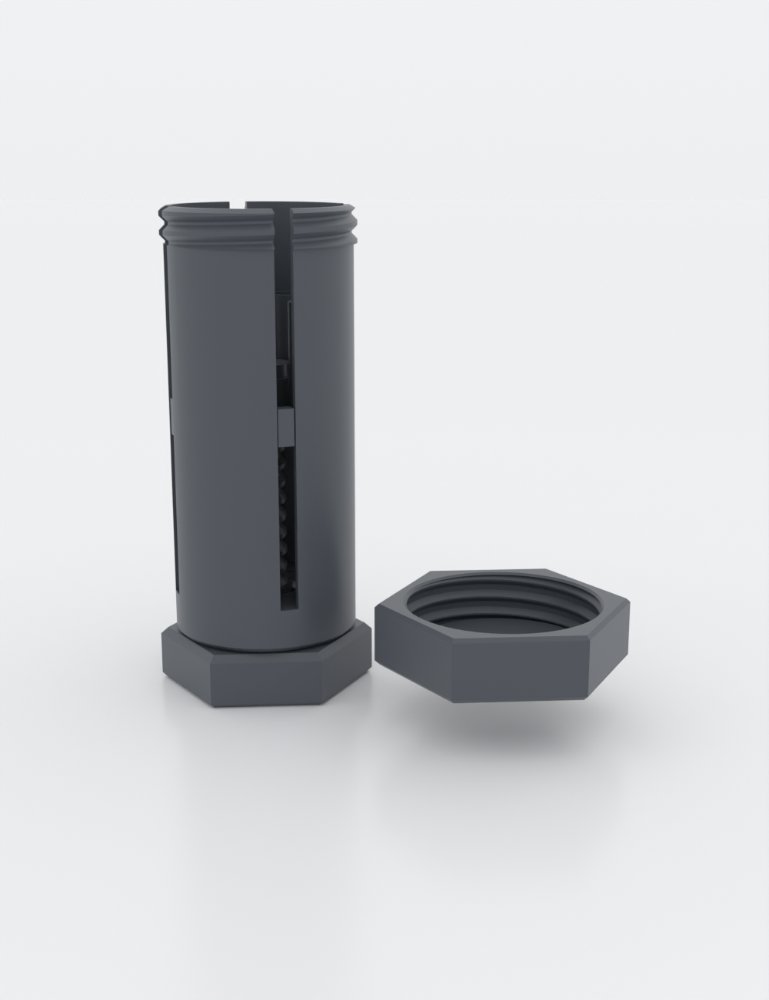
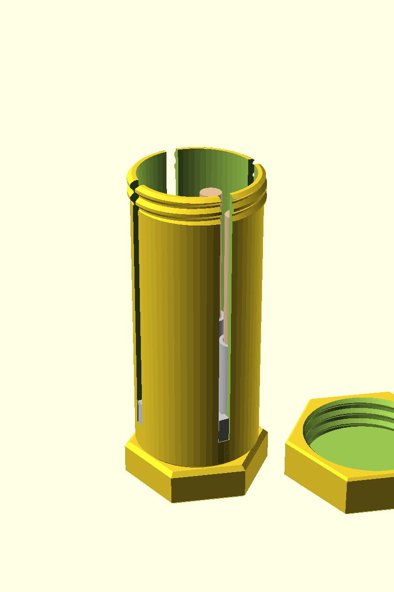
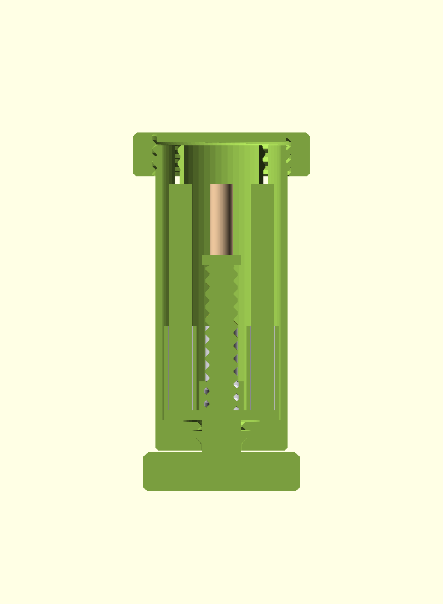

# preroll-elevator

A twist-up dispenser for pre-rolls, built like an industrial hex bolt. Unscrew
the hex cap-nut lid, twist the bolt-head knob at the base, and a central
lead-screw raises four pre-rolls in a ring so their tops rise out the top to
grab. Twist back and they retract; screw the lid on to close and protect. It
works exactly like a chapstick or glue stick — and the inside is honest about
it: the elevator is literally a nut climbing a bolt.

Ships tuned for slim "dogwalker" pre-rolls (4 × Ø7 × 70 mm) and is fully
parametric — one size preset covers 1¼, 98-special and king-size rolls, or set
your own diameter and length.

## What you get

- A **five-part printed dispenser** — no glue, no metal fasteners, no bought-in
  hardware. Everything is printed and assembles by hand.
- **Twist-to-present, twist-to-retract** action from a printable trapezoidal
  lead-screw. The single-start thread is **self-locking**, so the rolls hold
  their height and never sag closed on their own.
- Four rolls carried in a **ring around the central screw**, so the mechanism
  lives in the dead centre and steals no roll space.
- A screw-on **hex cap-nut lid** that seals the top for pocket/bag carry.
- A **"print this first" coupon** to dial the fit to your printer before you
  commit to the full tube.

## How it works

Twist the base knob → the central screw spins → the elevator (a nut, held from
rotating by four tabs riding slots in the wall) climbs the screw and lifts the
cups. A hard stop at the top of the screw sets the ~36 mm pop-up; a conical seat
and a snap-in retainer ring at the base let the screw spin freely but keep it
from lifting out.

## Print settings

- **FDM, 0.4 mm nozzle.** PLA or PETG both work; PETG gives a smoother twist.
- **Walls ≥ 1.2 mm** throughout (3 perimeters); no supports needed for any part.
- **Print orientations** (all supportless): body base-down / mouth-up;
  screw-knob hex-head-down / screw-up; elevator cups-up; lid closed-top-down;
  retainer flat.
- **Print this first:** `preroll-elevator-coupon.scad` — the production screw
  stub and the elevator's nut ring side by side. Screw them together and adjust
  `thread_tol` in ±0.1 mm steps until the nut runs free with slight play. The
  same `thread_tol` sets the lid fit, so re-check the lid after changing it.
- **Deliverable:** the five parts print separately, so the sliceable file is the
  multi-object plate `build/preroll-elevator-plate.3mf` (five distinct objects),
  **not** a single STL of the assembly (that would import as one welded body).
- Rough print time ~7–8 h total across the five parts; ~55 g filament.

## Parameters

The parameters worth tuning (full set with units in `preroll-elevator.scad`):

| Parameter | Default | What it does |
|---|---|---|
| `size_preset` | `dogwalker` | `dogwalker` / `1.25` / `98` / `king` / `custom` — sets roll diameter & length; the body and cups resize to fit. |
| `roll_d_custom`, `roll_len_custom` | 7.0, 70 | Your own roll size when `size_preset = custom`. |
| `pop_up` | 36 mm | How far the rolls rise above the rim at full extension. |
| `cup_slip` | 0.6 mm | Drop-in clearance around each roll (cup bore = roll dia + this). |
| `thread_tol` | 0.3 mm | Fit clearance for both threads (dial on the coupon). |
| `knob_af` | 42 mm | Hex twist-knob across-flats (the bolt head). |

Body outer diameter, bolt-circle and tube height are **derived** from the roll
size and the central hub, so every preset stays geometrically valid.

## Assembly & use

Five printed parts, assembled top-down in five steps — full bill of parts and
step-by-step in [ASSEMBLY.md](ASSEMBLY.md):

1. Insert the screw-knob up through the body from below (the flange cone seats on
   the base countersink).
2. Snap the retainer ring in over the flange — the screw now spins but can't lift out.
3. Thread the elevator on from the top, tabs aligned to the slots.
4. Drop a pre-roll into each cup.
5. Twist down to retract, then screw the lid on.

To use: unscrew the lid, twist the knob to raise the rolls, take one, twist back
down, cap it.

