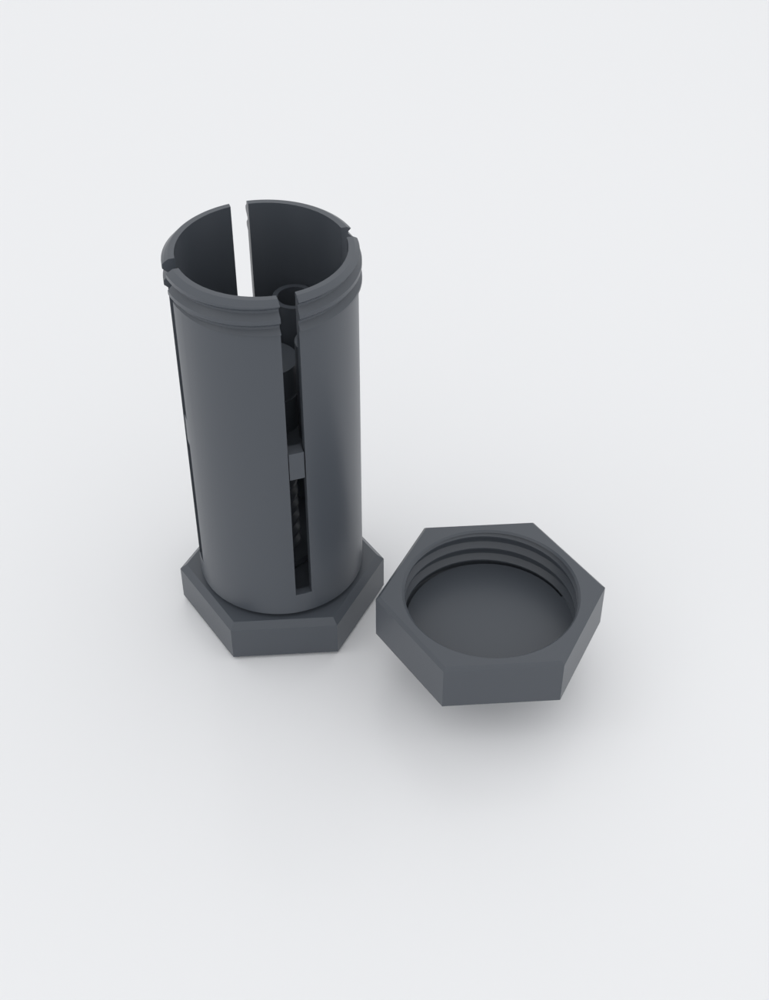

# preroll-elevator

A twist-up dispenser for pre-rolls, built like an industrial hex bolt. Unscrew
the hex cap-nut lid, twist the bolt-head knob at the base, and a central
lead-screw raises four pre-rolls in a ring so their tops rise out the top to
grab. Twist back and they retract; screw the lid on to close. It works on the
same idea as a chapstick or glue stick — twist up, twist down — though it's a
deliberate multi-turn dispenser, not a one-flick pocket stick. The inside is
honest about it: the elevator is literally a nut climbing a bolt.

Ships dialed for slim "dogwalker" pre-rolls (4 × Ø7 × 70 mm) and is fully
parametric — one size preset covers 1¼, 98-special and king-size rolls, or set
your own diameter and length. Preset lengths are the roll's **total** length:
standard cone sizing already includes the filter tip, so a "70 mm dogwalker" is
70 mm end to end. Rolls with an extra-long crutch go to `custom`.

**A sizing note, before you print.** The preset **diameters** (Ø7–8.5 mm) are the
straight pre-rolled-tube / hand-rolled class — *not* the wide mouth of a
pre-rolled **cone**, which runs ~Ø10–12.5 at the mouth and tapers to ~Ø5 at the
filter. A tapered cone dropped filter-down sits loose in these cups (it touches
only near the rim) and will rattle in carry; mouth-down it won't seat at all. If
you run pre-rolled cones, start from `custom` with `roll_d` set to your cone's
**mouth** diameter and tune the drop-in with `cup_slip` (see Print settings) — that
stops the mouth-down non-fit, though a straight bore still can't grip the taper.
Cone-true **tapered cups** are on the backlog; they wait on a measured sample.

It reads like shop hardware because it's **sized** like it: about **41 mm** across
the shank, **47 mm** at the lid, **110 mm** tall, ~**62 g** in PLA. The chapstick
comparison is about how it *works* — this is a benchtop object, not a pocket one.

> **Designed and gated, not yet field-printed.** The fits and clearances below are
> as-modeled — dialed on assumed dimensions, with no physical sample yet. The
> "print this first" coupons and the first real print are how you confirm them on
> your own printer; until then, treat the feel claims as intent, not measurement.

## What you get

- A **six-part printed dispenser** — `body`, `lid`, `screw`, `knob`, `elevator`,
  `cap`. No metal fasteners, no bought-in hardware; everything is printed and
  assembles by hand. (The knob is a press fit — a drop of glue is optional there,
  never required. Leave the top **cap** unglued: it must pop off for routine cleaning.)
- **Twist-to-present, twist-to-retract** action from a printable trapezoidal
  lead-screw. The single-start thread is **self-locking** in theory — the lead
  angle sits well under PLA's friction — so the rolls should hold their height and
  not sag closed on their own. (No field print has confirmed it under load yet;
  that's the first backlog item.)
- Four rolls carried in a **ring around the central screw**, so the mechanism
  lives in the dead centre and steals no roll space.
- The screw is **captured by the body floor** — its flange sits above the floor,
  the hex knob presses onto a torque-key stub below it, so the screw spins freely
  but can't lift out. No separate retainer, no fasteners.
- A **press-on top cap** is the pop-up stop: the elevator threads on over the bare
  screw tip during assembly, then the cap presses onto the tip so the elevator
  can't wind off the top. (A stop built into the screw would trap the nut, so the
  stop is a separate part added last — and it makes the elevator liftable for
  cleaning without disturbing the knob.)
- A screw-on **hex cap-nut lid** that caps the top opening for carry.
- Two **"print this first" coupons** to dial the fits to your printer before you
  commit to the full tube.
- Because the six parts print as **separate objects**, one filament swap — body in
  one colour, knob, lid and cap in another — reads like two-tone machined hardware.

> **It's a vented cage, not a sealed container.** Four full-length slots run down
> the shank (they guide the elevator and let the tabs drop in from the top) — a
> deliberate part of the mechanical look that also lets you see how many rolls are
> left. The lid caps the top opening, but the body is not airtight or
> odor-sealing. A solid-wall variant is on the backlog.

## How it works

Twist the base knob → the central screw spins → the elevator (a nut, held from
rotating by four tabs riding the slots) climbs the screw and lifts the cups. The
press-on cap at the top of the screw sets the travel; the flange-on-floor seat
takes the downward load and the press-on knob keeps the screw captive.

It's a deliberate **dispenser feel, not chapstick-fast:** the self-locking
single-start thread trades speed for hold, so it's roughly **9 turns to raise and
9 to retract**. You'll usually stop winding as soon as a roll clears the rim — but
capping means going all the way back down, so the tops drop below the mouth (the
lid can't go over raised rolls).

## Print settings

- **FDM, 0.4 mm nozzle.** Print the threaded parts (`screw`, `elevator`) in
  **PLA**: PETG strings and wants +0.05–0.1 mm on fits, which turns a coupon-tuned
  thread gritty, and the elevator's near-bed turns are the sensitive spot. PETG is
  fine (and feels nicer) on the `knob` and `cap`. Run the coupon in whichever
  material you print the threads in — and if you want a PETG `lid` (a third threaded
  part), bump `thread_tol` to ~0.4 (still free-running for the PLA central pair)
  rather than printing a PLA-tuned cap-nut in PETG.
- **Seam position: Scarf** (or Back). The stock Aligned seam stacks a vertical
  ridge that spends 0.05–0.15 mm of every tuned clearance — cup bores, slot walls,
  both threads — in one place; Scarf spends it nowhere. Cheapest fit insurance here.
- **Walls ≥ 1.2 mm** throughout (3 perimeters).
- **Layer height: 0.20 mm.** The quoted print times/weights and the coupon-tuned
  thread feel both assume it — the 4 mm-pitch thread's 45° flanks quantize into a
  layer staircase, so a draft-height profile shifts the fit you dialed on the
  coupon. Drop the body to 0.16 mm only if it rings (see below).
- **Keep auto-supports OFF.** No part needs them, and painted supports into the
  slots or either thread would weld the mechanism shut — the slots guide the
  elevator, the threads are the whole drive.
- **Print orientations** (all supportless): body base-down / mouth-up; screw
  thread-up (hex stub on the bed); knob hex-flat-down (socket up); elevator
  cups-up; lid closed-top-down; cap flat (bore up).
- **Slow outer walls on the body and the screw.** The screw is a tall column on a
  small hex-stub base — print it with a **brim** and reduced outer-wall
  speed/acceleration so it doesn't ring or tip (its flange adds mass low down, so
  that's enough). The body has the same disease with higher stakes: four tall thin
  wall arcs between the slots, with the lid thread waiting at the top if the mouth
  goes oval — so slow its outer wall too, and if it still rings, drop the body to
  0.16 mm layers. After removing the screw's brim, **dress the hex stub's bottom
  2 mm** with a file or 400-grit before pressing the knob on — the brim leaves flash
  on the very hex the knob grips (7+ mm of hex engagement remains, so the key loses
  nothing).
- **Print these first (two coupons):** `preroll-elevator-coupon.scad` is the
  central screw stub and the elevator nut ring side by side — screw them together
  and adjust `thread_tol` in ±0.1 mm steps until the nut runs free with slight play
  (or print a labelled range at once with `./scripts/render.sh preroll-elevator
  --sweep thread_tol=0.2:0.4:0.1`). The same `thread_tol` sets the lid, so re-check
  the lid after changing it. Then switch `part` to `tab-fit-coupon` in the
  Customizer and print the slide pair — if the tab scrapes rather than slides, open
  `slot_w` by 0.1 mm. The knob's hex-key fit is `knob_key_clear` and the cap's is
  `cap_fit` — both firm presses; if either needs more than a firm push, open it in
  0.05 mm steps rather than forcing the part. After the threads, `cup_slip` is the
  fit to tune for the payload, and it goes **both** ways: if a fat or tacky roll
  drags the elevator up as you pull it out, open `cup_slip` a touch; if a roll
  (especially a tapered cone) **rattles** loose in the cup, close `cup_slip` a step
  — or set `roll_d` to your cone's mouth diameter via `custom`. Print the coupons
  over a tray — they're small and bright and will find the floor. One heads-up: the elevator's first engaged thread turn prints over the disk
  bore (bridging in), so it can feel slightly gritty until it beds in — that's the
  part, not your `thread_tol`.
- **Deliverable:** the six parts print separately, so the sliceable file is the
  multi-object plate `build/preroll-elevator-plate.3mf` (six distinct objects),
  **not** a single STL of the assembly (that would import as one welded body).
- **Total print time:** the full set is roughly **6 h / ~62 g** in PLA across the
  six parts, plus ~50 min / ~8 g for the two coupons (from CI's test-slice; your
  printer will vary).

## Parameters

The parameters worth tuning (full set with units in `preroll-elevator.scad`):

| Parameter | Default | What it does |
|---|---|---|
| `size_preset` | `dogwalker` | `dogwalker` / `1.25` / `98` / `king` / `custom` — sets roll diameter & length; the body and cups resize to fit. |
| `roll_d_custom`, `roll_len_custom` | 7.0, 70 | Your own roll size when `size_preset = custom`. |
| `pop_up` | 36 mm | Elevator **travel**. Loaded rolls rise ~32 mm **above the rim** (travel minus the 4 mm retract gap); the empty cups stop ~12 mm short of the mouth. |
| `cup_slip` | 0.6 mm | Drop-in clearance around each roll (cup bore = roll dia + this). |
| `thread_tol` | 0.3 mm | Fit clearance for both threads (dial on the coupon). |
| `knob_key_clear` | 0.25 mm | Knob-to-screw hex-key press fit (firmer = less twist slip). |
| `cap_fit` | 0.2 mm | Top-cap press fit over the screw tip (firmer = a more secure stop). |
| `slot_w`, `tab_w` | 4.0, 3.5 mm | Anti-rotation slot and tab width; the 0.5 mm difference is the slide slop (tune `slot_w` on the tab coupon). |

Body outer diameter, bolt-circle, tube height and the hex knob size are
**derived** from the roll size and the central hub, so every preset stays
geometrically valid and the knob always reads as a head wider than the shank.

## Assembly & use

Six printed parts, assembled top-down in six steps — full bill of parts and
step-by-step in [ASSEMBLY.md](ASSEMBLY.md):

1. Lower the screw into the body from the top — the flange cone seats on the floor
   countersink and the hex stub pokes out the bottom.
2. Press the hex knob onto that stub from below — it's a blind press, so line the
   socket flats up with the stub's by feel (rotate until it stops clicking past the
   corners), then push until the knob nearly meets the body underside. The screw is
   now captured (spins, can't lift out) and the knob transmits your twist through
   its hex socket.
3. Thread the elevator on from the top — its nut passes over the bare screw tip,
   then catches the thread — tabs aligned to the slots, and wind it down.
4. Press the top cap onto the screw tip poking up above the elevator — this is the
   pop-up stop that keeps the elevator from winding off the top. (The cap is tiny —
   0.9 g — so do this over a dish; lose it and you lose the stop.)
5. Drop a pre-roll into each cup, **filter end down** (mouth up). A tapered cone
   loaded mouth-*down* only perches on the cup rim, stands proud, and holds the lid
   open.
6. Twist down to retract, then screw the lid on.

To use: unscrew the lid, twist the knob to raise the rolls, take one, twist back
down, cap it. Two hexes, and they're not interchangeable: the **nut** on top is
the lid you unscrew to open; the **head** at the base is the crank — twist the
wrong one and the screw just spins free. To **refill**, raise the empty cups to
the mouth first, then drop a roll into each.

## Care

Resin and kief will gum the screw thread, the slots and the cups over time.
**Routine clean:** lid off, pop the top cap off the screw tip, and wind the
elevator up and off the open top — now the thread, slots and cups all wipe down
from above and the knob never comes off. **Deep clean (screw out):** additionally
press the knob off the stub and lift the screw out. The knob and cap are deliberate
press fits (snug so nothing slips), so expect to work them off rather than have
them fall away. PLA softens in a hot car: keep it off a summer dashboard — PETG
resists heat better, but (as above) wants its thread fits re-tuned.
