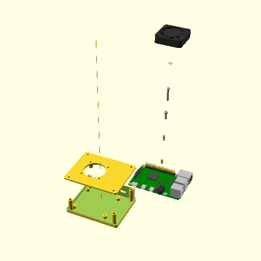

# sbc-case — Raspberry Pi 4, 40 mm fan, heat-set inserts — assembly

## Bill of materials

| Part | Qty | Description |
|---|---|---|
| `base()` | 1 | printed base tray (floor-down, no supports) |
| `lid()` | 1 | printed lid with fan mount (outer-face-down, no supports) |
| `vitamin_pcb()` | 1 | Raspberry Pi 4 model B |
| `vitamin_insert()` | 8 | M3x5.8 heat-set insert (4 base lid-screw posts, 4 lid fan bosses) |
| `vitamin_board_screw()` | 4 | M2.5 cap screw ×6 mm (board to standoffs) |
| `vitamin_lid_screw()` | 4 | M3 cap screw ×10 mm (lid to base posts) |
| `vitamin_fan_screw()` | 4 | M3 dome screw ×20 mm (fan through plate into lid bosses) |
| `vitamin_washer()` | 4 | M3 washer under each fan screw |
| `vitamin_fan()` | 1 | 40x11 mm 5 V fan (fan40x11 vitamin; blows into the case) |

## Assembly steps

1. Press the 4 F1BM3 inserts into the base's lid-screw posts — melt each one until it sits FLUSH with the post top, no deeper. The posts are through-bored (an M3x10 screw tip then bottoms out in free space, not plastic), so there is no shoulder to stop the insert: sink it too far and the lid screws find nothing to bite. (A stepped seat that stops the insert on its own is a planned refinement.)
2. Press the 4 F1BM3 inserts into the lid's fan bosses from the inner face (lid inner-face-up; the inserts melt in blind-side-down so the fan screws thread into them through the plate).
3. Drop the Raspberry Pi 4 onto the standoffs — every standoff is generated from the board's own hole list, so it self-locates.
4. Fix the board with 4 M2.5 cap screws into the printed pilot bosses (they self-tap; do not overtighten).
5. Fit the lid: the register lip drops into the cavity with 0.25 mm clearance — its notches pass the four lid-screw posts, which locate it — then seats on the wall and post tops.
6. Close the case with 4 M3 cap screws through the lid into the base posts.
7. Bolt the 40 mm fan to the lid bosses with 4 M3 dome screws, washer under each head, airflow blowing into the case; route its leads out through the GPIO notch to the Pi's fan header (follows temperature — quieter at night) or to a 5 V + GND pin pair (runs constant). The fan mounts to the lid but its lead plugs into the board, so for any later lid-off service, unplug the fan lead at the header before lifting the lid — otherwise the lid dangles by two wires.

